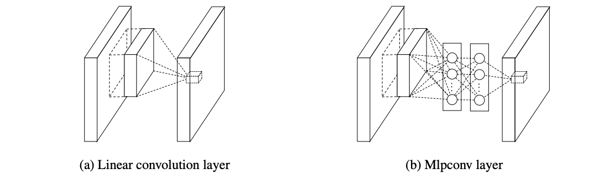

# Introduction: ML and DL
Machine Learning is a category of research and algorithms focused on finding patterns in data and using those patterns to make predictions. ML falls within the AI umbrella, which in turn intersects with the broader field of knowledge discovery and data mining.

"A computer program is said to learn from experience E (data) w.r.t. some class of task T (regression, classification, ..) and a performance measure P (error, loss, ..), if its performance at task in T, as measured by P, improves because of experience E." (Tom Mitchell)

- **Supervised learning**: given the desired outputs $t_1,..., t_N$ learn to produce the correct output given a new set of input.
- **Unsupervised learning**: exploit regularities in the data D to build a representation to be used for reasoning or prediction.
- **Reinforcement learning**: producing actions $a_1, ..., a_N$ which affects the environment, and receiving rewards $r_1, ..., r_N$, it learns to act in order to maximize rewards in the long term.

Deep Learning is about learning data representation directly from raw data. DL is particularly effective in tasks like image recognition, speech recognition, and pattern recognition.
During the last years, DL was enabled by the availability of large-scale datasets and the advances in hardware (ex. GPUs) to process vast amounts of data.
## From Perceptrons to Feed Forward Neural Networks
DL, while a crucial part of AI, is distinct from both traditional AI and ML. The field traces back to early efforts in the 1940s when computers were already capable of precise, rapid calculations but were limited by their inability to interact dynamically with environments or adapt to new data. This limitation led researchers to explore models inspired by the human brain, which operates in a massively parallel, fault-tolerant manner through billions of neurons and trillions of synapses.
### The perceptron
The development of ANN began with the **perceptron**, introduced by Frank Rosenblatt in 1957. The perceptron was inspired by how biological neurons process information, receiving inputs, applying weights, and check if a certain threshold is crossed. Weights were encoded in potentiometers, and weight updates during learning were performed by electric motors.

The basic structure of a perceptron can be seen as:
$$
y = \begin{cases} 
1 \ \ \ \ \ \ \ \  if \ \sum^n_{i = 1}{ w_ix_i + b }> 0\\
-1 \ \ \ \ otherwise
\end{cases}
$$
where $x_1, ..., x_n$ are the input features, $w_1, ..., w_n$ are the weights assigned to each input features, $b$ is the bias term, and $y$ is the output of the perceptron. It calculates the dot product of the weights and inputs, adds the bias term and then applies the activation function (which in this case is a step function). If the result is greater than zero the output is 1, if it is less or equal zero the output is -1.

According to the **Hebbian learning theory**: "the strength of a synapse increases according to the simultaneous activation of the relative input and the desired target". 
It states that if two neurons are active simultaneously, their connection is strengthened. The weight of the connection between A and B neurons is calculated using:
$$
\begin{cases}
	w_i ^ {k+1} = w_i^k + \Delta w_i^k \\
	\Delta w_i ^k = \eta \cdot x_i ^k \cdot t^k
\end{cases}
$$
where $\eta$ is the learning rate, $x_i ^k$ is the $i^{th}$ input of a neuron A at time k and $t^k$ is the desired output of neuron B at time k.
Starting from a random initialization, the weights are fixed one sample at a time (online), and only if the sample is not correctly predicted.

The **perceptron** is a linear classifier. It makes decisions by finding a linear boundary (a hyperplane) that separates different classes in the feature space: it computes a weighted sum of the input features and applies a threshold (often a step function) to determine the class label.
It does not work if the dataset is not linearly separable: the solution is to implement non-linear boundaries or use an alternative input representation.

The perceptron is a **non-linear** function of a linear combination (input are combined linearly, but then the activation function is applied which is non-linear). The non-linearity is important since:
- Non-linear models can approximate a wider range of functions (than linear models), including complex relationships in data.
- Real-world phenomena are generally non-linear.
- Non-linear activation functions allow for stacking of layers in deep NN.
### Multi Layer Perceptrons (MLPs) - Feedforward Neural Networks (FFNN)
Deep feedforward networks (also called feedforward NN or MLPs) are the core of DL models.
They are represented by a directed acyclic graph describing how the functions are composed together. The depth of the model is determined by the number of layers in the chain.

A simple non-linear model characterized by the number of neurons, activation functions,
and the values of weights.

- Activation functions must be differentiable to train it. 
- Layers are connected through weights $W^{(l)} = \{w_{ji}^{(l)}\}$. 
- The output of a neuron depends only on the previous layers $h^{(l)} = \{h_j^{(l)}(h^{(l-1)}, W^{(l)})\}$.

In regression the output spans the whole $\mathbb{R}$ domain: we use a linear activation function for the output neuron.

In classification with two classes, we chose according to their coding:
- $\{\Omega_0 = -1, \Omega_1 = 1\}$: tanh output activation.
- $\{\Omega_0 = 0, \Omega_1 = 1\}$: sigmoid output activation since it can be interpreted as class posterior probability.

When dealing with multiple classes (K) use as many neuron as classes: classes are coded with the one hot encoding $\{\Omega_0 = [0\ 0\ 1], \Omega_1 = [0\ 1\ 0], \Omega_2 = [1\ 0\ 0\ ] \}$ and output neurons use a softmax unit $y_k = {exp(z_k) \over \sum_k exp(z_k)}$ where $z_k = \sum_j w_{kj}h_j(\sum_j ^I w_{ji}x_i)$.

For all hidden neurons we use sigmoid or tanh.
### Universal Approximation theorem
“A single hidden layer feedforward neural network with S shaped activation functions (sigmoid or tanh) can approximate any measurable function to any desired degree of accuracy on a compact set”.

Regardless the function we are learning, a single layer can represent it. In the worst case, an exponential number of hidden units may be required. The layer may have to be unfeasibly large and may fail to learn and generalize.
### Gradient Descent (or Back Propagation)
Assuming to have a parametric model $y(x_n |  \theta )$ (in regression/classification).
Given a training set $D = <x_1 , t_1> ... <x_N, t_N>$ we want to find model parameters such that for new data $y(x_n | \theta) \sim t_n$ or in case of a NN $g(x_n | w) \sim t_n$. We rephrase the problem of learning into a problem of fitting.

For example, a linear model which minimizes $$E = \sum_n^N (t_n - g(x_n | w))^2$$ (taking into account that $g(x_n | w)$ is not linear since we are talking about NN).
To find the minimum of a generic function, we compute the partial derivatives and set them to zero. Since closed-form solution are practically never available, we use iterative solutions (**gradient descent, backpropagation**): initialize the weights to a random value, iterate until convergence according to the update rule.

Finding the weights of a NN is not a linear optimization:

$$
argmin_w \ E(w) = \sum_{n=1}^N (t_n - g(x_n, w))^2
$$

We iterate starting from a initial random configuration:

$$
w^{k+1} = w^k - \eta {\partial E(w) \over \partial w}\bigg|_{w^k}
$$

To avoid local minima, we can use momentum:

$$
w^{k+1} = w^k - \eta {\partial E(w) \over \partial w}\bigg|_{w^k} - \alpha {\partial E(w) \over \partial w}\bigg|_{w^{k-1}}
$$

Since using all the data points (batch) might be unpractical, so we use variations of the GD:
- Batch gradient descent: use one batch and one epoch. $${\partial E(w) \over \partial w} = {1 \over N} \sum^N_n {\partial E(x_n, w) \over \partial w}$$
- Stochastic gradient descent: use a single sample, unbiased, but with high variance. We need as many steps (iterations) as the number of data points since we fix one data point at a time. SDG has higher variance during loss minimization than batch GD. $${\partial E(w) \over \partial w} \approx {\partial E_{SDG}(w) \over \partial w} ={\partial E(x_n, w) \over \partial w}$$
- Mini-batch gradient descent: use a subset of samples, good trade off variance-computation. We need as many steps (iterations) as the number of data divided by the batch size. $${\partial E(w) \over \partial w} \approx {\partial E_{MB}(w) \over \partial w} = {1 \over M} \sum^{M<N}_{n\in\text{mini-batch}}{\partial E(x_n, w) \over \partial w}$$
Weights update can be done in parallel, locally, and it requires only two passes. We apply the chain rule (derivative of composition of functions) to the back propagation formula.
### Maximum Likelihood Estimation
Let's observes samples $x_1, ..., x_N$ from a Gaussian distribution with known variance $\sigma ^2$. We want to find the Maximum Likelihood Estimator for $\mu$.
Given the likelihood 
$$
L(\mu) = p(x_1, .., x_N | \mu, \sigma^2) = \prod_{n=1} ^ N p(x_n | \mu, \sigma^2) = \prod^N_{n=1} {1 \over \sqrt{2 \pi} \sigma} e^{- {(x - \mu)^2 \over 2 \sigma^2}}
$$
we take the logarithm obtaining 
$$
l(\mu) = N \cdot log{1 \over \sqrt{2 \pi} \sigma} - {1 \over 2 \sigma ^2} \sum ^N_n (x_n - \mu)^2
$$
we work out the derivative in order to find the minimum:
$$
\mu^{MLE} = {1 \over N} \sum_n^N x_n
$$
Let's apply this to NN.

For regression the goal is to approximate a target function $t = g(x_n | w) + \epsilon_n$ with 
$epsilon_n \sim N(0, \sigma^2)$ having N observation: 
$$ 
t_n \sim N(g(x_n |w), \sigma ^2)
$$
We write the MLE for the data and look for the weights which maximize the log-likelihood:
$$
argmin_w \sum_n^N (t_n - g(x_n | w))^2
$$
We have to minimize the **sum of squared errors** (SSE). In general, we use the **mean of squared errors** (MSE).

For classification the goal is to approximate a posterior probability $t$ having $N$ observation: 
$$
g(x_n|w) = p(t_n|x_n)
$$
with $t_n \in \{0, 1\}$ so that $t_n \sim Be(g(x_n|w))$. 
We write the MLE for the data and look for the weights which maximize the log-likelihood:
$$
argmin_w - \sum_n^N t_n log\  g(x_n|w) + (1- t_n)log(1-g(x_n|w))
$$
We have to minimize the **binary cross entropy**. In multiclass classification problem we use the **categorical cross entropy**.

Error functions (like the ones just defined) define the task to be solved. They are defined using knowledge/assumptions on the data distribution, exploiting background knowledge on the task and the model or by trial and error.
### Perceptron Learning Algorithm
Let's consider the hyperplane (affine set) $L \in \mathbb{R}^2$ $L: w_0 + w^Tx = 0$.
Any two points $x_1 , x_2$ on $L \in \mathbb{R}^2$ have $w^T (x_1 - x_2) = 0$.
The versor normal to $L \in \mathbb{R}^2$ is then $w^* = {w \over ||w||}$.
For any point $x_0$ in $L \in \mathbb{R}^2$ we have $w^Tx_0 = -w_0$.
The signed distance of any point $x$ from $L \in \mathbb{R}^2$ is defined by $w^{*T}(x - x_0) = {1 \over ||w||}(w^Tx + w_0)$.
The idea is that $(w^Tx + x_0)$ is proportional to the distance of $x$ from the plane defined by $(w^Tx + w_0) = 0$. 

It can be shown that the error function the Hebbian rule is minimizing is the distance of misclassified points from the decision boundary.
Let's code the perceptron output as +1/-1: If an output which would be +1 is misclassified then $w^Tx + w_0 <0$.
For an output with -1 we have the opposite.

The goal becomes minimizing:
$$
D(w, w_0) = - \sum_{i \in M} t_i(w^Tx_i + w_0)
$$
where $M$ is the set of misclassified points. To do so we can use stochastic gradient descent.
This is non negative and proportional to the distance of the misclassified points form $w^Tx + w_0 = 0$.
## Neural Network Training and Overfitting
### Model complexity
Too simple models underfit the data, while too complex model overfit the data and do not generalize.

A way to measure generalization is not trough training error/loss: the classifier has been learning from that data, so any estimate on that data will be optimistic. New data will probably not be exactly the same as training data.\
We need to test on an independent test set that can come from a new dataset, by splitting the initial data or by performing random sub sampling (with replacement) of the dataset.

- Training dataset: the available data.
- Training set: the data used to learn model parameters.
- Test set: the data used to perform the final model assessment.
- Validation set: the data used to perform model selection.
- Training data: used to train the model (fitting + selection).
- Validation data: used to assess the model quality (selection + assessment).
#### Cross-validation
Cross-validation is the use of the training dataset to both train the model (parameter fitting + model selection) and estimate its error on new data.

 - When lots of data are available use a Hold Out set and perform validation: hold out error might be biased by the specific split.
 - When we have few data available use [[Machine Learning#Leave-One-Out Cross Validation (LOOCV)|Leave-One-Out Cross-Validation (LOOCV)]]: it is unbiased but unfeasible with lots of data.
 - [[Machine Learning#k-fold Cross Validation|k-fold Cross-Validation]] is a good trade-off (sometime better than LOOCV).

Be aware of the number of model you get and how much it cost it to train.
## Preventing Neural Network Overfitting
### Early stopping: limiting overfitting by cross-validation
Overfitting networks show a monotone training error trend (on average with SDG) as the number of gradient descent iterations k, but they lose generalization at some point. Early stopping with cross validation works in the following way:
- Hold out some data.
- Train on the training set.
- Perform cross-validation on the hold out set.
- Stop train when validation error increases: it is an online estimate of the generalization error.
- Choose the model with best validation error (save best model). 

Model selection and evaluation happens at different levels: at parameters level, when we learn the weights for a NN, and/or at hyperparameters level, when we choose the number of layers or hidden neurons for a given layer. At some point, adding layers or hidden neurons only adds overfitting.
### Weight decay: limiting overfitting by weights regularization
Regularization is about constraining the model "freedom" by using a Bayesian approach: we make assumption on the parameters apriori distribution.
In general, small weights improve generalization of NN: $P(w) \sim N(0, \sigma^2_w)$ it means assuming that on average the weights are close to zero.
$$
\begin{align}
\hat{w} &= \arg\max_w P(D|w) = \arg\max_w P (D|w)P(w) \\ &= \arg\max_w \prod_{n=1}^N {1 \over \sqrt{2\pi}\sigma} \exp(- {(t_n-g(x_n|w))^2 \over 2\sigma^2}) \prod^Q_{q=1} {1 \over \sqrt{2\pi}\sigma_w} \exp(- {(w_q)^2 \over 2\sigma_w^2}) \\ &= \arg\min_w \sum_{n=1}^N {(t_n-g(x_n|w))^2 \over 2\sigma^2} + \sum^Q_{q=1} {(w_q)^2 \over 2\sigma_w^2} \\ &= \arg\min_w \underbrace{\sum_{n=1}^N (t_n-g(x_n|w))^2}_{\text{Fitting}} + \gamma\underbrace{\sum^Q_{q=1} (w_q)^2}_{\text{Regularization}}
\end{align} 
$$
Regularization can be performed by adding to the loss function the L2 norm (Ridge) or L1 norm (Lasso) of the weights, times a gamma factor. It is a sort of "penalty factor".

To select the proper $\gamma$ we can use hyperparameter tuning tools, or cross-validation:
- Split data in training and validation sets.
- Minimize for different values of $\gamma$:  $$E_{\gamma}^{TRAIN} = \sum_{n=1}^{N_{TRAIN}} (t_n - g(x_n | w))^2 + \gamma \sum_{q=1}^Q (w_q)^2$$
- Evaluate the model:  $$E_{\gamma^*}^{ VAL} = \sum_{n=1}^{N_{VAL}} (t_n - g(x_n | w))^2$$
- Chose the $\gamma ^ ∗$ with the best validation error.
* Put back all data together and minimize:  $$E_{\gamma^∗} = \sum_{n=1}^{N} (t_n - g(x_n | w))^2 + \gamma \sum_{q=1}^Q (w_q)^2$$
### Dropout: limiting overfitting by stochastic regularization
By turning off randomly some neurons, the network is forced to learn redundant representations of data, preventing hidden units to rely on other units (co-adaptation) thus becoming more immune to random noise and training set peculiarities.
We train a subset of the full network at each epoch using on average 70% of the network. 
It behaves as an ensemble method: it trains weaker classifiers on different mini-batches, then at test time we implicitly average the responses of all ensemble members as we remove masks and average output by weight scaling.
## Tips and tricks: best practices in NN
### Better activation functions
Activation functions such as Sigmoid or Tanh saturate: the gradient is close to zero, or anyway less than 1. This is an issue in back-propagation, since it requires gradient multiplication and in this way learning in deep networks does not happen. It is the **varnishing gradient problem**.

The derivatives are bounded between \[0, 1] causing vanishing gradient problem.

To overcome this problem we can use the Rectified Linear Unit (**ReLU**) activation function: 
$$
g(a) = ReLu(a) = max(0,a)
$$
$$
g'(a) = 1_{a>0}
$$
It has several advantages:
- Faster SDG convergence (6x more than sigmoid/tanh).
- Sparse activation (only part of hidden units are activated),
- Efficient gradient propagation (no vanishing or exploding gradient problems) and efficient computation (just thresholding at zero).
- Scale invariant: $max(0, a) = a \ max(0,x)$.

It has potential disadvantages:
- Non differentiable at zero: however it is differentiable everywhere else.
- Non-zero centered output.
- Unbounded: it could potentially blow up.
- Dying neurons: ReLU neurons can sometimes be pushed into states in which they become inactive for essentially all inputs. No gradients flow backward trough the neuron, and so the neuron becomes stuck and dies. Decreased model capacity happens with high learning rates.

Some variants of the ReLU are:
- Leaky ReLU: fix for the "dying ReLU" problem by adding a steepness if $x \le 0$:
$$
\begin{cases}
	x \ \ \ \ &if \ x\ge 0 \\
	0,01x \ \ \ &\text{otherwise}
\end{cases}
$$
- ELU: try to make the mean activation closed to zero which speeds up learning. Alpha is tuned by hand.
$$
\begin{cases}
	x \ \ \ \ &if \ x\ge 0 \\
	\alpha (e^x -1) \ \ \ &\text{otherwise}
\end{cases}
$$
### Weights initialization
The final result of the gradient descent is affected by weight initialization. We have to avoid zero (identical updated, all weights will learn in the same way, no learning will happen), or big numbers (if unlucky it might take very long to converge, may lead to overfitting or cause varnishing gradient).
We can take $$w \sim N(0, \sigma^2 = 0,01)$$ that is good for small networks, but it might be a problem for deeper NN.

In deep networks if weights starts too small, then gradient shrinks as it passes trough each layer, if they start too large, then gradient grows as it passes trough each layer until it is too massive to be useful. Weights should not bee to small nor too large.

We can use transfer learning by taking a pre-trained NN whose weights are generally optimal ([[#Artificial Neural Networks and Deep Learning#Transfer Learning|TL]]).
We can also use an autoencoder to provide a good initialization when the dataset is small ([[#Artificial Neural Networks and Deep Learning#AE for classifier initialization|AE for classifier initialization]]).
#### Xavier, Glorot & Bengio, He initialization
Suppose we have an input $x$ with $I$ components and a linear neuron with random weights $w$.
Its output is $h_j = w_{j1}x_1 + ... + w_{ji}x_I + ...  + w_{jI}x_I$.

We can derive that $w_{ij}x_i$ is going to have variance:
$$
Var(w_{ji}x_i) = E[x_i ]^2 Var(w_{ji}) + E[w_{ji}]^2 Var(x_i) + Var(w_{ji})Var(x_i)
$$
Now if our inputs and weights both have mean zero, that simplifies to: 
$$ 
Var(w_{ji}x_i) = Var(w_{ji})Var(x_i) 
$$
If we assume that all $w_i$ and $x_i$ are i.i.d. we obtain: 
$$ 
Var(h_j) = Var(w_{j1}x_1 + ... + w_{ji}x_I + ...  + w_{jI}x_I) = I * Var(w_i)Var(x_i) 
$$
The variance of the input is the variance of the output scaled by $I * Var(w_i)$.
If we want the variance of the input and the output to be the same we need to impose $I * Var(w_j) = 1$.

For this reason Xavier proposes to initialize $w \sim N(0, 1/n_{in})$.
By performing similar reasoning for the gradient Glorot & Bengio found $n_{out} Var(w_j) = 1$ and to accommodate that Xavier proposes $w \sim N(0, {2 \over n_{in} + n_{out}}))$.
More recently He initialization was proposed: $w \sim N(0, 2 / n_{in})$.

Generally speaking, the weights are initialized as a standard distributions with zero mean and variance inversely proportional to the number of inputs and/or outputs. In this way, the variance of the weights is keep under control.
### Batch Normalization
In a NN, we have to take into account:
- **Covariate Shift**: changes in the input data distribution between training and testing phases, leading to performance degradation. Whitening the inputs (zero mean, unit variance) helps mitigate this issue.
- **Internal Covariate Shift**: changes in the distribution of inputs to each layer during training, caused by updates to model parameters. Batch Normalization solve this issue.

Batch normalization (BN) normalizes the pre-activation (input to the activation function) to have zero mean and unit variance for each mini-batch, then, it applies a learnable linear transformation to allow the model to scale and shift the normalized values.
It is placed after FC or conv layers, and before non-linear activation functions.

Normalization is a linear operation, so it can be back-propagated.
scale and shift is a linear transformation used so that the network can learn how much normalization needs.

Batch normalization has shown to:
- Improve gradient flow trough the network.
- Allow using higher learning rates (faster learning).
- Reduce the strong dependence on weights initialization (indirectly mitigates overfitting).
- Acts as a form of regularization slightly reducing the need for dropout (indirectly mitigates overfitting).
### More about gradient descent: Nesterov accelerated gradient
Idea: make a jump as momentum, then adjust.

### Adaptive Learning Rates
Neurons in each layer learn differently: gradient magnitudes very across layers, early layer get "vanishing gradients". Ideally, we should use separate adaptive learning rates.
# Image Classification
Computer vision is an interdisciplinary scientific fields that deals with how computers can be made to gain high-level understanding from digital images or videos. It can be used for object detection, pose estimations, quality inspection, image captioning, and many more applications.

Digital images are saved by encoding each color information in 8 bits. So images are rescaled and casted in \[0, 255]. Therefore, the input of NN are a three-dimensional arrays $I \in \mathbb{R}^{R \times C \times 3}$. 
Videos are sequence of images (frames). A frame is $I \in \mathbb{R}^{R \times C \times 3}$, while a video of T frames is $V \in \mathbb{R}^{R \times C \times 3 \times T}$. 

When loaded in memory, image sizes are much larger than on the disk where images are typically compressed (ex. jpeg format). Without compression each color pixel occupy more or less 1 byte.
Visual data are very redundant, thus compressible. However, this must be taken into account in designing a ML algorithm for images, since during training a NN these information are not compressed.
## Local (spatial) Transformation
These transformations mix all the pixel locally, "around" the neighborhood of a given pixel: $G(r, c) = T_U [I](r, c)$ where $I$ is the input image, $G$ is the output, $U$ is a neighborhood (region defining the output) and $T_U : \mathbb{R}^3 \rightarrow \mathbb{R}^3$ or $T_U : \mathbb{R}^3 \rightarrow \mathbb{R}$ is the spatial transform function. 
The output at pixel $T_U [I](r, c)$ is defined by all the intensity values: $\{I(u, v), (u-r, v-c) \in U\}$.

The dashed square represents all the intensity values, where (u, v) has to be interpreted as "displacement vector" w.r.t. the neighborhood center (r, c).
Space invariant transformations are repeated for each pixel (do not depend on r, c).
T can be either linear or nonlinear.
### Local Linear filters
Linearity implies that the output $T_U[I](r, c)$ is a linear combination of the pixels in $U$: $\sum _{(u, v) \in U} w_i(u, v) * I(r+u, c+v)$.
We can consider weights as an image, or a filter h. The filter h entirely defines this operation. The filter weights can be associated to a matrix w. This operation is repeated for each pixel in the input.

### Correlation
The correlation among a filter $w = \{w_{ij}\}$ and an image is defined as:$$
(I \otimes w)(r, c) = \sum_{u = -L}^L \sum_{v = -L}^L w(u, v) * I(r+u, c+v)
$$where the filter h is of size $(2L +1) \times (2L + 1)$ contains the weights defined before as w. The filter w is also called kernel.

The correlation  formula holds even when inputs are grayscale images:
$$
T_U[I](r, c) = \sum_{(u,v) \in U} w_i(u, v) * I(r + u, c+v)
$$
and even when these are RGB images:
$$
T_U[I](r, c) = \sum_i \sum_{(u,v, i) \in U} w_i(u, v) * I(r + u, c+v, i)
$$
### Convolution
It is a linear transformation.
$$
(I \circledast  w)(r, c) = \sum_{(u, v) \in U} w(u, v) * I(r-u, c-v)
$$
It is equivalent to correlation up to a "flip" in the filter w.
## The image classification problem
Assign to an input image $I \in \mathbb{R}^{R \times C \times 3}$ a label y from a fixed set of categories $\Lambda$. The classifier is a function $f_0$ such that $I \rightarrow f_0 (I) \in \Lambda$.
Column-wise unfolding can be implemented: colors recall the color plane where images are from.

An image classifier can be seen as a function that maps an image I to a confidence scores for each of the L class: $$\mathcal{K} : \mathbb{R}^d \rightarrow \mathbb{R}^L$$where $\mathcal{K}(I)$ is a L-dimensional vector and the $i_{th}$ component $s_i = [\mathcal{K}(I)]_i$ contains a score of how likely $I$ belongs to class $i$.
A good classifier associates the largest score to the correct class.
#### 1-layer NN classifier
Dimensionality prevents us from using in a straightforward manner deep NN as those seen so far. 
We can arrange weights in a matrix $W \in \mathbb{R}^{L \times d}$, then the scores of the $i_{th}$ class is given by inner product between the matrix rows $W[i, :]$ and $x$. Scores then become $s_i = W[i, :]*x + b_i$.
Non linearity is not needed here since there are NO other layers after.
We can also ignore the softmax in the output since this would not change the order of the score (it would just normalize them), thus the prediction output.
#### Linear classifiers
A linear classification $\mathcal{K}$ is a linear function to map the unfolded image $x \in \mathbb{R}^d$: $\mathcal{K}(x) = Wx + b$ where $W \in \mathbb{R}^{L \times d}$ (weights), $b \in \mathbb{R}^L$ (bias vector) are the parameters of the classifier $\mathcal{K}$.
The classifier assign to an input image the class corresponding to the largest score $y_i = \text{arg max}_{i =1, .., L}{[s_j]_i}$ being $[s_j]_i$ the $i_{th}$ component of the vector $\mathcal{K}(x)$.

Softmax is not needed as long as we take as output the largest score: this would be the one yielding the largest posterior.

The score of a class is the weighted sum of all the image pixels. Weights are actually the classifier parameters, and indicate which are the most important pixels/colors.

Stacking many layers without nonlinear activations is pointless as it gets to a linear classifier.
### Training a classifier
Given a training set TR and a loss function, we define the parameters that minimize the loss function over the whole TR.
In case of a linear classifier $$[W, b] = \text{argmin}_{W \in \mathbb{R}^{L \times d},  \ b \in \mathbb{R}} \sum_{(x_i, y_i) \in TR} \mathcal{L}_{W, b} (x, y_i)$$. Solving this minimization problem provides the weights of our classifier. 
This loss will be high on a training image that is not correctly classified, low otherwise. 
The loss function can be minimized by gradient descent and all its variants. 
It has to be typically regularized to achieve a unique solution satisfying some desired property, it is sufficient to add $\lambda \mathcal{R}(W, b)$ to the summation (being $\lambda > 0$ a parameter balancing the two terms).

The training data is used to learn the parameters W, b. The classifier is expected to assign to the correct class a score that is larger than that assigned to the incorrect classes. Once the training is completed, it is possible to discard the whole training set and keep only the learned parameters.
#### Geometric Interpretation of a Linear Classifier
$W[i, :]$ is d-dimensional vector containing the weights of the score function for the $i_{th}$ class.
Computing the score function for the $i_{th}$ class corresponds to computing the inner product (and summing the bias) $W[i, :] * x + b_i$.
Thus, the NN computes the inner products against L different weights vectors, and selects the one yielding the largest score (up to bias correction).

These "inner product classifier" operate independently, and the output of the $j_{th}$ row is not influenced by weights at different row.
This would not be the case if the network had hidden layer that would mix the outputs of intermediate layer.

Each image is interpreted as a point in $\mathbb{R}^d$. Each classifier is a weighted sum of pixels, which corresponds to a linear function in $\mathbb{R}^d$.
In $\mathbb{R}^2$ these would be $f([x_1, x_2]) = w_1 x_1 + w_2 x_2 + b$. Then, points $[x_1, x_2]$ yielding $f([x_1, x_2]) = 0$ would be lines that separates positive from negative scores for each class. This region becomes an hyperplane in $\mathbb{R}^d$.

The classification score is then computed as the correlation between each input image and the "template" of the corresponding class.
## Challenges of image recognition
- Dimensionality: images are very high-dimensional image data as the whole batch and the corresponding activation must be stored in memory during training,
- Label ambiguity: a label might not uniquely identify the image.
- Transformations: there are many transformations that change the image dramatically, while not its label.
- Inter-class variability: images in the same class might be dramatically different.
- Perceptual similarity: perceptual similarity in images is not related to pixel-similarity.
#### K-NearestNeighboor
Assign to each test image, the most frequent label among the K-closest images in the training set. Setting the parameter K and the distance measure is an issue.

It is easy to understand and implement, and it takes no training time.
However, it is computationally demanding at test time, when $TR$ and $d$ are large. Large training set must be stored in memory. Rarely practical on images: distances on high-dimensional objects are difficult to interpret.
## Convolutional Neural Networks
#### Feature Extraction
Images cannot be directly fed to a classifier: we need some intermediate steps to extract meaningful information and reduce data-dimension. A feature extraction mechanism is placed between the data source and the CNN.
The better our features, the better the classifier.
A hand-crafted feature extraction can be implemented:
- PROS: exploit apriori/expert information, better interpretability, features can be adjusted to improve performance, limited amount of training data needed, more relevance can be given to some features.
- CONS: requires a lot of design/programming efforts, not viable in many visual representation, risk of overfitting, not very general and "portable".
#### Typical architecture of a CNN
The image get convoluted against many filters. When progressing along the network, the "number of images" or the "number of channels in the image" increases, while the image size decreases. Once the image gets to a vector, it is fed to a traditional NN.\
CNN are typically made of convolutional layers, nonlinearities (activation functions) and pooling layers (subsampling/maxpooling).

An image passing through a CNN is transformed in a sequence of volumes.
Each layer takes as input and returns a volume.

.png)

The volumes (spatial dimension, height and width) reduces, while the depth (number of channel) increases. Initially we have 3 channels (RGB), then for each pixel we take a small neighborhood and it becomes a single number.
### Convolutional layers
It mix all the input components, so that the output is a linear combination of all the values in a region of the input, considering all the channels. The parameters of the layers are called filters.
$$
a(r, c, l) = \sum _{(u, v) \in U, \ k = 1, ..., C} w^l (u, v, k)x(r+u, c+v, k)+ b^l
$$
$$
\forall (r, c) \ \ \ l=1, ..., N_F
$$
where $(r, c)$ denote a spatial location in the output activation $a$, while $l$ is the channel, and $N_F$ is the number of filters.

Filters (or kernels) must match the number of channels as the input, to process all the values from the input layer. The same filter is used through the whole spatial extent of the input (weights sharing).
The output of a convolutional layer is called volume or activation map. Each filter produces one activation map, and stacking these maps across filters forms the output volume.

The filter is identified by a spatial neighborhood U having size $h_r \cdot h_c$ and the same number of channels C as the input activations. The parameters are the weights plus one bias per filter. The overall number of parameters is $(h_r \cdot h_c \cdot C) \cdot N_F + N_F$.

Strides reduces the spatial extent by "sliding" the filter over an input with a stride. The larger the stride, the more the image shrink. In principle this corresponds to convolution followed by downsampling.
### Activation layers
They introduce non-linearity in the network, otherwise the CNN might be equivalent to a linear classifier. They are scalar functions and they operate on each single value of the volume. They DO NOT change the volume size.
### Pooling layers
They reduce the spatial size of the volume. They operate independently on every depth slice of the input and resizes it spatially, often using the MAX operation.

Typically, the stride is assumed equal to the pooling size (where not specified maxpooling has a stride 2x2 and reduces the image size to 25%).
It is also possible to use a different stride. It is possible to adopt stride = 1, which does not reduce the spatial size, but just perform pooling on each pixel (it makes sense with non linear pooling).
### Dense layers
In a dense layer each output neuron is connected to each input neuron: dense layers discard spatial relationships, focusing only on feature combinations.
They can contribute to overfitting as they have FC neurons, resulting in a large number of trainable parameters. This high parameter count increases the model's capacity to memorize the training data instead of generalizing to unseen data.

FEN (feature extraction network) structure. The output is a FC layer which has the same size as the number of classes, and provides a score for the input image to belong to each class.
#### Dense layer vs. Convolutional layer
Since convolution is a linear operation, if we unroll the input image to a vector then we can consider the convolution weights as the weights of a dense layer. So both convolution and dense layer can be described as a linear operator.

The difference between is in the matrix.
In the dense layer the matrix is dense, since there are different weights connecting each input and output neurons and also the bias vector is dense, as a different values is associated to each neuron. 
In convolutional layer the matrix is sparse, since only a few input neurons contribute to define each output (convolution is local) thus most entries are zeros. The circular structure of the matrix reflects convolution spanning all the channels of the input. Moreover, the same filter is used to compute the output of an entire output channel and the same bias value is used for many output neurons, since it is associated with the filter and not with the neuron.

Any convolutional layer can be implemented by a FC layer performing exactly the same computations.
The weight matrix would be:
- A large matrix with rows equal to output neurons and cols equal to input neurons.
- That is mostly zero except for certain blocks where the local connectivity takes place.
- The weights in many blocks are equal due to parameter sharing.
- Underlying assumption: if one feature is useful to compute at dome spatial position $(x, y)$, then it should also be useful to compute at a different position $(x', y')$. So in a CNN, all the neurons in the same slice of a feature map use the same weights and bias.

The opposite is also true: a FC layer can be implemented with a convolutional layer.
### Receptive fields
Due to sparse connectivity in CNN each output only depends on a specific region in the input (unlike in FC networks where the value of each output depends on the entire input). This region in the input is the receptive field for that output.
The deeper you go, the wider the receptive field is: maxpooling, convolution and stride > 1 increase the receptive field.
Usually, it refers to the final output unit of the network in relation to the network input, but the same definition holds for intermediate volumes.

As we move to deeper layers the spatial resolution is reduced and the number of maps increases. We search for higher-level patterns, and do not care about their exact location. There are more high-level patterns than low-level details.
## CNN Training
Each CNN can be seen ad a MLP, with sparse and shared connectivity.
CNN can be in principle trained by gradient descent to minimize a loss function over a batch. Gradient can be computed by back-propagation (chain rule) as long as we can derive each layer of the CNN. Weight sharing needs to be taken into account while computing derivatives (fewer parameters).

Back-propagation with max-pooling: the gradient is only routed through the input pixel that contributes to the output values, so the derivative is 1 at the location corresponding to the maximum and 0 otherwise.
### Data scarcity
Deep learning models are very data hungry. Data is necessary to define millions of parameters characterizing those networks.
#### Data augmentation
It is typically performed by means of **geometric transformations** (shifts/rotation/perspective distortion/scaling/flip ..) or **photometric transformations** (adding noise/modifying average intensity/superimposing other images/modifying image contrast).

Augmented versions should preserve the input label (so we have to select the correct transformation). Augmentation is meant to promote network variance w.r.t. transformation used. Unfortunately, invariance might not be always achieved in practice and several types of invariance cannot be achieved by synthetic manipulation of images. Moreover, data augmentations might not be enough to capture the inter-class variability of images.

Augmented copies $\{A_l (I)\}_l$ of an image $I$ lives in a vicinity of $I$, and have the same label as the image. Transformations are expert-driven.
Mixup is a domain-agnostic data augmentation technique:
- No need to know which (label-preserving) transformation to use.
- Mixup trains a NN on visual samples that are convex combinations of pairs of examples and their labels.

It extends the training distribution by incorporating the prior knowledge that linear interpolations of feature vectors should lead to linear interpolations of the associated target.

Given an annotated image $(I, y)$ and a set of augmentation transformations $\{A_l\}_l$, we train the network using these pairs $\{(A_l(I), y)_l\}_l$.
Training including augmentation reduces the risk of overfitting, as it significantly increases the training set size.
Data augmentation can be implemented as a network layer, such that it is executed on each batch, thus changing augmented images at each epoch.

Moreover, data augmentation can be used to compensate for class imbalance in the training set, by creating more realistic examples from the minority class.
In general, transformations can also be class specific, in order to preserve the image label.

If data augmentation introduces some "hidden traces" that are class-discriminative, then the network will learn these to perform detection.
#### Test time augmentation (TTA)
Even if the CNN is trained using augmentation, it won't achieve perfect invariance w.r.t. considered transformations. TTA can improve prediction accuracy: it works by augmenting the test data in multiple ways and combining the predictions.
It is particularly useful for test images where the model is quite unsure but extremely computationally demanding: number and type of transformation must be wisely configured.
### Confusion matrix
The element $C(i, j)$ corresponds to the percentage of elements belonging to class $i$ classified as elements of class $j$. The ideal matrix is the identity.
### Receiving operating characteristic (ROC)
In binary classification, the CNN output is equivalent to a scalar since $CNN(I) = [p, 1-p]$ being $p$ the probability of $I$ to belong to the first class.
Thus, we can write $CNN(I) = p$ and we can decide that $I$ belong to the first class when $p > \Gamma$ and use $\Gamma \neq 0.5$ which is the standard (as we require a stronger evidence).
Changing $\Gamma$ established a trade off between FPR and TPR.

Classification performance in case of binary classifiers can be also measured in terms of the ROC curve, which does not depend on the threshold setted for each class.
The ideal detector would achieve $FPR = 0\%$ and $TPR = 100\%$. Thus, the closer to (0, 1) the better, the larger the area under the curve (AUC) the better.

### Transfer Learning
1. Take a powerful pre-trained NN (ex. ResNet, EfficientNet, MobileNet, ..).
2. Remove the FC layers.
3. Design new FC layers to match the new problem, plug them after the FEN (initialized at random),
4. "Freeze" the weights of the FEN.
5. Train only the trainable parameters of the network on TR.

In transfer learning, typically only the fully connected layers (or newly added layers) are trained, while the convolutional base remains frozen. It is a good option when little training data are provided and the pre-trained model is expected to match the problem easily.

Fine-tuning involves training some or all of the conv layers in addition to the FC layers. A good option when enough training data are provided or when the pre-trained model is not expected to match the problem easily. Typically, lower learning rates are used than when training from scratches.

### Image retrieval from the latent space

Features are good for image retrieval. Take an input image and compute the latent vector associated, then find images having the closest latent representation.

Latent space is the lower-dimensional representation of input data learned by a model. It captures the essential, high-level features or patterns of the data, discarding irrelevant or redundant details.
## Famous CNN architectures
### LeNet-5: first architecture
Small input size, very simple task (text and images).

## AlexNet
A big LeNet-5 architecture (around 60 millions parameters): it is able to classify natural images and solve a real classification problem.
It is made of 5 convolutional layers followed by a large multi-layer perceptron (which contains almost all parameters 94%). The first conv layer has 96 11x11 filters, with stride 4 (big filters).

Since the network could not fit into a GPU, then it is manually programmed to split the computation: the output are two volumes separated over two GPUs. However, this is not needed anymore.

They trained an ensemble of 7 models to drop error: they are equivalent in architecture, but each one is trained from scratch.

To counteract overfitting, they introduced: RELU (also faster than tanh), 0.5 dropout, weight decay, norm layers (not used anymore) and maxpooling.
### VGG16
It is a deeper variant of the AlexNet convolutional structure. Smaller filters are used and the network is deeper. It has 138 million parameters split among conv layers (11%) and FC layers (89%).

"Fix other parameters of the arch. and steadily increase the depth of the network by adding more conv. layers, which is feasible due to the use of very small (3x3) convolution filters in all layers"

The idea is to use multiple 3x3 convolution in a sequence to achieve large receptive fields: it leads to less parameters and more nonlinearities than using lager filters in a single layer.

It require high memory, about 100MB per image to be stored with all the activation maps, only for the forward pass. During training, with the backward pass it is about twice as much.
### Network in Network (NiN)
It uses MLPconv layers (sequence of FC + RELU) instead of conv layers. It uses a stack of FC layers followed by RELU in a sliding manner on the entire image. This corresponds to MLP networks used convolutionally (still preserving sparsity and weight sharing).
Each layer features a more powerful functional approximation than a conv layer.

They also introduce global average pooling layers (GAP): instead of a FC layer at the end of the network, compute the average of each feature map.
The GAP corresponds to a multiplication against a block diagonal, non-trainable, constant matrix (the input is flattened layer-wise in a vector).

Since fully connected layers are prone to overfitting (many parameters) then the GAP was introduced to remove those layers.

In general, GAP can be used with more/fewer classes than channels provided an hidden layer to adjust feature dimension. The number of feature maps has to correspond to the number of output classes.
#### Advantage of GAP layers
- No parameters to optimize, lighter network less prone to overfitting.
- Classification is performed by a softmax layer at the end of the GAP.
- More interpretability, creates a direct connection between layers and classes outputs.
- It acts as a structural regularizer.
- Increases robustness to spatial transformation of the input images.
  Features extracted by the conv part of the network are invariant to SHIFT of the input images. The MLP after the flattening is not invariant to shifts (since different input neurons are connected by different weights). So, a CNN trained on centered images might not be able to correctly classify shifted ones. The GAP solves this problem since the two images lead to the same or very similar features.
- The network can be used to classify images of different sizes.

Global pooling layers perform a global operation on each channel, along the spatial component, and out of each channel it keep a single value. Pooling operations can be the avg (GAP) or the max (GMP).

Simple NiNs achieve state-of-art performance on "small" datasets and GAP effectively reduces overfitting w.r.t. FC. 
### InceptionNet and GoogleLeNet: multiple branches

The most straightforward way of improving the performance of deep NN is by increasing their size (either in depth or width).
Bigger size typically means a larger number of parameters, which makes the enlarged network more prone to overfitting, and a dramatic increase in computational resources used.
Moreover, image features might appear at different scales, and it is difficult to define the right filter size.

Both GoogleLeNet and InceptionV1 are deep networks, with high computational efficiency. Only 5 million parameters and 22 layers of inception modules, which are sort of "local modules" where multiple convolutions are run in parallel.

The solution is to exploit multiple filter size at the same level and then merge by concatenation the output activation maps together: zero padding is used to preserve spatial size, the activation map grows much in dept, a large number of operations to be performed due to the large depth of the input of each conv block.

Activation volumes are concatenated along the channel-dimension. All the blocks preserve the spatial dimension by zero-padding (conv filters) or by fractional stride (for maxpooling). Thus, outputs can be concatenated depth-wise.

Inception module with dimension reductions.

The spatial extent is preserved, but the depth of the activation map is much expanded. This is very expensive to compute.
To reduce the computational load of the network, the number of input channels of each conv layer is reduced thanks to 1x1 conv layers before the 3x3 and 5x5 convolutions. These 1x1 conv is referred as "bottleneck" layer.

Networks are no longer sequential: there are parallel processing.
#### GoogleLeNet
It stacks 27 layers considering pooling ones. At the beginning there are two blocks of conv + pool layers. Then, there are a stack of 9 of inception modules. At the end, there is a simple GAP + linear classifier + softmax. Overall, it contains only 5M parameters.

It suffer of the dying neturon problem, therefore two extra auxiliary classifier were added to compute intermediate loss that is used during training. Classification heads are then ignored/removed at inference time.
### ResNet: residual learning
Starting from an empirical observation: increasing the network depth, by stacking an increasingly number of layers, does not always improve performance. This is not due to overfitting, since the same trend is shown in the training error (while for overfitting we have that training and test error diverge).
The intuition is that deeper models are harder to optimize than shallower models. However, we might in principle copy the parameters of the shallow network in the deeper one and then in the remaining part, set the weights to yield an identity mapping. 
Therefore, deeper networks should be in principle as good as the shallow ones.

Adding an identity shortcut connection:
- Helps in mitigating the vanishing gradient problem and enables deeper architectures.
- Does not add any parameter or significant computational overhead.
- In case the network layers till the connection were optimal, the weights to be learned goes to zero and information is propagated by the identity.
- The network can still be trained through back-propagation. 

It force the network to learn a different task in each block.
- $\mathcal{F}(x)$ is the residual, which turns to be easier to train in deep networks.
- Weights in between skip connections can be used to learn the residual to improve the solution that can be achieved by a shallow network.
- Since $x$ and $\mathcal{F}(x)$ must have the same size, the convolutional layers in between are to preserve dimension in space-wise and depth-wise.

The motivations behind adding this identity mapping are that:
- It is easier for the following layers to learn features on top of the input value.
- In practice, the layers between an identity mapping would otherwise fail at learning the identity function to transfer the input to the output.
- The performance achieved by ResNet suggest that most of the deep layers have to be close to the identity.

The ResNet is a stack of 152 layers of the residual connection module. It alternates some spatial pooling by convolution with stride 2 and doubling the number of filters. \
At the beginning there is a convolutional layer. At the end there is a GAP and a final softmax.

Very deep architecture adopt a bottleneck layer to reduce the depth within each block, thus the computational complexity of the network (as the inception module).
### MobileNet
Designed to reduce the number of parameters and of operations, to embed networks in mobile applications.

Separable convolution was introduced, which is made of two steps:
1. Depth-wise: it does not mix channels, it is like a 2D conv on each channels of input activation $F$.
2. Point-wise: it combines the output of dept-wise conv by N filters that are 1x1. It does not perform spatial conv anymore.
### Wide ResNet
Use wider residual blocks ($F \times k$  filters instead of $F$ filters in each layer). Increasing width instead of depth is more computationally efficient (parallelizable).
### ResNeXt
Widen the ResNet module by adding multiple pathways in parallel. Similar to inception module where the activation maps are being processed in parallel. Different from inception module, all the paths share the same topology.
### DenseNet
In each block, each convolutional layer takes as input the output of the previous layers. There are short connections between convolutional layers of the network. Each layer is connected to every other layer in a feed-forward fashion.
This alleviates vanishing gradient problem, promotes feature re-use since each feature is spread through the network. 
### EfficientNet
It uniformly scales all dimensions of depth/width/resolution using a simple compound coefficient.
## Semantic segmentation
### Image segmentation
The goal is to group together similar-looking pixels for efficiency and separate images into coherent objects. One way for looking at segmentation is clustering.

Given an image $I \in \mathbb{R}^{R \times C \times 3}$, having as domain $\mathcal{X}$, the goal of image segmentation consist in estimating a partition $\{R_i\}$ such that $\cup_i R_i = \mathcal{X}$ and $R_i \  \cap \ R_j = \emptyset \ i \neq j$.
There are two types of segmentation: unsupervised and supervised (or semantic).

In semantic segmentation the goal is, given an image $I$, associate to each pixel (r, c) a label $\{ l_i \}$ from a fixed set of categories $I \rightarrow S \in \Lambda^{R \times C}$ where $S(r, c) \in \Lambda$ denotes the class associated with pixel (r, c).
The result is a map of labels containing in each pixel the estimated class.
Segmentation does NOT separate different instances belonging to the same class, that would be instance segmentation.

To this purpose, a training set that have been (manually) annotated is given. It is made of pairs $(I, GT)$, where $GT$ is a pixel-wise annotate images over the categories $\Lambda$ and $I$ is the input image.
### Semantic segmentation FCNN
Semantic segmentation faces an inherent tension between semantics and location: global information resolve what, while local information resolve where.
- On the one hand, we need go "go deep" to extract high level information on the image.
- On the other hand, we want to stay local not to loose spatial resolution in the predictions.

Combining fine layers and coarse layers lets the model make local predictions that respect global structure.

An architecture like this would probably be more suitable: the first half is the same of a classification network, while the second half is meant to upsample the predictions to cover each pixel in the image. Increasing the image size is necessary to obtain sharp contours and spatially detailed class prediction.

Upsampling based on convolution gives more degrees of freedom, since the filters can be learned.

Training is based on a weighted loss function: class-specific weights can be used to adjust the importance of each class to handle class imbalance or emphasizing certain classes that are more critical.

Random masking involves randomly occluding (masking) parts of the input image or label map during training. This is typically done by setting random regions of the input image or label to zero (or another placeholder value). It mimics the effect of selectively removing some data during training, which introduces stochasticity into the learning process.
#### Upsampling and Max Unpooling

#### Transpose convolution

Stride gives ratio between movement in output and input. It can be replaced by Upsampling + Convolution.
#### U-Net
Network formed by: a contracting and an extensive path. It has NO FC layers, everything is convolutional.
It use a large number of feature channels in the upsampling part. It use excessive data-augmentation by applying elastic deformations to the training images.

At each downsampling the number of feature maps is doubled.
### CNN: images with different size
CNNs are meant to process input of a fixed size. The conv and subsampling layers operate in a sliding manner, so they can be applied to images of any size. The FC layer constrains the input to a fixed size. Thus CNN cannot compute class scores yet extract feature when fed with images with different size.

However, since the FC is linear, it can be represented as convolution. This transformation can be applied to each hidden layer of a FC network placed at the CNN top. This transformation consist in reading the weights from the neuron in the dense layer and recycling these together with bias in the filters of a new 1 x 1 convolutional layer.

For each output class we obtain an image, having: lower resolution than the input image and class probabilities for the receptive field of each pixel (assuming softmax remains performed column-wise).
#### From classification to segmentation
Given a pre-trained CNN for classification we can "convolutionalized" it to extract the heat maps. The problem is that heat maps are very low resolution. To overcome this problem it is possible to:
- Direct heat map upsampling: assign the predicted label in the heat map to the whole receptive field, however that would be a very coarse estimate.
- Shift and stitch: assume there is a downsampling ratio $f$ between the size of input and of the output heat map.
  We compute the heat maps for all $f^2$ possible shifts of the input $(0 \le r, c \le f)$.
  We map the predictions from the $f^2$ heat maps to the image: each pixel in the heat map provides prediction of the central pixel of the receptive field.
  Interleave the heat maps to form an image as large as the input.
  In this way we exploit the whole depth of the network by using an efficient implementation. However, the upsampling method is very rigid.
  The same effect can be obtained by: remove strides in pooling layer (equivalent to computing the output of all the shifted versions at once), rarefy the filters of the following convolution layer by upsampling and zero padding, then repeat the same operation along each channel dimension and for each subsampling layer.
- Learn upsampling in a FCNN.
  Data-driven upsampling of the coarse outputs to pixel-dense outputs. These filters are initialized as bilinear upsampling filters.
  Linear upsampling of a factor $f$ can be implemented as a convolution against a filter with a fractional stride $1/f$. Upsampling filters can thus be learned during network training (provided a segmentation training set). These predictions are very coarse. Upsampling filters are learned with initialization equal to the bilinear interpolation.

In semantic segmentation, retaining intermediate information is beneficial, the deeper layers contribute to provide a better refined estimate of segments.
Both learning and inference can be performed on the whole-image-at-a-time.
It is possible to perform transfer learning/fine tuning of pre-trained classification models (segmentation typically requires fewer labels than classification).
Being fully convolutional, the network handles arbitrarily sized input.
### Patch-wise training vs full-image training
In patch-wise training we prepare a training set for a classification network, crop patches $x_i$ and assign to each patch the label corresponding to the patch center. Then, train a CNN for classification from scratches, or fine tune a pre-trained model over the segmentation classes.
The network is trained to minimize the classification loss over a mini-batch.
Batches of patches are randomly assembled during training. It is possible to resample patches for solving class imbalance. It is very inefficient, since convolutions on overlapping patches are repeated multiple times.

When full-image annotations are provided, the loss is evaluated over the corresponding labels in the annotation for semantic segmentation.
Therefore, each region provides already a mini-batch estimate for computing gradient.

Whole image FC training is identical to patch-wise training where each batch consists of all the receptive fields of the units below the loss for an image.

Limitations of full-image training and solutions:
- Minibatches in patch-wise training are assembled randomly. Image regions in full-image training are not. To make the estimated loss a bit stochastic we can adopt random masks.
- It is not possibile to perform patch resampling to compensate for class imbalance. One should go for weighting the loss over different labels.
## Localization
#### Preprocessing
In general, normalization is useful in gradient-based optimizers.
Normalization is meant to bring training data "around the origin" and possibly further rescale the data.
In practice, optimization on pre-processed data is made easier and results are less sensitive to perturbations in the parameters.

.png)

PCA/whitening preprocessing are generally performed after having "zero-centered" the data. They are not commonly used with CNN. The most frequent is zero-centering the data, and normalization.

Normalization statistics are parameters of the ML model: any preprocessing statistics must be computed on training data, and applied to the validation/test data. First split in training, validation and test and then normalize the data.
When using pre-trained model it is better to use the given pre-processing function.
#### Batch Normalization [[Artificial Neural Networks & Deep Learning#Batch Normalization|BN]]
Consider a batch of activations $\{x_i\}$, this transformation $$x_i ' = {{x_i - E[x_i]}\over{\sqrt{var[x_i]}}}$$ (where mean and variance are computed from each batch and separately for each channel) bring the activations to unit variance and zero mean.

BN adds a further parametric transformation: $y_{i, j} = \gamma_j x_i ' + \beta_j$ where parameters $\gamma$ and $\beta$  (scale and shift) are learnable. We have a pair of parameters for each channel of the input activation. The expected value and variance are not trainable parameters.

Estimates of mean and variance are computed on each minibatch and need to be fixed after training: after training they are replaced by (running) averages of values seen during training.

During testing, BN becomes a linear operator and it can be fused with the previous FC or conv layer. 
In practice, networks that use BN are significantly more robust to bad initialization. Typically, BN is used in between FC layers of deep CNN, but sometimes also between conv layers.

- Pros: it makes deep networks easier to train, improves gradient flow, allows higher learning rates (faster convergence), networks become more robust to initialization, acts as regularization during training, it has zero-overhead at test time so it can be fused with conv layer.
- Watch out: it behaves differently during training and testing.
### Localization problem
The input image contains a single relevant object to be classified in a fixed set of categories. The tasks are to assign the object to a fixed class and locate the object in the image by its bounding box. It is a multi-task problem, as the two outputs have different nature.

A training set of annotated images with label and bounding box around each object is required. 
The bounding box estimation consist in assigning to each input image $I \in \mathbb{R}^{R \times C \times 3}$ the coordinates $(x, y, h, w)$ of the bounding box enclosing the object: $I \rightarrow (x, y, h, w)$ (regression problem).

The training loss has to be a single scalar since we compute gradient of a scalar function w.r.t. network parameters. In order to minimize a multitask loss, we have to merge two losses: $$\mathcal{L}(x) = \alpha \mathcal{S}(x) + (1-\alpha)\mathcal{R}(x)$$ with $\alpha \in [0, 1]$ a hyper parameter of the network. Since $\alpha$ directly influences the loss definition, tuning might be difficult. Better to do cross-validation looking at some other loss. 
It is also possible to adopt pre-trained model and then train the two FC separately, however it is always better to perform at least some fine tuning to training the two jointly.

Extended localization problems involve regression over more complicated geometries. 
For example, human-pose estimation is formulated as a CNN-regression problem towards body joints. The networks receives as input the whole image, capturing the full-context of each body joints. The pose is defined as a vector of $k$ joints location, possibly normalized w.r.t. the bounding box enclosing the human. We have to train a CNN to predict a $2k$ vector as output.
### Weak-supervised Localization
In supervised learning a model $\mathcal{M}$ performing inference in $Y$ requires a training set $TR \subset X \times Y$.
For some tasks these annotations can be very expensive to gather.

In weak-supervised learning we obtain a model able to solve a task in $Y$, but using labels that are easier to gather in a different domain $K$. Therefore, $\mathcal{M}$ after training perform inference as $\mathcal{M} : X \rightarrow Y$ but is trained using $TR \subset X \times K$ where $K \neq Y$.

Weakly supervised localization perform $\mathcal{M} :  X \rightarrow \mathbb{R}^4$ without training images with annotated bounding box. The training set is typically annotated for classification, thus $TR \subset X \times \Lambda$ with image-label pairs $\{(I, l)\}$ with no localization information provided.
#### Class Activation Maps (CAM)
The advantages of GAP layer extend beyond simply acting as a structural regularizer that prevents overfitting. In fact, CNNs can retain a remarkable localization ability until the final layer. By a simple tweak, it is possibile to easily identify the discriminative image regions leading to a prediction.

**Class activation mapping** (CAM) are used to identify which regions of an image are being used for discrimination. They are very easy to compute as they require: a classifier trained with a GAP layer, a FC layer after the GAP and a minor tweak to obtain saliency maps.

Assuming that we have a CNN architecture trained, so at the end of the convolutional block we have $n$ feature maps $f_k (\cdot, \cdot)$ having resolution "similar" to the input image and a GAP layer that computes $n$ averages $F_k$.
By adding a single FC layer after the GAP, we can compute $S_c$ for each class $c$ as the weighted sum of $\{F_k\}$, where weights are defined during training, and the class probability $P_c$.

Thanks to the FC layer, the number of channels of the last conv layer can differ from the number of classes.

Last layer weights $\{w_k^c\}$ encode how relevant each feature map is to yield the final prediction.
CAM is defined as $$M_c(x, y) = \sum_k w_k^c f_k (x, y)$$and it directly indicates the importance of the activations at $(x, y)$ for predicting the class $c$.

CAM can be included in any pre-trained network, as long as all the FC layers at the end are removed. 
The FC layer used for CAM is simple, few neurons and no hidden layer. CAM has a low computational overhead during inference.

CAM resolution (localization accuracy) can improve by "anticipating" GAP to larger convolutional feature maps (but this reduces the semantic information within these layers). GAP encourages the identification of the whole object, as all the parts of the values in the activation map concurs to the classification. GMP (max pooling) is enough to have a high maximum, thus promotes specific discriminative features.
### CNN visualization
First filter layers are generally interpretable, unlike deeper layers. To determine "what the deepest layer see" it is possible to look at the activations. In order to visualize maximally activating patches:
1. Select a neuron in a deep layer of a pre-trained CNN on ImageNet.
2. Perform inference and store the activations for each input image.
3. Select the image yielding the maximum activation.
4. Show the regions (patches) corresponding to the receptive field of the neuron.
5. Iterate for many neurons.

To compute the input that maximize the value of a specific activation:
1. Compute the gradient of a specific pixel of the activation map w.r.t. the input.
2. Perform gradient ascent: modify the input in the direction of the gradient, to increase the function that is the value of the selected pixel in the activation map.
3. Iterate until convergence.
### Understanding DeepNN
DeepNN have million parameters: their inner function is obscure.
Saliency maps are used to understand model mistakes or discover semantic errors.

Heat maps should be class discriminative and they should capture fine-grained details (high-resolution). This is critical in many applications.

Grad-CAM and CAM-based techniques are also used in understanding DeepNN.

Augmented Grad-CAM increase the heat maps resolutions through image augmentation. All Grad-CAM that the CNN generates, when fed with multiple augmented version of the same input image, are very informative for reconstructing the high resolution heat map $h$.

Heat map Super Resolution (SR) is performed by taking advantage of the information shared in multiple low-resolution heat maps computed from the same input under different, but known, transformations $\mathcal{A}_l$

Perception visualization provides an explanation by exploiting a NN to invert latent representation: it shows "where" and "what", so "why".
It gives better insights on the model's functioning than what was previously achievable using only saliency maps (that only shows "where").
## Object detection
It assign to an input image $I \in \mathbb{R}^{R \times C \times 3}$ multiple labels $\{l_i\}$ from a fixed set of categories and the coordinates $\{(x, y, h, w)_i\}$ of the bounding box enclosing each object.

A training set of annotated images with labels and bounding boxes for each object is required. Each image requires a varying number of outputs.

CNNs can be modified to return multiple classification output by:
- Replace softmax activation in the output layer with sigmoid activation in each of the L neurons.
- The $i_{th}$ neuron will predict the probability $p_i \in [0, 1]$ of class membership for the input in a non-exclusive manner. These probabilities do no sum to one, as an input image might belong to multiple categories.
- The model must be trained with the binary cross-entropy loss function.

An approach similar to the sliding window for semantic segmentation can be used: since a pre-trained model is meant to process a fixed input size, we slide on the image a window of that size and classify each region. The background class has to be included for each region that does not correspond to an object.

- Cons: it is very inefficient since it does not re-use features that are "shared" among overlapping crops, we have to choose the crop size, it is difficult to detect objects in different scales, a huge number of crops of different sizes should be considered.
- Plus: no need of retraining the CNN.
### Region Proposal algorithm & Region-CNN
The region proposal algorithms (and networks) are meant to identify bounding boxes that correspond to a candidate object in the image. The idea is to apply a region proposal algorithm and then classify  the image inside each proposal region using a CNN.
R-CNN works as follows:
1. Extract region proposal from the input image: there is no learning in this phase.
2. Warping the region to a predefined size: this is necessary since the CNN has a FC layer.
3. Compute CNN features. The CNN is fine-tuned over the classes to be detected by placing a FC layer after feature extraction.
4. Classify regions. The regions are refined by a regression network to correct the bounding box estimate from ROI (region of interest) algorithm. SVM is trained to minimize the classification error over the extracted ROI.
#### Intersection Over Union (IoU)
To quantitatively asses the network performance over each and every image in the test set we use the following loss function:

It compares the detection results for an image against the annotation and given an indication of "how happy we are with the predictions"

Limitations of R-CNN:
- Ad-hoc training objectives and not an end-to-end training
- Regions proposal are from a different algorithm (selective search, select rectangular regions in an image) which has not been optimized for the detection by CNN.
- Training is slow and takes a lot of disk space to store features.
- Inference (detection) is slow since the CNN has to be executed on each region proposal (no feature re-use).
#### Fast R-CNN
1. The whole image is fed to a CNN that extract feature maps.
   Region proposal are identified from the image and projected into the feature maps. Regions are directly cropped from the feature maps, and not from the image. In this way we reuse convolutional computations.
2. ROI pooling layers extracts a fixed size activation from each region proposal thanks to maxpooling over a grid of fixed size.
3. Fixed-size is still required to feed data to a FC layer. The FC layer estimate both classes and BB location. A convex combination of the two is used as a multitask loss to be optimized (as in R-CNN but no SVM here).
4. Training is performed in an end-to-end manner: the convolutional part is executed only once.

In this architecture is possible to back-propagate through the whole network, thus train the whole network in an end-to-end manner. It becomes faster during testing.
Now that convolutions are not repeated on overlapping areas, the vast majority of test time is spent on ROI (region of interest) extraction.

It uses a combined loss since it has to take into account both classification (assign labels) and regression (BB regressor).
### Faster R-CNN
Instead of the ROI extraction algorithm, it trains a **region proposal network** (**RPN**) which is a FCNN. 
RPN operates on the same feature maps used for classification, thus at the last conv layer. RPN can be seen as an additional (learnable) module that improves efficiency and focus over the most promising regions for object detection.

The goal of the RPN is to associate to each spatial location $k$ anchor boxes, that are ROI having different scales and ratios. For each anchor, it estimates $2k$ objectiveness scores, that is the probability for an anchor to contain an object, and $4k$ BB coordinates: in total $6k$ probabilities. Estimate are obtained by sigmoid activation. 
Proposal are selected analyzing:
- Non-maximum suppression based on the objectiveness score and the IoU considering corrected boxes.
- Fixed threshold on the objectiveness score.

Training involves 4 losses:
- RPN: classify object/non object & regression coordinates
- Detection head: final classification score and final BB coordinates.

During training, object/non object ground truth is defined by measuring the overlap with annotated BB. The loss include a term of final BB coordinates computed from detection head.

Training procedure:
1. Train RPN keeping backbone network frozen thus training only RPN layers. This ignores object classes but just bounding box locations.
2. Train fast R-CNN using proposals from RPN trained before. Fine tune the whole fast R-CNN including the backbone.
3. Fine tune the RPN in cascade of a new backbone.
4. Freeze backbone and RPN and fine tune only the last layers of the faster R-CNN.

The faster R-CNN is still a two stage detector.
The first stage run a backbone network to extract feature and run the RPN to estimate ROI.
The second stage (same as fast R-CNN) crop features through ROI pooling (with alignment), predict object class using FC + softmax, and predict bounding box offset to improve localization using FC + softmax.
### YOLO: You Only Look Once
It is a region free method.
Detection networks are a pipeline of multiple steps. In particular, region-based methods make it necessary to have two steps during inference. It can be slow to run and hard to optimize, because each individual component must be trained separately.
In YOLO the object detection is a single regression problem, straight from image pixels to bounding box coordinates and class probabilities.

1. Divide the image in a coarse grid.
2. Each cell grid contains B anchors (base bounding box) associated.
3. For each cell and anchor we predict: the offset of the base bounding box to better match the object, the classification score of the base-bounding box over the C considered categories (including background).

The whole prediction is performed in a single forward pass over the image, by a single convolutional network. Typically, networks based on region proposals are more accurate, while region-free methods are faster but less accurate.
### Instance segmentation
Assign to an input image $I$ multiple labels $\{l_i\}$ a fixed set of categories each corresponding to an instance of that object, the coordinates $\{(x, y, h, w)_i\}$ of the bounding box enclosing each object and the set of pixels $S$ in each bounding box corresponding to that label.

It combines the challenges of object detection (multiple instances present in the image) and semantic segmentation (associate a label to each pixel) separating each object instance.
#### Mask R-CNN
As in faster R-CNN, each ROI is classified and the bounding boxes are estimated. Semantic segmentation is done inside each ROI. 

It extends faster R-CNN by adding a branch for predicting an object mask in parallel with the existing branch for bounding box recognition. A mask is estimated for each ROI and each class.
### Feature Pyramid Network
The goal is to naturally leverage the pyramidal shape of a ConvNet's feature hierarchy while creating a feature pyramid that has strong semantics at all scales.
It combines semantically strong features with semantically weak features.
Predictions are independently made on each level.

It uses top-down pathway and lateral connections.

This network solves the need of recognizing object at vastly different scales. Predictions are independently made on each level. FPN is not an object detector by itself: it is a feature extractor that works with object detectors.
### Metric Learning
A big drawback of classification is that each time a new class is defined, the network must be retrained. 
A possible solution is to use latent distance as a metric for classification. The latent representation of an image provides a meaningful description of the image in terms of patterns that are useful for solving the classification problem.

1. Extract feature from the first image $f(I)$.
2. Perform identification as $i = \text{arg min}_{j = 1, .., n} || f(I) - f(T_j) ||$. There is no need to compute $f(T_j) \forall j$ as they can be directly stored.

This is the same as doing image retrieval in latent space. Distances in the latent space are much more meaningful than data itself.

A more appealing perspective would be to train the network to measure distances between images. We would like to train the weights $W$ of our CNN such that when $I$ belongs to class $i$ $|| f_W(I) - f_W(T_i) ||_2 < || f_W(I) - f_W(T_j) ||_2 \ \ \ \  \forall i \neq j$.
#### Siamese networks
It consists of two or more identical subnetworks (with shared weights and parameters), which process different inputs and compare their outputs.
During training they are fed with pairs of images $(I_i , I_j)$ that might refer or not to the same individual. They extract a latent representation of the input image and then compare it using a difference (distance in the latent space).

The loss function has the objective of maximizing the distance between different images and viceversa.
#### Contrastive Loss
$$
W = \text{argmin}_w \sum_{i, j} \mathcal{L}_w (I_i, I_j, y_{i, j})
$$

where $$\mathcal{L}_w (I_i, I_j, y_{i, j}) = {{(1 - y_{i, j})} \over 2} || f_w(I_i)  - f_w(I_j)||_2  + {y_{i,j} \over 2} \max(0, m - || f_w(I_i) - f_w(I_j)||_2)$$ and $y_{i, j} \in \{0, 1\}$ is the label associate with the input pair $(I_i, I_j)$ (0 when refers to the same person, 1 otherwise), $m$ is an hyperparameter indicating the margin we want and $|| f_w(I_i) - f_w(I_j)||_2$ is the distance in the latent space.
#### Triplet Loss
A loss function such that a training sample $I$ is compared against $P$ a positive input referring to the same person or $N$ a negative input referring to a different person. 
We train the network to minimize the distance from the positive samples and maximize the distance from the negative ones.
$$
\mathcal{L}_w (I, P, N) = \max(0, m + || f_w(I) - f_w(P)||_2 - || f_w(I) - f_w(N)||_2)
$$
Triplet loss forces that a pair of samples from the same individual are smaller in distance than those with different ones.
## Autoencoders (AE)
AE are NN used for data reconstruction (unsupervised learning).  The typical structure is:

They can be trained to reconstruct all the data in a training set. The reconstruction loss over a batch $S$ is $$l(S) = \sum_{s \in S} ||s - D(E(s)) ||_2$$ and training of $D(E(\cdot))$ is performed through standard backpropagation algorithms.
The AE thus learns the identity mapping. There are NO external labels involved in training, as the reconstruction of the input is performed: it is an unsupervised technique called self-supervised learning.

Features $z = E(s)$ are latent representation.
AE do not provide exact reconstruction since $d \ll n$, by doing so we expect the latent representation to be a meaningful and compact representation of the input.
It is possible to add a regularization term $+ \lambda \mathcal{R} (s)$ to steer latent representation $E(s)$ to satisfy desired properties of the reconstruction $D(E(s))$.
More powerful and nonlinear representation can be learned by stacking multiple hidden layers (deep AE) with the use conv and transpose conv layers.

The larger the latent representation, the better images are reconstructed. As limit, when the latent dimension is as big as the input you can perfectly reconstruct it (learning the identity mapping from network input to network output).

The embedding size (bottleneck layer) is determined by balancing data complexity, application requirements, and empirical testing to achieve effective compression or feature extraction without losing important information. If it is too large the AE may overfit, if it is too small the AE may underfit.
It can be found by trial & error, tuning, by evaluating the outputs (using cross-validation) or by having a particular knowledge on the dataset.
### AE for classifier initialization
AE can be used to initialize the classifier when the TR includes few annotated data and many unlabeled ones.

1. Train the autoencoder in a fully unsupervised way, using the unlabeled data $S$.
2. Get rid of the decoder and keep the encoder weights.
3. Plug in a FC layer for classifying samples from the latent representation.
4. Fine tune the AE using the few supervised samples provided L (transfer learning). If L is large enough, the encoder weights $\epsilon$ can also be fine tuned.

AE provide a good initialization (and reduce the risk of overfitting) because of their latent vector is actually a good (latent) representation of the inputs used for training.
### Sampling the Latent Space
One option would be to train an autoencoder, discard the encoder and draw a random vectors $z \sim \phi_z$, to mimic a "new latent representation" and feed this to the decoder input.
This approach does not work since we do not know the distribution of proper latent representation (or it is very difficult to estimate).

This is a viable image generation approach only in a low dimensional latent space. When d increases, high density regions are rare, distributions $\phi_z$ is difficult to estimate.
Variational AE forces $z$ to follow a Gaussian distribution (on top of enabling accurate reconstruction). These are considered generative models (networks able to generate realistic images).
## Generative Adversarial Networks (GAN)
The goal is to generate generate other images that are similar to those in the given $TR$.

Generative models can be used for data augmentation, simulation and planning, inverse problems (super-resolution, colorization), realistic samples for artwork.
Training generative models can also enable inference of latent representation that can be useful as general features. It can be used for regularization or to perform anomaly detection.
Nowadays, those models are outdated since the advent of foundation models like Dall-E or Midjourney.

GANs do not look for an explicit density model $\phi_s$ describing the manifold of natural images, they just find out a model able to generate samples that "look like" training samples $S \subseteq \mathbb{R}^n$.\
Instead of sampling from $\phi_s$, sample a seed from a known distribution $\phi_z$ (noise, defined apriori) and then feed this seed to a learned transformation that generates realistic samples, as if they were drawn from $\phi_s$.
Use a NN to learn this transformation, which is going to be trained in an unsupervised manner (no label needed).

The biggest challenge is to define a suitable loss for assessing whether the output is a realistic image or not. The GAN solution is to train a pair of NN addressing two different tasks that compete in a sort of two player (adversarial) game. 
These models are:
- Generator $\mathcal{G}$ that produces realistic samples. It tries to fool the discriminator: if it succeeded it means that is a good generator. It is the model keep in the end. $\mathcal{G}$ has never seen an image of $S$.
- Discriminator $\mathcal{D}$ that takes as input an image and assess whether it is real or generated by $\mathcal{G}$. The goal is to recognize all the images that are generated. In this way, the loss of $\mathcal{G}$ is given by$\mathcal{D}$. After a successful GAN training $\mathcal{D}$ is not able to distinguish fake images.

Both $\mathcal{D}$ and $\mathcal{G}$ are conveniently chosen as MLP or CNN.
They take as input $\mathcal{D} = \mathcal{D}(s, \theta_d)$ and $\mathcal{G} = \mathcal{G}(z ,\theta_g)$ where $\theta_g$ and  $\theta_d$ are network parameters, $s \in \mathbb{R}^n$ is an input image (either real or generated) and $z \in \mathbb{R}^d$ is some random noise to be fed to the generator.
They give as output $\mathcal{D}(\cdot, \theta_d) : \mathbb{R}^n \rightarrow [0, 1]$ the posterior for the input to be a true image and $\mathcal{G}(\cdot, \theta_g) : \mathbb{R}^d \rightarrow \mathbb{R}^n$ the generated image.

A good discriminator is such:
- $\mathcal{D}(s, \theta_d)$ is maximum when $s \in S$ (true image from the $TR$).
- $1 - \mathcal{D}(s, \theta_d)$ is maximum when $s$ was generated from $\mathcal{G}$.
- $1 - \mathcal{D}(\mathcal{G}(z, \theta_g), \theta_d)$ is maximum when$z \sim \phi_z$.

Training $\mathcal{D}$ consist in maximizing the binary cross-entropy:

A good generator $\mathcal{G}$ makes $\mathcal{D}$ to fail, thus is minimizes the above.

GAN training:

During early learning stages, when $\mathcal{G}$ is poor, $\mathcal{D}$ can reject samples with high confidence because they are clearly different from the training data (thus $\mathcal{D}(\mathcal{G}(z)) \sim 0$). In this case, $\log(\mathcal{D}(\mathcal{G}(z)))$ is flat, thus has very flow gradient.
Rather than training $\mathcal{G}$ to minimize $\log(1 -\mathcal{D}(\mathcal{G}(z)))$, we can maximize $\log(\mathcal{D}(\mathcal{G}(z)))$. This objective function results in the same fixed point of the dynamics of $\mathcal{G}$ and $\mathcal{D}$, but provide much stronger gradients early in learning.

The training is rather unstable, we need to carefully synchronize the two steps, but it can be made with standard tools (back-propagation and dropout). Generator performance is difficult to assess quantitatively. There is no explicit expression for the generator, it is provided in an implicit form.
### GAN for anomaly detection
GANs can establish a mapping between random variables and the manifold of images. We can have an anomaly detection model if we train a GAN $\mathcal{G}$ to generate normal images and we invert the mapping obtaining $\mathcal{G}^{-1}$.

Let $s$ be an image defined over the pixel domain $\mathcal{X} \subset \mathbb{Z}^2$. Let $c \in \mathcal{X}$ be a pixel and $s(c)$ the corresponding intensity.
We want to locate an anomalous region, that is estimating the anomaly mask $\Omega$ (which is a binary variable).
We assume that a TR containing only normal images is given.
A generator $\mathcal{G}$ trained exclusively on TR, provides a mapping from the space of random vectors $z \sim \phi_z$ and to the manifold where images live $s \sim \phi_s$. Thus, an anomaly score for a test image is given by $s \rightarrow \mathcal{G}^{-1} (s) \rightarrow \phi_z(\mathcal{G(s)})$.
Unfortunately, it is NOT possible to invert $\mathcal{G}$.
#### BiGANs (bidirectional GANs)
The BiGAN adds an encoder $E$ which brings an image back to the space of "noise vectors" and it can be used to reconstruct the input image $\mathcal{G}(E(s))$ (as in AE).

The encoder can be used for anomaly detection by computing the likelihood of $\phi_z(E(s))$ and consider as anomalous all the images $s$ corresponding to a low likelihood.
Another option is to use the posterior of the discriminator as anomaly score $\mathcal{D}(s, E(s))$ since the discriminator will consider the anomalous sample as fake.

Its limitations is that it has little stability during training and there is no way to promote 
better quality of reconstructed images.
# Recurrent Neural Networks
## Sequence modeling
So far we have considered only static datasets: the function computed by the model has no memory of the history of the input, so it means that the model is not influenced by the order of which the input is presented.
Dynamic data has a "natural" order or sequence.
We can use memoryless models:
- Autoregressive models: predict the next input from previous ones using "delay taps" (input delayed by n-steps).
- Linear models with fixed lag: predict the next output from previous inputs using "delay taps".
- Feed forward NN: generalize autoregressive models using non linear hidden layers.
- Feed forward NN with delay: predict the next output from previous inputs and previous outputs using "delay taps".

We can use models with memory (dynamical systems):
- Generative models with a hidden state which cannot be observed directly.
  The hidden state has some dynamics possibly affected by noise and produces the output. To compute the output we need to infer the hidden state. Input are treated as driving inputs.
- Linear dynamical systems.
  States are continuous with Gaussian uncertainty. Transformations are assumed to be linear. State can be estimated using Kalaman filtering.

RNNs are models in which memory is implemented via **recurrent connections**, which allows to take into account the temporal order in which the data is presented. RNNs consist of a distributed hidden,  state to track temporal evolution and allows to store information efficiently, and a FFNN.
Non linear dynamics allows complex hidden state updates.

RNNs are trained using **backpropagation trough time** (**BPTT**) which is a variant of BP. It perform network unroll for U steps, initialize weights and biases to be the same (making the network a repetition of itself across time), compute gradients and update replicas with the average of their gradients.
$$
W_B = W_B - \eta \cdot {1 \over U} \sum_{u=0}^{U-1} {\partial E \over \partial W_B^{t-u}} V_B = V_B - \eta \cdot {1 \over U} \sum_{u=0}^{U-1} {\partial E^t \over \partial V_B^{t-u}}
$$
Sometime output might be related to some input happened quite long before. However BPTT is not able to train RNN significantly back in time (due to not being able to backpropagate trough many layers).
At earlier layers of the RNNs the weights are updated to nearly 0 gradient because they receive gradients that are backpropagated through the entire sequence: they experience the most dramatic decay.
However, more advanced architectures like LSTMs and GRUs mitigate the vanishing gradient problem that standard RNNs face during BPTT.
### Long Short-Term Memories (LSTM)
The problem of vanishing gradient was resolved designing a memory cell using logistic and linear units with multiplicative interactions:

The forget gate decides how much of the previous memory to forget. The input gate decides how much of the new information to store in the memory. The output gate determines how much of the memory to reveal as output.
Gates are controlled by a set of weights with bias and are activated by sigmoid, so their output is in \[0, 1]. The cell state is activated by tanh, so its output is in \[-1, 1].

The **Constant Error Carousel** (CEC) is mechanism in LSTMs that allows information (errors or gradients) to flow through time steps with minimal decay, overcoming the vanishing gradient problem often seen in traditional RNNs, and uses linear activations. 
The ability of LSTMs to maintain a constant error signal over long periods is achieved through the cell state, which can carry information across many time steps without being significantly altered.

It can be used for doing inference in two ways:
- Online (one word at time): at timestep in the input sequence correspond to a single timestep in the LSTM layer, the final state is used as feature representation for the entire sequence and is fed to a FFNN for prediction.
- Batch (entire sentence at time): the LSTM layer outputs a sequence of hidden states, one for each timestep in the input sequence, which can be used to make predictions.
#### Gate Recurrent Unit (GRU)
It combines the forget and input gates into a single "update gate". It also merges the cell state and hidden state, and makes some other changes.
#### Multiple Layers and Bidirectional LSTM Networks
When conditioning on full input sequence bidirectional RNNs exploit it: the idea is to have one RNNs trasverse the sequence left-to-right, have another RNN trasverse the sequence right-to-left, use concatenation of hidden layers as feature representation.

When initializing RNN we need to specify the initial state: it could be a fixed value (such as 0), but it is better to treat the initial state as a learnable parameter, we start off with random guesses, backpropagate the prediction error trough time all the way to the initial state values and compute the gradient of the error w.r.t. these, at the end update these parameters by gradient descent.
## Seq2Seq and Word Embedding
### Sequential data problems

- Image captioning: input a single image and get a series or sequence of words as output which describe it. The image has a fixed size, but the output had varying length.
- Sentiment Classification/Analysis: input a sequence of characters or words and classify it into positive or negative sentiment. Input has varying lengths while output is of a fixed type and size.
- Language Translation: each language has its own semantics and it has varying lengths for the same sentence.
### Conditional Language Models
A language model represents the probability of a sentence (sequence):
$$
P(y_1, .., y_n) = \prod_{t=1} ^n p(y_t | y_{<t})
$$
Conditional language model conditions on a source sentence (sequence):
$$
P(y_1, .., y_n | x_1, .., x_m ) = \prod_{t=1} ^n p(y_t | y_{<t}, x_1 , .., x_m)
$$
Given an input sequence $x_1, .., x_m$ and a target output sequence $y_1, .., y_n$ we aim the sequence which maximizes the conditional probability $P(y | x)$:
$$
y^* = \text{arg max}_y P(y_1, .., y_n | x_1,.., x_m)
$$
in sequence-to-sequence modeling, we learn from data a model $P(y|x, \theta)$ and our prediction now becomes $$y^* = \text{arg max}_y P(y_1, .., y_n | x_1, .., x_m, \theta)$$ where $\theta$ are the parameters.
### Seq2Seq models
Sequence-to-sequence models as encoder-decoder architectures:

Once we have trained the mode (learning $\theta$), we predict a sequence $y = y_1, .., y_n$ given $x = x_1, .., x_m$ by selecting $$y' = \text{arg max}_y \prod^n_{t=1} P(y_t | y_{<t}, x_1, .., x_m, \theta)$$
To compute the arg max over all possible sequence we can use:
- Greedy decoding: at each step pick the most probable token but this does not guarantee to reach the best sequence and it does not allow to backtrack from errors in early stages of classification.
- Beam search: keep track of several most probably hypotheses.

Given a training sample $<x,y>$ with input sequence $x = x_1, .., x_m$ and target sequence $y=y_1, .., y_n$, at time $t$ our model predicts $p_t = p(\cdot | y_1, .., y_{t-1}, x_1, .., x_m)$.
Using a one-hot vector for $y_t$ we can use the cross-entropy as loss (since it is a classification problem):

$$
loss_t(p_t, y_t) = - \sum_{i=1} ^{|V|} y_t^{(i)} \log(p_t^{(i)}) = - y_t^T \log (p_t)
$$

Over the entire sequence cross-entropy becomes: $$- \sum_{t=0} ^n y_t^T \log(p_t)$$
At training time, the decoder does not feed the output of each time step to the next as the input to the next to ensure that the decoder learn from the correct context (and to enable faster convergence).
At inference time the decoder feeds the output of each time step as input to the next one: as we do not have the ground truth from the dataset (correct labels) the decoder must rely on its own predictions to generate the output.

Special characters:
- \<PAD>: during training, examples are fed to the network in batches. The inputs in these batches need to be the same width so this is used to pad shorter inputs to the same width of the batch.
- \<EOS>: needed for batching on the decoder side. It tells the decoder where a sentence ends, and it allows the decoder to indicate the same thing in its outputs as well.
- \<UNK> : on real data, it can improve the resource efficiency to ignore words that do not show up often enough in your vocabulary by replace those with this character.
- \<SOS>\\\<GO>: This is the input to the first time step of the decoder to let the decoder know when to start generating output.
#### Dataset batch preparation
1. Sample batch\_size pairs of (source\_sequence, target\_sequence).
2. Append \<EOS> to the source\_sequence.
3. Prepend \<SOS> to the target\_sequence to obtain the target\_input\_sequence and append \<EOS>  to obtain target\_output\_sequence.
4. Pad up to the max\_input\_length (max\_target\_length) within the batch using the \<PAD> token.
5. Encode tokens based of vocabulary (or embedding).
6. Replace out of vocabulary (OOV) tokens with \<UNK>.
### Text Encoding
Performance of real-world applications depends on the input encoding. For local representation we can use N-grams, BOW or 1-of-N encoding. For continuous representation we can use latent semantic analysis, latent Dirichlet analysis or distributed representation.

With classic one-hot vector space representations word pairs share no similarity, and we need word similarity to generalize. We need to embed (map from an high dimensional input space to a lower dimensional vector space) the words in order to maintain a sort of similarity among them.

This can be done with an neural autoencoder: it is made of an encoding (smaller) and a decoding one, the idea is to compress the input and reconstruct it with minimal loss. It constrain the representation to be sparse.
### Word Embedding
Each unique word $w$ in a vocabulary $V$ (typically $||V|| > 10^6$) is mapped to a continuous m-dimensional space (typically $100 < m <500$).
It is based on the idea that similar words end up to be close to each other in the feature space. It fight the course of dimensionality with compression (dimensionality reduction), smoothing (discrete to continuous) and densification (sparse to dense).
It is an unsupervised technique since labeling is not required but learned in the process.

Word embedding techniques may overfit if the dataset is too small (not representative of the target domain) or if the network used is too complex. As a consequence, the embedding learned are not able to generalize and make predictions over unseen data, since the latent representation is too specific.
To prevent overfit to occur it is possible to use early stopping or cross-validation.
#### Neural Net Language model
It implements word embedding by exploiting the connections found between words during training. 
It has an input layer, which takes couples \<word, context>, a projection layers that maps the embedding to the vocabulary words, hidden layers (nonlinear) to perform the computations and an output layer which gives a probability distribution of words.
#### Word2Vec
Word2Vec is used to perform word embedding from the one-hot-encoding to a dense vector representation.
The embedding is obtained via unsupervised learning by predicting the one-hot encoding of a word from the one-hot encoding of the surrounding words. Each input one-hot encoded word is projected into a continuous vector and the n vectors obtained are averaged. This average is then used to predict the output word via softmax.
The training is performed using multi-class cross-entropy.

It is similar to the Neural Net Language model but removes the hidden layers and shares projection layer. The context in input contain both current ant previous words. The output is still a probability of a word given a context, but is found considering both previous and successive context words.

We can have two class of problems:
- **Skip-gram** model: predicts the context given a target word by minimizing negative log likelihood of the context given the target sample (loss function).
- **Continuous Bag of Word** model (**CBOW**): predicts the word given its context by minimizing the negative log likelihood of the word given its context.

Linear relationships in the embedding space arise naturally since the embedding are optimized to reflect semantic and syntactic relationships through word co-occurrences. So, we have a constant female-male difference vector, as well as country-capital (an so on).
### Attention Mechanism in seq2seq models
Fixed source representation in basic seq2seq models may become a representation bottleneck as it gets suboptimal for both encoder (as it may be hard to compress the full sentence) and decoder (as different information may be relevant at different steps).
Attention mechanism let the model focus on different parts of the input: the idea is to look back when decoding a sequence, to have a insight from the past. Decoder uses attention to decide which source parts are more important.
It computes a weighted sum of the encoder's outputs (hidden states) to dynamically create a context vector for each decoding step.
Attention mechanism are differentiable, thus trainable.
Attention scores can be computed in different ways: 
- Simple dot-product (no paramters).
- Bilinear function (aka "Luong attention"): multiply each state such that you learn the bilinear projection that will make the score important. It introduces a weighting matrix and thus it has the matrix parameters.
- Multi-layer perceptron (aka "Bahdanau attention"): it concatenate current and previous state to apply a tanh to the combined weighted sum. It learns a FFNN and thus it has the parameters of the network.

In the image, red represents decoder information (skip signal) while green the encoder information (gate signal).

By using attention mechanism in seq2seq models, the whole input is evaluated at each step of the sequence generation: the input is a sort of context memory. On the other hand, seq2seq models without attention mechanism cancel the input once the encoding is completed.
#### Chatbots generative response
Chatbots can be defined along at least two dimensions: core algorithm and context handling.
- Generative: encode the question into a context vector and generate the answer word by word using conditioned probability distribution over answer's vocabulary.
	- Single turn: build the input vector by considering the incoming question. They may lose important information about the history of the conversation and generate irrelevant responses $\{(q_i, a_i)\}$.
	- Multi-turn: the input vector is built by considering a multi-turn conversational context, containing also incoming question $\{([q_{i-2}; a_{i-2};q_{i-1};a_{i-1}], a_i)\}$.
- Retrieval: rely on knowledge base of question-answer pairs. When a new question comes is, inference phase encodes it in a context vector and by using similarity measure retrieves the top-k neighbor knowledge base items.

We can directly apply seq-to-seq models to the conversation between two agents.

NLP community believed LSTMs with attention could yield SOTA performance on any task. But some limits were preventing this:
- Performing inference (and training) is sequential in nature.
- Parallelization at sample level is precluded by recurrence sequential nature.
- Parallelization can happen only at level of batch.
- Memory constraints limit batching across to many examples.
- This becomes critical at longer sequence length.

Google proposes to speed up training by replacing RNN (sequential in nature) with attention mechanism (parallel in nature).

## Transformers

Feed forward blocks with two linear layers and ReLU activation. A normalization layer normalize each single vector representation in a batch independently, applies scale and bias globally (which are trainable layer level parameters). Incorporates residual connections. 
### Self attention
It was introduces in transformers to encode each input token according to the others input tokens. The same happens with the decoder, but with a masked approach: since during inference we do not know the word following the current processed word, it is not possible to compute the attention score, so we simply mask them (by adding -inf to their multiplication) so that they will not influence current word.

It operates between representation of the same nature. It is implemented via query ("what to focus on"), key ("what each element represents") and value (actual information). The use of query, key and value allows parallel execution.
For each query, the attention score is calculated via the dot product between the query and all keys.

Self-attention mechanism is permutation invariant by nature as it does not depend on the position or the order of words in the sequence. **Positional encoding** is used to make self-attention depend also on the position of the input.
A unique positional encoding vector is added to each token embedding, with the purpose  to represent the token's position in the sequence. It is often computed using sine and cosine functions of different frequencies.
#### Multi-head attention
Multiple head attentions allow the model to focus on different things, both at encoding and decoding time. Each head in the multi-head attention computes its attention independently, and their outputs are concatenated and linearly transformed to form the final output: it "cross" multiple Q, K, V coming from the encoder to the decoder.

