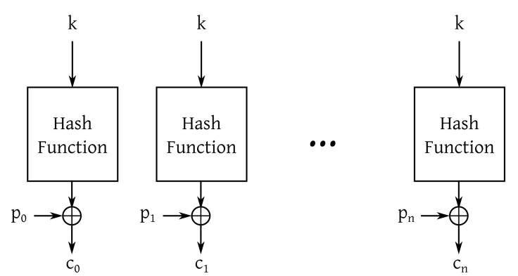
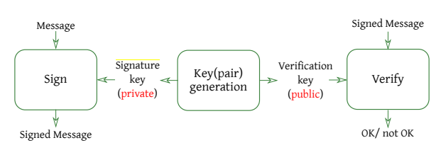

# Cryptography
### One Time Pad
A perfect cipher implementation. They key is pre-shared, used to encrypt a message m trough XOR and never used again. It is perfect since the length of the key is the same as the message. It is minimal since the number of keys is equal to the number of messages.

Perfect cipher are not vulnerable to bruteforce because of the minimal property.
### Block cipher


Assuming that the key is fixed, plaintext blocks with the same value will be encrypted to cypertext blocks with the same value. Under the assumption that the attacker only eavesdrops on the cypertext, if the attacker knows the position of a zero-filled plaintext block, she/he will be able to decrypt all the messages (the key is can be easily leaked). This can be fixed by adding a nonce to k that is increased at each block. So confidentiality is ensured.

The hash function is employed as a CSPRNG and has the only purpose to ensure confidentiality.

To ensure integrity a small piece of information (tag) must be added to the cypertext (not to the plaintext otherwise the attacker may be able to retrieve the key). In this way we are adding a MAC (message authentication code). In general, any user is able to verify and compute a MAC (it does not provide authentication).

To provide authentication a cryptographic signature must be used, as the actor verifying it should not be able to produce a valid one.
### Diffie-Hellman key agreement
The goal is to make two parties share secret value with public messages. The attacker can eavesdrop anything, but not tamper.
### Symmetric vs. Asymmetric encryption
#### Symmetric
* A single key is used both for encryption and decryption. Only confidentiality is guaranteed (not integrity).
* Disadvantage: a way to share the key must be found (key management problem), (consequently) scalability.
#### Asymmetric
* A pair of key is used (public, private). The public one is used to encrypt and the private one to decrypt. Confidentiality is guaranteed, but not integrity (if the role of the keys is reverted also the guaranteed properties change).
* Advantages: key management problem is solved (employ a one-way function with trapdoor to compute the private key from the public one).
* Disadvantages: computational complexity, (consequently) power consumption, PKI limitations.

### Public Key Infrastructure (PKI)
PKI is a framework that manages the creation, distribution, management, and revocation of digital certificates, which are used to associate public keys with identities (individuals, devices, ..).

* **Certificate Authority (CA)**: A trusted entity that issues and revokes digital certificates.
* **Registration Authority (RA)**: Acts as a verifier for the CA before a digital certificate is issued to the user.
* **Digital Certificates**: Documents that bind a public key with an identity, signed by a CA.
* **Certificate Revocation List (CRL)**: A list of certificates that have been revoked before their expiration dates.

Each digital certificate must be verified before trusting.  This verification can be done both online (by fetching CRL) and offline (by using root CA) and the public key must be used. Both the validity period and the integrity must be checked.
### Digital signatures



Digital signatures provide strong evidence that data is bound to a specific user. No shared secret is needed to check. Proper signature cannot be repudiated by the user. 
The message to be signed is first run through a hash function to produce a hash value (message digest). This hash value is a unique representation of the original message. Then it is encrypted using the signer's private key. This encrypted hash is the digital signature.

They are employed in hybrid encryption scheme to ensure that the public key the sender uses is the one of the recipient.
# Binary exploitation
## String format
```
<tgt><tgt+2>%<lower_part-already_printed_chars)>c%pos$hn<higher_part-low_part>c%pos+1$hn
```

If lower\_part > higher\_part then we have to swap \<tgt> and \<tgt+2>.

NOTE: if we write some characters before "what to write", we have to consider it in the displacement (in words).
# Secure Network Architecture
## VPN
It ensures an encrypted overlay connection over a (public) network. It solves the problem of creating a trusted network transport over an untrusted channel.
A VPN server should be implemented in the same network as the local computers (to ensure the same level of security). All laptops that should be allowed to contact the VPN server must be set up, and the firewalls's rules of the network must be updated as well (the VPN server must reach the local network trough the internet on a custom dest port).

* Full tunneling: every packet goes trough the tunnel.
  It could be inefficient due to traffic multiplication.
  It needs a single point of control and application of all security policies as if the client were in the corporate network. If the company is worried about the integrity of the traffic that reaches the computer also in case of remote connection, then this is the best option.
* Split tunneling: the traffic to the corporate network is sent trough the VPN, while the traffic to the internet is  sent directly to the ISP.
  It is more efficient but there is less control.
## Network Protocol Attacks
#### Denial of Service (DoS)
- [[Computer Security cheatsheet#SYN flooding|SYN flooding]]
- [[Computer Security cheatsheet#Distributed DoS|Distributed DoS]]
- [[Computer Security cheatsheet#DHCP poisoning|DHCP poisoning]]
- [[Computer Security cheatsheet#DNS poisoning|DNS poisoning]]
- [[Computer Security cheatsheet#ICMP redirect attack|IMCP redirect]]
- [[Computer Security cheatsheet#Smurfing|Smurfing]]
#### MITM attacks
- [[Computer Security cheatsheet#ARP poisoning/spoofing|APR poisoning/spoofing]]
- [[Computer Security cheatsheet#Spoofing|Spoofing]]
- [[Computer Security cheatsheet#DNS poisoning|DNS poisoning]]
- [[Computer Security cheatsheet#ICMP redirect attack|ICMP redirect]]
### SYN flooding
The multiplier factor is the fact that every time the server receives a SYN packet it has to save it in memory which is limited: an attacker simply send packets, without having to store them, needing less resources. An attacker sends a high volume of SYN requests with spoofed source address (faking the source aka using different IPs), many TCP/IP connections fill the queue and the service will not be able to answer anymore.

The attack can be mitigated with the use of SYN-cookies: the server reply with SYN+ACK but discard the half-open connection, and wait for a subsequent ACK from the client.
### Distributed DoS
A botnet (network of compromised computers called bots) are controlled via a dedicate command-and-control (C\&C) infrastructure by the attacker (bot master). 
### ARP poisoning/spoofing
ARP lacks of authentication: the first answer to the request is trusted. An attacker (who must be inside the network) can forge replies easily, the first that answers the ARP request is the one accepted. 
The goal is that of becoming a MITM.

Possible mitigations are check responses before trusting or add a SEQ/ID number in the request.
### MAC flooding
Switches uses CAM tables to cache which MAC addresses are on which ports. An attacker can generate ARP replies and fill the table in seconds. When full ARP replies cannot be cached and everything must be forwarded to every port (like hubs do) to avoid DoS and keep the service available. 
This is not a true DoS attack, it only turns switches based into hubs networks.

A mitigation is using CISCO PORT security.
### Spoofing
If the communication is not encrypted (http) the attacker can see all data flow: for example he/she is able to see the TCP SYN/ACK numbers and simulate the connection.
### TCP/IP hijacking
An attacker may simulate a TCP connection to the victim. The attacker can only correctly spoof the address and hijack the connection if they guess the ISN sent by the sender to the victim. The ISN must be guessed to conclude the handshake.
However the spoofed source needs not to receive the response packets, otherwise it might answer with a RST to close the connection.

The attack works across the network (the attacker does not need to be in the same network of the victim).
### DHCP poisoning
DHCP is an unauthenticated protocol.
The attacker can intercept the “DHCP requests”, be the first to answer, and client will believe that answer. In this way, the attacker can set IP address, DNS addresses, and the default gateway of the victim client.
The attacker must be in the same network as the victim to perform this attack.

The attack can be used to hijack traffic or perform DoS attacks.
### DNS poisoning
The attacker knows that there is a non-authoritative DNS in the network. 
The non-authoritative DNS keeps a cache of previously resolved.
The final victim is any machine that is using the DNS as a local DNS server.

1. The attacker makes a recursive query (resolved by the non-authoritative DNS in behalf of the client) to the victim DNS server. In general, IP address of the attacker is spoofed.
2. The victim (non-autoritative DNS) contacts the authoritative DNS to resolve the query.
3. The attacker, impersonating the authoritative DNS, sniffs/guess the query ID and spoof the answer.
4. The victim DNS caches the malicious record (poisoned).

DNS uses UPD to communicate. Therefore, an attacker could exploit the lack of a session in UDP.
### DNS DoS attack
The attack can be performed only under UDP (that does not have authentication).
It is based on the amplification factors of the Authoritative DNS responses. 
The attacker can spoof the IP address of the victim and send to the authoritative DNS server a request for all the available records. In this way, the Authoritative DNS response, way bigger than the query, is sent to the victim.

A possibile mitigation is to set up a stateful firewall to ensure that DNS responses are not forwarded if no DNS query from a client has been provided, or generally filter the rate of DNS responses that it allows towards a specific client. However, this solution moves the problem to the firewall.

A definitive solution is to avoid to answer to requests for all records, removing the amplification factor. This can be done only by the DNS administrator.
### ICMP redirect attack
In general, the goal of the attacker is to redirect the traffic to a specific machine (MITM, DoS, ..). The attacker needs to send an ICMP redirect message to the victim, spoofing the IP of the gateway redirect the traffic to another IP. The default gateway will become the new IP.
The attack is aimed at re-route traffic on specific routes or to a specific host that may be not a router at all.

In general, detecting and mitigating ICMP attack is non-trivial as the ICMP redirect response could be sent by a gateway as response to any of the packet sent by the victim.
An easy option is to completely disable ICMP redirect in the OS trading performance (non-optimal routes).
In order to mitigate the attack a fine-grained control mechanism could be used: if multiple ICMP redirect are received following a single packet sent, drop them all as it is a possible attempt of attack.
### Smurfing
It is a DDoS attack that exploit IP and ICMP. The attacker overwhelm a system with a flood of ICMP echo (ping) request, causing a DoS to legitimate users.
The attacker sends ICMP echo request packets with the spoofed source IP address of the target system. These packets are sent to a network’s broadcast address. Each device in the subnet receives the ICMP echo request and responds with an ICMP echo reply. Because the source IP is spoofed to be the target’s IP, all replies are sent to the target system.

The attack leverages the broadcast nature of ICMP to amplify the traffic sent to the target. A single ICMP request sent to a broadcast address can generate responses from many hosts, significantly amplifying the volume of traffic directed at the target.

A mitigation to smurfing is to configure routers to not forward packets directed to broadcast addresses. This can prevent the amplification aspect of the attack.
Another possible mitigation is to apply limits on ICMP traffic.
# Malware Security
## Dormant code
The malware is waiting for certain conditions to be true before doing evil actions.

It is possibile to apply static analysis, since no obfuscation is made.
It is possibile to apply dynamic analysis only after the conditions are met. It is possibile to modify the binary to force the execution of the malicious operations by patching the assembly instructions or manually modifying in gdb the result of the functions that regulate the conditions.
## Anti-debugging technique
It is not possible to apply dynamic analysis. It is still possible to modify the binary to force the execution (as previously explained).
## Polymorphism
The payload is encrypted with a cryptographycally-secure algorithm. The decryption routine itself changes slightly each time (the decryption routine is metamorphic!), making it harder to detect by signature-based methods.

Advantages: static analysis is ineffective due to obfuscation.
## Metamorphism
Different versions of the same malware are generated at each propagation, by rearranging its control-flow graph, substituting instructions with equivalent ones, injecting dumb instructions to break possible signatures and so on. Each instance of the malware is structurally different from others.

Advantages: signature-based methods are ineffective, static analysis may be ineffective too.

Bonus: it is possible to mix polymorphism and metamorphism to gain both the advantages (after decryption the malware rewrite itself).
## Anti-virus and Anti-malware
- Signature-based detection (basic strategy): database of byte-level or instruction-level signatures that match known malware. Wildcards or regular expression can be used.
- Heuristics: code execution in last section, incorrect header size, suspicious code section name, patched import address table.
- Behavioral detection: detect signs of known malware or "common behaviors"