# Cybercrime
Risk is a statistical and economical evaluation of the exposure to damage because of the presence of vulnerabilities and threats. $$Risk = Asset \times Vulenarbilities \times Threats$$Asset and vulnerabilities are the controllable variables while threat is independent (it is the driver of risks, without threats there is NO risk). 
## Threat landscape
- Internal or external w.r.t. the organization.
- Generic or targeted.
- Financially motivated (largest group of attacks according to historical records) or not.
### Gartner quadrant of threats 

|          | Generic                      | Specific                                        |
| -------- | ---------------------------- | ----------------------------------------------- |
| Internal | disgruntled employees (no €) | socially-engineered or dishonest employee (€€€) |
| External | criminals (€€€)              | a variety of attackers (€)                      |

In general the external-generic threat is easy to predict according to what makes the company valuable. It is the most common: criminals want to be effective (reproducibility and scalability) so they don’t want to focus on specific targets.
On the other hand, non-financial attacks or internal ones are difficult to predict.

Internal threats can be countered by contracts and separation of duties.

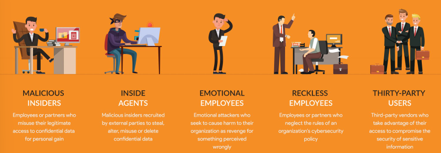

### Financially-oriented attacks
The attackers can **monetize** their attack **directly** (credit card frauds, ransomware, fake AVs, tech support scams, ..) or **indirectly** (information gathering, abuse of computing resources, rent/sell botnet infrastructure, ..). 
The discriminant between the two is whether the money comes directly from the victim or from the use of their computer.

A **ransomware** is a malware which encrypts a device and asks for ransom to decrypt it. It can also be asked to pay for not sharing stolen data if it's confidential.
1. Data is encrypted via symmetric encryption (faster than asymmetric).
2. The C\&C server generates public and private key pair, then sends the public key to the ransomware.
3. The ransomware encrypts the symmetric key using the public key.

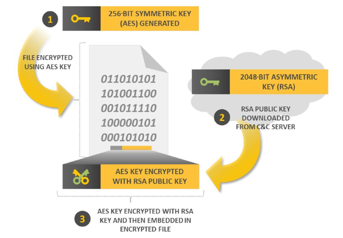

The only way to recover data is by using the private key that is stored in the C\&C server. A mitigation against it are backups.

A **botnet** is a network of compromised machine (infected) controlled by a bot master (C\&C, command and control). It can be used to make DDoS, distributed phishing or to crack password in a distributed way. 
It must be noted that botnet geolocation data is skewed because it depends on the number of connected users from a certain country and on the service provider the machines are using.
## Cybercrime ecosystem
Cybercrime has its own ecosystem, which exists only because some activities are not illegal. It is made of:
- Producers, who produce the malware (not illegal).
- Enablers, that provide the infrastructure to make the malware work. It can be botnets or "bulletproof" hosting (that reside in a weak legal country).
- Sellers, various kits are sold (botnets, exploitation kits, viruses, ..) as well as stolen VISA accounts or identities of some kind (common for money laundering).
- Testers, that check the malware against common AVs to evaluate its elusiveness (not illegal).
- Clients, that use the malware.
- Money mules, that launder the money made through malware sales (in common with traditional crime actors). They have to break the **traceability**: the idea is to detaches the crime from the victim in small pieces that may not be crimes.

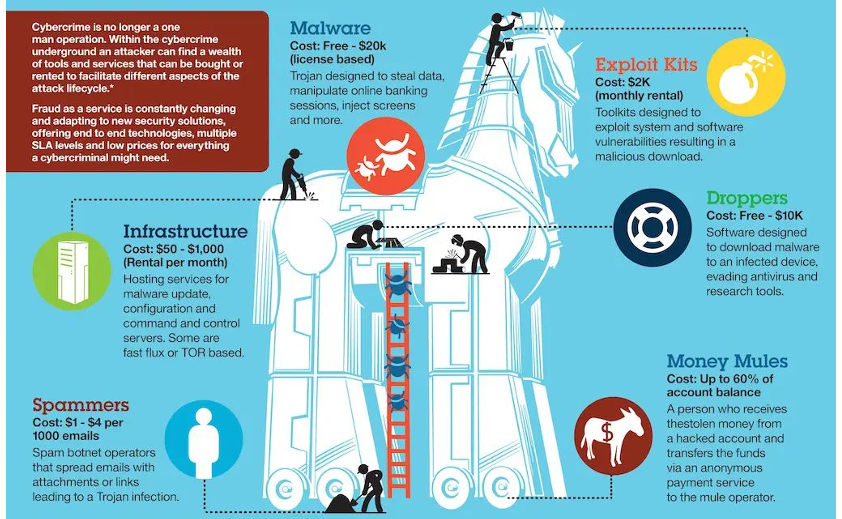
## Cryptocurrencies: abuses and forensics
Cryptocurrency is a completely decentralized way of managing transactions, since it eliminates the need of a trusted authority.

BitCoin is a secure, **decentralized payment system** implementation. It is also a tool for the storage, verification and auditing of information including digital representations of values (ex. NFT).
The BitCoin protocol defines a network over internet to mine bitcoins. Each **node** manage a group of **addresses** that holds coins, each address is a **hash the public key** (which belongs to a public-private pair) and act as a **pseudonym** of the coin’s holder.
The nodes view is formed by a **blockchain**, a shared, append-only, trustable, ledger of all transactions. A block is a transaction within a certain timeframe. The blockchain is a linked list of all the blocks: it contains all the transactions that have ever taken place since BitCoin creation.

A wallet is the SW that allows to:
- Manage and store the public-private key pair for each of your bitcoin address.
- Create and sign transactions (receive/spend BTC).
- Track the balance.

A bitcoin public address is an alphanumeric string from 26 to 35 characters. It works like the IBAN for a bank account. It is also the public key: it can be shared with anyone to receive payments and used to access the transaction’s history.
### Bitcoin transaction lifecycle


A transaction contains the hash of previous transaction of that account, hashed with the receiver public key and signed with the sender public key.
Blocks are a way to validate transactions that occur on the network.

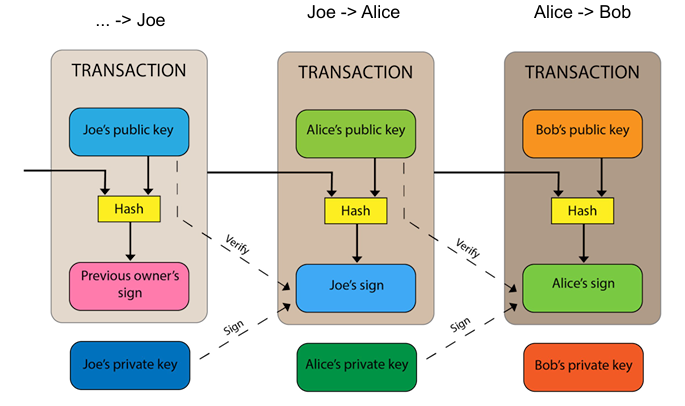

Miners competes to generate a new valid block by solving a complex mathematical problem by bruteforce: the solver is then rewarded a fixed number of BTC. If simultaneous solutions are found, the chain is forked (the network will converge over time). This mechanism is called **Proof-of-Work**.
The protocol ensures that the difficulty of finding the next block increases/decreases in relation to the number of miners competing.

Transactions to be included in blocks are chosen based on the amount of fee provided: the lower the fee, the longer for the transaction to be completed.
Moreover, a transaction is confirmed when it belongs to a block at least 6/7 blocks away from the end of the chain (so the network converges). The longer the path, the more computation was expended building it. This is an extremely costly solution: bitcoin is not really helpful for small transactions.
### Pseudo-anonymity
Bitcoins are often used by cybercriminals to perform illegal transactions because the number of identities that one can have is arbitrarily large  (ex. blockchain hopping).

Since everyone can have an arbitrary number of anonymous addresses, those can be used to split a transaction into multiple ones and make the derivation of the real owner difficult.

However, transaction data is public, and publicly analyzable.
If a transaction has multiple inputs, it is very likely that the inputs are all owned by the same entity. By analyzing the key we can associate group of keys together (ex. BitIodine, cluster addresses that are likely to belong to the same group of users).
# Fraud Analysis and Detection

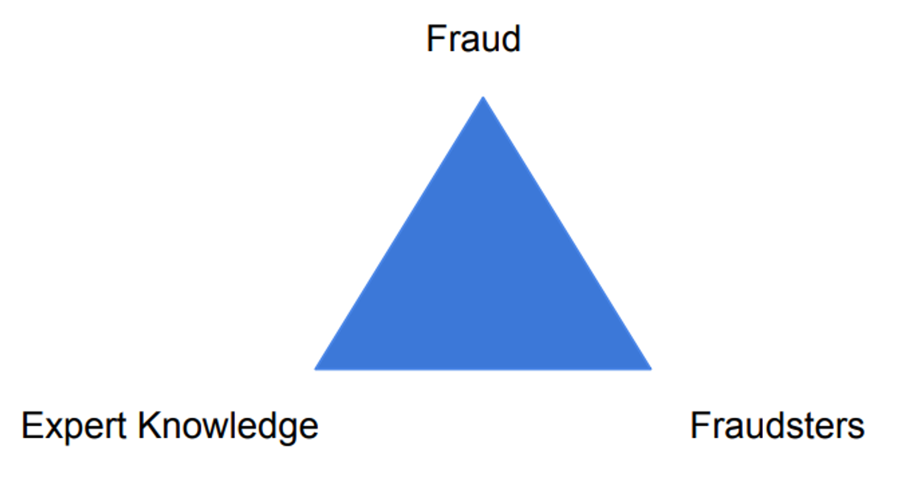
A fraud is **wrongful** or **criminal deception** intended to result in **financial** or **personal gain**. Fraud is a social phenomenon, that is:
- Uncommon: since only a minority of cases concerns fraud.
- Well-considered and imperceptibly concealed: fraudsters try to remain **unnoticed** and covered (do not behave different from non-frauders). They hide by well-considering and **planning** how to precisely commit fraud. Frauds are not impulsive and unplanned.
- Time-evolving: fraudsters adapt and refine their methods to remain undetected, their techniques evolve in time, along with better ahead fraud-detection mechanism (cat\&mouse game). Fraud-detection systems improve and learn by example.
- Carefully organized: fraudsters do not operate independently, fraud involve complex and organized structures.

All these characteristics makes difficult to:
- **Detect fraud**, since fraudulent cases are covered by the legitimate ones.
- *Learn from historical cases**, since only few examples are available.

To detect fraud, the context should be taken into account. 
The basic driver for people to commit fraud is the **potential gain or benefit**. A fraud-detection and prevention mechanism aims at reducing the opportunity driver. It aims at **making the fraud not convenient** for the attackers.

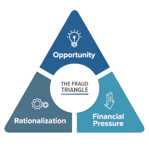
Basic conceptual model: presents the factors that explains the drivers for an individual to commit fraud.

Another possibile fraud vector is **social engineering**: it uses **influence, manipulation** and **persuasion** to **deceive people** by convincing them that the social engineer is someone he is not. As a result, the social engineer is able to take advantage of people to obtain information with or without the use of technology. This may include obtaining information, gaining access, or getting the victim to do certain actions.
Obtaining information from a human is easier than performing an attack to an information system. People are the largest vulnerability in any security chain. No technology in the world can prevent social engineering.
## Fraud categories
- **Banking and Credit Card Fraud**: most common one. Consists of unauthorized taking of another’s credit. Two types:
	- Application fraud: obtaining new credit cards from issuing companies by using false personal information, and then spending as much as possible in a short space of time.
	- Behavioral fraud: details of legitimate cards are obtained fraudulently. It does not necessarily require stealing the physical card, but only credentials.
- **Insurance fraud**: from the seller side (ex. selling policies from non-existent companies), or from the buyer side (ex. exaggerated claims, false damage, ..).
- **Corruption**: misuse of power for private gain.
- **Counterfeit**: imitation intended to be passed off as genuine.
- **Product warranty fraud**: fraudulently claiming compensation or remuneration based on a product warranty.
- **Healthcare fraud**: filing of dishonest healthcare claims to make profit.
- **Telecommunications fraud**: theft or use of telecommunication services to commit other forms of fraud (ex. cloning fraud, superimposition fraud).
- **Money laundering**: taking the proceeds of criminal activity and making them appear legal.
- **Click fraud**: illegal clicks on a website’s click-through advertisements to increase the payable number of clicks to the advertiser (manually or automatically).
- **Identity theft**: obtaining personal or financial information of another person for the purpose of assuming that person’s identity (ex. sim swap attack).
- **Tax evasion**: illegal act or practice of failing to pay taxes that are owed.
- **Plagiarism**: steal and pass off the ideas or words of another as own.
- **Phishing:** attempting to acquire sensitive information by masquerading as a trustworthy entity in an electronic communication (ex. deceptive mass mailing, Nigerian prince scam).
## Anti-fraud strategy
Fraud-detection and prevention mechanism aim at reducing losses due to fraud. Fraudsters, like other criminals, tend to look for the easy way: we have to make the fraud difficult.
- **Fraud detection**: recognize or **discover** fraudulent activities after they have happened (ex-post approach).
- **Fraud prevention**: **avoid** or reduce fraud that will happen (ex-ante approach).

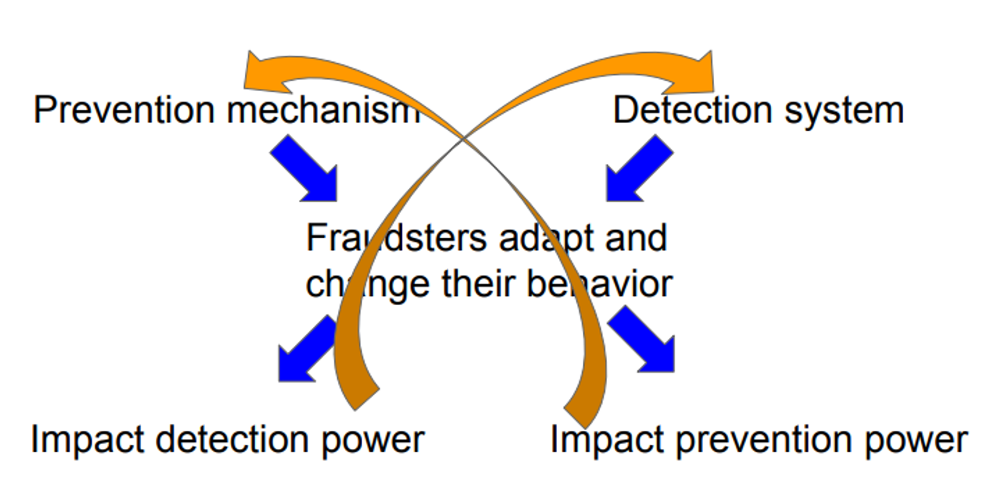
They are complimentary, but not independent. When fraudsters adapt to a detection mechanism, it will also impact prevention and vice-versa.

Fraud detection approach compute a score (fraud risk level) for each transaction in order to retrieve the most likely fraudulent action. The fraud risk level is provided, then an actual human will investigate the transactions flagged as positive. The more information he has, the better will be his work.

Prevention mechanism is a combination of multi-factor authentication (ex. OTP, smart cards, TOTP).
An example is **PSD2** (Payment Services Directive), an European regulatory requirement which has the goal of reducing fraud and making online payments more secure. It requires to use at least two of the following three elements: something the customer knows (e.g. PIN), has (e.g. OTP) or is (e.g. fingerprint). Usually subscriptions, small transactions or low-risk transactions are exempted (recall the security-usability trade-off).
## Expert based knowledge
The expert based approach is built on the **domain knowledge** of the **fraud analyst** that is able to gather and process the right information in the right manner. It involves a manual investigation of suspicious cases, which may indicate a new fraud mechanism that allows extending the fraud detection and prevention mechanism.

When fraudulent activities have been detected and confirmed, two types of measures are typically taken:
- **Corrective measures**: aim to resolve the fraud and correct the consequences. 
  Retrospective screening: actions to retrospectively detect and subsequently address similar fraud cases. The sooner corrective measures are taken and fraud is detected, the more effective such measures are and the more losses can be avoided.
- **Preventive measures**: aim at preventing future frauds, making the organization more robust and less vulnerable. Typical process:
  1. Investigate the fraud case to understand the underlying mechanisms.
  2. Extend the available expert knowledge with the discovered mechanisms.
  3. Adjust the detection and prevention system.

Starting from expert-based approach we can build a **rule-based engine**, which is basically a set of `if-then` rules that describes the previously detected fraud patterns and is applied to future transactions (trigger an alert when a fraud may be committed). They are based on the expert knowledge.

```
IF:
    amount of claim is above threshold OR
    severe accident, but no police report OR
    severe injury, but no doctor appointment OR
    claimant has multiple versions of the accident OR
    multiple recipts submitted
THEN:
    flag claim as suspicious AND
    alert fraud investigation officer.
```

**Red flags** is the anomaly, that is a variation from predictable patterns of behavior or something that seems out of place. Red flags are translated in expert rules and included in a rule-engine.

Disadvantages of rule-based engine:
- Expensive to build: it requires manual input by the fraud experts.
- Difficult to maintain and manage: updated are needed in order to keep the rule base effective, every single case require human follow-up and investigation.
- New fraud patterns are not automatically signaled: fraud is a dynamic phenomenon, fraudsters can learn the rules and circumvent them, but the rules are static.

So, rule based engine must continuously monitored, improved, and updated to remain effective.

Fraud becomes easier to detect the more time has passed. For this reasons in the last years we have seen a shift from rule-based engine to data-driven engine since big data can be exploited at a lower cost.

Expert-based fraud-detection system relies on human expert input, evaluation, and monitoring. It is a starting point and a complementary tool to develop an effective fraud-detection and prevention system. On the other hand, data-driven fraud-detection systems requires less human involvement, could lead to a more efficient and effective system. Expert knowledge remains crucial to build effective systems.
## Data-Driven Fraud Detection
Main characteristics:

- Precision: 
    Increased detection power w.r.t. classic approaches, since it requires the processing of massive volume of information to uncover frauds that are not apparent to the human eye. 
    The goals of a fraud-detection systems are:
    - Make optimal use of the limited investigation capacity.
    - Maximize the fraction of fraudulent cases among the inspected ones (more frauds detected).
    The higher precision is due to the higher fraction of inspected frauds.
- Operational and cost efficiency: 
  The increasing amount of cases to be analyzed, requires automated processes. Operational requirements exist, imposing time constraints on the processing of a case. Expert-based fraud detection systems is challenging and labor intensive while automated data-driven approaches are compliant with stringent operational requirements.

The negative social and financial impact of frauds increase awareness and attention that lead to growing investments and research from academia, industry, and government.
## Fraud detection techniques
Fraud-detection approaches have evolved: we have made huge steps in adopting powerful statistically-based methodologies and analyzing massive amount of data. But frauds remains hard and complex to detect.

Challenges of developing fraud-detection models:
- **Dynamic nature of fraud**. 
  Fraudsters adapt their approaches (camouflage) so we need adaptive analytical models for detection and prevention.
- **Good detection power**. 
  In order to detect fraud as accurately as possible, we want a low false negative rate (missed frauds) especially involving large amounts (high financial impact) & a low false alarm rate, to avoid harassing good customers and prevent accounts or transactions to be blocked unnecessarily.
- **Skewness of the data**. 
  In general, we have plenty of historical examples of non-fraudulent cases, but only a limited number of fraudulent cases. It is a needle-in-a-haystack problem: we might experience difficulties in learning an accurate model.
- **Operational efficiency** (big data management). 
  We have a limited amount of time available to reach a decision and let a transaction pass or not. It impacts the design of the analytical model since it should not take too long to evaluate. The information or the variables used by the model should not take long to be gathered or calculated.

There is a need for new techniques that are able to detect and address stealthy patterns:

- **Unsupervised learning** or **descriptive** analytics techniques. 
	They do not require labeled observations. The objective is to learn the norm from historical observation. 
	It is able to detect a new fraud if it leads to **detectable deviations from normality**
	(detecting anomalies = find the behavior that deviates from normal one). 
	It allows to detect **novel fraud patterns**, that are different in nature from historical frauds and make use of new, unknown mechanisms.
	Limitations: It is prone to **deception** (camouflage-like fraud strategies). For this reason it is not a replacement, but it is complimentary to expert rule-based fraud detection system. It can lead to lots of false positives.
- **Supervised learning** or **predictive** analytics techniques. 
	The objective is to learn from historical observations to **retrieve patterns** that allow **differentiating** normal and fraudulent **behavior**. It aim at finding tracks that fraudsters cannot hide: “**known alarms**”. It can be applied to **prediction**, **detection** and **estimation** of the amount of fraud.
    Limitations: They need historical examples to learn from (labeled). For this reason data source quality is crucial and data scarcity is a problem. They have a low detection power against different and new fraud types (not detected so far and not included in the historical DB). It can lead to lots of false negatives.

**Active learning systems** use both methods in developing a powerful fraud-detection and prevention system. In this way we focus on different aspects of fraud.
Trough **graph/network analysis** we are able to extend the abilities of the fraud-detection systems by learning and detecting characteristics of fraudulent behavior in a network of linked entities. Including an **extra source of information** in the analysis contributes in uncovering particular patterns indicating fraud.

In developing a fraud detection system we generally start with an expert-based rule engine, add a unsupervised learning system (it does not need labeled data that we may not have), then, once we build a labeled history, use a supervised learning system.
### Fraud management cycle
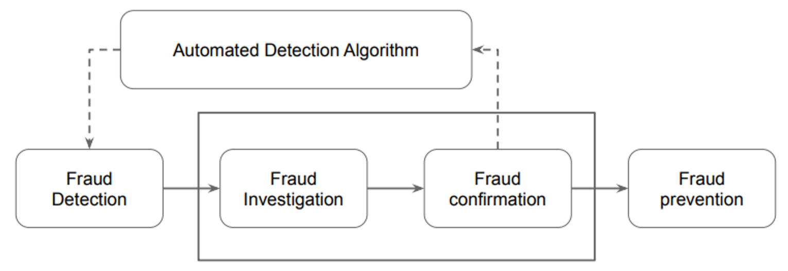

- **Fraud detection**: applying detection models on new, unseen observations and assigning a fraud risk to every observation.
- **Fraud investigation**: a human expert is required to investigate flagged cases given the involved subtlety and complexity.
- **Fraud confirmation**: determining true fraud label, possibly involving field research.
- **Fraud prevention**: preventing fraud to be committed in future.
- **Feedback loop**: newly detected cases should be added to the DB of historical fraud cases, which is used to learn or induce the detection model. It automatize the process.

A **regular update** of the model is recommendable given the **dynamic nature of fraud**. The **frequency of re-training** or **updating the detection model** depends on several factors:
-  The volatility of the fraud behavior.
- The detection power of the current model.
- The amount of (similar) confirmed cases already available in the DB.
- The rate at which new cases are being confirmed.
- The required effort to re-train the model.

An alternative technique is **reinforcement learning**, which works by **continuously updates** the model by learning from the newest observations. This allows continuous updates **avoiding costs**, but it **enlarges threats**: if I avoid the automatized detection system once, I can do it anytime.
### Fraud analytical process
It is the sequence of operations that we have to perform to put in place a data-driven approach.

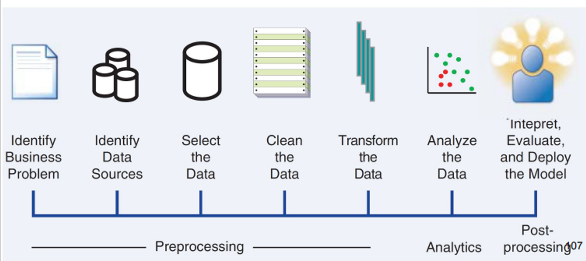

Data are the key ingredient so data selection has an important impact on the analytical models: data are gathered and then cleaned by getting rid of all inconsistencies, such as missing values and duplicate data. Additional transformation are performed when needed: eliminations, alphanumeric to numeric coding, geographical aggregation, and so on.

The analytical model is estimated on the pre-processed data. The actual fraud-detection model is built during the data analysis step. Finally, the model is interpreted and evaluated by the fraud experts.

We want our model to be able to detect **trivial fraudulent patterns** (**model validation**), but also **unknown patterns** (”knowledge diamonds”, provide added insight and detection power). Once the analytical model has been appropriately validated and approved, it can be put into production.

Moreover, the **output** must be represented in a **user-friendly way**, since it must be analyzed by people, it must be easy to investigate. It must be able to **integrate** with other systems, since (in general) financial applications are made up of many systems. The model must be **monitored** and **back-tested** in each single case: we have to be sure that is reliable.

Key characteristics of successful fraud analytics models:
- **Statistical accuracy**: detection power and correctness of the statistical model in flagging suspicious cases. We need to make sure that the model generalizes well and is not over-fitted to the historical data set.
- **Interpretability**: when a deeper understanding of the detected frauds is required, a fraud-detection model must be interpretable. Model’s interpretability depends on the technique used.
	- **White-box models**: allow to understand the underlying reasons why the model signals a case to be suspicious. Lower detection power at the cost of higher interpretability (trade-off).
	- **Black-box models**: complex, non interpretable. Higher detection power at the cost of lower interpretability (trade-off).
- **Operational efficiency**: time and effort that is required to collect and pre-process the data, to evaluate the model, to monitor, back-test the model and re-estimate it, to evaluate whether a case is suspicious or not. When cases need to be evaluated in **real time**, operational efficiency is crucial and a main concern.
  Developing and implementing a fraud-detection model involves a significant cost to an organization:
	- To gather, preprocess, and analyze the data.
	- To put the resulting analytical models into production.The software, human, and computing resources.
	- External data to enrich the available in-house data.
    Cost-benefit analysis is made in order to gain insight of the returns on investment of building an advanced fraud-detection system. 
    Direct costs: management, operational, equipment. 
    Indirect costs (more relevant): less usability, slower performance, less privacy (due to security controls), reduced productivity (users are slower).
    More money does not mean more security (ex. very expensive “unconfigured” fraud-detection systems, or complex authentication that slows down users).
- **Regulatory compliance**: depending on the context there may be internal or external regularization that applies to the development and application of a model. A fraud-detection model should be in line and comply with all applicable regulation and legislation.
## Machine Learning for fraud detection
### Data pre-processing step
In theory, for data “the bigger the better” but real data is typically “dirty” (inconsistencies, incompleteness, duplication, ..). Messy data will yield messy analytical model. 
For this reason data-filtering mechanism must be applied to clean up and reduce the data since even the slightest mistake can make the results invalid.

Variety of different sources provide different information: transaction data, contractual, subscription or account data, sociodemographic information, survey, expert-based data, publicly available data, and so on. We have to decide which ones are useful for our purposes.

Transactional data is structured and detailed information capturing the key characteristics of a customer transaction. It can be summarized over longer time horizons by aggregating it (averages, absolute/relative trends, max/min values, recency, frequency and monetary). The interaction between transactions is very useful for fraud detection (anti-money laundering).

The application of both descriptive and predictive analytics requires data represented in a structured manner. A structured **data table** allow straightforward processing and analysis:
-  The **rows represent** the basic **entities** to which the analysis applies, also referred to instances, observations, or lines.
- The **columns contain information** about the basic **entities**. Also referred to (explanatory) variables, fields, characteristics, attributes, indicators, features.

Types of data elements:
-  **Continuous data**: defined on a interval, which can be both limited or unlimited.
- **Categorical data**:
	- **Nominal**: can take on a limited set of values with no meaningful ordering.
	- **Ordinal**: can take on a limited set of values with a meaningful ordering.
	- **Binary**: can only take two values (yes/no).

**Sampling** is the process that take a subset of historical data to build an analytical model. A good sample must be **representative** for the entities and we must choose the **optimal time window**. We need to make a **trade-off** between **lots of data** (a more robust analytical model) and **recent data** (more representative). We have to choose an “average” period to get as accurate as possible a picture of the target population. We have to take into account that sampling has a direct impact on the fraud detection power. 
Sampling bias should be avoided even if is not straightforward.

In order to **mitigate seasonality effect** or **bias** we can:
- **Build separate models** for different but **homogeneous time frames**. This is a complex and demanding solution: multiple models have to be developed, run, maintained and monitored. It can be more accurate.
- Sampling observations over a period **covering a full business cycle** and build a single model. It reduces the detection power since it is less tailored to a particular time frame. It is less complex and costly to operate.

In a fraud detection context data sets are very skew. We can apply **stratificatied sampling** in two ways: according to the target fraud indicator (sample will contain exactly the same percentages of (non-) fraudulent transactions as in the original data) or applied on predictor variables (resemble the real product transaction distribution).
#### Exploratory statistical analysis
Visual data exploration give us an initial insight into the data (pie chart, bar charts, histogram, scatter plots).
We can complement the data processing with inspection of some basic statistical measurements to see whether there are interesting patterns. It can be of two types:
- **Basic descriptive statistics**: provide basic insight for the data (mean, median, mode, variation, standard deviation, percentile values)
- **Specific descriptive statistics**: it express the symmetry or asymmetry of a distribution. 
  The values of these measures are harder to interpret: this limit their practical use and sometime it is easier to assess these aspects inspecting visual plots of the distributions of the involved variables (Benford’s Laws).
#### Missing values
They can occur because of various reasons: the information can be **non applicable** or **undisclosed**, or **error** can occur during **merging** sources. Some analytical techniques can deal directly with missing values. Other techniques need some additional preprocessing.
-  **Replace** the missing value with a known value.
- **Delete** observation or variables with lots of missing values. This assumes that information is missing at random and has no meaningful interpretation/relationship with the target.
- **Keep** missing values can be meaningful and may have a relation with fraud and needs to be considered as a separate category.

We need to statistically test whether missing information is related to the target variable or not. If yes, then we can adopt the keep strategy and make a special category for it. If not, depending on the number of observations available, we can decide to either delete or replace them.

**Outliers** are extreme observations that are very dissimilar to the rest of the population. It can be univariate (outlying on one dimension) or multivariate (on multiple dimension).

For detecting univariate outliers we can use:

- Histograms: 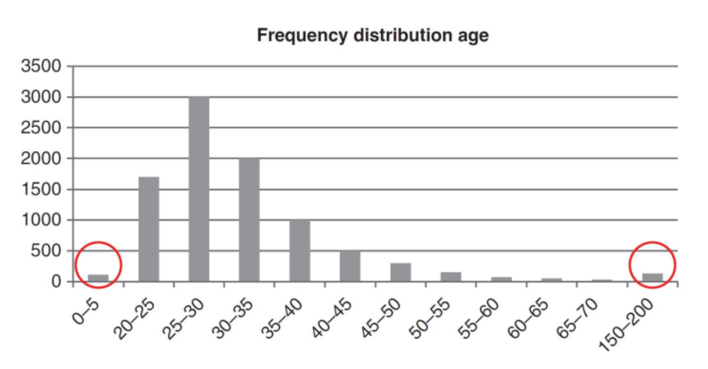
- Box plot: it represents three key quartiles of the data that are 1st quartile (25% of the observation have a lower value), the median (50% of the observation have a lower value), 3rd quartile (75% of the observation have a lower value). 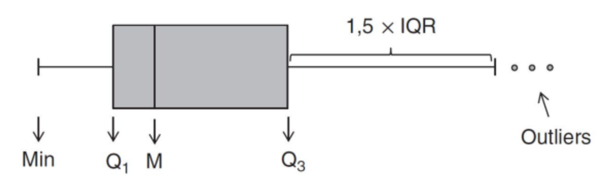
- z-scores: measures how many standards deviations an observation lies away from the mean. It relies on the normal distribution.
  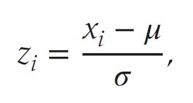


For multivariate outliers we can use: fitting regression lines and inspecting the observations with large residuals (error), clustering, or calculating the Mahalanobis distance.

We have to take into account that not all invalid values are outlying and may go unnoticed if not explicitly looked into. We have to construct a **set of rules** based on **expert-knowledge**, which is applied to the data to check and alert for issues. Various schemes exists to deal with outliers.

- For **invalid observations**, we could treat the outlier as a missing value by including an indicator that the value was missing or even more precisely an invalid outlier.
- For **valid observations**, we can impose both a lower upper limit on a variable and any values below/above are brought back to these limits (**truncation**). When handling valid outliers in the data set using this technique, we may impair the ability of unsupervised learning techniques analytics in detecting frauds so we have to be extremely careful.

Standardizing data consist in scaling variables to a similar range (min/max standardization, z-score standardization, decimal scaling).

For categorical variables, it may be needed to reduce the number of categories. 
For continuous variables, by categorizing the variable into ranges, non monotonicity can be taken into account.

Many analytical modeling exercises start with tons of variables, of which typically only a few actually contribute to the prediction of the target variable. The average model in fraud detection has between 10 and 15 variables.

Filters are a very handy variable selection mechanism. They allow a quick screening of which variables should be retained for further analysis. It measures univariate correlations between each variable and the target. It allow reduction in the number of dimensions of the data set early in the analysis, but it works univariately and do not consider correlation between the dimension individually. Other criteria may play a role in selecting variables: privacy issues and regulatory compliance, also operational issues could be considered.
#### Principal component analysis (PCA)
It is a technique used to reduce the dimensionality of data by forming new variables that are not correlated and are linear combination of the original ones. These new variables describe the main components dimensions that are present in the original data set. 
The maximum number of new variables (principal components) is equal to number of original variables. 
To explain all the information (variance) in the original data set, the full set of principal components is needed. The variance contained in the original variables can be summarized by a limited number of principal components. 
Since some of these account for a very small fraction of variance of the original variables, they can be left out. At the end we have reduced the data set.

PCA biggest limitation is the reduced interpretability, since we are replacing the original variables with a (reduced) set of uncorrelated principal components. When interpretability is no concern, then PCA is a powerful data reduction tool that will yield a better model in terms of stability as well as predictive performance.

### Unsupervised Learning for Fraud Detection
Unsupervised learning = anomaly detection.

The main goal for a unsupervised learning is finding anomalous behavior deviating from the norm. To do so we have to know the behavior of the average customer at a snapshot in time and/or the average behavior of a given customer across a time period. 
It aims at finding anomalies: suspicious observations, outliers or exceptions.

It is relevant is environments where:
- Organizations are starting doing fraud detection.
- There is no labeled historical data set available.
- Fraudsters are continuously adapting their strategies.

First of all, we have to define the average behavior or norm: it depends on the application field, the boundary between norm and outliers is not clear-cut (fraudsters try to blend into norm), and the norm may change over time (analytical models built need to be continuously monitored and updated).

Anomalies do not necessarily represents frauds. Unsupervised learning for fraud detection require extensive validation of the identified suspicious observations.
#### Break-point analysis
It is an **intra-account** fraud detection method. A break-point indicates a **sudden change** in account behavior.

1. Define a fixed time window.
2. Split it into an “old” and “new” part.
3. Compare the two parts.
#### Peer-group analysis
It is a **inter-account** fraud detection method. A peer-group is a **group** of account that **behave similarly** to the target account. When the behavior of the target account deviates substantially from its peers, an anomaly can be signaled.

1. The peer group of a particular account is identified (prior business knowledge, statistical way, number of peers).
2. Target account behavior is contrasted with its peers (statistical test, distance metric).

Both break-point and peer-group analysis will detect **local anomalies** rather than global anomalies.
#### Clustering
It is a technique that slip up a set of observations into clusters that maximize the **homogeneity** (cohesion) or the **heterogeneity** (separation) among them. 
We have to carefully select the data for clustering (structured or unstructured). We have to avoid excessive amounts of correlated data by applying feature selection methods.

In fraud detection, anomalies are grouped into small, sparse clusters, based on similarity.

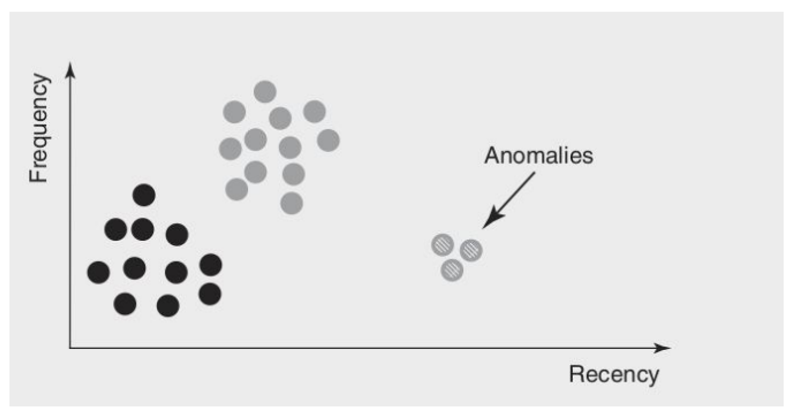

A **distance metric** is needed to **quantify similarity**. Various distance metrics have been introduced for both continuous and categorical data (Euclidean, Mahalanobis, Minkowski).

- For continuous variables we use Euclidean metric or Pearson correlation (cosine measure).
- For binary variables (categorical), we use Simple Matching Coefficient (SMC, calculates the number of identical matches between the variable values) or the Jaccard index (measures the similarity between both claims across those red flags that were raised at least once).

Types of clustering techniques: 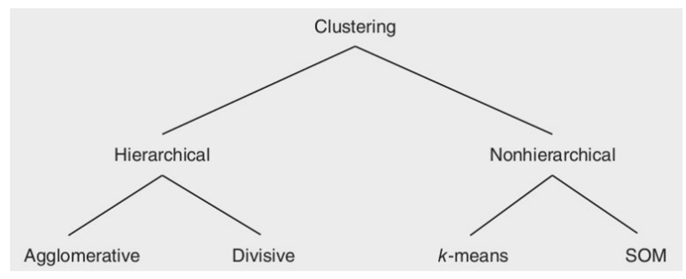

#### Hierarchical clustering

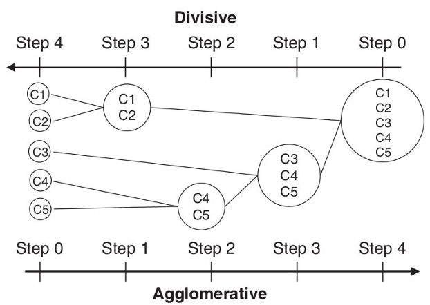
Distances between clusters: 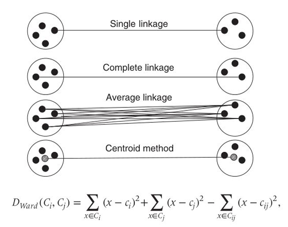 
-  **Single linkage**: in order to compute the distance you take the closest points between two clusters and you compute the distance w.r.t. to each other.
- **Complete linkage**: distance between two most dissimilar points between two clusters.
- **Average linkage**: average between all distance of all points of two clusters.
- **Centroid method**: compute the centroids, which are sorts of means of the clusters, and then you compute the distance between centroids.
- **Dward distance**: it tries it add some performance metrics between the final results. It computes similarities of two different clustering solutions.

In order to decide on the optimal number of clusters:
- *Dendogram**: tree-like diagram that records the sequences of merges. Vertical (or horizontal) scale gives the distance between two clusters amalgamated. Cut the dendogram at the desired level to find the optimal clustering.
- **Screen plot**: plot the distance at which clusters are merged. The elbow point then indicates the optimal clustering.

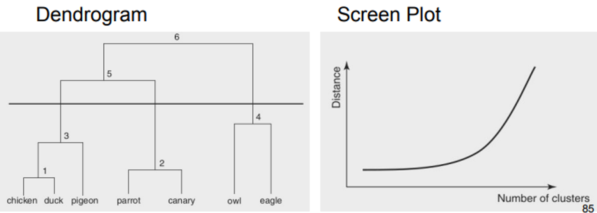

Final considerations on hierarchical clustering:
- Advantage: the number of cluster does not need to be specified prior to the analysis.
- Disadvantage: do not scale very well to large data set, the interpretation of the clusters is often subjective and depends on the domain expertise.
#### Non-hierarchical techniques
- **K-means clustering**:
    1. Select k observations as initial cluster centroids (seeds).
    2. Assign each observation to the cluster that has the closest **centroid**.
    3. When all observations have been assigned, recalculate the positions of the k centroids (mean).
    4. Repeat until the cluster centroids no longer change or a fixed number of iterations is reached
    A limitation is that the number of clusters k needs to be specified before the start of the analysis, this can come from an expert-based input, the result of another clustering procedure, trial and error, or by trying out different seeds to verify the stability of the clustering solution.
    It is sensitive to outliers, which are especially relevant in a fraud detection setting. A more robust alternative is to use the median instead (k-medoid clustering). In case of categorical variables, the mode can be used (k-mode clustering).
- **Self-organizing maps** (SOM)**:
    It allows users to visualize and cluster high-dimensional data on a low-dimensional grid of neurons. It is a feed-forward neural network with two layers: an input and an output layer.
    Each input is connected to all neurons in the output layer with weights $w = [w_1, .., w_N]$ with N = number of variables. All weights are randomly initialized. 
    When a training vector x is presented, the weight vector of each neuron c is compared with x (closest distance). The neuron that is the most similar to x in Euclidean sense is called the **Best Matching Unit** (BMU). 
    The weight vector of the BMT and its neighbors in the grid are then adapted using the following learning rule: $$w_i (t + 1) = w_i(t) + h_{ci}(t)[x(t) - w_i(t)]$$ where t represents the time index during training and $h_{ci}(t)$ defines the neighborhood of the BMU c.
    The neighborhood function $h_{ci}(t)$ is non-increasing function of the time and the distance from the BMU. 
    The decreasing learning rate and radius will give a stable map after a certain amount of training: the neurons will then move more and more toward the input observations and interesting segments will emerge. The training is stopped when the BMUs remain stable or after a fixed number of iterations.
    SOMs can be visualized by means of:
    - A **U** (**unified distance**) **matrix** superimposes a height Z dimension on top of each neuron visualizing the average distance between the neuron and its neighbors. Dark/light colors indicate a large distance and can be interpreted as cluster boundaries.
    - A **component plane** visualizes the weights between each specific input variable and its output neurons. It provides a visual overview of the relative contribution of each input attribute to the output neurons.
    SOMs are useful for clustering high-dimensional data sets because of the visualization facilities. Since there is no objective function to minimize, it is harder to compare various SOM solutions against each other. Unlike k-means clustering, a SOM does not force the number of clusters to be equal to the number of output neurons.

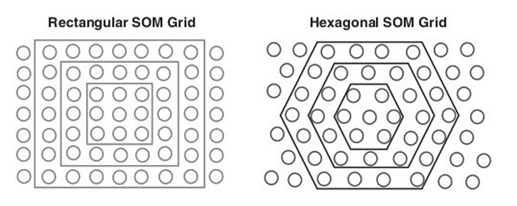
In many domains, the expert have prior knowledge that can be incorporated to guide the clustering so that the process will be faster and with the desired properties. This is done trough constraints.
Each time an observation is (re)assigned, the constraint is verified and the (re)assignment halted in case a violation occur.

In evaluating a clustering solution there exists no universal criterion. We can use:
- **Statistical perspective**: using the sum of squared errors (SSE) when comparing two clustering solutions, the one with the lowest SSE is chosen. $$SSE = \sum^K_{i = 1}\sum_{x \in C_i}dist^2(x, m_i)$$
- **Explore data** and **graphically compare cluster distributions** across all variables on a cluster-by-cluster basis.
- **One-class SVM** (Support Vector Machines): maximize the distance between a hyperplane and the origin, in this way we separate the majority of the observation from the origin. Normal observation will lie above the hyperplane, while outliers will be closer to the origin.
### Supervised Learning for Fraud Detection
It assumes the **availability of historical labelled data**, from which it can identify known fraudulent patterns.

We need to determine a **target fraud indicator**, which is usually hard to do. One can never be fully sure that a certain transaction is fraudulent, and target label are typically not noise-free.

It can be of two types:
- **Regression**: the target variable is continuous and varies along a predefined interval (can be limited/unlimited).
- **Classification**: the target variable is categorical and it can only takes a limited set of predefined values (binary or multiclass classification).

#### Linear regression
The general formula is $Y = \beta_0 + \beta_1X_1 + ... + \beta_nX_n$ where Y is the target variable, $X_1, .., X_n$ are the explanatory variables and β parameters measures the impact on the target variable Y of each of the individual explanatory variables (weights).
β parameters can be estimated by minimizing a squared error function (ex. OLS, ordinary least squares).

The goal is to find the best fit line w.r.t. the available data, that can accurately predict the output for the continuous dependent variable with the help of the independent variable.
When estimating using OLS, two problems may arises: the error/targets are not normally distributed and there are no guarantees that the target is between 0 and 1.
#### **Logistic regression**
It is a combination of the linear regression with the bounding function so that the outcome is bounded between 0 and 1. 
To do so, we pass the weighted sum of inputs through an **activation function** that can map values in between 0 and 1: it is called **sigmoid function** so the curve obtained is called sigmoid curve or S-curve. 
β parameters are estimated using the maximum likelihood optimization.

It estimates a linear decision boundary to separate both classes (fraudulent/legitimate). It can be used for both classification and regression.
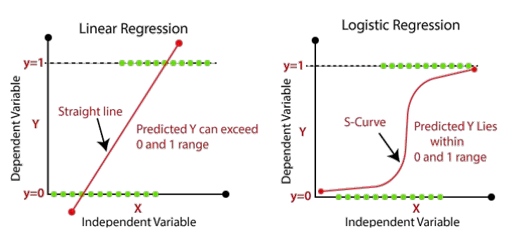
Linear and logistic regression are used to select the variable by using the p-value, that is the probability of getting a more extreme value than the one observed. 
A low (high) p-value represents an (in) significant variable. The p-value can be compared against a significance level.

A variable is selected based on:
- **Statistical significance**.
- **Interpretability**: the sign of the regression coefficient indicate the direction of the relationship between a predictor variable and the response variable. A positive (negative) sign indicates that as the predictor variable (de)increases, the response also (de)increases.
- **Operational** **efficiency**: amount of resources that are needed for the collection and pre-processing of a variable.
- **Legal** **issues**: some variables cannot be used because of privacy.

In summary:

| Linear regression                                                                                              | Logistic regression                                                        |
| -------------------------------------------------------------------------------------------------------------- | -------------------------------------------------------------------------- |
| Predicting the **continuous dependent** variable with independent variables.                                   | Predict the **categorical dependent** variable with independent variables. |
| Find the best fit line to predict the output (linear relationship between dependent and independent variable). | It estimates a linear decision boundary to separate both classes.          |
| Based on ordinary least squares (OLS).                                                                         | Based on the concept of maximum likelihood estimations.                    |
| Output: continuous values.                                                                                     | Output: between 0 and 1.                                                   |
#### Decision trees
A **recursive-partitioning algorithm** (RPA) with a tree-like structure.
The top node (root) specify a test condition, of which the outcome corresponds to a branch leading up to an internal node.
The terminal nodes (leaf) assign fraud labels.

Every tree can also be represented as a rule set: every path from a root note to a leaf node makes up a simple if-then rule.

Various algorithms must be implemented:
- **Splitting decision**: which variable to split at what value. 
  It aim at minimizing the **impurity** in the data (minimal impurity is when all customers are either good or bad). The impurity can be measured through entropy or gini.
  To answer the splitting decision, various candidate splits must be evaluated in terms of their decrease in impurity (gain). A higher gain is preferred.
- **Stopping decision**: when to stop adding nodes to the tree.
  If the tree continues to split, it will have one leaf node per observation: overfitting.
  To avoid this we split data in training sample (make splitting decision) and validation sample (independent, used to monitor the mis-classification error). The error keeps decreasing as the splits becomes more and more specific. At some point the error will increase since the splits become too specific. Where the validation curve reaches its minimum, the procedure should be stopped.
- **Assignment decision**: what class to assign to a leaf node.

Decision trees are used for:
- **Variable selection:** variables that occur at the top of the tree are more predictive.
- **Evaluating** and interpreting **clustering** solution.  White-box supervised techniques can be used to explain the solution of (unsupervised) black-box models.

Advantages:
- White-box model with a clear explanation: interpretable.
- Operationally efficient.
- Powerful techniques and allow for more complex decision boundaries than a logistic regression.
- Non-parametric: no normality or independence assumptions are needed.

Disadvantage:
- Highly dependent on the sample that was used for tree construction. A small variation in the underlying sample might yield a totally different tree.
### Neural Networks
Neural networks can model very **complex patterns** and decision boundaries in the data. 
The activation functions may differ per neuron, they are typically fixed for each layer.
The processing element (neuron) perform two operations:

1. It takes the input and multiplies them with the weights (including intercepts  β zero, which is the bias term).
2. Puts this into a nonlinear transformation function (logistic regression),

**MultiLayer Perceptron** (MLP) is made of a input layer, an hidden layer (**feature extractor**) that combine the inputs into features that are then subsequently given to the output layer to make the prediction.

In the fraud analytics setting, complex patterns rarely occur. It is recommended to use a neural network with one hidden layer (universal approximator, capable of approximating any function to any desired degree of accuracy on a compact interval).

The optimization is more complex: an iterative algorithm is used to optimize a cost-function (continuous target variable - mean squared error cost function, binary target variable - maximum likelihood cost function).
The procedure starts from a set of random weights, which are then iteratively adjusted to the patterns in the data using an optimization algorithm (ex. back propagation).

The main limitation is that the cost function is not convex (may have multiple local minimum but only a global minimum), so if the starting weights are chosen in a sub-optimal way, one may get stuck in a local minimum.

The weight learning proceed in two steps:
- **Preliminary training**:
  Try out different starting weights, start the optimization procedure for a few steps, continue with the best intermediate solution.
- **Stopping criterion**:
  The optimization procedure continues until the error function shows no further progress, the weights stop changing substantially or after a fixed number of optimization steps (Epochs).

The number of hidden neurons is proportional to a more complex, nonlinear pattern. NN can model **very complex patterns**, but they are easy to **overfit**. In order to avoid this we can use **training & validation set** or **weight regularization** (keep weights small in absolute sense to avoid fitting the noise in the data).

A NN is a black-box approach: it relates inputs to outputs in a mathematically complex, non transparent, and opaque way. 
It is applied as high-performance analytical tools in settings where interpretability is not a key concern. In application areas where insight into the fraud behavior is important, one needs to be careful with NNs.

Variable selection (vertical lines) is supported by the **Hinton diagram** that visualizes the weight between the inputs and the hidden neurons as squares: the size of the square is proportional to the size of the weight, the color of the square represents the sign of the weight (black = negative, white = positive).
The diagram can be used in number of hidden layer selection (horizontal lines).

We can remove the variables whose weights are closest to zero (ex. income). We must re-estimate the NN with the variable removed (starting from the previous weights). We continue until a stopping criterion is met. 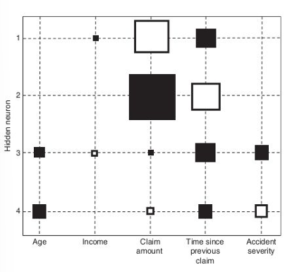

Another method is **performance-driven** (**backward**) **selection**:
1. Build a neural network with all N variables.
2. Remove each variable in turn and re-estimate the network. This will give N networks each having N – 1 variables.
3. Remove the variable whose absence gives the best performing network (in terms of misclassification error, MSE).
4. Repeat this procedure until the performance decreases significantly (stopping criterion).

**Rule-extraction** procedure extract if-then classification rules, mimicking the behavior of the neural network:
- **Decomposition techniques**: decompose the network’s internal workings by inspecting weights and/or activation values.
- **Pedagogical techniques**: consider the neural network as a black box and use its predictions as input to a white-box analytical technique such as decision trees.

The rule set must be evaluated in terms of: accuracy, conciseness, fidelity (measures to what extent the extracted rule set succeeds in mimicking the neural network).

A **two stage model** setup provides an ideal balance between model interpretability (which comes from the first part) and model performance (which comes from the second part).
1. Estimate an easy-to-understand model first (white-box).
2. Use a neural network to predict the errors made by the simple model using the same set of predictors.

#### Support vector machines (SVMs)
They deal with the following shortcomings of NN:
- Effort needed tune the number of hidden neurons (optimization problem).
- Objective function is non-convex (multiple local minima).

It is based on linear programming (objective function, constraint) whose main limitation is that it can estimate multiple optimal solutions: extra objective is added to the analysis to overcome this.

It is based on support vectors (training points that lie on one hyperplane).
It is a convex optimization problem: no local minima are present but only one global minimum.

The SVMs can be extended with error terms $e_k$ that allow misclassification.

It is not interpretable (black-box, as NN): variable selection can be performed using the backward procedure. It will reduce the variables but not provide any additional insight.
SVMs can be represented as NN: we can apply rule extraction approaches (decompositional or pedagogical approach) or a two stage model.
### Ensemble methods
It aim at estimating **multiple analytical models** instead of using only one:
- Multiple models can cover different parts of the data input space and complement each other's drawbacks.
- To be successful, models need to be sensitive to changes in the underlying data.

It is commonly used with decision trees:

-  **Bagging** (bootstrap aggregating):
	  It starts by taking B **bootstrap** (sample with replacement) from the dataset. For each bootstrap a model is built. For classification, a new observation will be classified by letting all B classifiers vote. For regression, the prediction is the average of the outcome of the B models. 
	  The number of bootstrap can be fixed or tuned via an independent validation data set.
	  If perturbing the data set with the bootstrapping procedure can alter the model constructed, then bagging will improve the accuracy. For models that are robust with respect to the data set, it will not give much added value.
-  **Boosting**:
	  It estimate multiple models using a weighted data sample: starting from uniform weights, it iteratively **re-weight** the data according to the classification error (**misclassified cases** get **higher weights**). The key idea is that difficult observation get more attention.
	  The number of boosting runs can be fixed or tuned using an independent validation set.
	  It is easy to implement but there is an high chance of overfitting the data set.
- **Random forests**
	  It is a combination of decision tree with bootstrapping.
	  Each single tree that is selected to form a forest must be random as much as possibile. 
	  The higher the diversity of the base classifiers the higher the performance.
	  They rank among the best performing models. They can deal with data sets having only a few observations, but with lots of variables.
### Evaluating a Fraud Detection Model
When evaluating predictive models, two key decisions need to be made:
#### Dataset splitting
If we have large dataset we can split it into **training set** (70%) and **test set** (30%). They must be totally independent.
If a **validation set** (30%) is needed it will be taken from training set (40%).
**Stratified split-up** ensures that fraudsters/non-fraudsters are equally distributed.
 If we have a small dataset we can use
 - **Cross-validation**: data is split into K folds, an analytical model is then trained on K – 1 training folds and tested on the remaining validation fold. It is repeated for all possibile validation folds resulting in K performance estimates, which are averaged. It gives multiple models: they can collaborates in an ensemble.
 - **Leave-one-out cross-validation**: every observation is left out in turn and a model is estimated on the remaining K – 1 observations, it gives K analytical models. It gives multiple models: a random one is sufficient (they all differs from one sample only).
In **stratified cross validation**, make sure that each fold has approximately the same distribution of class labels as the original dataset (useful in imbalanced data set).
#### Performance metrics
We use the **confusion matrix**: 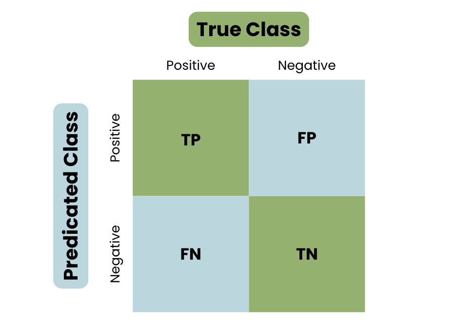

- **Classification accuracy**: the percentage of correctly classified observations. $$(TP + TN)/(TP + FP + FN + TN)$$
- **Classification error**: misclassification rate. $$(FP + FN) /  (TP+FP+FN+TN)$$
- **Sensitivity** or **hit rate**: how many of the fraudsters are correctly labeled as a fraudster. $$TP /  (TP+FN)$$
- **Specificity:** how many of the non-fraudsters are correctly labeled by the model as non-fraudster. For a perfect model it is 1. $$TN /  (FP+TN)$$
- **Precision**: how many of the predicted fraudsters are actually fraudsters.      $$TP / (TP+FP)$$
All these performance metrics depends from:
- **Receiver operating characteristics** (**ROC**) **curve**: plots the sensitivity versus specificity, 
  The **area under the curve** (**AUC**) provides a simple figure-of-merit for the performance: the higher the better the performance, it represent the probability that a randomly chosen fraudster gets a higher score than a randomly chosen non-fraudster.
  A good classifier should have a ROC above the diagonal and AUC bigger than 50%.
- **Interpretability**.
- **Justifiability**: verifies to what extent the relationships modeled are in line with expectations.
- **Operational efficiency**: ease of implementation, use and monitoring of the final model.

Fraud detection datasets often have a very **skew target class distribution frauds** (< 1%). This creates a problem for the analytical techniques: since it has lots of non-fraudulent observations it will tend to classify every observation as non-fraudulent.
It is recommended to increase the number of total fraudulent observations or their weight, such that the analytical techniques can pay better attention to them.
In order to overcome this problem, it is possible to:
- Increase the time horizon for prediction.
- Sample every fraud twice or more (**oversampling**).
- Remove some non-frauds to make the distribution less skew (**undersampling**).

Under and oversampling can also be combined. It usually result in better classifier than oversampling. This methods must be applied only on the training set. 
To find the optimal number of under/oversampling is subjected to trial and error. It is recommended to stay as close as possible to the original class distribution to avoid unnecessary bias.

Another possibile technique is **SMOTE** (**synthetic minority oversampling technique**): rather than replicating the minority observations it **create synthetic observations** based on the existing minority observations. It usually works better than under/oversampling.

<table><thead><tr><th width="166"></th><th width="244">Advantages</th><th>Disadvantages</th></tr></thead><tbody><tr><td>Rule-based engine</td><td></td><td>Expensive to build: it requires manual input by fraud experts.<br>Difficult to maintain and mange. <br>New fraud pattern are not automatically signaled. </td></tr><tr><td>Data-driven detection</td><td>Increased detection power.<br>Higher precision. </td><td></td></tr><tr><td>Unsupervised Learning</td><td>It does not require labelled data.<br>It is able to detect newer frauds.</td><td><p>A general behaviour (norm) must be defined.</p><p>It require extensive validation of the identified suspicious observations. <br>It is prone to deception (camouflage-like fraud strategies).<br>It can lead to lots of false positive. </p></td></tr><tr><td>Supervised Learning</td><td>More accurate detection than UL.</td><td>It need labelled data (data quality is crucial and data scarcity is a problem).<br>It is not able to detect new frauds.<br>It can lead to lot of false negatives.</td></tr><tr><td>Reinforcement Learning</td><td>Allows continuous updates avoiding costs.</td><td>It enlarges threats: if I avoid the system once, I can do it anytime.</td></tr><tr><td>Neural networks</td><td>Increased detection power.</td><td>Low interpretability (due to black-box model).<br>Require great effort to tune the number of hidden neurons.<br>Objective function is non-convex (multiple local minima).<br>Easy to overfit.</td></tr><tr><td>Ensemble methods</td><td>Good performance w.r.t. the available data.<br>Multiple models can cover different parts of the data set and complements each other's drawbacks.</td><td>Models need to be sesitive to changes in the underlying data.</td></tr></tbody></table>
## Introduction to digital forensics
Digital forensics is the application of scientific analysis method to digital data, computer systems, and network data to reconstruct evidence.

A digital forensics investigation takes place in 4 phases:
1. Source **acquisition**: how to make a copy of a digital evidence in the most safe way.
2. Evidence **identification**: how to analyze digital evidence.
3. **Evaluation**: how to map them.
4. **Presentation**: how to use them as testimony.

Forensics procedures have been developed with the USA setup in mind. So some of the technical context and some of the textbooks refer to the USA system.

Some examples of forensics engagements:
- Situations and constraints: it's best practice to apply high standards since they could end up in a court.
	- Internal investigations (inside an organization).
	- Criminal investigations (defense or prosecution).
	- Post-mortem of a system to assess damage or define a recovery strategy.
- Research (honeypot, etc).
- Crimes and events:
- Child pornography (easy to prosecute).
- Fraud (difficult to prosecute).
- Cyber extortion or threats such as:
	- Ransomware, difficult to prosecute in general.
	- Extortion related to more personal things, easy to prosecute.
- Non-cyber crimes with digital components.
- Espionage.
- Copyright infringements (can ends up in civil court).
- Policy violations  (can ends up in civil court).
### Daubert standard
A **witness** who is qualified as an **expert** by **knowledge**, **skill**, **experience**, **training**, or **education** may testify in the form of an opinion or otherwise if:
- The expert's specialized knowledge will help the jury to **understand** the **evidence** or to determine a fact in issue.
- The testimony is based on sufficient facts or data.
- The testimony is the product of reliable principles and methods.
- The expert has reliably applied the principles and methods to the facts of the case.

According to Galileo scientific means **repeatable**, that is the possibility for someone else to recreate the experiment and have the same outcome or to be able to analyze the data and get to the same outcome.
According to Karl Popper "a scientific statement speaks about reality, it must be **falsifiable**", so it can be turned around and proved false.

The Daubert test declare the factors to consider in determining whether the theory or methodology in question is "scientific":
- Whether the theory or technique employed is generally accepted in the **scientific community**.
- Whether it has been subjected to **peer review** and **publication**.
- Whether it can be and has been **tested**.
- Whether the **know** or **potential error rate** is acceptable.
- Whether the research was conducted **independent** of the particular **litigation** or dependent on an intention to provide the proposed testimony.
# Digital Forensics
## Acquisition
During acquisition we have to take into account that **digital evidence** is **brittle**: if modified, there is no way to tell. It is **not tamper evident**. It is possibile to theoretically create a perfect fake, along with timestamps that can create a false alibi.
Procedures that ensure, insofar as possibile, that digital evidence sources become tamper evident are needed. We need to ensure:
- Legal compliance.
- Ethical behaviour from all parties.
- Detection of errors in good faith.
- Detection of natural decay.

In order to seal digital evidence, **hashes** (and **digital signatures**) are used. Moreover, if the hash of a digital object is recorded at a given step of acquisition, and then constantly checked in further steps, it can ensure on the identity, authenticity and non-tampered state of the evidence from that step on. 
However, hashes are not a dogma: if there is no hash, it does not mean that the evidence can be dismissed. Other measures may have been taken and we can still reconstruct the **chain of acquisition**. 
Computing hashes does not say anything about what happened before the hashing took place: a proper procedure has to be adopted. 
To be useful, hashes must be either **sealed in writing** (stored somewhere else from where the evidence is stored, ex. on a signed report), or **encrypted** to form a digital signature.

HW used for acquisition:
- Removable HD enclosures or connectors with different plugs.
- Write blocker.
- External disks.
- USB, firewire, SATA and e-SATA controllers, if possibile.

SW used for acquisition: essentially Linux OS that have an **extensive native file system support** and **ease** of **accessing** **drives**/**partitions** without "touching" (mounting) them. It can be used to acquire the **bitstream** of an hard drive (bit-by-bit clone, since if we only copy the allocated content we potentially lose information).
### Basic procedure of acquisition of a powered-down system
1. Disconnect the media from the original system (if possibile).
2. Connect the source media to analysis station, if possibile with a **write blocker**.
3. Compute the hash of the source.
4. Copy the source.
5. Compute the hashes of the source and the clone.
6. Compare the three hashes.

This operation could alter the evidence with irreversibile consequences. By comparing the three hashes we know if everything is ok or if something has changed. 
It could be good to compute also MD5 (not really used) and SHA-1 (almost deprecated) hashes of the image at least, for redundancy and compatibility.

Main challenges/limitations: 
- **Time**: a typical HHD today has a capacity of 1TB with an average speed of 80MB/s. It means that we can expect to wait several hours to complete a copy (or to run a hash). However, some SW may automate part of the procedure (compute the source hash while copying, in parallel).
- **Size**: dealing with today's capacity in storage is complex, in particular for large-scale investigations. Using external media slows down operations. Sometimes, moving images across a network can be useful. That is why NAS or SAN are commonly used.
- **Encryption**: there is an increasing use of encryption in regular PCs. The problem is that even if provided with the key, performing acquisition in a repeatable way is challenging.
### Alternative procedures
-  **Booting from live distribution**
	If we need to work directly on the machine (system with weird HW controllers or physical cases, RAID devices, specific investigation constraint) we can live-boot the system under assignment using a Linux distribution targeted to forensics analysis. Ordinary distributions may mount (swap partitions). Once we boot, we can use the previous method to clone the drives from the inside.
-   **Target power on**
    If we cannot turn the power off (ex. critical services) or we can but it is better not to do it (ex. live analysis of an intruder), since our actions will modify the state of the computer, we may work in volatility order:
    - **Dump of memory**: if possibile, and not costly. HW tricks to perform the dump are available (firmware).
    - *Save runtime information** (ex. network, processes..).
    - **Disk acquisition**.
    It could be possibile to perform the acquisition without a shutdown. All executed activities must be documented before sealing the evidence, since each command may alter the state.
- **Live network analysis**
	In some cases we need to observe an attacker "live" (ex. honeypots) but we must be careful since an intruder can react if he feels observed. Key observation points are logs and network traffic.
## Identification
It is the **analysis** part of the evidence, during which we may need to apply some methodologies from computer science.
The needed toolset is composed of:
- **Linux**: because it has the most **extensive native system support** (ex. support in **hot swapping drives** and devices, **mounting images**, ..).
  Windows cannot be used since there is NO possibility to specify that a resource is read-only (not even with a write blocker). It tampers with drives and modifies evidence. It has NO image handling or hotswapping of drives.
- **Virtualization**: a set of guests Windows machines with different versions in a network with the Linux host using Samba to share drives (hybrid approach).

In using Linux has a host, and Windows as a guest, we are able to work the images in Linux, mounting them in read-only and then exporting them via Samba to Windows, but at the same time we can use some specific Windows tools.
It is not always possibile to use Samba: if Windows must see the file system (ex. file recovery tool, unallocated space analysis) we can mount the image as a read-only loop device under Linux, and/or use the "non-persistent" mode of VMWare.

We have to take into account that everything that we do must be scientific: it must be repeatable and validable (another expert must be able to perform the same analysis by hand, at least in theory).
So analysis SW needs to be open sources and possibly free.
#### Recovery of deleted data
In many cases, data of interest has been (voluntarily or not) deleted. One of the most typical task of computer forensics is the retrieval (complete or partial) of such deleted data.

The OS is "lazy" and optimizations cause data persistence and locality. When we delete a file:
- First, the file entry in the FS is flagged as deleted. Until here, it can be "undeleted" by simply removing  the flag.
- Then, at some random time, two things will happen (not in a particular order): the FS entry will be removed when the FS is rewritten or rebalanced (until this happens we can find metadata on the file), the actual blocks allocated with the file will be overwritten with other contents (until this happens we can retrieve the actual blocks on disk).

In a HHD the **slack space** (padding between end of a file and next cluster) contains data about files that have been deleted (less than 4 sectors, 4KB).

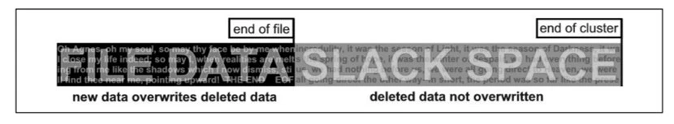

File carving can be used to recover data from a hard disk where the metadata was removed or otherwise damaged.
Since sectors are one after the other, there is an high probability that a file is stored continuously. So, even if we do not have metadata anymore, we can scan the entire drive as a single bitstream in order to locate headers & footers of interesting file types: anything in between, if not to large, is a candidate file (file recovering through **carving**). 
This is not normally the case because of **fragmentation** (no really common in modern HHD, at most it is divided in two parts) and **headerless** caused by encryption and compression (in this case we need the file to be complete, otherwise it is meaningless).
### Anti-forensics techniques
Anti-forensics techniques aim to create confusion in the analyst, to lead them off track, or to defeat tools and techniques used.
- **Transient antiforensic**: can be defeated if detected. It interfere with **identification** since data is hidden and not deleted.
	- *File system insertion and subversion technologies**: data are placed where there is no reason to look for (in the FS metadata or in a partition table). Data recovery SW will ignore these files, but carving will still work.
	- **Log analysis**: typically log analysis is done with regular expression, if attackers perform log injection, they can try to make the script fail or even exploit them.
	- **Partition table tricks**: if partitions are not correctly aligned using a partition restore tool may not be useful, multiple partitions may not be supported by forensics tools or by generating enough partitions the tool will crash.
- **Definitive antiforensic**: destroying evidence, or making it impossible to acquire. It interfere with **acquisition**.
	- *Timeline tampering**: it is possibile to modify events by making them appear separated, or close, or moving them completely out of scope. Once destroyed or modified, such data cannot be retrieved. The modification is not visible per se. Analysis tools can display a timeline based on MAC(E) values: Modified, Accessed, Changed, (Entry Changed).
	- **Countering file recovering**: since file recovery uses data remains, it only takes secure deletion, wiping unallocated space, encryption or VM usage to make it useless.
	- **Fileless attacks**: the attack does not write anything on the disk, then when the machine is shut down the evidence is lost.

## SSD forensics
The **FTL** (flash transition layer) is a HW/SW combination that sits between ATA channel and memory chips. It enables:
- **Write caching**: every time a bit is changed the block needs to be rewritten, so for speed and lifespan preserving reasons this change is keep in a cache for a certain amount of time. To do so SSDs are equipped with a small amount of DRAM-based cache memory to reduce physical writes (that can be disabled).
- **Trimming**: preemptive blanking of erased blocks marked by the OS. It has negative impact on forensics as data persistence is reduced.
  Trimming is aggressive and happen almost as soon as there are files to be trimmed (in 1-10s). The drives that implement an aggressive version of TRIM does not allow the recovery of any file.
  Trimming is needed since for each write a blank must be done but blanking is time consuming.
  In some weird cases, trimming is not done “correctly” so you could recover some files.
- Erasing patterns: certain SSD controllers may exhibit unexpected trimming patterns (ex. in stripes).
- **Garbage collector**: it triggers in almost 3 minutes. It is similar to trimming but performed without the indication of the OS. It has obvious consequences on forensics.
- **Data compression**: transparently employed by some SSDs to use less physical blocks and reduce wear.
- **Data encryption/obfuscation**.
- Bad block handling.
- **Wear leveling**: spread consumption of cells as evenly as possibile across the drive. From black-box point of view, if **write amplification** does not happen or is completely masked, there is no difference. No drives showed write amplification from an external point of view.

In HHDs we can physically address a sector from the OS an read it. In SSDs the FTL translates logical block addresses (LBAs) as requested by the OS into the respective physical block address (PBA) on memory chips. The underlying mapping is transparent and can be modified by the FTL at any time.
The FTL may move data around or blank data (delete it) even if the OS is not running (for efficiency reasons).
This is not good for forensics approaches, since they rely on the ability of the OS to access the raw data on the disk.

We cannot bypass FTL via SW. In theory we can directly read the memory chips (0s and 1s), but then they need to be interpreted. In any case it is:
- Extremely time and money consuming process (needs custom HW and reverse engineer FTL implementation).
- Non-repeatable, and may leads to alteration or destruction of the evidence.
- Very brittle process depending on firmware and HW.
- Information not public and actually heavily protected by intellectual properties of vendors.

Since the drive keeps changing even when connected to a write blocker, we cannot perform carving nor slack space recovering.
## Evaluation and Presentation
During the evaluation we need to match the evidence elements (facts) with the required legal elements to support (or negate) a legal theory.

Items that we have to evaluate are the ones that support the indictments. We need **alternative explanations** to the elements, we need to analyze what can be said, what cannot, and what further experiments would be needed to say more. The latter is important to analyze whether these experiments will be performed by the counterpart, and whether performing them or asking for them to be performed entails risk.

Evaluation and presentation are moments when we have to interacts with people with different background and expertise, for example **lawyers**.
- Lawyers own the choice of defense strategy:
  They may ask for the expert's counsel, but the expert must yield to them.
- Lawyers own the relationship with the client:
  Experts should never tarnish this relationship. If you are unable to do this, you need to resign.
- Lawyers (and customer) pay your bill, but do not dictate what you write or say:
  You should always write and say only that of which you are personally convinced. You may be asked to omit a finding, as long as this omission is not the same as lying.

On the other hand:
- The **expert** assist one of the parts in the judgment.
- This is not the same as "helping someone escape law": this is the part where law is applied.
- "**Process truth**" is not the same as historical truth. The purpose of a process is not establish the truth, but the process truth.

We have then **prosecutors**/**police**:
- Assisting the prosecutors or the police does not entail moral superiority.
- It si still very important to stick to science and facts.
- It is important not to get your words or thoughts shaped by "justice".

A key component of the evaluation process is reviewing documents and evidence already presented in the proceedings. In particular, written reports of other expert witnesses and investigators.
What to look for:
- **Technical**/**factual errors** (or **omissions**):
	- Acquisition:
		- Search and seizure: process, chain of custody, seals.
		- Description of seized/analyzed materials: serial numbers, ecc.
		- Hashing/cloning procedure: use of write blockers.
	- Analysis:
		- Steps where hashing was not verified.
		- Proprietary programs, bugs and vulnerabilities.
		- Description of the process.
		- Technical mistakes.
- **Unclear reasoning**, **methodologies** or **descriptions**.
- **Suggestive writing**.
- **Opinions** and **hypotheses** not clearly distinct from facts and **not substantiated**.

Typical presentation errors lies in no exploration of **alternative hypotheses**. Is the presentation neutral or biased? Can we find counter-examples for some of the assumptions? Are there missing explanations that we can provide in order to shift the understanding of the judge?

In the presentation we must be **clear**. The report need to be **extensive**, so it have to comprehend everything. Everything in the report must be explained in why it is relevant to the reader as it is not obvious to them. 
The presentation must:
- Focus on the items you want to explain. You need to be **concise**.
- If it is in a national language: do not exceed in English terminology.
- All technical terminology must be explained, if necessary in a footnote.
- You need to be **simple** without being **simplistic** and without giving the reader the impression that you are simplifying things for them.
- Do not show excessive deference to the judge/jury.
- Do not use weak arguments if you have more solid ones.

A report can be modeled as a scientific paper or report: **introduction**, **facts**, **discussion** & **analysis** (each block with a small introduction saying what you want to explain and a summary conclusion), **final conclusion** (leave out any doubtful statement). 
Structure it like an obstacle course.

In many jurisdictions the expert may just submit a report, but may be called as witness. In others, like Italy, they must be called as witness to submit their report. 
In most jurisdictions, the expert witness provides a sworn testimony and can commit **perjury** (not telling the truth on purpose). This means that, depending on jurisdiction an expert witness cannot lie or claim confidentiality or professional secrecy.

Usually digital forensics experts are called by their side and thus proceed to friendly direct examination. In Italy, judges can asks questions of their own.

Cross examination is done by the counterpart, it is less friendly and sometimes downright hostile.
# Cloud Forensics
Cloud computing is a computing-as-a-service paradigm. We will deal mainly with the concept of public clouds, since private clouds offer less challenges.
## Acquisition issues
In general, even in IaaS (infrastructure) scenarios, no control is given to the user on HW and storage space. This makes traditional acquisition procedures unfeasible for the host. \
The level of access vary based on:
- SaaS (software): cloud service provider is the only one who has logs/data.
- PaaS (platform): customer may have an application log, network log, database log, or OS depend on the cloud service provider.
- IaaS (infrastructure): logs until OS level are accessibile to customers, but network/process logs only accessible at provider level.

A VM cloud may be spread in different drives: it is almost impossibile to perform correctly data acquisition. 
When deallocating, space is gone forever, meaning that there is no deallocated space to analyze: the concept of slack space and carving is not possibile to apply.
## Analysis (identification) issues
The real cloud issue is that some data exists only as result of **transaction**, and **visualization** may be different from data (ex. dynamic web pages).

Other issues regards **attribution** due to DNS resolution, connectivity and provider identification, geolocation of hoster. We need to take multiple acquisition of the web page to know what is fixed and what change over time. Moreover, many web pages are personalized w.r.t. the user at dynamic time. We also have to specify everything that we did during acquisition.

It is hard to guarantee **integrity**: the only way is to ask the provider to get data directly from the database but, in some cases, it is impossibile due to end-to-end encryption.
## Legal issues
From a legal standpoint, the **location** of the **data** (ex. datacenter) is important: how data can be used or stored depends on its geolocation.
- Some judiciary acts require a physical location.
- Criminal investigation/prosecution are based on physical location.
- Applicable law depends on physical location.

Electronic data is unique as it may actually span multiple physical locations (no other artifact has this property).

The main expectation of forensics is the retrieval of deleted/fragmented data which is impossibile in a cloud environment: metadata will disappear easily (snapshots and restores) and investigation of hypervisor-level suffer from lack of tools and research.
## Attribution issues
In cyberspace, attribution is hard already: spoofing at IP level, usage of stepping stones (that is attribution to technical source, not to the agent).
Cloud infrastructure adds an additional layer of indirection in attribution. To be able to attribute we need the **cooperation** of the **cloud provider** (which is not always the case).

Another issue is the "**clouds of clouds of clouds**": cloud service providers use each others. This means that acquire the cooperation of the cloud provider can be very difficult.
## Forensically Enabled Clouds (FEC)
Requirements for a cloud service provider to offer "forensics friendly" services are:
- Make an effort to store (snapshot of) **volatile VM data** in their infrastructures.
- Make an effort to provide **proof** of **past data** possession.
- **Data location**.
- **Identity management**.
- **Encryption** and **key management**.
- **Legal provision** and **service level agreements** (SLAs).

We can use cloud services to enable forensics: large scale data storage, large computing infrastructures (analysis of large amount of data takes a lot of time) and reuse of computing concepts.
In general, we need to control the evidence (chain of custody) and the use of cloud can generate privacy issues. 
Moreover, trans-national operations are challenging from a legal perspective.
# Mobile Forensics
In legal terms, mobile forensics is the utilization of scientific methodologies to recover data stored in a cellular device. It is the science of recovering digital evidence from a mobile device under forensically conditions using accepted methods.
Mobile devices are smartphone, tablet, feature phone, GPS device, but also wearable IoT, virtual reality devices, drones, and many other more.

The main components of a smartphone are:
- **Device internal memory**: where all the data is stored, so it is the main goal of the investigation.
- **Sim card**: useful since you can tie a phone to a phone number and collect history of calls to compare with what you find on the phone itself.
- **SD cards**: are becoming rare.
- **Cloud synchronization**: we sync from and to our device. It is also used to have a backup of the data on the device. The phone is the access for a cloud account, but not the storage. It is used to get access to accounts even when the user is not providing any credentials.
- **Local backups**: useful to compare it with the data on the phone, and retrieve what was deleted.
- **Synced devices**: all information stored into synced devices (ex. wearable IoT) can be retrieved through the smartphone.

In the pre-smartphone era, mobile devices lacked robust **encryption** mechanism, leaving user data vulnerable to unauthorized access. Even Android and iOS were not using encryption at the beginning.
Today encryption has become a standard feature in all devices. Modern smartphones employ various encryption techniques to protect sensitive information stored on the device.

Encryption is the process of encoding all user data on a device using symmetric encryption keys. Once a device is encrypted, all user-created data is automatically encrypted before committing it to disk and all reads automatically decrypt data before returning it to the calling process.
**Android** has two methods for device encryption:
-  **Full-disk encryption** (**FDE**):
	All user data is encrypted with a key. Only devices with Android 9 or lower can use FDE. Android 13 removed the use of FDE entirely.
-  **File-based encryption** (**FBE**):
	It allows different files to be encrypted with different keys that can be unlocked independently. Android 7 and higher support FBE. Android 10 and higher are required to use FBE. 
	It enables a new feature called **Direct Boot**, that allow encrypted devices to boot straight to the lock screen. 
    An FBE device has two storage locations available to the applications:
	-  **Credential encrypted** (**CE**): file is only available after the user has unlocked the device.
	- **Device encrypted** (**DE**): file is only available both during direct boot mode and after the user has unlocked the device.

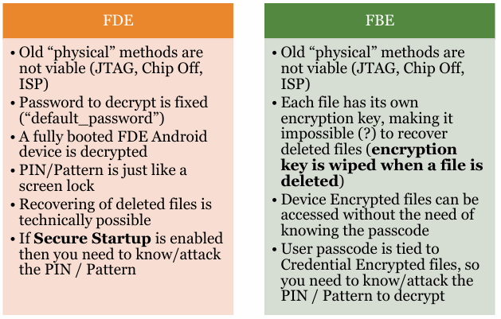

Apple uses a technology called **data protection** to protect data stored in flash storage on the devices that feature an apple SoC (system on a chip). A device can respond to common events while at the same time providing a high level of encryption for user data. Third-party app receive this protection automatically.
It is implemented by constructing and managing a hierarchy of keys and builds on the HW encryption technologies. It is controlled on a per-file basis by assigning each file to a class at creation time. Accessibility is determined according to whether the class keys have been unlocked. Each class uses different policies to determine when the data is accessible.

The mobile forensics process is done trough:
- **Intake**: receive device as evidence for examination.
- **Identification**: identify device specifications and capabilities.
- **Preparation**: prepare methods and tools to be used.
- **Isolation**: protect the evidence by preventing remote data destruction, isolating the device from cellular network, bluetooth and WiFi.
- **Processing**: conduct the forensics acquisition.
- **Verification**: validate the acquisition and findings.
- **Documenting/reporting**: keeps notes about findings and process.
- **Presentation**: prepare exhibits and present findings.
- **Archiving**: keep a copy of the data in a safe place, in common formats for the future.
## Device identification
First of all, we have to asses the device state: passcode know/unknown, turned on/off. The device must be isolated with the use of a Faraday bag.

The device is identified trough the model number, IMEI and serial number.
## Acquisition techniques
To extract data from a device, you need to communicate with it typically via USB (if the device is fully working). Sometimes it is needed to physically open the device to shorten test points. Other methods can be used as well (ex. WiFi, bluetooth, SD card, ..).
-  Know passcode: 
	It is possibile to directly communicate with the device and extract some data. An exploit is needed to extract a FFS (Full File System).
-  Unknown passcode, AFU (after first unlock):
	An exploit is needed to extract encryption keys from RAM.
-  Unknown passcode, BFU (before first unlock):
	An exploit is needed to bruteforce the passcode: if successful  the FFS can be extracted, if unsuccessful you should still be able to extract some data.
## Device analysis
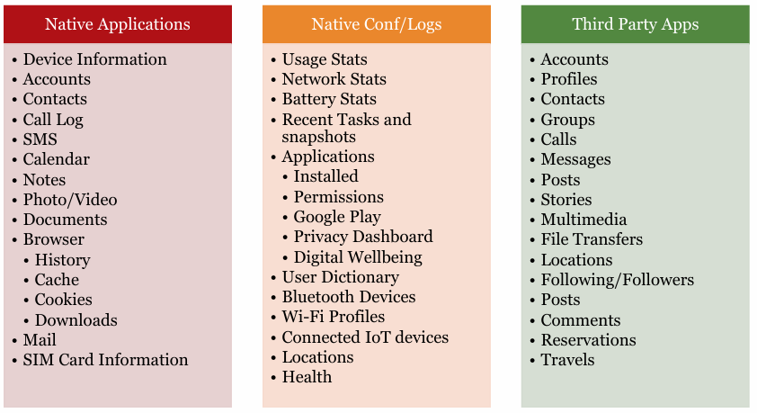
## Validation and Reporting
- Set the expectations for your report.
- Highlight evidence relevant to the investigation.
- Explain your findings, know and understand what you are reporting.
- Provide opinions only when required or legally permitted, if appropriate.
- Make sure to validate the report.
- Take and keep notes to be prepared for testifying in court sometimes years after your investigation.
# Exam questions

## 2021 06 15
##### Describe what is a write blocker.
It is a device used to ensure that the OS does not write on an external disk (ex. HDDs, USB sticks) while acquiring it. It is an important tool in forensics acquisition, since it allow to read the disk without tampering it.
##### Describe a process to clone a disk using a write blocker appropriately.
1. First of all the disk is attached to the device that will be performing the cloning operation (generally a Linux OS machine) with the use of a write blocker. An hash of the disk data is made, before any operation.
2. Then the disk is cloned bit-by-bit and other two hashes are made: one of the disk and one of the clone.
3. At the end the 3 hashes are compared: if they are the same no tampering was made during the acquisition.
##### Describe an example of a case in which a write blocker may prove not useful.
When the device cannot be turned off, the write blocker cannot be attached, so we must use other approaches in order to no tamper with the evidence.
In SSDs the write blocker may not work as intended as the FTL will still works (even if the OS is not running) and it will perform operations that change how the data are stored on the disk (ex. trimming, garbage collector, wear leveling).
##### What does "anti-forensics" mean?
Anti-forensics describe all those techniques aim at interfering with the digital forensics, such as finding a way to mislead the analyst or to hide data.
##### What are the two main types of anti-forensic techniques? Give at least one example per each.
There are two types of anti-forensics techniques:
- Transient anti-forensics: interfere with analysis (identification) since data is hidden and not deleted. They can be defeated if detected.
  Some examples are putting data into places where they do not belong to (in the FS metadata or in a partition table), using custom weird partitions (to make forensics tool unusable, lot of partitions can make the tool fail), make log injection (since log analyzer tools uses regular expression, by making log injection it may be possibile to exploit the tool itself).
- Definitive anti-forensics: interfere with acquisition since data are deleted. In general, it is irreversible. Some examples are timeline tampering (in order to make events uncorrelated or correlated to each other and mislead the analyst), countering file recovery (secure delete files, VM usage, wiping out unallocated space), fileless attacks (attacks that do not write anything on disk, leaving no footprint).
##### Explain how it is often possible to recover deleted data, touching on the concepts of file allocation and deallocation, metadata persistence, file carving and slack space.
When data is created, some space into the disk is allocated and metadata are created aswell and stored in the FS (containing information useful for the OS to locate data such as filenames, timestamps, file sizes, and more).
When a data is deleted its relative file entry in the FS is flagged as deleted but the actual data is not deallocated. Up to this time we are still able to retrieve data and metadata, as it has not been deleted yet. Then at random some time, the FS entry may be removed (until this happens we can still find metadata about the file) or the space is over-written with other data (until this happens we are still able to recover the file since it is still present).
When a file is deleted, some or all of its metadata can persist in the file system. Knowing about the old position of the data, we can exploit the slack space, that may contains partial data, to recover the file.
We may recover data trough carving: we identify successive headers, anything in between two headers, if not too large, is a candidate file.
##### A startup involved in the financial domain has hired you as "Chief Anti-Fraud Officer." Unfortunately, the company has no historical data related to previous frauds or legitimate transactions. However, it recently hired some expert fraud analysts as part of your team. Your primary task is to design an effective anti-fraud strategy.<br>Describe the main components of an anti-fraud strategy, providing a brief explanation of how they work, advantages, and disadvantages
An anti-fraud strategy is based on two main components:
- Fraud detection: aim at detecting frauds after they have happened, so it is an ex-post approach. The main objective is to discourage fraudsters and make fraud difficult. A fraud score is computed for each transaction, and then an expert is called to analyze each one of the flagged as fraudulent.
- Fraud prevention: aim at preventing frauds, so it is an ex-ante approach. It is generally based on multi-factor authentication.
They are complimentary, but not independent. If a fraud adapts to a detection mechanism, it will also impact prevention and vice-versa.
##### By considering the scenario described above, explain which type of techniques and/or system you would deploy, providing a brief explanation of how they work, the order of deployment, and their advantages and disadvantages.
I would start with a rule-based approach, since we do not have historical data. It require the expert input, who has to generate a set of rules based on its knowledge. 
Its main disadvantage is that is not automatically updated so it require continuously the expert input. For this reason it is difficult to maintain and it is not operationally efficient.
At the same time, we can develop an unsupervised learning model. In this way we would be able to detect newer fraud mechanism, and we can collect historical labelled data. The main disadvantage is that it can lead to lot of false positive, need extensive validation and it is prone to deception. In order to be able to deploy the model, a norm should be defined, which is not trivial, since there is no universal indicator on what is fraud and what is not.
After we have collected enough historical labelled data, we can develop a supervised learning model to make it work in parallel with the other two before mentioned. This model will not be able to identify newer mechanism, and may lead to lot of false negatives.
In this way, having different models to work together, we are able to mitigate each one drawbacks.
##### After a few days, the company is the victim of a fraudulent campaign. Therefore, you decide to analyze available data. Considering only the graph shown below, which shows the distribution of the amount spent per country by a customer, explain the analysis you would apply on that data and what are the first insights you can extract from it.
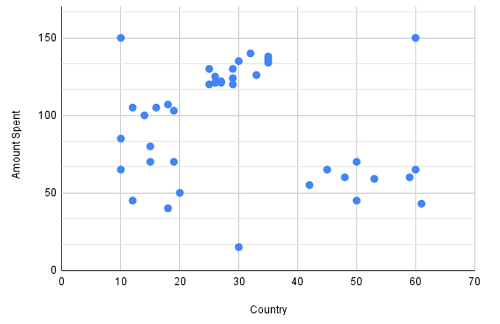

I would apply a clustering technique, in order to retrieve automatically suspicious cases, that I will analyze better.
I can see that there are several outliers, so K-means is not a suitable choice since it is sensitive to outliers. I would deploy a hierarchical technique, since it is less sensitive to outliers and does not need to specify the number of clusters.
I expect to receive 3 clusters and 3 outliers.
## 2021 07 08
##### Define the term "ransomware".
It derives from the union of ransom and malware, that is malicious software.
It is a malware that once infected a computer it encrypts all data and ask the victim for a ransom to get the data back.
It works in 3 steps:
1. The C\&C generate a pair of private-public keys, then sends the public key to the ransomware.
2. The ransomware encrypts the data with a symmetric algorithm and encrypt the symmetric key with the public key.
3. Once the ransom is paid the data are recovered with the private key. Since the private key reside in the C\&C server, it is impossible to recover the data without paying
A mitigation against it are backups.
##### What are the typical components of the cybercrime ecosystem behind a ransomware attacks?
The cybercrime ecosystem is very complex. In this case we can consider:
- Ransomware developers: that develop the malicious code.
- Testers: that test the malware against common antiviruses, to ensure that it is not easily detected.
- Enablers: that provide the infrastructure to spread the malware (ex. botnets or bulletproof hosting) but also C\&C servers in order to generate and store the public-private key pair.
- Money mules: that launder the money in order to break the traceability, in exchange for a percentage.
- Sellers: that sold kits of various kind as well as stolen accounts/identity used for money laundering.
##### What is the role of cryptocurrencies in the ransomware phenomenon?
Cryptocurrencies are de-centralized currency, since it eliminates the need of a trusted authority. It allows users to manage their accounts and move money (send and receive).
The key point that make cryptocurrencies useful in the ransomware phenomenon is its pseudo-anonymity: each user may have different public addresses, which are not bind to their true identity, in this way the attackers can easily ask for the ransom without revealing their identity.
Cryptocurrencies ensure fast and irreversible payments, which are crucial in fraudulent activities: in fact, even if investigated, there is no way of moving back the money to the owner, which can be done in regular bank account.
Every user can have an arbitrarily large number of identities, that are not linked to personal information of the owner, this ensures that payments from different victims appear unrelated and preventing the victims from collaborating.\
Moreover, a general lack of regularization has motivated the use of cryptocurrencies in cybercrimes.
##### In SSD drives, what is an FTL chip?
The FTL (flash transition layer) is a combination of SW/HW that manage some functionalities of the SSDs, such as:
- The translation the logical block address (asked by the OS) into the respective physical block address.
- Garbage collector, trimming and wear leveling mechanism: to ensure that all block are used almost the same.
- Write caching.
- Data compression/obfuscation.
It is needed due to the nature of SSDs: they are based on transistor technology, so each write degrades the reliability of the drive. The FTL is in charge of hiding the SSDs complexity to the OS.
##### What are the behaviors of FTL chips that can interfere with forensics acquisition and analysis, and how?
Forensics acquisition of drives is based on the ability of the OS to directly address the memory: in SSDs this is managed by the FTL, so the acquisition is more difficult than on HDDs.
Since the goal of forensics acquisition is in general the retrieval of deleted data, the following mechanisms (implemented by the FTL) have direct consequences on the inability of retrieve that data:
- Garbage collector: it operates without the OS request, it periodically frees block in order to release them for future writing. It is triggered every 3 minutes.
- Trimming: it consists in preemptive blanking of erased blocks marked by the OS. It is triggered in almost 1-10s. It reduce data persistency.
- Wear leveling: a technique used by FTL to extend the lifespan of the flash memory by distributing writes and erases evenly across the storage medium.  This process can change the physical location of data without altering its logical address, making it difficult to trace data.
The FTL works even without the OS running (for efficiency reasons): data is constantly moved around or deleted (when needed).
##### What are the main challenges in forensics acquisition of a web page, and what are the approaches and countermeasures that can be adopted to solve or mitigate them?
The main challenge in the acquisition of a web page is its dynamicity: each user may visualize a different web page according to its preferences or previous interactions (ex. cookies), thus the acquisition may not be accurate and generally is not repeatable. Normal acquisition procedures are not suitable (ex. deleted data retrieval): it must be treated as a running computer.  As consequence, every operation that is performed must be recorded somewhere, since it can change the data itself.
Data locality is also an important issue: according to the geolocation of the server that host the web page the laws that applies to such data may change, making the acquisition even more complex.
Another challenge is data attribution due to DNS resolution, spoofing at IP level or usage of stepping stones.
A countermeasure is to require the CSP to offer forensics-friendly services, such as store (snapshot of) volatile VM data, provide proof of past data possession or enable key management.
##### A startup involved in the financial domain has hired you as "Chief Anti-Fraud Officer". The company has collected at least two years of historical data related to previous frauds and legitimate transactions. Your primary task is to design an effective anti-fraud solution.<br>Describe the Fraud Management Cycle, highlighting the core components and challenges of each step.
The fraud management cycle is made up different steps:
- Fraud detection: a detection model is applied to mark suspicious cases. The model should be update regularly to ensure up-to-date detection. This is necessary because of the dynamic nature of frauds, since fraudsters tend to adapt to the detection mechanism and blend-in non suspicious cases.
  Typically expert-based models or data-driven fraud models are used.
- Fraud investigation: an expert has to go through all flagged cases and mark them as true.
- Fraud confirmation: each flagged case must be investigated, involving further research if necessary.
- Automated feedback: all new detected cases must be added to the DB of historical samples to make the detection better.
- Fraud prevention: in order to prevent future cases.
##### By considering the scenario described above, explain which type of techniques you would deploy, providing a brief explanation of how they work, the order of deployment, and their advantages and disadvantages.
Assuming that the data collected is not labelled I would start by deploying an unsupervised learning model: in this way we would be able to make a labelled historical DB to be used in further models.
The main advantage is that with UL we are able to detect newer cases and learn newer fraud mechanism to make our detection better. On the other hand, it require a definition of normal behaviour, which may be difficult since fraud are very dynamic in nature, and it require extensive validation of the identified suspicious observation by an expert since it can make lots of false positive.
Once a historical collection of labelled data is made a supervised learning model can be developed.
The main disadvantages are the inability to detect new frauds and the fact that it can lead to lot of false negatives.
A better solution is to use both models at the same time by deploying an active learning system.
##### After a few days, the company is the victim of a fraudulent campaign. Therefore, you decide to analyze available data. Considering the data contained in the table shown below, which shows the first rows of the current  dataset, explain the analysis you would apply on that data and what are the first insights you can extract from it. 

.png)

As an expert I would first focus on the flagged cases and try to extract all information that are relevant in those cases. In this example we can notice that the timestamp of the flagged cases is at night, while the other transactions are made during the day. Another noticeable feature is that UserID 4 can be likely related to a fraud since he/she made a small transaction followed by a big one. UserID 2 is showing a strange behaviour aswell, by making multiple small transaction in the same day.
Secondly, an intra-account anomalies detection could be done by making a break-point analysis (a time window is defined, then data are splitted into two parts and compared, if anomalies are detected it is flagged) and a inter-account detection by using peer group analysis (each account is linked to a group of peers and its behaviour is analyze w.r.t. other peers, if it is anomalous it is flagged as suspicious). 
I would apply them to both UserID 2 an 4: the results may yields other interesting insights and help in better decide whether the transactions are actually fraudulent.
## Miscellaneous
##### What are the main characteristics we use to define what is "scientific"?
Falsifiable and repeatable.
##### Describe the two characteristics.
According to Galileo, scientific means repeatable, so that anyone will be able to repeat the exact same experiment and get the exact same results (at least in theory) or by the presented result get to the same outcome.
According to Karl Popper each scientific experiment must be falsifiable, which means that it can be turned around and proved false.
##### What is, in brief, the Daubert test?
The Daubert test is a series of characteristics that help in identifying a scientific statement. We can say that something is "scientific" if:
1. It is generally accepted into the scientific community.
2. It can be or has been tested.
3. Its potential or known error rate is acceptable.
4. It is supported by a paper that had been peer-rewiewed.
5. It has not been developed for a particular litigation. 
It is used in most of the federal courts in USA. It has almost replaced the Frye standard, which only require point 1.
##### In which cases is preferable to proceed with an acquisition using a live Linux distribution, instead of the standard process?
In general we must use a live Linux distribution when we have to work directly on the machine, because of system with weird hardware controllers or physical cases, RAID devices or specific investigation constraint. It is needed also when we need to capture volatile data or when we cannot shutdown the system (as it would make irreversible/harmful actions on the data of interest).
Generally, we live-boot the system using a Linux distribution targeted to forensics analysis since it provide an extensive native file system which supports accessing drives/partitions without mounting them, as opposed to ordinary distributions which may mount (swap partitions).
##### Explain the acquisition using a live Linux distribution procedure.
Once we boot, we can use standard method to clone the drives from the inside.
We must work in volatile order: dump of memory, logs (network and processes data) and in the disks acquisition.
To clone the disk bit-a-bit we have to mount it in read-only mode, compute the hash at each step (in order to be able to check if during the acquisition we have tampered with the evidence) and records all operations performed, as they can change the state of the disk.
In general, all executed activities must be documented before sealing evidence, since each command may alter the state. 
##### What is the "chain of custody"? How does it work?
The chain of custody is the procedure to collect and protect the evidence from the crime scene to the court room. It aim to establish and preserve the integrity and authenticity of the evidence, ensuring that it can be reliably used in legal proceedings.
In digital forensics cases, it mostly refer to the fact that digital evidence is brittle: it is easy to tamper with it, and this is not always evident.
It is a concept of USA legal proceedings.
##### Describe the roles in the underground market that may be involved in a ransomware operation, in order to exemplify what we mean by "malware/crime-as-a-service". Which of these roles can be investigated/identified by analyzing a malware sample?
The roles that can be identified, from the cybercrime ecosystem, in a ransomware operation are:
- Developers: who develop the malware. They can be identified from the malware sample, since they can be linked to other similar sources: it can be common that developers leave a signature on their work, or may reuse pieces of code.
- Testers: that test the malware against common anti viruses.
- Infrastructure providers: in order to deploy the ransomware. They rent/sell the needed infrastructure such as botnets or bulletproof hosting. In particular, they provide a C\&C server which is in charge of creating and storing private-public key pair. Since the ransomware need to communicate with the C\&C, there may be a traffic log that can be used to link the infrastructure to a specific group of criminals.
- Exploit kits: designed to exploit systems and software vulnerabilities resulting in the download of the ransomware.
- Money mules: are in charge of laundering the money that comes from the ransom. An address must be provided to collect the ransom, and this can be retrieved from the sample. There are different techniques to get to the identity (or a partial one) of the final destination of the ransom, starting from that address.
##### A company with more than ten years of experience in the fraud detection domain (i.e. they have ten years of labelled data and a team of expert analysts) has hired you as "chief anti-fraud officer". After analyzing the previous solutions developed by the company, you discover that they are mainly based on expert-based static rules and supervised black-box approaches such as neural networks. Describe the advantages and disadvantages of expert-based static rules systems.
The main disadvantage of expert-based detection is that a continuous input from an expert is needed since all flagged cases must be analyzed by hand and the rules must be updated accordingly: so it is not only expensive to build, but also to maintain. Moreover, it is not able to detect novel frauds pattern or complex ones.
The main advantage is that it does not require an historical database of labelled data.
On the other hand, NN may be able to identify more complex patterns but being a black-box approach it may not be clear why a transaction is flagged as fraudulent or not. 
##### The company is interested in developing an automated solution for automatically generating and updating the set of rules from the available dataset. Considering only the techniques seen during the course, provide a solution to the above mentioned problem, highlighting advantages and disadvantages.
Since we have historical data, we can apply a supervised learning method, more precisely a decision tree. Every tree can be represented as a rule set: every path from a root note to a leaf node makes up a simple if-then rule.
The advantages are the interpretability (it is a white-box model), it is operationally efficient, it allows for complex decision boundaries and is non-parametric.
The main disadvantage is that it is dependent on the first sample takes as root. A small variation in the underlying sample might yield a totally different tree.
##### Explain why black-box models may represent an issue in the fraud detection domain and how this problem can be mitigated by describing at least one of the techniques seen during the course.
Black-box model are not easily interpretable: this is a problem in the fraud detection domain since the output will be analyzed by a human.
Several techniques may be used to solve this problem, aiming at "opening" the model to make it more interpretable:
- Pedagogical techniques: take the output of the black-box model and use it as input to a white box model such as decision trees to extract rules.
- Decomposition techniques: decompose the black-box model internal workings by inspecting weights and/or activation values.
##### You suspected that a new fraudulent pattern has emerged in the last few years, but the company's solutions didn't detect it. Please describe which category of techniques can be deployed to detect such unseen patterns, highlighting advantages and disadvantages.
To detect newer fraudulent pattern an unsupervised learning model must be deployed.
The main disadvantage is that it can lead to lot of false positive, so the expert has to go trough lot of flagged cases that may not be fraudulent at all. Moreover it is prone to deception (camouflage-like fraud strategies). For this reason it is not a replacement, but it is complimentary to expert rule-based fraud detection system.
##### Describe what are the 5 key characteristics of a successful fraud analytical model. For each characteristic, provide a brief description and highlight its importance in the fraud detection task.
The key characteristics of a fraud analytics model are:
- Statistical accuracy: detection power and correctness of the statistical model in flagging suspicious cases. We need to make sure that the model generalizes well and is not over-fitted to the historical data set.
- Interpretability: when a deeper understanding of the detected frauds is required, a fraud-detection model must be interpretable. It depends on the technique used: white box models are more interpretable than black-box ones (trade-off between interpretability and accuracy).
- Operational efficiency: time and effort that is required to the entire process of deploying the system (collecting data, process them, build the model, estimate the results and optimize the model). A cost-benefit analysis must be made.
- Regulatory compliance: A fraud-detection model should be in line and comply with all applicable regulation and legislation, internal or external, that applies to the development and application of a model.
##### Thanks to a collaboration with an important European bank, you retrieved two years of raw historical unlabeled transactions. <br>Please explain, motivating your answer: <br>a) which step would you follow to pre process the data you received? <br>b) which models would you deploy after the preprocessing step is concluded to build an effective fraud detection and prevention system? <br>Provide a brief explanation of how the chosen techniques work, their order of deployment, and their advantages and disadvantages.
First of all, during the pre-processing phase it is important to "clean" the data: removing inconsistencies between unit measures, remove duplicates if needed, group data by geographical info and so on.
We have to take particular care of missing values: they can be eliminated, replaced or kept depending on the particular application. We can make some statistical test to check if missing information is related to the target variable or no: if yes, then we can adopt the keep strategy and make a special category for it.
Then, since data in the fraud domain are very skew (in general < 1% cases are fraudulent), I would apply some techniques to balance the number of fraudulent cases. The SMOTE approach is a good choice (since it generally works better than under/over sampling), it will generate synthetic data from the ones that we already have. During this step we must be careful in not introducing bias, so we should stay close to the original distribution.
After the pre-processing of the data is complete, I would deploy first an unsupervised learning model, in order to create a DB of historical labelled data. The main advantage is that it is able to detect newer fraudulent patterns, but it may generate lot of false positive and it is prone do deception (camouflage-like strategies).
Then, once we have enough labelled data, we can deploy a supervised learning model: it will not detect newer frauds pattern but it has a more accurate detection of known pattern.
In the end, it is possible to integrate both models in an active system creating a hybrid system that combines the benefits of both detection techniques.
##### You work for the Time Variance Authority (TVA), a company specialized in detecting banking frauds. You suspect that some fraudulent patterns are not detected by the fraud detection system developed by your company. Therefore, you decide to analyze some data acquired from an already deployed system.<br>By taking into consideration only the graphs shown above, which shows the amount spent by one customer, explain the analysis you would apply on the data and what the first insights you can extract from it.
.png)
I would apply a the break-point analysis that is an inter-account technique. It consist of:
- Take a time window and break it into two part.
- Compare the two parts.
- Analyze the results.
From the given graph, I can immediately say that there was a sudden change in behaviour of the customer: it can be clearly seen that the amount spent has significantly increases (more than 100%) from time 80.
Further data could be driven from a peer-to-peer analysis: the customer should be classified in a group that is characterized by the same behaviour, if the user deviates from its peers, an anomaly can be signaled.
##### What are the differences between data and metadata in the context of forensics acquisition?
Data refers to the actual content that is being investigated (ex. images, documents, files, ..).
Metadata is data about data: it helps in recovering the actual data as it gives important information such as last access, last modification, extension, file size, creation time.
Generally speaking, data is the evidence that directly relates to the investigation while metadata helps to verify the authenticity, timeline, and usage patterns, ensuring the integrity of the forensic analysis.
##### What is the slack space?
The slack space is located between the end of a file and the end of the cluster. It contains deleted data that has not been entirely overwritten. It is up to 4KB.
It occurs because files rarely use all allocated cluster space, leaving leftover data from previously deleted files which can be useful in forensics investigations.
##### What is file carving?
File carving is a technique used to recover data from unallocated disk space without relying on FS metadata. It works by scanning the disk as a bitstream, identifying a pair of header and footer and analyze what is placed in between: if not too long it can be a candidate file.
##### Can we use file carving to recover the information contained in the slack space?
Yes, file carving can be used to recover the information in the slack space. Trough file carving we can analyze the slack space to find relevant signatures or patterns that may indicate the presence of certain data types. However, the process can be challenging because slack space is often fragmented, and there is no FS metadata to assist.
##### What makes the fraud detection an imbalanced class?
Data about frauds are often very skew: <1% are fraudulent cases. Fraud detection is an unbalanced class since the distribution of fraudulent and non-fraudulent cases is not equal, we have lot of non-fraudulent cases that can impact the ability of a detection model to works correctly since it tend to favor the majority class.