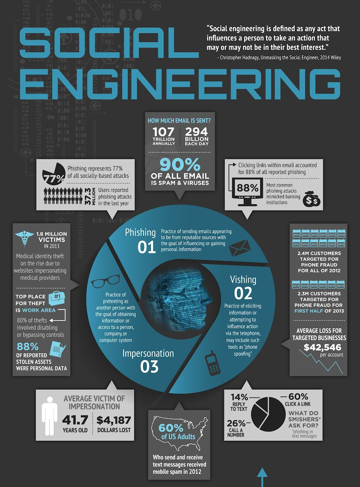

# Threat Modeling
Security can be seen as solving the objective of "obtaining a goal against an adversary".
It is achievable trough:
- **Policies**, the goals/objectives that the system should enforce.
- **Threat Model**, a set of assumptions on the adversary.
- **Mechanisms**, all the measures that ensures the policies are followed as long as the threat model is correct.

Since security is a **negative goal**, we need TMs: we should ensure that the policies are followed independently from the external world.  
It is much harder to validate than a positive goal, as it requires to think about every possibile adversary and their attacks. For this reason, TMs end up being a set of assumption on the attacker's capabilities.

Mechanism are security measures. They ensure that the policies are followed as long as the assumptions on the attackers are correct. 
Mechanism includes more than mere technological solutions: they integrate all the possible ways in which attacks may be handled. 
Often, mechanism are simple. It's mostly a matter of recognizing the necessity to use them. 

Threat modeling helps in identifying the three components:
$$
Risk = Assets \times Vulnerabilities \times Threats
$$
We still have to handle the problems of costs, feasibility, user experience, safety, and so on.


## Model the system
Represents the (data) flows and interactions among the entities of the system. We can insert **boundaries** to identify who controls each part of the system, and identify which are trust boundaries. 

The system may be huge, but not representing it all may not show some threats. The knowledge of the system may not be centralized in real world scenarios. At different level of abstraction we may identify different details. 
### Data Flow Diagrams
![[data_flow_diagram.png]]

| Element          | Appereance                              | Meaning                                                                  | Examples                                                         |
| ---------------- | --------------------------------------- | ------------------------------------------------------------------------ | ---------------------------------------------------------------- |
| External entity  | Rectangle with sharp corners            | People, code, and other stuff outside your control                       | Employees, customers, other organization with which you interact |
| Process          | Rounded rectangle/concentric rectangles | Any running agent, usually code                                          | Browser, HTTP server, ADAS perception software                   |
| Data flow        | Arrow, mono- or bi- directional         | Communication and interaction between other components                   | Network connections, HTTP, Modbus                                |
| Data store       | Two parallel lines                      | Stuff to store data                                                      | Files, Databases, Memory                                         |
| Trust boundaries | Dotted lines or dotted rectangle        | Represent where your "control" ends, where the interactions are not safe |                                                                  |
### Swim Lane Diagrams

Lanes (columns) are actors or components. Arrow represent the flow of information between lines. 
It is useful to represent **time-dependent interactions** (e.g. networks protocol).
It may be useful to identify trust boundaries, if some of the interactions are between trusted sources. 

From a practical point of view, a model needs to be comprehensible. Multiple sub-models may be added for each relevant component.
## Find, Address and Validate threats
Threats themselves can be modeled by brainstorming, using structured approaches or using attack trees. 
### Brainstorming
It is the easiest way to threat model. We get a bunch of experts in a room and make them
hypothesize attacks and threats against the system. 
However it may leads to unbalanced threats depending on the expertise, or impossible-to-realize complex attacks, ignoring simpler but less interesting threats.
### Structured Approaches
#### STRIDE
The acronym stands for: 
- **Spoofing**: it means imitating, pretending to be something you are not. In (cyber)security, it describes an attack where a malicious actor attempts to disguise a data flow as coming from a legitimate (trusted) source, when in fact it does not. 
  It violates **authentication**.
	- Weak authentication schemes, tampering of certificates, controlling the victim's machine, may all lead the attacker to present a file as authenticated while it's not.
	- [Wifi evil attack](https://www.kaspersky.com/resource-center/preemptive-safety/evil-twin-attacks).
	  Wifi are identified with their SSID. In WPA2 the AP (access point) authenticates the device: the AP with stronger signal is preferred. If the attacker knows the password (e.g. public places), he/she can create an evil twin of the SSID with the correct password to make the victim's device automatically connect, thus becoming a MITM.
- **Tampering**: it means modifying, and in (cyber)security it implies the (unallowed/unexpected) modification of data either at rest or in transit. 
  It threats **integrity** of data.
  It is easy to confuse with spoofing, and sometimes it overlaps with it. 
	- The easiest example is buffer overflow, in which an attacker modify a region of memory that he/she should not be allowed to access. 
	- Another example is the well known bank withdrawal race condition, since the saved result is incorrect due to an error in the sequence of executed instruction.
	- Hardware attacks such as [row hammer](https://en.wikipedia.org/wiki/Row_hammer) modify directly bits in memory. There is NO authentication of the user. However, some sort of "access" to the memory of the device is necessary. 
	- Time-Of-Check vs Time-Of-Use (**TOCTOU**) bugs.
	   It is a race condition where an attacker exploits the gap between a program’s check of a resource and its actual use. In this window, the attacker can change the resource (e.g., replacing a file with a symlink), causing the program to operate on a malicious target, often with elevated privileges.
	  Similar problem may arise in network contexts. 
	- **Network Tampering** involves not only modifying in-transit packets but also injecting or dropping them. This overlaps significantly with spoofing, where attackers impersonate trusted machines.
	- Encryption schemes can be applied either at the channel level (e.g., VPNs) or at message level (e.g., signatures). However, **channel encryption alone is insufficient**: once a message is delivered, it may persist beyond the session. If communication traverses multiple interchangeable paths, each hop must be secured. Full message-level encryption also requires both endpoints to support compatible protocols.
	- **Time tampering** can cause premature expiry or unintended extensions of certificates, sessions, or licenses, thereby undermining security or availability.
	- In AI/ML systems, attackers can alter the training data to degrade performance, embed backdoors, or induce targeted misclassification: it is a form of data poisoning that affects integrity and reliability of models. 
- **Repudiation**: in (cyber)security it is a threat to **accountability** where an individual, entity, or system denies having performed an action, leaving the system unable to prove otherwise. 
  It is strictly related with the concept of fraud although not exactly overlapping. It often works against privacy. 
	- User may claim that messages were never sent, received or read, posing a challenge when actions need to be attributed and verified.
	  Public figures have frequently claimed that their social accounts were hacked after personal messages or public tweets raised scandals.
	  A more dangerous real-world consequence is seen in the rise of [swatting](https://en.wikipedia.org/wiki/Swatting), a false emergency call that dispatch armed law enforcement to an unsuspecting victim's address. This attack thrives precisely because attributing the origin of the call is difficult, making it a low-risk, high-impact tactic.
	- Repudiation-based fraud can be originate form any actor in a transaction: the buyer, the seller or any intermediary. 
	  What if someone claims that the ATM didn’t give them their money? 
	  The attacker may be the bank (claiming they did but never providing you the money) the intermediary (e.g., an ATM provider not from the bank, keeping the money for themselves) or the user, receiving the money and claiming they were not provided (or not even attempting the transaction).
	  Something similar happens in e-commerce.
	  The user would like to be sure that if they receive something incorrect or never receive anything, they’ll be provided either their money or the goods. 
	  The seller (not the service provider) would like to be sure that the money will be received.
	  Each one of the intermediaries wants to be sure that they are not given  responsibility of the lost/modified package.
	  Some e-markets accept it as an economic risk, force the seller to take at least part of the responsibility while the user is more protected being the client. Local laws also affect such decisions, some american states allow to drop packages at the door with a photograph. 
	  Overall, managing fraud entails logging various events.
	- To manage such scenarios, systems rely on **logging critical events** (e.g., timestamps, identities, state changes). 
	  However, logging software is yet another piece of code, hence it expands the attack surface of the system. 
	  TOR, VPNs and browser privacy extensions tamper with information about the actual sender. In general, logs may be directly or indirectly tampered with by an attacker. Rootkits or sophisticated adversarial attacks against can tamper with logs or evade detection by IDS.
	  Moreover, logs are not inherently trustworthy unless cryptographic secured and redundantly stored.
	- Deepfakes and in general video, photo and audio digital editing allow for a recorded person to claim that the data is altered. If video and audios can be faked, how do we prove recorded actions?
- **Information disclosure**: in (cyber)security it is the process of allowing entities to see information that they are not authorized to see. 
  It is a threat against **confidentiality**.
  Data can be seen either at rest or in motion (it could also be seen as data in use).
	- An example is physical disk data recovery (freed memory is not intrinsically overwritten). This enables data recovery techniques.
	- **Metadata** may be as relevant as data itself. It is not only the content of the file that may disclose information, but directly the file name or folder themselves. 
	- Data may need to be decrypted to be used. Attackers may attempt to dump RAM to capture sensitive data like passwords, encryption keys, or session tokens.
	- What is sensible information is not trivial (e.g packets IP are clear, even when we use TLS). Communication per-se may be something that we don’t want to share (TOR/VPNs). The most obvious attack is **sniffing**.
	- Spectre vulnerability (speculative execution attack).
	  Branch prediction allows CPUs to speed up computation, loading data in memory for the most commonly taken branch. The attacker “teaches” the branch predictor to expect a specific pattern, and then forces an invalid action which is denied, but the branch predictor still loads it in memory. A memory dump allows to retrieve the information.
	- **Timing attacks** exploit the fact that certain operations (like cryptographic comparisons) take different amounts of time depending on the input values. By measuring such execution times, attackers can infer bits of secret keys, password or internal logic path. 
- **Denial of service**: in (cyber)security it is the threat that aims at absorbing/consuming resources a to deny a service from working/reaching the user. It is always physical, with infinite resources it will not happen. 
  It is a threat against **availability**.
	- At the core of information system there are running process: it is sufficient to stop a process to deny the service. 
	  DoS can be implemented trough crashing the target or exhausting it. **Crashing** it is heavily dependent on the specific implementation vulnerabilities. **Exhausting** computation may be done through requesting unbalanced tasks to the server (e.g., video processing, encryption/decryption routines, ..).
	- Zip bombs may also aim at exhaust computation, but most commonly just exhaust disk storage.
	- Fork bombs work similarly to Zip bombs, a program forks infinitely to exhaust PIDs.
	- **Network exhaustion** is performed either through **amplification** factors or crashes. Some examples are smurfs, ping of death, land attacks, amplification hell. Networks are highly insecure. 
	- Money can be the exhausted resource (e.g., SMSs, cloud computation).
	- Electricity is particularly relevant in IoT environments, or in space.
	- Note that countermeasures often ends up having the downside of enabling DoS: locking a device after a number of login attempts, firewalls automatically banning IPs on pattern detection, rate limiting on APIs or services, reputation-based email filtering, and so on. 
- **Elevation of privilege** (or Expansion of Authority): it means allowing someone to do something that they are not authorized to do. Many examples that we already provided may have an Elevation of Privilege effect.
	- SQL injections, buffer overflows, and Log4Shell make the attacker capable of executing commands with privileges they should not own.
	- An attacker obtaining access to a local network may interact with services they should not have the authority to interact with.
	- A **confused deputy** is an entity with certain privileges that is tricked into misusing its authority on behalf of another user (less or differently privileged), leading it to perform operations that the user is not authorized to execute. 
	  It is a perfect case of social engineering.
	  **Cross Site Request** Forgery attacks force the browser to act as a confused deputy, sending the attacker’s commands with the authorization of the user.
	  **Shellcode execution in SUID processes** allows the attacker to execute code as the owner of the file. 
	  Forcing the printing of relevant information in debug or error logs, similarly, convinces the process to provide the attacker with information that they should not have.

STRIDE-per-elements consider the case that only some elements can have some threat categories. The core limitation derives from having to do the data flow diagram (DFD).
STRIDE-per-interactions assumes all threats can be represented in the interaction between elements, since the element by itself does not "act". Limited if an element is not fully expanded, since the interaction between the internal systems of the element would not be visible. 

|     | Threat type                 | Description                                                   |
| --- | --------------------------- | ------------------------------------------------------------- |
| S   | **Spoofing**                | Pretending to be someone esle                                 |
| T   | **Tampering**               | Modifying data or code without autorization                   |
| R   | **Repudiation**             | Denying performing an action without a way to prove otherwise |
| I   | **Information Disclosure**  | Leaking information to unauthorized parties                   |
| D   | **Denial of Service**       | Making a system or service unavailable                        |
| E   | **Elevation of Privileges** | Getting higher privileges than allowed                        |
STRIDE **threat model matrix**, help identify which threat types apply to which system components:

|                 | S   | T   | R      | I   | D   | E   |
| --------------- | --- | --- | ------ | --- | --- | --- |
| External Entity | yes |     | yes    |     |     |     |
| Process         | yes | yes | yes    | yes | yes | yes |
| Data Store      |     | yes | yes/no | yes | yes |     |
| Data            |     | yes |        | yes | yes |     |
#### MITRE's ATT&CK
[MITRE ATT&CK](https://attack.mitre.org/#) (Adversarial Tactics, Techniques, and Common Knowledge) is a publicly available framework that compiles observed adversary behaviors.
The framework is organized as a matrix:
- **Columns** represent **tactics** (why) - the adversary's objective at a given phase of the attack. 
- **Rows** represents **techniques** (how) - methods that an adversary may use to accomplish the goal. 
For each technique the framework offers: examples of how real-world attackers used it, mitigation strategies to monitor or prevent their impact. 

|      | STRIDE                                    | MITRE ATT&CK<br>& other knowledge bases                                |
| ---- | ----------------------------------------- | ---------------------------------------------------------------------- |
| Pros | Simple<br>Comprehensive                   | Based on "real" data<br>Specific<br>Easy to understand countermeasures |
| Cons | High-level<br>Not specific<br>Theoretical | Complex<br>Does not consider "0 days"<br>Not applicable to everything  |
#### Attack Trees
Kind of deprecated.
The core idea is to develop a tree of sequential events to reach a goal. Then, prune the tree depending on the system's characteristics. 
The problem is that too many attack trees for a single system are needed, plus an **excessive complexity** make them hard to use. 
Still they present an interesting overview of all the necessary/possible steps to achieve an attack goal.


### Mitigating Threats
- **Top-Down Approach**: start with a system-wide view, then analyze components. This ensures all potential threats are considered.
- **Breadth-First**: evaluate all threats at a given level before diving into lower layers. Unmitigated threats at higher layers are often more critical.
- **Threat-Mitigation Hierarchy**: every mitigation introduces new attack vectors, requiring additional defenses.

- **Avoid the risk**: if the risk is greater than the potential reward, you can decide not to implement the software, application or feature.
- **Address the risk**: after identifying the threat, you change the design or operational processes, or implement mitigations, to reduce the risk. 
- **Accept the risk**: if the threat is real but has low probability or impact, you can decide to accept the costs of something going wrong.
- **Transfer the risk**: If the threat is something that someone else is better equipped to handle, you can make them responsible for it, like providing end-users or customers a terms of service and licensing agreement or purchasing insurance.
- **Ignore the risk**: If you want to pretend the threat doesn’t exist, then you can ignore it, but this decision often means you open yourself up to legal liability or compliance violations.

The attacker has room in the gap between what a system is designed to do, and what it does to achieve its goal. Our perfect goal would be to design a system that does what it is designed for. 
# Social Engineering
Technology vulnerabilities are hardened, patched or solved. 
Social engineering is often the path of least resistance. Moreover, technologies hardly prevent SE. Hence, it is usually simpler, faster and cheaper. 

The vast majority of attacks requires at least one step of SE. 
- Only about 3% of malware tries to exploit an exclusively technical flaw, while other 97% involves targeting users through SE. 
- For more than 90% of the successful attacks human are the “kill switch”. This means that without the human error the attack won’t start.
- The number of successful attacks has risen from 62% in 2014, to 71% in 2015, to 76% in 2016, and to 79% in 2017 with no end in sight. 91% of these attacks use spear phishing.


> [!DEFINITION] Social Engineering
> - “Any act that **influences** a person to take an action that may or may not be in their best interest” *Christopher Hadnagy*
> - "Social engineering uses influence and **persuasion** to deceive people by convincing them that the social engineer is someone he is not, or by **manipulation**. As a result, the social engineer is able to take advantage of people to obtain information **with or without the use of technology**” *Kevin D. Mitnick & William L. Simon - Art of Deception*
> - “Social engineering refers to all techniques aimed at talking a target into revealing specific information or performing a specific action for illegitimate reasons.” *ENISA (European Union Agency for Cybersecurity)*

SE is the medium, not the objective. 
More specifically, it is a category of attacks/techniques to obtain specific goals. Each can be considered an attack vector, available every time there is some kind of human interaction in the attacked system. These can be used both by themselves, both as a step of a bigger attack, which may or may not include the use of other techniques. 
## SE in STRIDE

| Threat Type             | Relevance in SE                                                                                                                                                                     |
| ----------------------- | ----------------------------------------------------------------------------------------------------------------------------------------------------------------------------------- |
| Spoofing                | 🟢 Highly relevant<br>The attacker **impersonates a trusted entity** (e.g., phishing, fake IT support) to gain access or justify actions.                                           |
| Tampering               | 🟡 Moderately relevant<br>The attacker may forge or alter communications (e.g., fake requests, manipulated forms) on behalf of someone else.                                        |
| Repudiation             | 🔴 Uncommon as a primary goal<br>It can be a side effect, as attackers may deny their actions or blame others.                                                                      |
| Information Disclosure  | 🟢 Highly relevant<br>Attackers trick victims into **revealing sensitive information** (e.g., credentials, internal procedures).                                                    |
| Denial of Service       | 🔴 Uncommon as primary goal<br>SE typically aims for access, not service disruption, though it can be a side effect (e.g., triggering account lockouts).                            |
| Elevation of Privileges | 🟢 Highly relevant<br>Core to many SE attacks, especially when using **confused deputy** tactics (e.g., tricking a privileged user or system into acting on the attacker’s behalf). |
Social engineering attacks often span multiple STRIDE categories, but are primarily concerned with **deception-based privilege escalation** and **unauthorized access.**
## Structuring SE
The term social engineering has evolved significantly over time, but its core mechanisms remain consistent.

The first use of the term is found in book titled “An Efficient Remedy for the Distress of
Nations”, where it referred to the **role of policy planners** who needed to understand and influence **mass behavior** in both domestic and international affairs.

Throughout the 19th and 20th centuries, the meaning of the term was that of being an **engineer of social contexts** and **of people**, that understands the behavior of the system given an input, and can predict an output.

In the digital age, phone phreakers are the ones that first modifies the term towards its current meaning which is "any act that manipulates a person to take an action that may or may not be in their best interest".

These definitions share the following fundamental principles
1. Knowledge advantage (**epistemic asymmetry**).
   The policy maker has knowledge of the historical reaction of masses towards events. 
   The attacker has information on the victim and knowledge of expected behavior, but not the opposite.
2. Technical strength to enact changes in others's behavior (**technocratic dominance**).
   The policy maker has systemic tools such as media, education, healthcare mandates, and surveillance infrastructure.
   The attacker can fake a website login, spoof the caller ID or disguise themselves. 
3. Redirection of intent (**technological replacement**).
   The policy maker convinces the masses to act in alignment with state goals.
   The attacker convinces the victim to do something which is in the attacker' interest, such as download and execute malware.


> [!TIP] How SE works
> The attacker understands human behavior (**knowledge**) and has technical skills to trigger the wanted human behavior (**technical advantage**).
> By combining these, the attacker manipulates the target into acting against their own interests, often without realizing it.

Wrong assumptions lead the victim to build an incorrect model of the environment. 
## SE attacks vectors

### Phishing
SE approach trough **text** (e.g. mails, text messages, comments on social media platforms, ..). It is vastly the most common vector. 
Objectives vary: financial fraud, information theft, coercion/blackmail/extortion, malware delivery. 
Implementation means are email, instant messaging services, social media chats.
Common attacks are **spear phishing**, which target always the same category of people (it is called whaling for important people) or **angler phishing**, which the interaction starts from the victim in order to increase the trust. 
Assumptions to play on (spoofing options) are logos, message structure copying, email send field or actual sender spoofing, impersonating on social media or using stolen accounts. 
### Vishing 
SE approach trough **voice** (e.g.. calls, VoIP or voice over IP, voice messages).
Most common attack goals are to obtain information or convince the victim to perform an action. 
Assumptions to play on are spoofing caller-ID trough VoIP, spoofing caller's name or instant messaging call options.
Some countermeasures are technologically (may be implemented by the phone provider) and education/awareness (e.g., teach to call back instead).
### Impersonation
SE approach trough **physical approach** so it require physical presence.
Most common goal is to access premises. 
Common attacks are shoulder surfing and piggybacking/tailgating.
Assumptions to play on (spoofing options) are wearing ad-hoc clothes, playing on the access level you already obtained or copying access credential. 
Some countermeasures are perimeter security and/or personnel education. 

### Comparison

| Technique         | Pros                                                                                                                                    | Cons                                                                                                    | Countermeasures                                                 |
| ----------------- | --------------------------------------------------------------------------------------------------------------------------------------- | ------------------------------------------------------------------------------------------------------- | --------------------------------------------------------------- |
| **Phishing**      | - Scalable (mass delivery, parallelizable)<br>- Easy automation<br>- Harder to trace<br>- Can bypass technical barrier with social cues | - Spam filters and user awareness can easily defect them<br>- Requires convincing design                | Email filtering, spoofing protection (SPF/DKIM), user awareness |
| **Vishing**       | - Real-time interaction<br>- Can pressure or confuse target<br>- Less likely to be flagged by software                                  | - Requires live interaction<br>- More time-consuming<br>- Easier to report (trough recording)           | Caller ID verification, telecom-level filters, user awareness   |
| **Impersonation** | - Direct access to secure environments<br>- May bypass digital controls entirely<br>- Allows more control on the attack                 | - High-risk for attacker<br>- Requires physical presence and preparation<br>- Can be easily interrupted | Badge systems, mantraps, personnel awareness, uniform policy    |

## Building Blocks of a SE attack
The final goal of the attacker derives from the definition: convince the victim to execute a specific action. 
To obtain the action, you need to **influence** the victim -> influence tactics.
To influence the victim, you need to have its **trust** -> pretexting.
To have its trust, you need **knowledge** -> information gathering. 
### Knowledge: information gathering
If an attack targets a specific entity, the focus is on gathering information relevant to that entity. 
If no specific entity is targeted, the search may focus on entities with exploitable characteristics. 

Relevant information may vary.
- For **corporations**: name, branding, business focus, physical addresses, facility details, organizational structure (names), policies, procedures, social media end event (coming/passed), supply chain partners, relationships with external entities.
- For **individuals**: contact details, family and friends, personal interests, hobbies, sports, employment details (new/old) and financial status, social media presence, schedule, routines, geolocations.

If targeting a specific company, an attacker might gather information about its employees. 
If there is no specific target and the goal is to exploit elderly individuals for financial gain, an attacker may look for the names of grandparent-children pairs and target whoever is identified.

Such information can be accesses by:
- **Physical inspection**: layout of the facility, identification of people, access policies.
- **Digital scraping**: general information gathering (google dorks, whois, recon-ng), people lookup (heHarvester, Pipl, social-media engines, LinkedIn sales tools) or others (Shodan, Have I been pwned, deHashed).
- "Online" **technical [OSINT](https://www.ibm.com/think/topics/osint)**: social media (80% of data used in SE attacks), company websites, collaboration websites, public reports, and many more.
- Previous attacks or illicit activities.
- Dumpster diving, theft, break & enter, data leaks.
### Building Rapport: pretexting
Pretexting means creating a **scenario**/**identity** that helps the attacker to justify their actions and requests. 
A pretext is a **false but plausible narrative** that explains who the attacker is, why they are contacting the target, and why the target should comply with their requests.

One of the most important aspects of a social engineering attack is to **build trust**, which does not mean that the victim has to like the attacker, but has to trust that the attacker is telling the truth. A solid pretext is an essential part of building trust. It is a combination of character and context. 

1. Thinking through your goals: the pretext needs to justify the requests.
2. Know how far to go: ensure to answer who are you, what do you want, are you a threat, how long will this take.
3. Getting support for pretexting: look the part, bring your tools, know your stuff.
4. Executing the pretext: practice, stretch, communicate, learn how to build a rapport, given the medium that you will use. 
### Influencing tactics
Principles of influence are:
- **Reciprocity**:
  Similar to "altruism". 
  According to [Cialdini](https://www.scirp.org/reference/referencespapers?referenceid=1108133), our brains are unsettled until we **repay a favor**. Experiments by [Regan](https://journals.sagepub.com/doi/10.1177/0093650207307896) show that a small favor may be more relevant than how much the experimenter was liked by the subject. 
  Note that the level of an "**acceptable request**" is dependent on the perceived value of your gift by the receiver. Hence, knowing your victim's tastes and interests increase the chance of obtaining information from the victim. 
- **Obligation**:
  Similar perception of **debt towards others**, but based on social norms or expected behavior, not on previous favor or gifts.
- **Scarcity**: 
  If something is made scarce, or less available, its perceived value increases. 
- **Authority**:
  It is the right to exercise power. Society teaches us to follow authorities' orders. It can be legal, organizational or social. 
  [Milgram](https://en.wikipedia.org/wiki/Milgram_experiment) showed in an experiment the effectiveness of authority:
	- The volunteer was told that the experiment was on memory and learning. He was put in a room as the “teacher”. Another (fake) volunteer was the student. A third person entered as the “experimenter”, in a lab coat (authority). 
	- The teacher was to ask the student word pairs, and the student would get electrocuted if wrong. For each error, the (fake) voltage increased (from 45 to 450 volts).
	- The student was to make audible protests and fake being in pain. If the volunteer indicated a desire to halt the experiment, the experimenter said words like “please go on”.
	- All participants went up to 300V, with 65% to 450V.
	
	
- **Consistency & Commitment**:
  It is “unnatural” to disagree with yourself.
  After making a commitment, taking a stand or position, people are more willing to agree to requests that are consistent with their prior commitment.
  “Foot-in-the-Door” experiment by [Freedman & Fraser](https://doi.org/10.1037/h0023552): homeowners were asked to put a large and unattractive “Drive Safely” sign in their front yard. Some were previously asked to put a small “drive safely” sticker on their cars. Only 17% of people asked directly to put the yard sign agreed. 76% of those that were asked to put the sticker first accepted to put the yard sign.
- **Liking**:
  People like people whom are like them. 
  Hence, if an attacker manage to make the victim like him/her, they’ll be more prone to help you the attacker or accommodate his/her requests.
  [Cialdini](https://www.scirp.org/reference/referencespapers?referenceid=1108133) presents the example of Tupperware parties, where instead of having a salesman invite people to gatherings, the process involved a “host” (e.g., friend or neighbor) inviting people to their home for a party.
- **Social Proof**:
  If you don’t know what to do, act like you belong. When people are unsure how to behave in a situation, they tend to look to others for cues. This psychological principle suggests that if others act as though something is normal or acceptable, individuals are more likely to follow suit.
  In social engineering, you may have a partner participating in the same interaction before with the victim, or build up a claim that you did that interaction with many people before and it went well.
- **Fear**:
  It is an effective tactic due to two main effects:
	- It activates the amygdala, triggering the fight-or-flight response, which limits rational thinking.
	- It creates urgency, forcing the user to make a choice without verifying the provided information.
- **Cognitive Blindness** / **Selective Attention**:
  It occurs when a person fails to notice a visible but unexpected object or event because their attention is focused elsewhere. 
  Since in SE the goal of the attacker is to make the victim wrongly assume something, forcing its attention towards a smokescreen is extremely effective.
  For example, a scammer calls an employee pretending to be IT support and asks them to reset their password. The employee, distracted by the perceived authority, does not question the legitimacy of the request.
## AI in Social Engineering
Assumptions are the foundations of SE attacks:
- In impersonation we can have deepfakes: seeing a person is not a way to authenticate them anymore. 
- In vishing we have audio-jacking to implement a MITM.
- Large-scale phishing can now be tailored and access personal information by using an Automatic Spear-Phishing.
## Email Spoofing
Email works using a client-server model and follows standardized protocols for sending, receiving, and delivering messages:
1. Sending the email:
   A user composes an email using an email client (e.g., Gmail, Outlook).
   The client sends the email to an **SMTP** (**Simple Mail Transfer Protocol**) server which is a **MTA** (**Mail Transfer Agent**).
2. Email transmission (forwarding):
   The SMTP server looks at the recipient’s domain using the DNS (Domain Name System) to find the Mail Exchange (MX) records for that domain. The email is routed through one or more mail servers until it reaches the recipient’s mail server.
3. Receiving the email:
   The recipient’s mail server stores the email. The recipient retrieves it using IMAP (Internet Message Access Protocol) or POP3 (Post Office Protocol 3).

![[./assets/email-process.png]]

The SMTP has limited commands:
- HELO/EHLO: first command sent by the client to the mail server to introduce itself.
- STARTTLS: upgrade an existing plaintext connection to an encrypted TLS connection.
- MAIL FROM: specifies the sender's email address.
- RCPT TO: specifies the recipient's address (multiple commands for more recipients).
- DATA: signals the beginning of the email content (headers + body). This is the visible element of the email from the recipient’s email client.

Anybody can send SMTP commands to an MTA server. 
Email spoofing occurs when an attacker manipulates email headers to send an email that appears to be from someone else. The **SMTP protocol does not authenticate the sender by default**, making it possible to forge the "from" field.
### Sender Policy Framework (SPF)
SPF is a framework through which the owner of a domain can indicate to the DNS which IP addresses are allowed to send emails on behalf of the domain. 
The **SPF record specifies which servers are allowed to send emails for that domain**.
The recipient’s MTA server can check, upon receiving an email, if the sender was allowed to send it.
- If the recipient’s MTA server does not check, SPF is useless.
- If the sender’s MTA server does not support SPF, it is spoofable.

1. Sending email:
   The sender’s SMTP server attempts to send an email.
2. Email transmission & SPF check:
   The recipient’s server queries the SPF record in the sender’s domain’s DNS settings. 
   If the sending SMTP server is not listed in the SPF record, the recipient's mail server can decide whether to reject, flag, or quarantine the email.
3. Receiving the email:
   If the SPF check passes, the email proceeds to further authentication checks (like [[Human & Physical aspects of Security#Domain Keys Identified Mail (DKIM)|DKIM]] and [[Human & Physical aspects of Security#Domain-based Message Authentication, Reporting & Conformance (DMARC)|DMARC]]) before being delivered to the inbox.

However, the sender shown inside the body of the email does not need to be the same as the actual email address!
Since the end user is a human the attacker does not need to authenticate. If the human
makes the wrong assumption on what they are looking at, assuming it is authenticated,
they will not detect the attack.

A **malicious MTA** (Mail Transfer Agent) is an email server that is intentionally set up or misconfigured to facilitate spam, phishing, email spoofing, or malware distribution. It operates similarly to legitimate MTAs but is used by attackers for harmful purposes.
### Domain Keys Identified Mail (DKIM)
DKIM works by **digitally signing emails using a cryptographic key**, allowing the receiving server to verify their authenticity. 
While SPF validates the sender's MTA IP addresses, DKIM uses **asymmetric key pairs** to sign part of an email (specific headers like from, subject, date, ..).

Advantages:
- It signs part of the email content, in addition to enduring that the sender is whitelisted. 
  With **SPF**, there is **NO distinction between users** under the same domain. The MTA is assumed to be the only authorized sender, and its IP address is inserted in the SPF authorization list. 
  This provide message integrity and domain authentication. 
- The sending MTA holds the private key, not the user, lowering the chance of being stolen.
Disadvantages:
- It **does not encrypt** the email DATA content, so if an attacker manages to obtain data in transit it can change the content. 
### Domain-based Message Authentication, Reporting & Conformance (DMARC)
It is meant to solve the issues of SPF and DKIM by building on top of them. It tells receiving mail servers what to do when SPF and/or DKIM fail to authenticate a message.
The simple intuition is to ensure that the sender's domain address in the email aligns with the authenticated domain: enforcing that SPF or DKIM must pass and align.

Domain owners publish a **DMARC policy** in their DNS records that tells receiving mail servers what to do with emails that fails the authentication checks.

```
v=DMARC1; p=reject; sp=quarantine; ruf=mailto:fail-report@example.com; pct=50;
```

In the example:
- `p=reject` means that the policy if the sender and authenticated domains do not align is to reject.
- `sp=quarantine` means that if the sender domain is a subdomain of the authenticated domain just put it in quarantine.
- `ruf=mailto:...` means that a report should be sent to that email if there is a rejection.
- `pct=50` means that the policy should be applied to only 50% of the emails of the given domain, to allow for gradual rollout.

|           | Autheticates/checks                                                                                                               | Limitations/Weaknesses                                                                                 |
| --------- | --------------------------------------------------------------------------------------------------------------------------------- | ------------------------------------------------------------------------------------------------------ |
| **SPF**   | IP address of sending mail server.                                                                                                | Fails with email forwarding.<br>Does not verify the "from" header seen by the user.                    |
| **DKIM**  | Email integrity through signatures.                                                                                               | Requires key management. <br>Only part of email is signed to allow forwarding and other modifications. |
| **DMARC** | Builds on top of SPF and DKIM. <br>Validates the alignment of senders. <br>Allow the sender domain to define the policy to apply. | % of emails to ignore may lead to attacks.                                                             |
Note that there are other policies that specific email providers may utilize (e.g. spam scores, IP blocklists).
However, it is important to clarify that if the spoofed domain does not implement any approach, there’s nothing that can really be done on the receiver side.
# Physical Security
It is that part of security concerted with **physical measures** designed to:
- **Safeguard personnel**: protecting people within an environment.
- **Prevent unauthorized access**: securing equipment, installations, material and documents from being accessed by unapproved individuals.
- **Counteract malicious actions**: reducing the risk of espionage, sabotage, damage and theft.

While STRIDE is not fully functional for physical security, as it was originally developed for software threat modeling, it can still be applied:
- **Spoofing**: 
  It refers to deceiving a system or person into believing that the attacker is a legitimate entity or person.
  It is one of the most used attacks. It can be done by **breaking** the **mechanism** used for **identification** (e.g., bypassing biometric sensors or badge readers), or to break the "person" mechanism for identification (which is not that trivial) by **impersonation** of people. 
  Note that physical access to devices may also pave the way for the execution of other spoofing attacks. 
- **Tampering**: 
  It is the unauthorized interference with or alteration of equipment or assets.
  It is the most pervasive attack. It means to "touch or make changes to something when you should not, especially when this is illegal". Common devices that block access to something are often not meant to stop an indefinitely long attack. 
- **Repudiation**: 
  In physical security contexts, repudiation involves the attacker's ability to deny having performed an action, particularly when access logs or histories are incomplete.
  It is meaningful only if there is history of events. It is particularly relevant since the attacker needs to be physically present within the premises. 
- **Information Disclosure**.
  While often seen as a digital threat, in a physical context it involves the unauthorized exposure of sensitive information through physical media or environments.
  For example **visual hacking** means observing confidential information on screens or documents left in open places, while **physical breach** consist in stealing documents or portable storage devices from secure locations.
- **Denial of Service**:
  The basic implementation of a DoS is not digital (e.g. cutting cables or disabling a key piece of hardware).
  Although digital DoS attacks overwhelm systems with data, the physical version involves targeted disruption through tangible actions.
- **Elevation of Privilege**:
  It occurs when an attacker gains access to a system that they are not authorized to use, essentially obtaining privileges that should be restricted.
  All physical threats presented up to now may be summed up as obtaining access to somewhere you should not. Hence, physical security goals can be summed up as identify asset locations and stop unauthorized access to them.

**Authentication** and **authorization**, plus **detection** can prevent/detect these threats:
- **Perimeter design**: understand what are the requirements and capabilities derived from being in a zone and define the boundaries of that zone, then ensure that those are "defendable".
- **Access control**: authenticate each way to get inside, potentially with different access levels.
- **Surveillance**: beginning of "detection system", someone directly or indirectly checking relevant locations. One may "force" its way trough an access control zone (e.g. picking a lock, breaking a wall, killing the guard). We want to detect/prevent the attackers to obtain access trough recognition. 
## The Security Defense Chain
In short: Deter, Delay, Detect, Respond.

|              | Goal                                                       | What to do                                                                   | Examples                                                                                    |
| ------------ | ---------------------------------------------------------- | ---------------------------------------------------------------------------- | ------------------------------------------------------------------------------------------- |
| **Deter**    | **Discourage** **attackers** from attempting intrusion.    | Use visible security measures to create a psychological barrier.             | Fences, warning signs, lighting, surveillance cameras, security patrols.                    |
| **Delay**    | **Slow down the intruder** to buy time for a response.     | Introduce obstacles that increase the effort and time needed to gain access. | Locked doors, security turnstiles, barriers, reinforced entry points.                       |
| **Detect**   | **Identify unauthorized access** or attempts in real-life. | Systems that alert to breaches as they occur.                                | Motion detectors, CCTV, alarms, access control logs.                                        |
| **Response** | **React effectively** to intrusions or security events.    | Personnel or systems to neutralize threats.                                  | On-site guards, law enforcement notification, lockdown procedures, incident response plans. |
## How to access a physical location
Before lockpicking, we can attack the door by:
- Non-destructive bypass techniques such as **shimming**,  involves inserting a thin piece of metal or plastic (a shim) into a lock or latch mechanism to bypass the locking function, and **releases**, refers to using manual override or release mechanisms that are built into many access control systems or locks usually intended for emergency or maintenance. 
- Cloning or key reuse.
- Destructive techniques such as drilling or cutting.
### Lockpicking
Lockpicking is essentially the art and science of bypassing a lock without using its intended key, and it relies on understanding both the design of the lock and the mechanics behind its operation.


Most lockpicking techniques focus on common pin tumbler locks: these locks consist of a series of **spring-loaded pins** that prevent the lock from turning unless the correct key aligns the pins at what’s called the shear line. 
When a key is inserted, it pushes each pin so that the gap between the pins aligns perfectly, allowing the cylinder to rotate and unlock the mechanism.
The goal of lockpicking is to create a situation inside the lock where the internal components line up as if the correct key were present. 
This is typically achieved by:
- **Manipulating Pins:** using a pick to push pins up individually.
- **Applying Tension:** using a tension tool (a torque wrench) to apply rotational force on the lock to create a binding effect, where one or more pins may stay slightly in place due to friction, allowing the attacker to set each pin at the shear line incrementally.

In a typical pin tumbler lock, not all pins are free to move when tension is applied. Often, one or two pins become “bound” (due to slight differences in resistance). A lockpicker works on these first:
- **Identify the Bound Pin:** by feeling for resistance, the picker determines which pin is bound.
- **Set the Pin:** carefully lifting the bound pin until it reaches the shear line will cause it to “set” in place, meaning it no longer resists the turning of the lock.
- **Repeat:** this process is repeated for the remaining pins until all have been set, allowing the cylinder to rotate fully and the lock to open.
This method is called **single pin picking** (SSP) since it works on one bound pin at a time, setting it at the shear line until the lock opens.

When picking a lock, fine control is crucial. Two common issues you might encounter are:
- **Oversetting a pin**: it occurs when you lift a pin past the optimal point, beyond the shear line.  When a pin is overset, it can either bind or cause misalignment with the rest of the pins.
- **Forcing the key pin through the shear line**: excessive force or improper manipulation can cause the key pin to be pushed too far, making it cross beyond the shear line. This might happen when too much pressure is applied, or if the pick accidentally engages both the key pin and the paired driver pin simultaneously.
  It can misalign the lock’s internal mechanism, requiring the attacker to start over.


**Security pins** add an extra layer of complexity to lockpicking by intentionally generating false signals, like false sets and inconsistent tactile feedback: their irregular surfaces can cause the picker to receive inconsistent tactile feedback, making it difficult to determine when the pin has reached its correct position. 
### Electronic door mechanisms
#### RFID/NFC badges
They are commonly used for **electronic access control systems**. There are several implementations with varying levels of security:
- 125 kHz RFID cards (e.g. HID).
  They generally do not have any significant security implementation. They store a fixed ID that can be easily duplicated. 
- 13.9 MHz NFC cards (e.g. Polimi's).
  They support more complex protocols, such as MIFARE Classic 1K. A while ago it was discovered to be broken, allowing to crack the keys of a card through brute forcing. Note that Polimi’s student cards are now “emulated” mifare cards, while they can be copied knowing the keys, the bruteforce process is not feasible anymore.
### Remote Entry Systems
The command needs to be sent through an **insecure channel** by definition. 
#### Single code: basic replay attacks
The key and the car share a **symmetric key**. The secret key is used to generate always the **same message**. Upon pressing the key button, the key generates and sends the message. 

This is exploitable trough **sniffing**: the attacker, being in the general vicinity of the key or car, it can sniff the message and replay it at will. 

#### Rolling code: jam and replay attack
The key and car share a **secret key** and a **seed**, and both have a **counter**. The message is an hash of key, seed and counter. 
The key increases the counter every time it generates a new message. 
The car, upon reading a valid message with counter $n$, shifts the list of valid counters to $[n+1, n+100]$.

If the attacker just sniffs the message and replays it, it fails, since the counter is "old" and not accepted anymore.
The car has received the message from the actual key (with counter $n$) and increased its counter to accept only messages from counter $[n+1]$. Therefore, replaying the message does not work.
 Each message can be accepted only once. 


However, the attacker can **stop the message $(n)$ from reaching the car** (jamming), while saving it. 
In this way, the car never increases its counter and the message of the attacker is valid. Usually the owner of the car will press the key again, since it wants to get in the car, generating $(n+1)$. The attacker can then **send $msg(n)$ while saving $msg(n+1)$** and the car still accepts $(n+1)$.


#### RKS (remote keyless system): replay/forward attacks
The issue with single and rolling codes is that there is no two-way communication. Newest **keyless vehicles continuously generate challenges for the key to solve**.
The key is the only one that knows the secret, and therefore can solve the challenge.

If the attacker jams the signal, the challenge never reaches the key, not allowing for the key to solve it and be replayed.
The attacker needs to not jam the challenge but the message. While the implementation of such attack is challenging, it is theoretically feasible. Therefore, adding a simple **expiration time** to the challenge of the vehicle ensures that the message cannot be replayed "offline".


Nonetheless, keyless systems have another issue: the key does not need to be pressed by the victim, allowing an attacker to execute a replay/forward attack when the victim is not near, yet not too far away to make the challenge expire. 
The only solution is to have stringent deadlines.

# Cyber-Physical Systems Security
A cyber-physical system identify contexts integrating embedded computers, networking, automated controls and sensors/actuators.

- **Distributed controllers** are used for computing: they may run on bare-metal systems, RTOSs or lightweight Linux distros, depending on timing and resource constraints. 
- **Networking**.
  Communication uses a mix of serial protocols, and also parallel IP-compatible network protocol for higher bandwidth. It may also include sensor networks, which operates over low-power, lossy wireless links.
- **Sensors** are analog controls that transform an analog signal into a digital, discrete one. **Actuators** turns digital commands into physical actions. Both determines the system's ability to monitor and influence its environment.
- A CPS intrinsically has **control processes**, embedded in devices or centralized in control rooms, that decides how to act on sensed information. These processes are often feedback-based.
- The physical environment provides access to the system, but also limits the behavior of the system.

Requirements and characteristics of CPSs:
- **Real-Time Interactions**:
  CPSs monitor and responds to changes in the physical environment with **short timing guarantees**. Tasks must meet strict deadlines to ensure correct system behavior.
- **Resources Constraints**:
  Often operate on limited power (e.g. battery-powered sensors or embedded controllers), with minimal memory and computational resources. Efficiency in energy consumption and computation is essential. 
- **Feedback Loops**:
  Continuously adjust system behavior based on sensor inputs.
- **Distributed Architecture**:
  Geographically dispersed subsystems, such as ICS (Industrial Control Systems), SCADA (Supervisory Control and Data Acquisition), or smart transportation systems. Networks may have variable latency or reliability. 
- **Safety** and **Reliability**:
  System failures can have physical consequences, including injury, loss of life, or environmental harm, necessitating rigorous safety and fault tolerance mechanism. 
- **Long Life Span**:
  CPSs are often deployed for decades. They remain operational over time, yet threats evolve. Companies may stop servicing CPS components before their end of life. New components also need to ensure backward compatibility. 
## Applying CIA
- **Confidentiality** "loses" its role as most relevant element, but has its space especially in protecting sensitive or proprietary data.
- **Integrity** remains relevant due to safety risks. Tampering with control data or commands can lead to unsafe behavior or system malfunction. 
- **Availability** becomes the most relevant element due to safety, product line, and overall tasks of the system. 

The concept of **safety** (protecting humans, environment, and infrastructure from harm) becomes relevant, although not applied to data itself.

Enterprise systems are more standardized and structured: they have more developed modeling frameworks. 
While CPSs require understanding threat modeling basics to adapt them (that's why we do not use only MITRE ATT&CK but less constrained frameworks).
Moreover, CPS are often **critical systems**, which implies state actors may be a valid threat. 
### Physical Layer
Most relevant threats are related to the **tampering** with field devices, sensors, and
networks, **spoofing** devices, or in less common cases **information disclosure**. 

- Destruction of devices or networks may lead to denial of services.
- Access to devices may allow to flash firmware or tamper with settings.
- Physical connection to networks (wired or wireless) allows to sniff/tamper with data.
### Control and Actuation Layer
Typical attack vectors include:
- **Controller parameters** (e.g. PID gains)
- **Setpoints / Objectives** (e.g. desired temperature, speed)
- **Sensor feedback** (to trick the controller)
- **Actuator commands** (e.g. forcing a valve open)


Such attacks may aim to:
- Cause **specific outcomes** (e.g. stealthy manipulation)
- Trigger **unsafe or destructive behavior** (e.g. overspeed, overheating)
- Exploit **hidden weaknesses** (e.g. **robo-punching** or **micro-defect injection**)

The attack surface spans multiple layers, such as physical, network, and control, but the impact is most visible at the control layer.

Countermeasures focus on control loops. They are based on **resilient control** and **anomaly detection**:
- **Robust control theory**: control algorithms that can tolerate a significant amount of modeling error or sensor noise. A similar concept can be obtained with saturation of the output. Useful only if the controller code is not tamperable. 
- **Fault-tolerant control**: if a sensor or component "fails" (e.g., is tampered with) switches to a second software/hardware component.
- **Hardware redundancy**: using multiple controllers or duplicated hardware paths in parallel. If the output of the two components differ, raise an alarm. 
- **Model-based anomaly detection**: develop a model of normal process behavior. Flag anomalies when real measurements deviate too far from predicted values. 

Note that if designed only for safety, it may be bypassed while if designed for security, usually it is located in a component different from the controller. 
### Sensor Layer
A device that detects or measures a physical property and converts it to an analog or digital signal. 
Sensors can be active (they generate the stimulus that they successively read, such as radars) or passive (accept external physical stimuli, such as a thermocouple).
A sensor receives in input a stimulus from a measurand (the quantity that the sensor
intends to measure).

- The transducer produces an electrical representation of the measurand by measuring the stimulus (e.g. a photoresistor transducer decreases its electric resistance as photons hit its surface).
- Analog signal processing (e.g. amplifier and filters) are meant to increase the amplitude of the perceived signal and remove noise.
- ADC transforms the analog signal (voltage) into a digital value (bits). Such digital data is then forwarded for processing/control.

Attacks that aim at **tampering with the value of a sensor** can be classified depending on the position of the attacker (as usual).
#### Measurand attacks
A direct modification of the measurand to achieve the attack goal (e.g. inserting an object in front of a radar/lidar to enforce it to act on it or copying a fingerprint).
  
For **passive sensors**, we can either **increase precision** to make the attack more difficult, or use **sensor fusion** to **recognize anomalies** (e.g. temperature or electrical conductivity of fingers to ensure they are not plastic).

For **active sensors**, it is possible to **watermark** the active sensing process by embed a secret pattern into the emitted signal to detect if a response is genuine or spoofed (e.g. patterns in the LiDAR laser generation or frequency to avoid injection of false points).
#### Transduction attacks
Analog attacks where an adversary **injects malicious physical signals** (e.g., sound, light, EM waves) that are transduced by a sensor into false electrical signals. 
It may be a modification of the correct stimulus or a change in the perceived stimulus (e.g. soundwave to attack gyroscopes and accelerators, lasers to tamper with LiDARs, ultrasonic waves to inject audio in microphones). 
It is the most simple attack.

An example is to use light to send a stimulus to a microphone, triggering various voice commanded devices with clear requests.
Another examples is to use audio to disrupt drone operations by tampering with its accelerators and gyroscopes perception.

**Detection** countermeasures: aim to identify the presence of an attack during or after it occurs.
- Randomization of active sensors probing to make spoofing easier to detect. 
- Verifying that the sensor responds correctly to a certain input.
- Detect out-of-band signals.
**Prevention** countermeasures: aim to make attacks physically or logically harder.
- Shielding the sensor through “physical” barriers, or through limiting the spatial/temporal/spectral surface.
- Filtering the analog signal before ADC to block signals outside the expected frequency range. 
- Randomization of sample collection.
- Randomization of active sensors probing, which prevents the attacker from predicting the characteristics of outgoing signals.
- Sensor fusion: combine data from multiple sensors types. Spoofing all simultaneously is significantly harder.
#### Transmission attacks
Attacks that modify, create, or delete digital sensor data once the conversion has been
executed, either during transmission or storage (takes place after the sensor has collected the data).
Not directly related to the sensor per-se, we will discuss them in other layers (e.g., network).
### Computation Layer
The attacks are based on firmware and software vulnerabilities:
- **Application layer vulnerabilities**: lack of authentication is a more common problem than one would expect.
- **Unpatched firmware vulnerabilities**: lack of software updates for goods that are old and not serviced anymore.
- **Insecure firmware updates**: over-the-Air software updates are not always well authenticated.
- **Supply chain attacks**: given the critical infrastructure in which they are used, it is not to exclude that vulnerabilities / backdoors may be implemented by the supplier or through the supply chain.

Malicious firmware are critical since they can hijack the device's behavior, bypass safety mechanisms, provide persistent access for attackers and remain undetected even after resets.

The most effective countermeasures is to **validate firmware before executing** it. When a firmware update is applied, it must prove its authenticity by being digitally signed by the trusted author.
. To do so, the system require:
- A pair of public-private keys. 
- A **root-of-trust bootloader** and a secure storage for the public key:
	- It can be stored in ROM, Trusted Execution Environment (TEE), or Hardware Security Modules (HSMs).
	- It may include rollback protection to prevent loading outdated (and possibly vulnerable) firmware versions.
	- It can support single- or multi-stage secure boot processes.
- An **offline key sharing process**. 

In **single-stage secure boot**, a minimal, immutable bootloader directly validates the firmware signature at power-up and either executes or rejects it. It's simple and secure, but lacks flexibility and extensibility: updating the key would require replacing the hardware. 

In **multi-stage secure boot**, rather than verifying the main firmware in a single step, it builds a **chain of trust**, where each stage verifies the next before handing over control. So, we can update the trusted public key,  as long as the new keys are signed by an already trusted one.
### Network Layer
OT (operational technology) networks are designed to monitor and control physical processes in industries.
Unlike traditional IT networks, they focus on **availability**, **safety**, and **real-time responsiveness**, and not, for example, high bandwidth.

Many protocols used in OT were not originally designed for security: they **lack authentication** and **encryption** due to power, memory and bandwidth constraints. 

Access to the network can be achieved through remote access to devices, physical tapping, or supply-chain (e.g., introducing tampered firmware during installation). 
We already know the idea of attacks that can be implemented in networks.
- **Spoofing** devices is easy as long as their packets are not authenticated.
- **Tampering** is interesting in contexts like [daisy-chains](https://en.wikipedia.org/wiki/Daisy_chain_(electrical_engineering)), where one compromised node can tamper with data or commands in transit. 
- **Repudiation** goes alongside spoofing, since packets are not authenticated.
- **Information disclosure** is not even to be discussed, almost no data is encrypted (but also data is not often not valuable on its own).
- **Denial of Service** is particularly relevant since it is often feasible by design due to safety allowing “amplification” factors.
- **Elevation of Privilege** may be achieved in hierarchical networks by obtaining the role of the “master”.

In designing countermeasures, we must comply to low power, low computation, low bandwidth requirements. 
-  **Message Authentication Codes** (MAC) or **Hash-MAC** (HMAC):
  The idea is to use a shared symmetric key to generate a small sequence of bits that can be shared to prove the integrity and authenticity of a message. 
  A common implementation for HMAC is $H(key // H(key // message))$ instead of $H(key // message)$ to prevent [length extension attacks](https://en.wikipedia.org/wiki/Length_extension_attack). The MAC can be appended to the data sent over the network with low computation, and relatively low bandwidth. 
  However, the problem of a shared symmetric key remains.
- **[[Human & Physical aspects of Security#Intrusion Detection (in CPS)|Intrusion Detection Systems]]** (IDS):
  OT networks usually require less interaction from humans. Therefore, they become more predictable. This allows for easier detection of uncommon behavior packets analysis.
# Automotive Security
The automotive ecosystem players are:
- Automotive manufacturers: they usually buy the needed devices and aggregate them. 
- Original equipment manufactures.
- Processor/semiconductor/board companies (e.g., NVIDIA, ARM, Texas Instruments).
- Regulations and state requirements.
- Fleet management companies (e.g. Uber, taxis, postal services, rental, ..): they may integrate external devices onto the car.

Safety Measures in smart vehicles are: 
- Airbags and belts.
- Anti-lock braking systems and electronic stability controls.
- Pedestrian detection and braking systems.
- Drowsiness (fatigue) detection.
- Lane assist.
- Emergency call.
- Overhead & night vision.
- Intersection and blind-spot scanning.
Then, there are comfort and other in-vehicle features (not to ensure security):
- Cabled, Wi-Fi and Bluetooth phone communication.
- Adaptive cruise control.
- Personalized driving settings.
- Navigation systems.
- Entertainment systems (e.g., games).
In-vehicle technologies:
- Sensors.
- On-board networks (e.g. Controller Area Network (CAN), Ethernet, Local Interconnection Network (LIN), FlexRay which is a Brake-by-Wire system).
- Diagnostic protocols for on-board communication.
- Electronic control units, infotainment systems (e.g. Android, Linux, Windows) and Advanced Driver-Assistance System (ADAS, uses computer vision to generate a path to follow).

Each of this feature affect the behavior of the system in the real world.  
Both **aftermarket devices** and **car sharing** increase the vehicle’s attack surface, **weaken trust boundaries**, and elevate risks to safety, privacy, and integrity.
Smart vehicles combine **critical safety controls** and **convenience features** interconnected by diverse communication protocols and networks, leading to a complex attack surface.
## On-Board Sensors

## On-Board Networks
Modern vehicles integrate multiple in-vehicle networks.


Network are designed to ensure that safety critical features are not directly connected (on the same network) and not connected to the internet. 
Modern smart cars use a **mixed** and **layered network architecture**: they generally do not use a full star topology due to costs and weight (in star each node would need a dedicated cable to a central controller). Buses are preferred.
### Controller Area Network (CAN)
CAN was developed by focusing on NO issues with electromagnetic interference, broadcast nature and arbitration focused on favoring the most important messages: the main focus is safety.  
It is the current de-facto standard based on data link and physical layers. 
The maximum network length is 40m, the maximum baud rate is 1Mbps (usually 500/200kbps). 

It is a multi master, broadcast, bus topology network. 
- The physical layer enables differential signaling over two wires: `CAN_H` and `CAN_L`. This supports robust communication in noisy environments. 
- The **data link layer employ CSMA/BA** (Carrier Sense Multiple Access with Bitwise Arbitration): before transmitting a node listens to the bus to check if it is idle to avoid immediate collisions, if multiple nodes start transmitting at the same time the lowest numerical ID wins. 

From the security point of view:
- The presence of multiple **external interfaces** (e.g., OBD-II, Wi-Fi, Bluetooth, USB, ..) increases the attack surface.
- Compromising the **Head Unit** or **Communication Control Unit** can provide access to critical systems through the CAN or MOST bus.
- The CAN bus, **lacking authentication** and **encryption**, is a key target for attacks originating from compromised ECUs (Electronic Control Unit) or external devices.
#### CAN frames
In a CAN we can have 4 types of frames: data, remote, error or overload (deprecated).
Data frames are standard data packet of any kind of information. 
It can have two format: 11bit or 29bit identifier. They are made to ensure compatibility. 


| Field name                        | Length (bit)         | Purpose                                                                                                                  |
| --------------------------------- | -------------------- | ------------------------------------------------------------------------------------------------------------------------ |
| **start-of-frame**                | 1                    | denotes the start of frame transition                                                                                    |
| **identifier**                    | 11                   | a unique identifier which also represent the message priority                                                            |
| Remote Transmission Request (RTR) | 1                    | must be dominant (0) for data frames and recessive (1) for remote request frames                                         |
| Identifier Extension (IDE)        | 1                    | must be dominant (0) for base frame format with 11bit identifier, recessive (1) for extended frame with 29bit identifier |
| reserved bit (r0)                 | 1                    | must be dominant (0), but accepted as either dominant or recessive                                                       |
| **Data Length Code** (DLC)        | 4                    | number of bytes of data (0-8 bytes)                                                                                      |
| **Data Payload**                  | 0-64 <br>(0-8 bytes) | data to be transmitted (length dictated by DLC field)                                                                    |
| CRC                               | 15                   | cyclic redundancy check                                                                                                  |
| CRC delimiter                     | 1                    | must be recessive (1)                                                                                                    |
| ACK slot                          | 1                    | transmitter sends recessive (1) and any receiver can assert a dominant (0)                                               |
| **end-of-frame** (EOF)            | 7                    | must be recessive (1)                                                                                                    |
IDs enable priority: a **lower value indicates higher priority**, i.e. messages with high real time requirements. 
- Each ECU "owns" a set of IDs which is exclusive. 
- IDs encodes the type of data. DCB (**Device Configuration Block**) files (proprietary) describe what's inside the data field of each ID.
- Each ECU "subscribes" to a list of IDs: it means that each ECU is programmed to listen to certain IDs relevant to its function.
- The majority of packets are periodic. 

Remote frames are used for requests, so they do not carry a payload. They are not often seen in current implementations.

Error frames are just 6 bit-time sequences of zeros or ones. They are used to notify that the current data/remote frame has to be considered not valid.
They are needed when:
- Sender ECU sent a wrong bit.
- Receiver ECU reads something non CAN-compliant.
- Conflict on the bus.
Error frames are sent while the bus is idle to request a pause from transmission, so they are not often used in newer ECUs. 
#### Error Handling: Fault Confinement
In automotive systems, fault confinement involves monitoring and managing communication errors to maintain system integrity.
Each unit can be in one of the following state:
- **Error active**: the unit is fully operational.
- **Error passive**: the unit is still operational but with limited communication capability. It cannot transmit active error frames but only passive ones.
- **Bus off**: the unit is disconnected from the CAN bus and cannot participate in communication.
Each unit maintains two error counter, **transmit** and **receive**, which increases by 8 every time an error occurs:
- when any counter reaches 128 the unit goes into error passive state.
- when the transmit error counter reaches 256, the unit shuts down the CAN controller. 

Proper error handling ensures that faults are confined and do not propagate throughout the network.

The processor is at higher layer. 
The CAN controller reads the bits and translates them in actual packets with meaning.
The CAN transreceiver translates only electric signals in bits and vice-versa.


A CAN log contains only data frames (and remote, rarely). All others are "removed" by the CAN transreceiver in advance.  
An attacker which does not have a way to bypass the CAN Controller cannot write and read arbitrary bits on the bus.
### Attack Goals
- **Spoofing**: sending messages with any ID is accepted in CAN, even ones owned by other ECUs. A basic receiver accepts ALL messages.
- **Tampering**: may consist in injecting malicious messages to spoof legitimate nodes, send false commands, modifying data fields of ongoing messages.
- **Repudiation**: CAN lacks message authentication, allowing attackers to send forged messages without attribution.
- **Information Disclosure**: as in other fieldbus-like networks, there is no encryption standard. Hence, being on the bus allows to sniff any data.
- **Denial of Service**: in automotive networks using CSMA/BA, an attacker can ALWAYS exploit the **arbitration mechanism**  to dominate the bus (since node with lowest ID has highest priority). An attacker can write on the bus at the speed that is allowed by its hardware, injecting high-volumes of low ID packets (e.g., ID 0x00). This can effectively starve higher-ID messages, causing system malfunctions or data loss. However, it is an easily visible attack. 
- **Elevation of Privileges**: exploiting diagnostic protocols (e.g., UDS) to perform unauthorized actions (e.g., unlocking doors, disabling airbags).
#### Force a bus-off state 
The goal of this attack is to **isolate a specific ECU** by repeatedly causing transmission errors, forcing it into the **Bus-Off state**, where it can no longer communicate on the CAN bus.
The attacker can **silence a critical ECU**, preventing it from transmitting essential data (e.g., brake commands, sensor data).

1. Discover the **victim ID**.
2. **Detect victim ID on the bus**:
   Continuously listen for the victim ECU’s messages to identify when it is transmitting.
3. **Find a ‘1’ (recessive) bit in the packet:**
   Identify a '1' bit in the victim’s message, which can be overwritten. CRC delimiter is '1' by design.
4. **Overwrite it with a '0' (dominant):**
   Transmit a dominant bit at the exact timing, causing a **bit error**.
   This forces the victim to detect a transmission error and increment its **Transmit Error Counter (TEC)**.
5. **Repeat 32 Consecutive Times:**
   By causing 32 consecutive errors, the attacker rapidly increments the TEC.
   Once the TEC reaches **256**, the target ECU enters the **Bus-Off state**, effectively disconnecting it from the network.

- This attack can enforce DoS, with a **ransomware** attack: the attacker could demand a ransom in exchange for ceasing the DoS attack or restoring normal ECU functionality.
- It is also able to **evade intrusion detection systems** by silencing compromised ECUs to prevent detection. 

The main limitation is that **physical access is required**: some possible mitigations are implementing access controls, securing physical entry points, and deploying encryption/authentication at critical nodes can reduce the risk.
## Intrusion Detection
It involve monitoring network traffic to **identify anomalies** that indicate potential attacks. Typically, a limited number of devices are deployed to read and analyze network traffic for inconsistencies. IDS can be categorized as follows:
1. **Frequency based** IDs:
	- CAN data is usually periodic, and when they are not, they are still sent at a specific frequency.
	- Attackers often attempt to overwrite the messages sent by an ECU to convince another one of something.
	- However, if the attacker disables or isolates the original sender, the bus frequency can be kept identical, making detection more challenging. 
2. **Specification based** IDs:
	- They rely on enforcing rules derived from **physical specifications** (e.g. voltages/power), **logical specifications** (e.g. ID ownership) or **protocol properties** (e.g. detect bus-off victim).
	- Make it impossible for the attacker to exploit some specific vulnerabilities (e.g. buffer overflows due to too high values, sending in ID from an ECU that was not supposed to send it). 
	- They are extremely case-specific, hard to generalize. They may require testing per-vehicle. 
3. **Payload based** IDs:
	- They can be detected with **data-related rules** (e.g., some bits may have fixed values), **multi-value analysis** (e.g., speed + rpm + gear), **time-series analysis** (e.g., speed increase not realistic) or **machine learning based rules**. 
	- Impossible for the attacker to send non-protocol compliant request. So, it is extremely complex to comply to all the rules while being able to implement a meaningful attack. 
	- Crafting payloads that maintain protocol compliance while executing an attack is computationally intensive and prone to detection.
	- Finding rules that are **strict enough to detect attacks** without generating **false positives** is difficult.

When an intrusion is detected in a vehicle’s CAN network, the **response strategy**, or **reaction**, is critical. Potential responses are:
- **Isolate the suspected attacker node**: however, identifying the attacker is challenging, and unintended isolation of a legitimate ECU could impair vehicle functionality.
- **Send alert/notification**: however, defining the right recipients and the content of the alert is crucial.
- **Switch to a safe mode**.
- **Change message IDs**.
- **Send data to analysts**: we have to ensure that data is transmitted securely to avoid further exploitation. 

The whole process (detection + reaction) consist in:
1. Define which ECUs/IDs to defend.
2. Monitor the bus from the beginning of communication
3. Count the TEC (Transmit Error Count) of each ECU.
4. Detect when the ECU goes bus off. 
5. If the ECU writes on the bus again, flag as attack. 
### Countermeasures
These countermeasures are employed to mitigate network-level threats in automotive in-vehicle networks, particularly to support IDSs:
- **Gateway**: acts as intermediaries that separate one subnetwork from another, controlling traffic flow between them. 
- **Subnetworks**: divide the vehicle network into **isolated zones** to prevent direct communication between non-critical and critical ECUs. 
- **Firewalls** (in gateways): monitor and control traffic entering or leaving a subnetwork, preventing unauthorized access or data leakage. 
#### Authentication protocols
When implementing authentication protocols in automotive networks, several key properties and challenges must be considered.

**HMAC** (Hash-Based Message Authentication Code) is a cryptographic technique that uses a secret key and a hash function to produce a unique authentication code for a given message. It is commonly used to verify data integrity and authenticity. 
A major challenge is key management: securely distributing and updating keys across ECUs is complex. 
We have to account for replay attacks: without nonce or timestamp mechanisms, an attacker can **replay previously captured HMACs**.
Moreover, computing hashes adds processing overhead, potentially affecting time-sensitive applications. 

In implementing an authentication protocol, we must take into account:
- **Backward compatibility**.
  We have to ensure that newer authentication protocols can coexists with older systems and legacy ECUs without causing conflicts.
- **Centralized** vs. **distributed authentication**.
  In centralized authentication a single ECU handles the mechanism for all nodes. It allows easier key management and policy enforcement. However, it is a single point of failure. 
  In distributed authentication, each ECU independently authenticates messages using locally stored keys or certificates. However, it requires a complex key management since each node require unique keys or certificates. 
- **Key distribution**.
- **Security level dependent on hash dimension**: as the security strength of HMAC is directly related to the length of the hash output.

Due to computational and bandwidth constraints, authentication is **typically reserved for non-periodic, critical data transfers** (e.g., firmware updates to prevent malicious code injection, remote diagnostics to verify legitimate service requests, over-the-air updates to prevent spoofing or replay attacks).

**[NXP’s TJA115x](https://www.nxp.com/products/interfaces/can-transceivers/secure-can-transceivers:SECURE-CAN)** series is a family of **secure CAN transceivers** designed to enhance security in automotive networks. These transceivers integrate security mechanisms directly into the CAN interface, providing an additional layer of protection against CAN-based attacks.
#### Application and Diagnostic Protocols
**OBD-II** (On-Board Diagnostics II) is a standardized diagnostic system widely used in modern vehicles to monitor and report the status of various vehicle subsystems. It is a critical part of the application layer in automotive networks. It is mandatory in many countries. 

**Unified Diagnostic Services** (UDS) extends diagnostic protocols. It is a request-response protocol: the diagnostic tool sends a request to an ECU (authenticating if necessary), and the ECU replies with diagnostic information or executes operation like resets, updates, or self-tests.


UDS is nowadays present in all autonomous vehicle.
However, since UDS gives access to powerful capabilities (e.g., reprogramming ECUs, resetting or disabling control units, accessing sensitive memory or configuration, controlling actuators or running tests) we should monitor it to ensure that is not under attack. 
## Real-world attack limitations
In real-world scenarios, attackers face several practical limitations when attempting to manipulate or disrupt automotive networks. These limitations are often due to **ECU** reactions, **protocol specifications**, and **physical hardware constraints**.

| Strategy                     | Limitation                                                                          |
| ---------------------------- | ----------------------------------------------------------------------------------- |
| Flood the bus with data.     | ECU may reject inconsistent or incrogruent data.                                    |
| Move ECU to diagnostic mode. | May not be feasible while the vehicle is moving at speed.                           |
| Move ECU to bootrom mode.    | Must be executed while the vehicle is stationary and powered down.                  |
| Shut ECU off.                | Potentially dangerous and may not work at high speed or during critical operations. |
| Bus-off drop attack.         | Requires hardware that can manipulate CAN state effectively.                        |

- Attack strategies are often limited by **ECU-specific behaviors** and the physical state of the vehicle (e.g., stationary vs. moving).
- Techniques such as **ECU flashing and bus-off attacks** require specialized hardware and knowledge of internal ECU logic, such as checksum algorithms.
- Mitigation strategies can be implemented by **monitoring for inconsistent messages, limiting flash attempts, and requiring secure authentication for critical functions**.
# Intrusion Detection (in CPS)
The assumption behind intrusion detection is that not all attacks can be prevented, and not all attackers can be blocked from accessing the system.
In many occasions, some mitigations may not be implementable. It may therefore be necessary to check for attack events on the system. 
**Intrusion** or **Attack Detection Systems** (**IDS** or **ADS**) do not directly solve the issue. 
The reaction to the attack may be vastly different from case to case, and the design of the reaction has to be considered. 

|      | Signature-based detection (supervised)                                                                                                                                                        | Anomaly-based detection (unsupervised)                                                                                                   |
| ---- | --------------------------------------------------------------------------------------------------------------------------------------------------------------------------------------------- | ---------------------------------------------------------------------------------------------------------------------------------------- |
|      | The IDS maintains a library of **attack signatures**, such as specific payloads, traffic patterns or malware code snippets.<br>Incoming data is scanned for matches against these signatures. | The IDS detects **deviations from normal behavior** in network traffic or system activities.                                             |
| Pros | Highly effective in detection of **known threats**.<br>Low false positive.                                                                                                                    | Detects also novel attacks.<br>It may **self-update** the baseline pattern.                                                              |
| Cons | Incapable of detecting novel attacks.<br>Requires updates to the DB.                                                                                                                          | Requires a predictable behavior.<br>Potentially **high false positives**.<br>Requires substantial<br>**training** to learn new patterns. |

## Phases of ID
### Design/Training
The system learns the normal behavior/signatures and builds models that will be used in the detection phase. 
- The data used for training may be historical or synthetic. 
- The **features** extracted in training are fundamentals.
- A validation step is needed to ensure that the training was successful.
Note that the training phase is not necessarily before detection. 
Design/Training can be executed through experts, by defining **rules**, collect **signatures** or build **heuristics models from data** or AI, particularly good at defining models of a given behavior.
### Detection
The system detects deviations from normal behavior or matches known attacks signature. 
- The **monitoring** needs to be done in **real-time**, or measures to maintain the freshness of the evaluated data are necessary.
- The system needs to evaluate the same features found in training. 
About the performance:
- Evaluating real-world effectiveness of an intrusion detection system (IDS) before deployment is challenging.
- False positives can be problematic, especially if they trigger automated responses or alerts. 
- Some IDSs claim near-perfect detection rates, but these claims may not hold up in diverse or dynamic environments.

Detection can occurs in different places: 
- **Host-based**: monitor activities **on a single host**, and checks for system logs, file changes, application activity, and/or resource usage. Commonly used for malware detection. Usually software running with some privileges.
- **Network-based**: monitor activities based **on one or multiple networks**. Commonly analyze frequency and flow of packets, payload content, or protocol compliance. Either implemented **on strategic nodes** such as routers and switches, or connected as a standalone hardware component.

Commonly, in OT/CPS, network-based IDSs are more common to avoid deployment on
resource-constrained hosts with non-identical firmware and software.
### Evaluation
The confusion matrix is commonly used for evaluating ML performances. If we have unbalanced classes, as it is often the case in intrusion detection, it can be misleading.
Relevant metrics:
$$Accuracy = \frac{TP + TN}{TP + TN + FP + FN}$$
$$
Precision = \frac{TP}{TP + FP}
$$
$$
Recall = \frac{TP}{TP + FN}
$$
$$
F1_{score} = \frac{2}{\frac{1}{Rec} + \frac{1}{Pre}}
$$
## Intrusion detection approaches
### Physical Layer Detection
Identifying anomalies in the **communication medium** (e.g., electrical signals, radio frequencies, timing). The features and methods are highly dependent on the specific physical layer. 

A common approach **fingerprinting devices** based on unique physical traits, to verify whether the message originates from the expected hardware.

Note that it can **detect unauthorized devices**, but it cannot determine whether an authorized device is sending malicious data.  
### Packet Flow-Based Detection
Attempts to recognize patterns and behaviors focusing on the **sequence periodicity**, and flow of packets.

Suitable for OT/CPS networks where **traffic is predictable** (fixed frequency or event-driven). Less computationally intensive since it doesn’t analyze payload content.

Mostly effective at detecting disruptions like **DoS (Denial of Service) attacks**. May miss sophisticated attacks that don’t alter flow characteristics significantly.
### Protocol Compliance Detection
Detects attacks exploiting protocol weaknesses, crafting **malformed packets**, or engaging in anomalous behaviors that deviate from protocol standards.

Particularly useful in OT networks vulnerable to DoS attacks via malformed packets. Helps catch anomalies at the communication protocol level like forceful errors or malformations. 
### Payload-Based Detection
Inspects the payload to identify malicious activity or unauthorized behavior.

Particularly relevant in OT/ CPS networks **when the packet carries sensor data**. It allows to recognize anomalous or abrupt changes in the sensor values, or inconsistencies between various sensors. 

Forces **attackers to maintain realistic system behavior**, making attacks harder.

May require accurate models of system behavior, which might not always be available.
# Industrial System Security
- **SCADA** (**Supervisory Control and Data Acquisition**) is a centralized system that control multiple PLCs or RTUs (**Remote Terminal Units**).
- **PLC** (**Programmable Logic Controller**) is a real-time computer that directly control machinery such as industrial robots, motors, ovens, executing logic (actuating) based on sensor inputs.
- **HMI** (**Human-Machine Interfaces**) are touchscreens, terminals, pads, and any other graphical displays used by operators. 
- **Historians** are databases optimized for time-series and live interaction, storing process and sensors variables for analysis. 
## Famous industrial systems attacks
### StuxNet (2010)
Targets Siemens PLCs at the Natanz nuclear facility in Iran. 
A worm was found with unknown effective date of deployment. It was a single executable, not controlled remotely. 
The attack chain consisted of:
- Windows OS: the worm spreads through **local network** and **USB keys**.
- Siemens Step7 application running on Windows: once a system with Step7 was found, StuxNet modified projects files and injected malicious code into communications with PLCs. It performed a **MITM attack**. It tampers with outbound data to show the correct frequency.
- Siemens S7 PLC: the worm uploaded the code on PLCs instructing them to periodically vary the spinning frequencies of the centrifuges (goal of the attack). 
### Industroyer (2016)
Targets the Ukrainian power grid causing a major power outage in Kyiv. 
A malware was discovered after payload execution.
The attack chain consisted of:
- Initial access left no traces, likely vectors are phishing or compromised credential.
- The malware was deployed on **SCADA servers** or substation workstations for **persistence**. It did not self-replicate: it was manually operated. 
- The attack scans for devices using specific industrial protocols.
- It issued valid control commands to **open circuit breakers**, disrupting power distribution.
### Triton (a.k.a. Tritis) (2017)
Targets Triconex, a petrochemical plant.
It was the first known malware specifically **targeting safety systems**, not just operations.
A malware was discovered upon an error triggering a safety shutdown in the infected SIS.
The attack chain consisted of:
- Initial access left no traces, the most likely vector is **spear-phishing**. 
- It maintained **persistent access** in the IT network for an extended period.
- It gained access into the industrial network via a **misconfigured DMZ**. 
- Used RDP (**Remote Desktop Protocol**) to **control a workstation** within the OT environment.
- Injected a **Remote Access Trojan** (RAT) into the Safety Instrumented System (SIS). Since the physical switch was left in program mode, which should not have been the case during operation, it was able to enable **remote reprogramming of safety logic** which caused a fault that **triggered a fail-safe**, leading to plant shutdown.
## The Purdue Model
It represent layer-based division of IT/OT networks for **Industrial Control Systems** (ICS, monitor, control, and automate industrial processes), focused on a hierarchical division of systems. 

It defines a 6-level architecture (from 0 to 5), where each level corresponds to a layer of functionality, ranging from physical processes up to enterprise IT systems. 
It is particularly effective from a security standpoint, allowing to correctly segment the network, identify access control policies, and overall simplifying the threat modelling process.  

Ideally, the data flow follows:
- **Top-down approach** where business systems send production plans and instructions down to operations. 
- **Bottom-up approach** where sensors and control systems report status and performance up to the business layer. 

The 6 layers are:
0. **Field**.
1. **Control**.
2. **Supervisory**.
3. **Production Planning**.
4. **On-site Enterprise**.
5. **Enterprise**. 
This division allow us to identify the most relevant security measures given the logical and physical division of tasks.
### Perimeter and IT network (5&4)
Level 5 (enterprise) includes the global enterprise systems, such as administration tools, management ERPs and mail or web services (if on premise). It is typically **located outside the industrial site** (e.g., in data centers or cloud environment).
Level 4 (on-site enterprise) is similar, but **physically located in the industrial complex**. It may contain engineering workstations not directly communicating with OT.

Network security considerations:
- Communication between spatially distant IT networks is done via VPN. 
- Border firewalls (FWs) enforce consistent rules across all entry and exit points. 
- DMZs are implemented if public servers are on premise, to separate internal networks. 
### Industrial Network Interactions (4&3)
DMZ acts as a secure intermediary between IT (level 5&4) and OT (level 3-0) networks. 
No direct communication is allowed between IT and OT systems: all traffic must pass through the DMZ. Routing between Level 4 and Level 3 is strictly prohibited.

Network security constraints:
- Level 3 is only permitted to push data to the historian. It cannot receive queries or traffic from Level 4.
- Level 4 can query the historian but has no access to SCADA or any other Level 3 components.
- No enterprise traffic should enter or traverse the Level 3 network.
### Industrial Production Planning (3)
It is the highest industrial layer, containing historians, SCADA servers, industrial workstations, and potentially security-related servers.
Level 3 (production planning) has multiple tasks, not hierarchically ordered. Therefore, this layer's networks should be divided by scope, hardening the access to the particularly critical ones (e.g., security).
At this layer, IDSs for ICS protocols start to be effective.
### Industrial Network to Lower Levels (3&2)
Interaction with Level 2 (supervisory control) is done only through **jump hosts**, a dedicated and monitored server.
Communication to/from the jump host can be implemented physically (via a dedicated interface) or logically (e.g., through a Level 4 firewall). Regardless of implementation, only remote SCADA/ICS access to Level 2 processes is allowed.
### Lower Levels (2, 1&0)
In lower levels, due to the nature of OT hardware (e.g., PLCs, RTUs, sensors), traditional EDR (Endpoint Detection and Response) tools are often not feasible.
Instead, mostly OT-protocol network-based IDSs are viable.
Moreover, if the production process is situated remotely (e.g., power grid) ideally a VPN should be present. 

Security considerations:
- Secure boot or similar firmware updates verification processes should be implemented on each updateable OT machine (e.g., PLC).
- Authenticate and log commands employing RBAC (Role-Based Access Control).
- Prefer encrypted/authenticated protocols.
- Follow a push-based data flow as much as possible.
#### Safety Instrumented Systems (SIS)
A SIS is a **control system** designed specifically to **detect and respond to unsafe conditions** (not security related). Technically they are PLCs: they check the sensor data and act on level 0.
Its goal is to bring the system to a safe state or halt it to **prevent catastrophic failure**. 
It operates independently from normal process control systems. 

Given its critical role and authorization, SIS should be **isolated** from the rest of communication. If feedback from SIS is necessary, [data diodes](https://en.wikipedia.org/wiki/Unidirectional_network) can allow **one-way communication**.
## Purdue Cloud Limitations
Purdue model enforces strict layered segmentation that doesn’t align with today’s real‑time, cloud‑connected industrial environments.
Cloud infrastructure, especially IoT devices, may break the Purdue model hierarchy:
- **External devices may control internal processes**. 
- **Data flow is bidirectional with off-premises systems**. 

For example, cloud-based SCADA or historians require field devices to push real-time data directly to the cloud providers, bypassing level 4. Moreover, they may allow to issue control commands via the cloud interface, directly or indirectly routing them to level 1 devices. 

However, cloud-based solutions increase functionality, so we cannot just ignore them.
We need to **consider every cloud interaction** in the threat model, inserting gateways and historians between PLCs and cloud systems, yet we do not have a structured, functional approach that takes in consideration each possible cloud interaction.