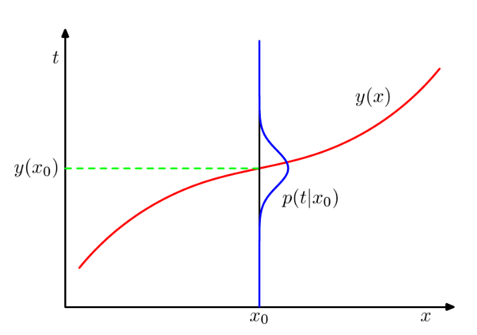
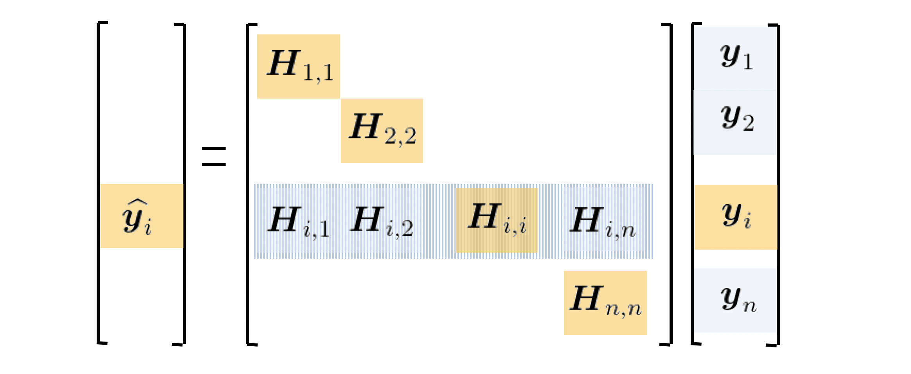

"A computer program is said to learn from experience E with respect to some class of tasks T and performance measure P, improves with experience E".

ML is a sub-field of AI where the knowledge comes from experience and induction. It is a bottom-up approach. It can extract information from data, not create information: if something is not observed, it cannot be generated.
It is used when:
- there is NO human expert (e.g. DNA analysis).
- humans can perform the task but cannot explain how to the machine (e.g. character recognition).
- desired function changes frequently (e.g. predicting stock prices based on recent training data).
- each user needs a customized function (e.g. email filtering).

Every ML algorithm has the following components:
- Representation (e.g. linear models, instance-based, Gaussian processes, SVM, model ensembles, ..).
- Evaluation (e.g. accuracy, precision and recall, SSE, likelihood, posterior probability, ..).
- Optimization (e.g. combinatorial as greedy search, convex as gradient descent or constrained as linear/quadratic programming).
# ML Models
## Supervised Learning
The goal is to estimate the unknown model that maps known inputs to known outputs. 
It is the largest, most mature, most widely used sub-field of ML. 
Input variables $x$ are also called features, predictors or attributes. Output variables $t$ are also called target, responses or labels. The nature of the output $t$ determine the type of problem:
- Classification: if $t$ is discrete.
- Regression: if $t$ is continuous.
- Probability estimation: if $t$ is the probability of $x$.

We want to approximate $f$ given the dataset $\mathcal{D}$. The steps are:
1. Define a loss function $L$, which is the objective function we want to minimize.
2. Choose some hypothesis space $\mathcal{H}$, a subspace of all possible functions.
3. Optimize to find an approximate model $h$.
A bigger hypothesis space will yield better performance on seen data, but it might perform poorly with unseen data. In general, having a smaller hypothesis space is better, as with a bigger one the optimal $f$ moves with the data, thus we are learning noise. 
## Unsupervised Learning
The goal is to learn a better (more efficient) representation of a set of unknown input data. 
## Reinforcement Learning
The goal is to learn the optimal policy, in order to automatize the decision making process. 
## Dichotomies in ML
- Parametric vs. Non parametric
	- Parametric: fixed and finite number of parameters.
	- Non parametric: the number of parameters depends on the training set.
- Frequentist vs. Bayesian
	- Frequentist: use probabilities to model the sampling process.
	- Bayesian: use provability to model uncertainty about estimate.
- Generative vs. Discriminative
	- Generative: learns the joint probability distribution $p(x, t)$.
	- Discriminative: learns the conditional probability distribution $p(t|x)$.
- Empirical Risk Minimization vs. Structural Risk Minimization
	- Empirical risk: error over the training set.
	- Structural risk: error over the training error with model complexity.

# Linear Models for Regression
## Linear Regression
The goal of regression is to learn a mapping from input $x$ to a continuous output $t$.

Many real processes can be approximated with linear models. A model is said to be linear if it is linear in the parameters (coefficients that multiplies $x$ or functions of $x$). Linear problems can be solved analytically. Augmented with kernels, it can model non-linear relationships.

A linear function in the parameters $w$ can be written as:
$$
y(x, w) = w_0 + \sum_{j=1}^{D-1} w_jx_j = w^T x
$$
where $w_0$ is the offset and $x = (1, x_1, .., x_{D-1})$.

To quantify how well or poorly we are doing on a task we define a loss function $L(t, y(x))$. The average expected loss is given by:
$$
\mathbb{E}[L] = \int\int L(t, y(x))p(x, t)dxdt
$$
where $p(x, t)$ is the joint probability of observing both $x$ and $t$.

A common choice for regression is the square loss function $L = (t - y(x))^2$. 
The optimal solution (if we assume a completely flexible function) is the conditional average:
$$
y(x) = \int t p(t|x)dt = \mathbb{E}[t|x]
$$

A simple generalization of the squared loss is the **Minkowski loss**:
$$
\mathbb{E}[L] = \int \int |t-y(x)|^q p(x, t)dxdt
$$
where the minimum of $\mathbb{E}[L]$ is given by:
- the conditional mean for $q=2$.
- the conditional median for $q=1$.
- the conditional mode for $q \rightarrow 0$.
### Basis Functions
To consider non-linear functions, we can use non-linear basis function:
$$
y(x, w) = w_0 + \sum_{j=1}^{M-1} w_j \phi_j (x) = w^T\phi(x)
$$
where $\phi(x) = (1, \phi_1(x), .., \phi_{M-1}(x))^T$ are called features (e.g. polynomial, Gaussian, sigmoidal, ..). 
In this way, we extend the class of models by considering linear combinations of fixed non-linear functions (basis functions) of the input variable.
### Approaches
The generative approach consists in:
1. Model the joint density: $p(x, t) = p(x|t)p(t)$.
2. Infer the conditional density: $p(t|x) = {p(x, t) \over p(x)}$.
3. Marginalize to find the conditional mean: $\mathbb{E}[t|x] = \int t p(t|x)dt$.
It is useful for augmenting data since it can generate new samples. 

In a discriminative approach we try to predict the target given the input. It consists in:
1. Model the conditional density: $p(t|x)$.
2. Marginalize to find the conditional mean: $\mathbb{E}[t|x] = \int tp(t|x)dt$.

A direct approach (which is not a statistical method) consists in finding a regression function $y(x)$ directly from the training data. 
## Minimizing Least Squares
Given a dataset with $N$ samples, we consider the following error (loss) function
$$
L(w) = {1 \over 2} \sum_{n=1}^N (y(x_n, w))^2
$$
which is (half) the **residual sum of squared errors** (**RSE**) a.k.a. **sum of squared errors** (**SSE**). It can also be written as the sum of the $l_2$-norm of the vector of residual errors:
$$
RSS(w) = ||\epsilon||^2_2 = \sum_{i=1}^N \epsilon^2_i
$$
### Ordinary Least Squares
Let's write RSS in matrix form with the dataset $\Phi = (\phi(x_1), ..., \phi(x_N))^T$, $t=(t_1, .., t_N)^T$ the vector of target variables and $w$ the vector of parameters.
$$
L(w) = {1\over2} RSS(w) = {1\over2} (t - \Phi w)^T (t - \Phi w)
$$
The goal is to find $w$ in order to minimize $L(w)$. To do so, we compute first and second derivative:
$$
{\partial L(w) \over \partial w} = -\Phi ^T (t-\Phi w)
$$
$$
{\partial^2 L(w) \over \partial w \partial w^T} = \Phi ^T \Phi
$$
Assuming $\Phi^T\Phi$ is non singular, then $\hat{w}_{OLS} = (\Phi^T\Phi)^{-1} \Phi^Tt$. 
The assumption is important, otherwise we cannot invert the matrix.
To clarify, $\Phi^T\Phi$ is singular when there are:
- more samples than features, so it is not possibile to solve the problem as we have infinite solutions. 
- redundant features, as some features are linear combinations of others.

OLS is a closed-form solution, which is not practical with big data. 
### Gradient Optimization
It is an algorithm with sequential (online) updates.
If the loss function can be expressed as a sum over samples $L(x) = \sum_n L(x_n)$, then we can write the following rules:
$$
w^{(k+1)} = w^k - \alpha^{(k)} \nabla L(x_n)  
$$
$$
w^{(k+1)} = w^{(k)} -\alpha^{(k)}({w^{(k)}}^T \phi(x_n) - t_n) \phi(x_n)
$$
where $k$ is the iteration and $\alpha$ is the learning rate. 
For convergence, the learning rate has to satisfy two boundaries:
$$
\sum_{k=0}^\infty a^{(k)} = + \infty
$$
$$
\sum_{k=0}^\infty a^{(k)^2} < + \infty
$$
Advantages: it is cheaper and since the problem is convex it will find the optimal solution.
#### Geometric interpretation
Let's assume that $t$ is an N-dimensional vector. 
Let's denote:
- $\varphi_j$ as the $j_{th}$ column of $\Phi$.
- $\hat{t}$ as the N-dimensional vector whose $n_{th}$ element is $y(x_n, w)$.
So, we can say that:
- $\hat{t}$ is a linear combination of $\varphi_1, .., \varphi_M$, which are the columns of $\Phi$.
- $\hat{t}$ lives in a M-subspace $\mathcal{S}$.
- since $\hat{t}$ minimizes SSE w.r.t. $t$, it represents the orthogonal projection of $t$ onto the subspace $\mathcal{S}$ $$
\hat{t} = \Phi \hat{w} = H t
$$where $H = \Phi (\Phi ^T \Phi)^{-1} \Phi ^T$ is called the hat matrix.

### Maximum Likelihood (ML)
It is a discriminative approach. 
The output variable $t$ can be modeled as a deterministic function $y$ of the input $x$ and random noise $\epsilon$: $t = f(x) + \epsilon$.
We want to approximate $f(x)$ with $y(x, w)$ assuming that $\epsilon \sim \mathcal{n}(0, \sigma^2)$ (white, Gaussian noise).

Given N samples, with inputs $X = \{x_1, ..., x_N\}$ and outputs $t = (t_1, ..., t_N)^T$, the likelihood function is:
$$
p(t|X, w, \sigma^2) = \prod_{n=1}^N \mathcal{N}(t_n|w^T \phi(x_n), \sigma^2)
$$
Assuming the samples to be independent and identically distributed (i.i.d.), we can consider the log-likelihood (by applying the log we do not change the position of the max):
$$
l(w) = \ln p(t|X, w, \sigma^2) = \sum_{n=1}^N \ln p(t_n|x_n, w, \sigma^2) = -{N \over 2} \ln (2\pi\sigma^2) - {1 \over 2\sigma^2} RSS(w) 
$$
To find the maximum likelihood, we compute the gradient and put it to zero:
$$
\nabla l(w) = \sum_{n=1}^N t_n \phi(x_n)^T - w^T (\sum_{n=1}^N \phi(x_n)\phi(x_n)^T) = 0 
$$
$$
w_{ML} = (\phi^T \phi)^{-1} \phi^T t
$$
The results is the same [[#Ordinary Least Squares|OLS]] we have computed before.
### Variance of parameters
Given a limited number of parameters, uncertainty arises. 
In general, we assume that:
- the observation $t_i$ are uncorrelated and have constant variance $\sigma^2$.
- the $x_i$ are fixed (non random).
The variance-covariance matrix of the least-squares estimates is:
$$
Var(\hat{w}_{OLS}) = (\Phi^T\Phi)^{-1} \sigma^2
$$
In fact, more samples lower the variance of the parameters. 
Usually, the variance $\sigma^2$ is estimated by $\hat{\sigma^2} = {1 \over N-M} \sum_{n=1}^N (t_n - \hat{w}^T \phi(x_n))^2$.

Assuming that the model is linear in the features $\phi_1(), ..., \phi_M()$ and that the noise is additive and Gaussian we can say that:
$$
\hat{w} \sim \mathcal{N}(w, (\phi^T\phi)^{-1}\sigma^2)
$$
$$
(N-M)\hat{\sigma^2} \sim \sigma^2 \chi_{N-M}^2
$$
such properties can be used to form test hypothesis and confidence intervals. 
#### Gauss-Markov theorem

> [!THEOREM] 
> The least square estimate (LSE) of $w$ has the smallest variance among all linear unbiased estimates. 

It follows that LSE has the lower MSE of all linear estimator with NO bias. However, there may exist a biased estimator with smaller MSE. So, introducing bias can be beneficial since it reduce the variance (bias-variance trade-off).
### Multiple outputs
In case of multiple outputs, we could use a different set of basis functions for each output, thus having independent regression problems.
Usually, a single set of basis functions is considered $\hat{W}_{ML} = (\Phi^T\Phi)^{-1} \Phi^T T$.
For each output $t_k$, which is a N-dimensional column vector, we have $\hat{w}_k = (\Phi^t\Phi)^{-1} \Phi^T t_k$.

The solution decouples between different outputs. The pseudo inverse $(\Phi^t\Phi)^{-1} \Phi^T$ needs to be computed only once. 
### Overfitting vs. Underfitting
We want to have a good generalization: this is the problem of model selection, which consist in identifying the proper hypothesis space. 
## Regularization
It is used to reduce the MSE by adding a penalty term to the loss function as follow:
$$
L(w) = L_D(w) + \lambda L_W(w)
$$
In this way, we prevent coefficient to reach large values. 
### Ridge
By taking $L_W(w) = {1 \over 2}w^Tw = {1 \over 2}||w||_2^2$ we get:
$$
L(w) = {1 \over 2} \sum_{i=1}^N (t_i - w^T \phi(x_i))^2 + {\lambda \over 2} ||w||_2^2
$$
It is called ridge regression or [[Artificial Neural Networks & Deep Learning#Weight decay limiting overfitting by weights regularization|weight decay]].
The loss function is still quadratic in $w$:
$$
\hat{w}_{ridge} = (\lambda I + \Phi^t\Phi)^{-1} \Phi^T t
$$
### Lasso
By taking $L_W(w) = {1 \over 2}\sum_{j=1}^M w_j = {1 \over 2}||w||_1$ we get:
$$
L(w) = {1 \over 2} \sum_{i=1}^N (t_i - w^T \phi(x_i))^2 + {\lambda \over 2} ||w||_1^2
$$
Differently from Ridge, Lasso is non-linear in $t_i$ and no closed form solution exists (it is a quadratic programming problem).
However, it has the advantage of making some weights equal to zero for values of $\lambda$ sufficiently large. In fact, it can be used for feature selection, by excluding the features which have coefficient equal to zero.
Lasso yields sparse models. 
## Bayesian Linear Regression
### Bayesian approach
- Formulate the knowledge about the world in a probabilistic way.
	- Define the model that expresses the knowledge quantitatively.
	- The model will have some unknown parameters.
	- Capture the assumptions about unknown parameters by specifying the prior distribution over those parameters before seeing the data.
- Observe the data.
- Compute posterior probability distribution for the parameters, given observed data.
- Use the posterior distribution to:
	- Make prediction by averaging over the posterior distribution.
	- Examine/Account for uncertainty in the parameter values.
	- Make decisions by minimizing expected posterior loss.

The posterior distribution can be obtained by combining the prior with the likelihood for the parameters, given the data (Bayes' rule):
$$
p(parameters|data) = {p(data|parameters)p(parameters) \over p(data)}
$$
$$
p(w|\mathcal{D}) = {p(\mathcal{D}|w)p(w) \over p(\mathcal{D})}
$$
where:
- $p(w|\mathcal{D})$ is the posterior probability of parameters given training data.
- $p(\mathcal{D}|w)$ is the probability (likelihood) of observing the training data given the parameters.
- $p(w)$ is the prior probability over the parameters.
- $p(\mathcal{D})$ is the marginal likelihood (normalizing constant): $p(\mathcal{D}) = \int p(\mathcal{D}|w)p(w)dw$.

In words: $posterior \propto likelihood \times prior$.
We are searching for the most probable value of $w$ given the data: maximum a posteriori (MAP) which is the mode of the posterior.
### BLR
Another approach to avoid overfitting is to use a Bayesian Linear Regression (BLR).
In the Bayesian approach the parameters of the model are considered as drawn from some distribution. 

Assuming Gaussian likelihood model, the conjugate prior is Gaussian too $p(w) = \mathcal{N}(w|w_0, S_0)$.
Given the data $\mathcal{D}$, the posterior is still Gaussian:
$$
p(w|t, \Phi, \sigma^2) \propto \mathcal{N}(w|w_0, S_0)\mathcal{N}(t|\Phi_w, \sigma^2 I_N) = \mathcal{N}(w|w_N, S_N)
$$
$$
w_N = S_n(S_0^{-1}w_0 + {\Phi^Tt \over \sigma^2})
$$
$$
S_N^{-1} = S_0^{-1} + {\Phi^T\Phi \over \sigma^2}
$$
For sequential data, the posterior acts as prior for the next iteration. 

In Gaussian distributions the mode coincides with the mean. It follows that $w_N$ is the MAP estimator. Moreover:
- If the prior has infinite variance, $w_N$ reduces to the ML estimator. 
- If $w_0 = 0$ and $S_0 = \tau^2I$, then $w_N$ reduces to the ridge estimate, where $\lambda = \sigma^2 / \tau^2$.

