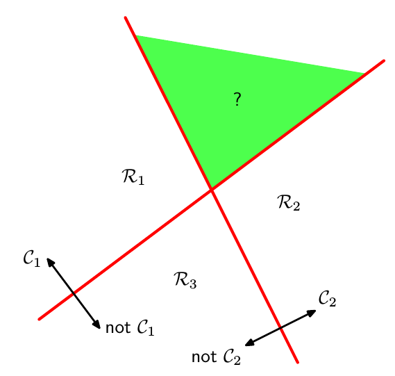
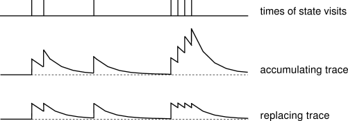

"A computer program is said to learn from experience E with respect to some class of tasks T and performance measure P, improves with experience E".

ML is a sub-field of AI where the knowledge comes from **experience** and **induction**. It is a **bottom-up approach**. It can extract information from data, not create information: if something is not observed, it cannot be generated.
It is used when:
- there is NO human expert (e.g. DNA analysis).
- humans can perform the task but cannot explain how to the machine (e.g. character recognition).
- desired function changes frequently (e.g. predicting stock prices based on recent training data).
- each user needs a customized function (e.g. email filtering).

Every ML algorithm has the following components:
- Representation (e.g. linear models, instance-based, Gaussian processes, SVM, model ensembles, ..).
- Evaluation (e.g. accuracy, precision and recall, SSE, likelihood, posterior probability, ..).
- Optimization (e.g. combinatorial as greedy search, convex as gradient descent or constrained as linear/quadratic programming).
# ML Models
## Supervised Learning
The goal is to estimate the **unknown model** that maps known inputs to known outputs. 
It is the largest, most mature, most widely used sub-field of ML. 
Input variables $x$ are also called **features**, predictors or attributes. Output variables $t$ are also called **target**, responses or labels. The nature of the output $t$ determine the type of problem:
- Classification: if $t$ is discrete.
- Regression: if $t$ is continuous.
- Probability estimation: if $t$ is the probability of $x$.

We want to approximate $f$ given the dataset $\mathcal{D}$. The steps are:
1. Define a loss function $L$, which is the objective function we want to minimize.
2. Choose some hypothesis space $\mathcal{H}$, a subspace of all possible functions.
3. Optimize to find an approximate model $h$.
A bigger hypothesis space will yield better performance on seen data, but it might perform poorly with unseen data. In general, having a smaller hypothesis space is better, as with a bigger one the optimal $f$ moves with the data, thus we are learning noise. 
## Unsupervised Learning
The goal is to learn a **better** (more efficient) **representation** of a set of unknown input data. 
## Reinforcement Learning
The goal is to learn the **optimal policy**, in order to automatize the **decision making process**. 
## Dichotomies in ML
- **Parametric** vs. **Non parametric**
	- Parametric: fixed and finite number of parameters. They require training to estimate those parameters. The complexity of the model is fixed regardless of the dataset size. 
	- Non parametric: the number of parameters depends on the training set (it requires storing the entire dataset and perform queries on it to make predictions so it might be memory demanding, but it is faster since it does not require training). The complexity of the model grows with the number of training samples.
- **Frequentist** vs. **Bayesian**
	- Frequentist: use probabilities to model the sampling process.
	- Bayesian: use probabilities to model uncertainty on the estimate.
- **Generative** vs. **Discriminative**
	- Generative: learns the joint probability distribution $p(x, t)$.
	- Discriminative: learns the conditional probability distribution $p(t|x)$.
- **Empirical Risk Minimization** vs. **Structural Risk Minimization**
	- Empirical risk: error over the training set.
	- Structural risk: error over the training error with model complexity.
# Linear Models for Regression
## Linear Regression
The goal of regression is to learn a mapping from input $x$ to a **continuous output** $t$.

A model is said to be linear if it is **linear in the parameters** (coefficients that multiplies $x$ or functions of $x$). Linear problems can be solved analytically. Augmented with kernels, it can model non-linear relationships.

A linear function in the parameters $w$ can be written as:
$$
y(x, w) = w_0 + \sum_{j=1}^{D-1} w_jx_j = w^T x
$$
where $w_0$ is the offset and $x = (1, x_1, .., x_{D-1})$.

To quantify how well or poorly we are doing on a task we define a loss function $L(t, y(x))$. The average expected loss is given by:
$$
\mathbb{E}[L] = \int\int L(t, y(x))p(x, t)dxdt
$$
where $p(x, t)$ is the joint probability of observing both $x$ and $t$.

A common choice for regression is the square loss function $L = (t - y(x))^2$. 
The optimal solution (if we assume a completely flexible function) is the conditional average:
$$
y(x) = \int t p(t|x)dt = \mathbb{E}[t|x]
$$

A simple generalization of the squared loss is the **Minkowski loss**:
$$
\mathbb{E}[L] = \int \int |t-y(x)|^q p(x, t)dxdt
$$
where the minimum of $\mathbb{E}[L]$ is given by:
- the conditional mean for $q=2$.
- the conditional median for $q=1$.
- the conditional mode for $q \rightarrow 0$.
### Basis Functions
To consider non-linear functions, we can use non-linear basis function:
$$
y(x, w) = w_0 + \sum_{j=1}^{M-1} w_j \phi_j (x) = w^T\phi(x)
$$
where $\phi(x) = (1, \phi_1(x), .., \phi_{M-1}(x))^T$ are called features (e.g. polynomial, Gaussian, sigmoidal, ..). 
In this way, we extend the class of models by considering linear combinations of fixed non-linear functions (basis functions) of the input variable.
### Approaches
A **direct** approach (which is not a statistical method) consists in finding a regression function $y(x)$ **directly from the training data**. 
It is computationally efficient, but it has no probabilistic interpretation and lacks flexibility.

The **generative** approach consists in:
1. Model the **joint probability distribution**: $p(x, t) = p(x|t)p(t)$.
2. Infer the conditional density (using Bayes theorem): $p(t|x) = {p(x, t) \over p(x)}$.
3. Marginalize to find the conditional mean: $\mathbb{E}[t|x] = \int t p(t|x)dt$.
It is useful for augmenting data since it can generate new samples, so it is robust to missing data. However, the assumptions about data distribution (point 1.) might be unrealistic. 

In a **discriminative** approach we try to predict the target given the input. It consists in:
1. Model the **conditional probability distribution**: $p(t|x)$.
2. Marginalize to find the conditional mean: $\mathbb{E}[t|x] = \int tp(t|x)dt$.
It finds decision boundaries that best classify $y$ given $X$, without modeling the distribution of $X$.
Typically achieves better classification accuracy than generative models.
## Minimizing Least Squares
Given a dataset with $N$ samples, we consider the following error (loss) function
$$
L(w) = {1 \over 2} \sum_{n=1}^N (y(x_n, w))^2
$$
which is (half) the **residual sum of squared errors** (**RSE**) a.k.a. **sum of squared errors** (**SSE**). It can also be written as the sum of the L$_2$-norm of the vector of residual errors:
$$
RSS(w) = ||\epsilon||^2_2 = \sum_{i=1}^N \epsilon^2_i
$$
### Ordinary Least Squares
Let's write RSS in matrix form, to do so we need:
- $\Phi = (\phi(x_1), ..., \phi(x_N))^T$, as the $N \times d$ **design matrix** (each row is $x_n^T$).
- $t=(t_1, .., t_N)^T$ as the $N \times 1$ vector of target values.
- $w=(w_1, .., w_N)^T$ as the $d \times 1$ vector of parameters (one for each feature).
Then:
$$
L(w) = \frac{1}{2} RSS(w) = \frac{1}{2}(t - \Phi w)^T (t - \Phi w)
$$
Note that $||t- \Phi w||^2 = (t - \Phi w)^T (t - \Phi w)$, one term is transposed otherwise we cannot make the matrix multiplication. 
Moreover, the factor $1 \over 2$ is used to remove the factor $2$ that will come out the derivative.
The goal is to find $w$ in order to minimize $L(w)$. 
To do so, we compute first and second derivative:
$$
L(w) = \frac{1}{2}[t^Tt -2t^T\Phi w + w^T\Phi^T \Phi w]
$$
$$
\frac{\partial L(w)}{\partial w} = \frac{1}{2}[\overbrace{\frac{\partial }{\partial w}t^Tt}^{A} - \overbrace{\frac{\partial}{\partial w} 2t^T \Phi w}^{\text{B}} + \overbrace{\frac{\partial}{\partial w} w^T \Phi^T \Phi w}^{\text{C}}]
$$
where:
- A does not depend on $w$, therefore its contribute is 0.
- B can be solved taking into account that $-2t^T \Phi = a^T$ is a constant vector, therefore ${\partial \over \partial w} a^T w = a$, so $\text{B} = -2\Phi^T t$.
- C can be solved taking into account that $w^t \Phi^t \Phi w = a$ is a symmetric matrix by construction, therefore ${\partial \over \partial w} w^t a w = 2aw$ if $a$ is symmetric, so $\text{C} = 2 \Phi^T \Phi w$.
Putting all together:
$$
\frac{\partial L(w)} {\partial w} = -\Phi^T t + \Phi^T \Phi w
$$
Assuming **$\Phi^T\Phi$ is non singular**, then the minimum is reached for:  $$
\hat{w}_{OLS} = (\Phi^T\Phi)^{-1} \Phi^Tt
$$The assumption is important, otherwise we cannot invert the matrix.
To clarify, $\Phi^T\Phi$ is singular if:
- we have **more features ($d$) than samples ($N$)**: then $\Phi^T \Phi$ is singular because the design matrix $\Phi$ has **more columns than** rows, making it **rank deficient**.
- if **features are linearly dependent** (redundant features): then $\Phi^T \Phi$ is singular because some columns of $\Phi$ are linear combination of others. 

OLS is a closed-form solution (direct approach). 
It is efficient only when $d$ is small since the **matrix inversion** is $O(d^3)$. 
For big data (large $d$), iterative approaches like gradient descent or stochastic gradient descent are preferred. 

> [!TIP] A bad-conditioned (or ill-conditioned) matrix
> A matrix is said to be bad-conditioned when its condition number is large:
> $$
> cond(A) = {\sigma_{max} \over \sigma_{min}}
> $$
> where $\sigma_{max}$ and $\sigma_{min}$ are the largest and smallest singular values of matrix A. Moreover, if $\sigma_{min}$ is close to 0, then $cond(A)$ becomes large.
> 
> A large condition number means that small changes in input can lead to large changes in output (unstable learner). 
> In this case, the matrix $\Phi^T \Phi$ is nearly singular (not invertible or almost not), so computing the inverse is numerically unstable. This happens especially when:
> - some features are highly correlated (multicollinearity).
> - there are redundant or nearly redundant features.
> - there are more features than datapoints (so $\Phi^T \Phi$ is rank deficient).
#### Geometric interpretation of Linear Regression
Given a dataset where $t \in \mathbb{R}^N$ is the target vector, $\Phi \in \mathbb{R}^{N \times M}$ is the design matrix with basis function/features as columns $\{\varphi_1, \dots, \varphi_M\}$. 
A linear regression model aim to find:
$$
\hat{w} = arg \min_w \|t - \Phi w\|^2
$$

Each $\varphi_j$ ($j_{th}$ column of $\Phi$),  is a "direction" that the model is allowed to combine to approximate $t$.
The set $\{\varphi_1, .., \varphi_M\}$ span a subspace $\mathcal{S} \subseteq \mathbb{R}^N$ of dimension at most $M$.

Since $\hat{t}$ minimizes SSE w.r.t. $t$, it represents the **orthogonal projection of $t$ onto the subspace $\mathcal{S}$**. 
$\hat{t}$ is a linear combination of $\{\varphi_1, .., \varphi_M\}$, so it "lives" in a M-subspace $\mathcal{S}$: $$ \hat{t} = \Phi \hat{w} = Ht $$where $H = \Phi (\Phi ^T \Phi)^{-1} \Phi ^T$ is called the **hat matrix** (because it transform $t$ into $\hat{t}$, so it "puts a hat on $t$"). The hat matrix is symmetric ($H=H^T$) and idempotent ($H^2 = H$).

- Linear regression can be interpreted geometrically as projecting the target vector onto the subspace of the feature matrix.
- The solution $\hat{w}$ gives us the projection $\hat{t} = \Phi \hat{w}$, which is the closest approximation to $t$ within the subspace. 
### Gradient Optimization
It is an algorithm with sequential (**online**) updates.
If the loss function can be expressed as a sum over samples $L(x) = \sum_n L(x_n)$, then we can write the following rules:
$$
w^{(k+1)} = w^k - \alpha^{(k)} \nabla L(x_n)  
$$
$$
w^{(k+1)} = w^{(k)} -\alpha^{(k)}({w^{(k)}}^T \phi(x_n) - t_n) \phi(x_n)
$$
where $k$ is the iteration and $\alpha$ is the learning rate. 
For convergence, the learning rate has to satisfy two boundaries:
$$
\sum_{k=0}^\infty a^{(k)} = + \infty
$$
$$
\sum_{k=0}^\infty a^{(k)^2} < + \infty
$$
Advantages: it is cheaper and since the problem is convex it will find the optimal solution. 

### Maximum Likelihood Estimation (MLE)
It is a discriminative approach. 
The output variable $t$ can be modeled as a deterministic function $y$ of the input $x$ and random noise $\epsilon$: $t = f(x) + \epsilon$.
We want to approximate $f(x)$ with $y(x, w)$ assuming that $\epsilon \sim \mathcal{n}(0, \sigma^2)$ (**white Gaussian noise**). This **assumption** is important since it gives us a **closed form solution** for MLE. 

Given N samples, with inputs $X = \{x_1, ..., x_N\}$ and outputs $t = (t_1, ..., t_N)^T$, the likelihood function is:
$$
p(t|X, w, \sigma^2) = \prod_{n=1}^N \mathcal{N}(t_n|w^T \phi(x_n), \sigma^2)
$$
Assuming the samples to be independent and identically distributed (i.i.d.), we can consider the **log-likelihood** (by applying the log we do not change the position of the max):
$$
l(w) = \ln p(t|X, w, \sigma^2) = \sum_{n=1}^N \ln p(t_n|x_n, w, \sigma^2) = -{N \over 2} \ln (2\pi\sigma^2) - {1 \over 2\sigma^2} RSS(w) 
$$
To find the maximum likelihood, we compute the gradient and put it to zero:
$$
\nabla l(w) = \sum_{n=1}^N t_n \phi(x_n)^T - w^T (\sum_{n=1}^N \phi(x_n)\phi(x_n)^T) = 0 
$$
$$
w_{MLE} = (\phi^T \phi)^{-1} \phi^T t
$$
The results is the same as [[#Ordinary Least Squares|OLS]].
### Variance of parameters: statistical tests on coefficients
Given a limited number of parameters, uncertainty arises. 
In general, we assume that:
- the observation $t_i$ are uncorrelated and have constant variance $\sigma^2$.
- the $x_i$ are fixed (non random).
The variance-covariance matrix of the least-squares estimates is:
$$
Var(\hat{w}_{OLS}) = (\Phi^T\Phi)^{-1} \sigma^2
$$
In fact, more samples lower the variance of the parameters. 
Usually, the variance $\sigma^2$ is estimated by $\hat{\sigma^2} = {1 \over N-M} \sum_{n=1}^N (t_n - \hat{w}^T \phi(x_n))^2$.

Assuming that the model is linear in the features $\varphi_1(), ..., \varphi_M()$ and that the noise is additive and Gaussian we can say that:
$$
\hat{w} \sim \mathcal{N}(w, (\Phi^T\Phi)^{-1}\sigma^2)
$$
$$
(N-M)\hat{\sigma^2} \sim \sigma^2 \chi_{N-M}^2
$$
This allow us to formulate some statistical tests.
#### Single coefficient significance (t-test)
Given the following hypothesis test: 
$$ H_0: w_j = 0 \qquad \text{ vs. } \qquad H_1: w_j \neq 0 $$
it determines if the single coefficient is relevant or not: $$ t_{stat} = \frac{\hat{w}_j - w_j}{\hat{\sigma} \sqrt{v_j}} \sim t_{N - M - 1} $$where $t_{N - M - 1}$ is the T-Student distribution with $N-M-1$ degrees of freedom.
We do not reject the null hypothesis (reject the coefficient) if we have:
$$
|t_{stat}| \le z_{1-\alpha / 2}
$$
where $z_{\sigma}$ is the quantile of order $\sigma$ of the normal distribution. 
#### Overall significance of the model (F-statistic):
It considers the following hypothesis test:
$$
\begin{align}
& H_0: w_1 = \dots = w_M = 0 \ \ \ \ \ \ \text{none of the predictors are useful}\\
& H_1: \exists w_j \neq 0 \ \ \ \ \ \text{at least one predictor is useful}
\end{align}
$$
In other words, under $H_0$​ the model does not explain more variability than would be explained by the mean alone.
The F-statistic can be computed (is distributed) as follows:
$$

F = \frac{N-M-1}{M }\frac{TSS - RSS}{RSS} \sim F_{M, N-M-1}

$$
where $N$ is the total number of observations, $M$ is the total number of predictor, and $F_{M, N-M-1}$ is the Fisher-Snedecor distribution.

Both these statistics are interpreted via the **p-value**, that is the probability of obtaining a statistic as extreme as (or more extreme than) the observed value, under the null hypothesis ($H_0$).
- If the p-value is small (e.g., < 0.05), reject $H_0$ → the predictor/model is significant.
- If the p-value is large, the predictor/model is likely not significant.
### Least Square Estimate

> [!THEOREM] Gauss-Markov theorem
> The least square estimate (LSE) of $w$ has the smallest variance among all linear unbiased estimates. 

It follows that LSE has the lower MSE of all linear estimator with NO bias. 
However, there may exist a biased estimator with smaller MSE. So, introducing bias can be beneficial since it reduce the variance (bias-variance trade-off).
### Multiple outputs
In case of multiple outputs, we could use a different set of basis functions for each output, thus having **independent regression problems**.
Usually, a single set of basis functions is considered $\hat{w}_{MLE} = (\Phi^T\Phi)^{-1} \Phi^T t$.
For each output $t_k$, which is a N-dimensional column vector, we have $\hat{w}_k = (\Phi^t\Phi)^{-1} \Phi^T t_k$.

The solution decouples between different outputs. 
The pseudo inverse $(\Phi^t\Phi)^{-1} \Phi^T$ needs to be computed only once. 
### Regularization
It is used to reduce the MSE by adding a **penalty term** to the loss function as follow:
$$
L(w) = L_D(w) + \lambda L_W(w)
$$
In this way, we prevent coefficient to reach large values. 
#### Ridge
It uses the L2 regularization $\|w\|_2^2 = \sum_{i=0}^N w_i ^2$ which is smooth and differentiable everywhere. 
$$
L(w) = {1 \over 2} \sum_{i=1}^N (t_i - w^T \phi(x_i))^2 + {\lambda \over 2} ||w||_2^2
$$
It is also called [[Artificial Neural Networks & Deep Learning#Weight decay limiting overfitting by weights regularization|weight decay]].
It helps by distributing weights among correlated features, reducing variance but keeping all features.
Since it is linear in $t$, then it exist a closed form solution:
$$
\hat{w}_{ridge} = (\lambda I + \Phi^t\Phi)^{-1} \Phi^T t
$$
Note that the matrix $\Phi^T \Phi + \lambda I$ is definite positive, so its eigenvalues must be greater than $\lambda$. Moreover, $\lambda I$ adds a small positive value to the diagonal improving the matrix conditioning, as well as numerical stability.
#### Lasso
It uses the L1 regularization $\|w\|_1 = \sum_{i=0}^N |w_i|$ which introduces a non-differentiability at $w_i=0$.
$$
L(w) = {1 \over 2} \sum_{i=1}^N (t_i - w^T \phi(x_i))^2 + {\lambda \over 2} ||w||_1
$$
Differently from Ridge, Lasso is non-linear in $t_i$ and no closed form solution exists (it is a quadratic programming problem).
However, it has the advantage of making some weights equal to zero for values of $\lambda$ sufficiently large. In fact, it can be used for feature selection, by excluding the features which have coefficient equal to zero.
Lasso yields sparse models. 

|           | What it does in practice                                                                                                                                            | When to use and why                                                                                          | Penalty term                                                                     |
| --------- | ------------------------------------------------------------------------------------------------------------------------------------------------------------------- | ------------------------------------------------------------------------------------------------------------ | -------------------------------------------------------------------------------- |
| **Ridge** | It **helps by distributing weights among correlated features**, reducing variance but keeping all features.                                                         | When we have **highly correlated features** and want to **keep all of them** while controlling their impact. | Adds a penalty term proportional to the **square of the coefficients**.          |
| **Lasso** | It **tends to arbitrarily drop one of the correlated features** because of its sparsity effect. This can be problematic if both variables carry useful information. | When we want to **perform automatic feature selection** and eliminate unnecessary variables.                 | Adds a penalty term proportional to the **absolute values of the coefficients**. |

## Bayesian Linear Regression
### Bayesian approach
- Formulate the knowledge about the world in a probabilistic way.
	- Define the model that expresses the knowledge quantitatively.
	- The model will have some unknown parameters.
	- Capture the assumptions about unknown parameters by specifying the prior distribution over those parameters before seeing the data.
- Observe the data.
- Compute posterior probability distribution for the parameters, given observed data.
- Use the posterior distribution to:
	- Make prediction by averaging over the posterior distribution.
	- Examine/Account for uncertainty in the parameter values.
	- Make decisions by minimizing expected posterior loss.

The posterior distribution can be obtained by combining the prior with the likelihood for the parameters, given the data (Bayes' rule):
$$
p(parameters|data) = {p(data|parameters)p(parameters) \over p(data)}
$$
$$
p(w|\mathcal{D}) = {p(\mathcal{D}|w)p(w) \over p(\mathcal{D})}
$$
where:
- $p(w|\mathcal{D})$ is the posterior probability of parameters given training data.
- $p(\mathcal{D}|w)$ is the probability (likelihood) of observing the training data given the parameters.
- $p(w)$ is the prior probability over the parameters.
- $p(\mathcal{D})$ is the marginal likelihood (normalizing constant): $p(\mathcal{D}) = \int p(\mathcal{D}|w)p(w)dw$.

In words: $posterior \propto likelihood \times prior$.
We are searching for the most probable value of $w$ given the data: **maximum a posteriori** (MAP) which is the **mode of the posterior**.
### Bayesian Linear Regression (BLR)
Another approach to avoid overfitting is to use a Bayesian Linear Regression (BLR) since it introduces a prior over the weights which encourages them to be small (unless the data strongly supports otherwise).

We assume a **Gaussian likelihood** for the observed targets $t \in \mathbb{R}^N$: 
$$
p(t | w, \Phi, \sigma^2) = \mathcal{N}(t|\Phi w , \sigma^2 I_N)
$$

The conjugate **prior** is **Gaussian** too $p(w) = \mathcal{N}(w|w_0, S_0)$. This **implicitly regularize** the weights.

Given the data $\mathcal{D}$, the posterior is also Gaussian:
$$
p(w|t, \Phi, \sigma^2) \propto \underbrace{\mathcal{N}(w|w_0, S_0)}_{\text{prior}} \cdot \underbrace{\mathcal{N}(t|\Phi w, \sigma^2 I_N)}_{likelihood} = \mathcal{N}(w|w_N, S_N)
$$
with:
$$
w_N = S_N(S_0^{-1}w_0 + {\Phi^Tt \over \sigma^2})
$$
$$
S_N^{-1} = S_0^{-1} + {\Phi^T\Phi \over \sigma^2}
$$
In Gaussian distributions the mode coincides with the mean so it follows that $w_N$ is the **MAP estimator**. Moreover:
- If the prior has infinite variance, $w_N$ reduces to the MLE. 
- If $w_0 = 0$ and $S_0 = \tau^2I$, then $w_N$ reduces to the [[Machine Learning#Ridge|ridge estimate]], where $\lambda = \sigma^2 / \tau^2$.

Note that in training a BLR we must invert $S_N$ which requires $O(M^3)$ with $M$ number of features. 

In online learning, the posterior acts as prior for the next iteration. 

We are interested in the **posterior predictive distribution**, which is obtained by marginalizing over the posterior of $w$:
$$
	p(t|x, \mathcal{D}, \sigma^2) = \int \mathcal{N}(t|w^T \phi(x), \sigma^2)\mathcal{N}(w | w_N, S_N) dw = \mathcal{N}(t|w_N^T\phi(x), \sigma^2_N(x))
$$
where:
$$
\sigma^2_N = \underbrace{\sigma^2}_{\text{noise in the} \atop \text{ target values}} + \underbrace{\phi(x)^T S_N\phi(x)}_{\text{uncertainty associated} \atop \text{with parameter values}}
$$
- In the limit, as $N \rightarrow \infty$, the second term goes to zero.
- The variance of the predictive distribution arises only from the additive noise governed by parameter $\sigma$.
#### Modeling challenges
A central challenge in Bayesian modeling is specifying a suitable **model**, which should be flexible enough to admit all plausible outcomes and a suitable **prior distribution**, which must avoid giving zero or very small probabilities to possible events, but should also avoid spreading out the probability over all possibilities.

To avoid uninformative priors, we may need to model dependencies between parameters. One strategy is to introduce **latent variables** (which capture hidden structure in the data) and **hyperparameters** into the prior. 
Both of these represents the ways of modeling dependencies in a interpretable way. 
#### Computational challenges
The other big challenge is computing the posterior distr\sibution. 
There are several approaches:
- **Analytical integration**: if we use conjugate priors, the posterior distribution can be computed analytically. It only works for simple models. 
- **Gaussian (Laplace) approximation**: approximate the posterior distribution with a Gaussian. It works well when there are lot of data compared to the model complexity.
- **Monte Carlo integration**: once we have a sample from the posterior distribution, we can simulate a Markov chain that converges to the posterior distribution (Markov Chain Monte Carlo, MCMC).
- **Variational approximation**: frame inference as an optimization problem, usually faster than MCMC, but it is less general.

In summary:
- Advantages:
	- Closed-form solution of the posterior.
	- Tractable Bayesian treatment.
	- It can model arbitrary non-linearity with the proper basis functions.
- Disadvantages:
	- Basis functions are chosen manually, independent of the training set. 
	- Still subject to the **curse of dimensionality**: high-dimensional input spaces require exponentially more data to model accurately.

| Method                              | Category            |
| ----------------------------------- | ------------------- |
| Ordinary Least Squares (OLS)        | Direct approach     |
| Gradient-based optimization         | Direct approach     |
| Maximum Likelihood Estimation (MLE) | Generative approach |
| Bayesian Linear Regression          | Generative approach |
# Linear Classification
## Classification Problem
The goal of classification is to assign an input $x$ into of of $K$ discrete classes $C_k$, where $k = 1, .., K$. 

In linear classification, the input space is divided into decision regions whose boundaries are called **decision boundaries** or decision surfaces. 
In classification, we need to predict discrete class labels, or posterior probabilities that lie in the range of $(0, 1)$, so we use a nonlinear function. 
$$
y(x, w) = g(x^Tw + w_0)
$$
It is a **generalized linear model**, which is **not linear in $x$**:
- it will give us **decision boundaries linear in $x$** which corresponds to $y(x, w) = \text{constant}$.
- but the function $y(x, w)$ is NOT linear in $x$ because of the non-linear function $g$.
They have more complex analytical and computational properties than regression. As in regression, we can consider fixed nonlinear basis functions to transform the input space while maintaining a linear relationship in the new space. 

- In two class problems, we have a binary target value $t \in \{0, 1\}$, such that $t=1$ is the positive class and $t=0$ is the negative class. 
  We can interpret the value of t as the probability of the positive class. 
  The output of the model can be represented as the probability that the model assigns to the positive class. 
- If there are $K$ classes, we can use a 1-of-$K$ encoding scheme.
  $t$ is a vector of length $K$ and contains a single 1 for the correct class and 0 elsewhere. $t$ is the vector of class probabilities. 

We can use three approaches to classification:
- **Discriminant functions approach**: build a function that directly maps each input to a specific class (e.g. LS, [[Machine Learning#Artificial Neural Networks & Deep Learning Perceptron Learning Algorithm The Perceptron Algorithm|perceptron algorithm]], [[Machine Learning#K-nearest neighbors|k-nearest neighbors]]). 
- **Probabilistic approach**: model the conditional probability distribution $p(C_k|x)$ and use it to make optimal decisions. There are two alternatives:
	- **Probabilistic discriminative approach**: model $p(C_k|x)$ directly using parametric models (e.g. [[Machine Learning#Logistic Regression|logistic regression]]).
	- **Probabilistic generative approach**: model class conditional densities $p(x|C_k)$ together with prior probabilities $p(C_k)$ for the classes, then infer the posterior $p(x|C_k)$ using Bayes' rule (e.g. [[Machine Learning#|naive Bayes]]). 
## Discriminant function approach
### Two classes
Given $y(x) = x^Tw + w_0$, the decision boundaries can be found with $y(x) = 0$. We assign $x$ to $C_1$ if $y(x) \ge 0$, to $C_2$ otherwise. 
Moreover, given two points on the decision surface $x_A, x_B$ we can say that $y(x_A) = y(x_B) = 0$ and $w^T(x_A - x_B) = 0$: since the scalar product is null (perpendicular vectors) it means that $w$ is orthogonal to the decision surface. 
If $x$ is on the decision surface, then $w^Tx / ||w||_2 = - w_0 / ||w||_2$ which means that $w_0$ determines the location of the decision surface (translation w.r.t. the origin).  

### Multiple classes
Consider the extension to $K>2$ classes. We can adapt the previous solution in two ways:
- One-versus-the-rest: $K-1$ classifiers, each of which solves a two class problem. The idea is to separate points in class $C_k$ from points not in that class. However, there are regions in input space that are ambiguously classified. 
- One-versus-one: $K(K-1)/2$ binary discriminant functions. However, ambiguity arises. 
A simple solution is to use $K$ linear discriminant functions of the form: 
$$
y_k(x) = x^Tw_k + w_{k0}
$$
where $k = 1, ..., K$.
The idea is to assign $x$ to class $C_k$, if $y_k(x)>y_j(x)$ $\forall j \neq i$. 
The result decision boundaries are **singly connected** and **convex** (any straight line between two points inside the region lie inside that region). In fact, for any two points $x_A, x_B$ that lie inside the region $\mathcal{R}_k$, so $y_k(x_A) > y_j(x_B)$ and $y_k(x_B) > y_j(x_B)$, taken any positive $\alpha$ we can say
$$
y_k(\alpha x_A + (1 - \alpha)x_B) > y_j(\alpha x_A + (1 - \alpha)x_B)
$$
due to linearity of the discriminant functions. 

### Least Squares for Classification
Least squares approximates the conditional expectation $\mathbb{E}[t|x]$.
Consider a general classification problem with $K$ classes using **1-of-$K$ encoding scheme for the target vector $t$**. Each class is described by its own linear model:
$$
y_k(x) = w_k^Tx + w_{k0}
$$
where $k = 1, .., K$. 
Using vector notation $y(x) = \tilde{W}^T\tilde{x}$ where:
- $\tilde{W}$ is a $D \times K$ matrix whose $k_{th}$ column is $\tilde{w}_k = (w_{k0}, w_{k}^T)^T$.
- $\tilde{x} = (1, x^T)^T$.

Given a dataset $\mathcal{D} = \{x_i, t_i\}$, $i = 1, .., N$. 
We have already seen how to minimize [[Machine Learning#Minimizing Least Squares|least squares]] $\tilde{W} = (\tilde{X}^T\tilde{X})^{-1}\tilde{X}^T T$ where:
- $\tilde{X}$ is an $N \times D$ matrix whose $i_{th}$ row is $\tilde{x}_i^T$.
- T is an $N \times D$ matrix whose $i_{th}$ row is $t_i^T$.
A new input is assigned to a class for which $t_k = \tilde{x}^T\tilde{w}_k$ is the largest. 

However, some problems arises in using least squares:
- it is highly **sensitive to outliers**, unlike logistic regression. 
- it does not works well with non-Gaussian distribution since LS is derived as the [[#Maximum Likelihood Estimation (MLE)|MLE]] under the **assumption of Gaussian noise**. LS regression assumes that the errors are normally (Gaussian) distributed around the predicted values. This assumption is **valid for continuous targets but not for binary targets**. This is the reason why LS fails in classification. 

So far, we have considered classification models that work directly in the input space. 
All considered algorithms are equally applicable if we first make a fixed non-linear transformation of the input space using vector of basis functions $\phi(x)$.
Decision boundaries will appear linear in the feature space, but would correspond to nonlinear boundaries in the original input space. 
Classes that are linearly separable in the feature space may not be linearly separable in the original input space. 

### [[Artificial Neural Networks & Deep Learning#Perceptron Learning Algorithm|The Perceptron Algorithm]]
The [[Artificial Neural Networks & Deep Learning#The perceptron|perceptron]] is an example of linear discriminant model. It is an online linear classification algorithm. 
It corresponds to a two-class model:
$$
y(x) = f(w^T\phi(x))
$$
$$
f(a) = 
\begin{cases}
	+1 \ \ \ \text{if} \ a \ge 0\\
	-1 \ \ \ \text{otherwise}
\end{cases}
$$

The algorithm finds the **separating hyperplane** by **minimizing the distance of misclassified points to the decision boundary**.
Using the number of misclassified point as loss function is not effective since it is a piece wise constant function (we cannot optimize it using gradient). 

We are seeking a vector $w$ such that $w^T \phi(x_n) > 0$ when $x_n \in \mathcal{C}_1$ and $w^T \phi(x_n) < 0$ otherwise.
The perceptron criterion assigns **zero error to correct classification** and $w^T \phi(x_n)t_n$ (non zero error) to misclassified patterns $x_n$: in this way the error is proportional to the distance to the decision boundary. 
The loss to be minimized is the distance of misclassified points in $\{(x_n, t_n)\}_{n=1}^N$ with $t_n \in \{-1, 1\}$:
$$
L_P(w) = - \sum_{n \in \mathcal{M}} w^T \phi(x_n)t_n
$$
where $\mathcal{M} = \{n \in \{1,..,N\}:t_n\neq y(x_n)\}$. 
It is also called the **perceptron loss** or Hinge loss without margin.
Note that $w^T \phi(x_n)t_n$ is always negative, since it is a missclassification, so we adjust the sign by putting a minus before the summary. 
The perceptron update rule is similar to a [[Machine Learning#Gradient Optimization|SDG]] step, but it does not minimize a continuous loss function. Instead, it updates weights whenever a **missclassification** occurs (**online**):
$$
w^{(k+1)} = w^{(k)} - \alpha \nabla L_P(w) = w^{(k)} + \alpha \phi(x_n)t_n
$$
Since the perceptron function does not change if $w$ is multiplied by a positive constant (this because it only cares about the sign of $w^T\phi(x_n)$, not its magnitude), the **learning rate** $\alpha$ can be set to an **arbitrary** value (except for 0, generally it is set to 1). The learning rate only scales the weight updates but does not affect the number of iterations needed for convergence. 
The perceptron updates are **step-based corrections** rather than gradient-based optimizations. 

The effect of a single update is to reduce the error due to misclassified pattern. However, this **does not imply that the loss is reduced at each stage**.  
The **loss is reduced** only at **sample level** (on the sample currently misclassified).
Let's take the loss formulation for a single point: 
$$
L_{p_n} = - w^T x_n t_n
$$
Therefore, we can prove that $L_{p_n}' < L_{p_n}$:
$$
\begin{align}
L_{p_n} = - w^T x_n t_n < w^{'\ T} x_n t_n &= (w + \alpha x_nt_n)^T x_n t_n \\
&= w^T x_n t_n + \alpha x_n x_n^T t_n t_n^T \\
&= L_{p_n} + \alpha \|x_n\|_2 \|t_n\|_2 \\
&= L_{p_n} + \alpha \|x_n\|_2
\end{align}
$$
since $t_n \in [-1, 1]$ therefore its L2-norm is 1. 

> [!THEOREM] Perceptron Convergence theorem
> If the training data set is linearly separable in the feature space $\Phi$, then the perceptron learning algorithm is guaranteed to find an exact solution in a finite number of steps. 

- The number of steps before convergence may be substantial. There is no bound on this number, so it has no practical use. 
- We are not able to distinguish between non separable problems and slowly converging ones. 
- If multiple solutions exists, the one found **depends on the parameters initialization** and the **order of data points presentation**. 
- It can be employed for K multi-class classification by training K one-versus-the-rest classifiers. 
### K-nearest neighbors
The idea is to look at the nearby points to predict the target of a new point. It can be used for both regression and classification:
Given a test sample $x$:
1. **Compute Distance**: Calculate the distance between $x$ and all training samples using a distance metric (e.g., Euclidean, Manhattan, or cosine similarity).
2. **Find Nearest Neighbors**: Identify the $k$ closest training samples.
3. **Predict Output**:    
    - **For classification**: Assign the most frequent class label among the $k$ neighbors (**majority voting**).
    - **For regression**: Take the **average** (or weighted average) of the neighbor values.

The number of neighbors $k$ is an hyperparameter that must be chosen accordingly: a small $k$ make the algorithm sensitive to noise, while a large $k$ lead to smooth decision boundary. it can be set using [[Machine Learning#Validation approach|cross validation]].
It can be used as a **regularization hyperparameter**: the larger the value of $k$, the more the model is regularized: a smaller $k$ is going to give a more complex model, which is associated with smaller bias and higher variance (likely overfitting the training data).

The choice of metric affects the performance, depending on the data distribution. 

It is computationally **expensive for large datasets**, sensitive to irrelevant or redundant features and the performance depends on a good choice of $k$. 

KNN naturally supports multi-class classification using **majority voting** among neighbors. - In case of ties, a **tie-breaking rule** is needed (e.g., prioritize the closest neighbor or use weighted voting).
## Probabilistic Discriminative Models
### Logistic Regression
#### Binary problem
Consider a two-class classification problem. The posterior probability of class a sample to be classified in $\mathcal{C}_1$ can be written as a logistic sigmoid function:
$$
p(\mathcal{C_1}|\phi) = { 1 \over 1 + \exp(-w^T \phi)} = \sigma(w^T \phi)
$$
where (for brevity) $\phi = \phi(x)$ is the transformed input vector and $p(\mathcal{C}_2|\phi) = 1 - p(\mathcal{C}_1 | \phi)$.
The bias term is omitted for clarity.
This model is known as logistic regression. Differently from generative models, here we model $p(\mathcal{C}_k | \phi)$ directly. 

Given a dataset $\mathcal{D} = \{x_n, t_n\}$ with $n = 1, .., N$ and $t_n \in \{0, 1\}$ (binary classification problem).
We want to maximize the probability of getting the right label (**maximum likelihood**):
$$
p(t|\phi(x), w) = \prod_{n=1}^N y_n^{t_n}(1 - y_n)^{1-t_n}
$$
where $y_n = \sigma (w^T \phi(x))$ is the logistic prediction. 
We define the loss function by taking the **negative log** of the **likelihood**:
$$
L(w) = -\ln p(t|\phi(x), w) = - \sum_{n=1}^N (t_n \ln y_n + (1-t_n)\ln(1-y_n)) = \sum_{n=1}^N L_n
$$
Then, to minimize it, we differentiate by applying the chain rule on $L_n$:
$$
\frac{\partial L_n}{\partial y_n} = -\frac{t_n}{y_n} +(1-t_n)\frac{1}{1 - y_n} =  \frac{ y_n - t_n}{y_n(1-y_n)} 
$$
$$
\frac{\partial y_n}{\partial w} = \frac{\partial y_n}{\partial z} \cdot \frac{\partial z}{\partial w}  = y_n(1-y_n)\phi(x)
$$
where $z = w^t \phi(x)$ and ${\partial \sigma(z) \over \partial z} = \sigma(z)(1-\sigma(z))$.
$$
\frac{\partial L_n}{\partial w} = \frac{\partial L_n}{\partial y_n} \frac{\partial y_n}{\partial w} = \underbrace{(y_n - t_n)}_\text{error}\overbrace{\phi(x)}^{\text{feature}} 
$$
The gradient of the loss function is:
$$
\nabla L(w) = \sum_{n=1}^N (y_n - t_n)\phi(x)
$$
- It has the same form as the gradient of the SSE function for linear regression. 
- There is **NO closed form solution**, due to **non linearity** of the logistic sigmoid function. 
- The error function is convex and can be optimized by standard **gradient optimization** techniques. 
- Easy to adapt to the online learning setting.
- The gradient has a meaningful interpretation since $y_n -t$ represent the difference between predicted probability and true label (prediction error): it means that the gradient updates weights in the **direction that reduces the difference between predicted and actual values**. 

> [!TIP] Relation between cross-entropy and negative log likelihood
> The general concept of **NLL loss** applies to **any probabilistic model** where we maximize the likelihood of observed data. It is defined as: $L_{NLL​}=−\sum_i ​\log P(y_i​∣x_i​)$.
> 
> Cross-entropy loss is **a specific case** of NLL when dealing with **categorical distributions** (e.g., classification problems with softmax outputs).
> For a classification problem with a categorical target $y$ and model predictions $\hat{y}$, it is defined as: $L_{CE} =-\sum_i y_i \log⁡ \hat{y_i}$.
> 
> In classification problems, the NLL and CE coincides. This is because classification problems typically model the probability of each class using a categorical distribution (for multiclass classification) or a Bernoulli distribution (for binary classification).

By applying the logit function $logit(y) = \log{y \over 1-y}$ to the output of logistic regression, we "unpack" the targets: $logit(y(x)) = w^Tx = w_0 + x_1 w_1 + ..$
Then, we can perform hypothesis testing on the significance of the parameters which linearly influence the log-odds of the output. 
#### Multi class problem
For the multiclass case, we represent posterior probabilities by a **softmax transformation** of linear functions of feature variables:
$$
p(\mathcal{C}_k|\phi) = y_k(\phi) = {\exp(w_k^T\phi) \over \sum_j \exp(w_j^T\phi)}
$$
Differently from generative models, here we will use maximum likelihood to determine parameters of this discriminative model directly:
$$
p(T|\phi, w_1, .., w_K) = \prod^N_{n=1} (\underbrace{\prod^K_{k=1} p(\mathcal{C}_k |\phi_n)^{t_{nk}})}_{\text{Only one term} \atop \text{corresponding to correct class}} = \prod^N_{n=1} (\prod^K_{k=1} y_{nk}^{t_{nk}})
$$
where $y_{nk} = p(\mathcal{C}_k | \phi_n) = {\exp(w_k^T\phi_n) \over \sum_j \exp (w_j^T\phi_n)}$.
Taking the negative logarithm gives the cross-entropy function for multiclass classification problem:
$$
L(w_1, .., w_K) = -\ln p(T|\phi, w_1, .., w_K) = - \sum_{n=1}^N (\sum_{k=1}^K t_{nk} \ln y_{nk})
$$
Taking the gradient:
$$
\nabla L_{w_j} (w_1, ..., w_K) = \sum_{n=1}^N (y_{nj} - t_{nj})\phi_n
$$
The gradient is computed for each set of weight for each class
#### Connection between Logistic Regression and Perceptron Algorithm
If we replace the logistic function with a step function, both algorithms use the same update rule: $w \leftarrow w - \alpha(y(x_n, w) - t_n)\phi_n$.

## Probabilistic Generative Models
### Naive Bayes
The naive assumption is that, given the class $C_k$, the input features $x_1, .., x_M$ are conditionally independent. So, the posterior probability can be simplifies to:
$$
\begin{align}
	p(C_k|x) &= {p(C_k)p(x|C_k) \over p(x)} \propto p(x_1, .., x_M, C_k) \\
	&= p(x_1|x_2, .., x_M, C_k)p(x_2,..,x_M,C_k) \\
	&= p(x_1|x_2, .., x_M, C_k)p(x_2|x_3, .., x_M, C_k)p(x_3,..,x_M,C_k) \\
	&= p(x_1|x_2, .., x_M, C_k) .. p(x_M|C_k)p(C_k) \\
	&= p(x_1|C_k)..p(x_M|C_k)p(C_k) = p(C_k)\prod^M_{j=1}p(x_j|C_k)	
\end{align}
$$
Given a prior $p(C_k)$, we maximize the MAP (maximum a posteriori) probability: 
$$
y(x) = arg \max_k p(C_k) \prod^M_{j=1}p(x_j|C_k)
$$
As loss function we use the log likelihood for fitting both the priors $p(C_k)$ and the likelihoods $p(x_j|C_k)$. We optimize with the MLE (maximum likelihood estimation).
Note that the naive Bayes is not a Bayesian method, since the priors are estimated from data and not updated using likelihoods. 
Thanks to the generative abilities of the naive Bayes classifier, we are able to generate a dataset which resembles the original one. 
## Evaluating the results
To evaluate the performance of a classifier, we can compute the confusion matrix which tells us the number of points which have been correctly classified and those which have misclassified.
From the confusion matrix, we can derive some useful metrics:
- **Accuracy**: fraction of the samples correctly classified in the dataset $Acc = {TP + TN \over N}$.
- **Precision**: fraction of samples correctly classified in the positive class among the ones classified in the positive class $Pre = {TP \over TP + FP}$.
- **Recall**: fraction of samples correctly classified in the positive class among the ones belonging to the positive class $Rec = {TP \over TP + FN}$.
- **F1 score**: harmonic mean of precision and recall $F1 = {2 \cdot Pre \cdot Rec \over Pre + Rec}$.
Ideally, we want them all to be as close to 1 as possible.
These performance metrics are not symmetric, but they depend on the class we selected as positive. Depending on the application, one might switch the classes to have measures which better evaluate the predictive power.
# Model Selection

> [!NOTE] No free lunch theorem
> For any learner L, given any distribution P over $x$ and training set size $N$ it holds that:
> $${1 \over |\mathcal{F}|} \sum_{\mathcal{F}} Acc_G(L) = {1 \over 2}$$
> where $\mathcal{F}$ is the set of all possible concepts $y=f(x)$ and $Acc_G(\mathcal{L})$ is the generalization accuracy of the learned measured on non-training examples. 

It means that the average accuracy of any learner is purely random guessing.
Moreover, for any two learners $L_1, L_2$:
- if $\exists$ learning problem s.t. $Acc_G(L_1) > Acc_G(L_2)$
- then $\exists$ a learning problem s.t. $Acc_G(L_2) > Acc_G(L_1)$
In practice, we so not expect a favorite learner to always be best, we have to try different approaches and compare them.
## Bias-Variance decomposition
Assume that we have a dataset $\mathcal{D}$ with $N$ samples obtained by a function $t = f(x) + \epsilon$ with $\mathbb{E}[\epsilon] = 0$ and $Var[\epsilon]=\sigma^2$.
We want to find a model $y(x)$ that approximates $f$ as well as possible. Let's consider the expected square error on an unseen sample $x$:
$$
\begin{align}
\mathbb{E}[(t-y(x))^2] &= \mathbb{E}[t^2 + y(x)^2 - 2ty(x)] \\ &= \mathbb{E}[t^2] + \mathbb{E}[y(x)^2] - \mathbb{E}[2ty(x)] \\ 
&= \mathbb{E}[t^2] \pm \mathbb{E}[t]^2 + \mathbb{E}[y(x)^2] \pm \mathbb{E}[y(x)]^2 -2f(x)\cdot\mathbb{E}[y(x)] & *\\ 
&= Var[t] + \mathbb{E}[t]^2 + Var[y(x)] + \mathbb{E}[y(x)]^2 - 2f(x)\cdot\mathbb{E}[y(x)]\\ 
&= Var[t] + Var[y(x)] + (f(x) - \mathbb{E}[y(x)])^2 \\ 
&= \underbrace{Var[t]}_{\sigma^2} + \underbrace{Var[y(x)]}_{\text{Variance}} + \underbrace{\mathbb{E}[f(x) - y(x)]^2}_{\text{Bias}^2}
 \end{align} 
$$
where $\sigma^2$ is the irreducible error.
At (\*) we apply the fact that 
$$
\begin{align}
\mathbb{E}[t \cdot y(x)] &= \mathbb{E}[(f(x) + \epsilon)y(x)] \\
&= \mathbb{E}[f(x)y(x)] + \mathbb{E}[\epsilon y(x)] \\ 
&= f(x)\mathbb{E}[y(x)] + \mathbb{E}[\epsilon] \cdot \mathbb{E}[y(x)]
\end{align}
$$
where $\mathbb{E}[\epsilon] = 0$ by definition.

- **Bias** measures how far the average prediction is from the true function.  
- **Variance** measures how much the prediction varies between different training sets.  
- **Irreducible error** is due to the noise in the data (cannot be removed by any model).

In the following graph, each blue dot represent a predicted model: ideally we would like to have low bias and variance.

|               | Low Variance                                                                                                           | High Variance                                                                                                                |
| ------------- | ---------------------------------------------------------------------------------------------------------------------- | ---------------------------------------------------------------------------------------------------------------------------- |
| **Low Bias**  | Ideal case, since the main goal is to reduce the error which is the sum of bias and variance.                          | **Overfitting**. Too large hypothesis space. Solutions are to reduce the hypothesis space or increase the sample size. |
| **High Bias** | **Underfitting**. Too small hypothesis space. Solutions are to increase the hypothesis space (model complexity). | All wrong predictions.                                                                                                       |
### Bias
When we train a model multiple times on different datasets $\mathcal{D}$ sampled from the same distribution, we obtain different learned functions $y(x)$. The expected hypothesis, denoted as $\mathbb{E}[y(x)]$, represents the average prediction our model would make if we could train it on infinitely many datasets.

Bias quantifies the **error introduced by the model’s assumptions**, measuring **how far the expected prediction is from the true function** $f(x)$:
$$
bias^2 = \int (f(x) - \mathbb{E}[y(x)])^2p(x)dx
$$
High bias mean that the model is too simple to capture the underlying patterns, so **bias decreases when model complexity increases**. 
Since we are not able to compute $f(x), \mathbb{E}[y(x)]$ or the true data distribution $p(x)$, the previous formula is purely theoretical.
### Variance
It measure **how much the learned function $y(x)$ varies when trained on different datasets**. It quantifies the difference between what we learn from a particular dataset and the expected hypothesis:
$$
variance = \int \mathbb{E}[(y(x) - \overline{y}(x))^2]p(x)dx
$$
where $\overline{y}(x) = \mathbb{E}[y(x)]$ is the expected hypothesis.
Statistically speaking, increasing the data is always beneficial since it yields better performance, while computationally speaking this is not always the case. 
It **increases with simpler models** and/or **more samples**. 

.png)

As we can see from the graph, the balance between bias and variance determines the model's generalization ability. 
Bias and variance directly influence **training error** and **prediction error**:
- While **training error** decreases as model complexity increases, it is not a reliable measure of generalization since it behaves similarly to bias (large with simpler models and improves with higher hypothesis space).
- However, **training error** is an **optimistically biased estimate** of the prediction error, meaning it tends to underestimate the true error on unseen data. The **prediction error** accounts for both bias and variance, making it a better indicator.

In practice, we randomly divide the dataset into test an train: we use training data to optimize parameters and test data to evaluate the prediction error.
For the test set to provide an unbiased estimate of the prediction error, it must not be used during training, including hyperparameter tuning or model selection. If the test set influences model choices, it effectively becomes part of the training process, leading to an optimistically biased evaluation that does not reflect real-world performance.

|  | .png) |
| ------------------------------- | ---------------------------------- |

The bias-variance trade-off can be managed using different techniques:
- Model selection:
	- **Feature selection**: identifies a subset of input features that are most related to the output.
	- **Regularization**: all the input features are used, but the estimated coefficients are shrunken towards zero, thus reducing the variance.
	- **Dimension reduction**: the input variables are projected into a lower-dimensional subspace. 
- Model ensemble: **bagging**, **boosting**.
## Curse of Dimensionality
It refers to the **exponential increase in volume of the input space as the number of dimensions (features) grows**. 
This makes working with high dimensional data challenging, due to several reasons:
- As dimensions increases, the variance also increases which may lead to overfitting.
- Need for more samples to cover the space effectively and avoid overfitting. 
- High computational cost.

Common pitfall:
- If we can't solve a problem with a few features, adding more features seems like a good idea. 
- However, the number of samples usually stay the same.
- Despite adding more features, the model may perform worse due to the increased complexity, not better as expected. This is because the added features often do not provide meaningful information and may lead to overfitting.
## Feature Selection
### Best Subset Selection ( a.k.a. exhaustive search, brute force)
1. Let $\mathcal{M}_0$ denote the null model, which contains **no input feature** (it simply **predicts the sample mean** for each observation).
2. For $k = 1, .., M$:
	1. Fit all $\binom{M}{k}$ models that contains exactly $k$ features.
	2. Pick the best among these $\binom{M}{k}$ models, having the smallest $RSS$ or equivalently largest $R^2$, and call it $\mathcal{M}_k$.
3. Select a single best model from $\mathcal{M}_0, .., \mathcal{M}_M$ using some criterion (cross-validation, AIC, BIC). 

Advantages:
- Since **all possibile subsets are evaluated**, it guarantees finding the best one.
Disadvantages:
- It is **computationally expensive** for dataset with many features. 
- If not done carefully, evaluating subsets on the training set could lead to **overfitting**. 
### Feature Selection Meta-heuristics
To address the computational cost and overfitting risk, we can employ three meta-heuristics.
#### Filter methods
**Rank features** using simple, model-independent metrics, then select the best ones.

- Advantages: fast and scalable, **model-independent**.
- Disadvantages: **ignores feature interactions** so it might not find the best subset.

An example is [Pearson correlation coefficient](https://en.wikipedia.org/wiki/Pearson_correlation_coefficient).
#### Embedded methods
The learning algorithm exploits its own variable selection techniques.

We have already seen regularization approaches applied to linear models ([[Machine Learning#Ridge|Ridge]] and [[Machine Learning#Lasso|Lasso]]). 
Such methods shrink the parameters towards zero. This helps control the bias-variance trade-off by penalizing large weights: **regularization reduces model variance** (overfitting to noise) at the cost of increasing bias (model flexibility is reduced).

As for subset selection, for Ridge regression and Lasso we require a method to determine which of the models under consideration is best. So, we need a method for selecting the tuning **parameter $\lambda$.**
**Cross-validation** provides a simple way to tackle this problem: 
1. Choose a grid of $\lambda$ values.
2. Compute the cross validation error rate for each value of $\lambda$, we then select the tuning parameter value for which the cross-validation error is smallest.
3. Finally, the model is **re-fit using all of the available observations** and the selected value of the tuning parameter. 

- Advantages: efficient since it combines training and feature selection.
- Disadvantages: **model-dependent**.
#### Wrapper methods
Evaluate model performance under different features subsets.
- **Forward Selection**: starts from an empty model (no features) and add features one-at-a-time.
- **Backward Elimination**: starts with all the features and removes the least useful feature based on model performance, one-at-a-time.
- [[Machine Learning#Best Subset Selection (exhaustive search, a.k.a. brute force)|Brute force]]. 

Both forward selection and backward elimination evaluates a number of models that is quadratic in the number of features.
Brute force evaluated $2^n - 1$ models, where $n$ is the number of features.

Advantages: consider **features interaction**.
Disadvantages: computationally expensive (especially brute force), prone to **overfitting in small datasets** as the model may appear to perform well on the training/validation fold **just by chance**, model-dependent.
### Model evaluation
The model containing all the features will always have the smallest training error, because adding more features increases the model's flexibility, allowing it to fit the training data better.
However, we want to choose a model with **low test error**, not a low training error. 
Therefore, $RSS$ and $R^2$ are not suitable for selecting the best model, since they both focus on training error and do not account for overfitting. 
There are two approaches to estimate the test error:
- **Direct estimation** using a validation approach.
  To do so, it is necessary to have another independent set of data, the **validation data**, which is used to tune hyperparameters and select the best model.
- Making an **adjustment to the training error** to account for model complexity.
  We can use methods like Akaike Information Criterion (AIC), Bayesian Information Criterion (BIC), and Cross-validation adjust for model complexity to avoid overfitting.
#### Validation
##### Leave-One-Out Cross Validation (LOOCV)
Consider a validation set with one example $n$. 
We learn the model with dataset $\mathcal{D}\backslash\{n\}$ and evaluate its performance on the left-out point. The process is repeated for each data point, and the final error estimate is the average of all individual errors:
$$
L_{LOO} = {1 \over N} \sum_{n=1}^N (t_n - y_{\mathcal{D}\backslash\{n\}}(x_n))^2
$$

LOO is **almost unbiased** and slightly pessimistic. 
However, it has an **high computational costs**, which make its application infeasible for large dataset. 
##### k-fold Cross Validation
Randomly divide the training data into $k$ equal parts $\mathcal{D}_1, .., \mathcal{D}_k$ (folds). 
For each $i$, we learn the model using datapoints except $\mathcal{D}_i$ then its performance is estimated using $\mathcal{D}_i$ as validation set.
The final error estimate is the average over all data splits:
$$
L_{k-fold} = {1 \over k} \sum_{i=1}^k L_{\mathcal{D}_i}
$$
k-fold is much faster to compute rather than LOO, since common values for $k$ are 5 or 10, but it is more **pessimistically biased**. We generally use $k=10$ for a balanced bias-variance. 
#### Adjustment Techniques
##### Mallows’ $C_p$ Criterion
It adjusts the residual sum of squares (RSS) to include a penalty for model complexity:
$$
C_p = {1 \over N}(RSS + 2d\tilde{\sigma^2})
$$
where $d$ is the total number of parameters and $\tilde{\sigma^2}$ is an estimate of the variance of noise $\epsilon$.
It favors model with a low RSS while penalizing those with more parameters to prevent overfitting.
##### Akaike Information Criterion (AIC)
It is used to compare models based on likelihood estimation:
$$
AIC = -2\log L + 2d
$$
where $L$ is the maximized value of likelihood function for the estimated model.
A lower AIC value indicates a better model.
##### Bayesian Information Criterion (BIC)
$$
BIC = {1 \over N}(RSS + \log(N)d\tilde{\sigma^2})
$$
BIC replaces the $2d\tilde{\sigma^2}$ of $C_p$ with $\log(N)d\tilde{\sigma^2}$ term. Since $\log N > 2$ for any $n > 7$, BIC selects smaller models.
##### Adjusted $R^2$
The "original" coefficient of determination is $R^2 = 1 - {RSS(w) \over TSS}$. It tells us how the fraction of the variance of the data is explained by the model (how much better we are doing w.r.t. just using the mean of the target).
It modifies the traditional $R^2$ to penalize excessive model complexity:
$$
AdjustedR^2 = 1 - {RSS / (N-d-1) \over TSS / (N-1)} = 1 - (1-R^2){N-2 \over N-M}
$$
where $TSS$ is the total sum of squares and $N-M$ are the degree of freedom.
Differently from other criteria, here a large value indicates a model with small test error (better predictive performance).
## Feature Extraction
The previous approaches operate on the original features.
**Dimension reduction** methods transform the original features and then the model is learned on the transformed variables. The idea is to avoid useless parameters. It is an unsupervised learning techniques.

There are many techniques: Principal Component Analysis (PCA), Independent Component Analysis (ICA), Self-Organizing Maps (SOM), [[Artificial Neural Networks & Deep Learning#Autoencoders (AE)|Autoencoders]].
### Principal Component Analysis (PCA)
It is a **feature extraction** method since it creates new features by transforming or combining existing ones. It is an unsupervised technique which is **deterministic** (as it does not have any random component). 
The idea is to project data onto a **lower-dimensional orthonormal subspace** while preserving as much variance as possible.
A conceptual algorithm is:
1. Find a direction (line) such that when the data is projected onto that line, it has the maximum variance.
2. Find another direction, orthogonal to the first, that has maximum projected variance.
3. Repeat until $m$ principal components (PCs) have been identified.
4. Project the dataset onto these PCs. 

A more rigorous algorithm:
1. **Mean center the data**. 
   Since the PC identify the directions where the most of the variance of the data is present (direction is defined as a vector with tail in the origin) we should remove the mean values for each component. 
2. (Optional but recommended) **standardize the data to unit variance**.
3. Compute the **empirical covariance matrix S**.
4. Calculate **eigenvalues and eigenvectors** of $S$: $S = {1 \over N-1} \sum_{n=1}^N(x_n - \overline{x})(x_n - \overline{x})^T$. 
	- The eigenvector $e_k$ with largest non-negative eigenvalue $\lambda_k$ is the $k$-th principal component (PC). 
	- Moreover, $\lambda_k / \sum_i \lambda_i$ is the proportion of variance captured by the $k$-th PC. 
5. Transform the data by projecting onto the top $k$ PCs.

The set of PCs form an **orthonormal basis for feature space**, whose axes are aligned with the maximum variances of original data. 
The projection of original data onto first $k$ PCs gives a reduced dimensionality reconstruction of the original data, while keeping most variance. In fact, $k$ must be chosen based on how much variance we would like to keep. Moreover, $k\le d$ ($k=d$ means NO reduction).
Reconstruction will have some error, but it often is acceptable given the other benefits of dimensionality reduction. 

There are a few methods to determine how many feature to choose:
- Keep all the principal components until we have a **cumulative variance** of 90-95%: $$ \text{cumulative variance with k components} = {\sum_{i=1}^k \lambda_i \over \sum_{i=1}^M \lambda_i}  $$
- Keep all the principal components which have more than 5% variance (discard only those which have lower variance).
- Find the **elbow** in the cumulative variance function (after it stops increasing in a significant way). 

Advantages:
- Help reduce overall computational complexity.
- Improves generalization in supervised learning: reduced dimension gives a simpler hypothesis space and less risk of overfitting. 
- It can be seen as **noise reduction**, since lower-variance directions may corresponds to noise.
Disadvantages:
- It fails when data consists of multiple clusters. 
- The direction of greatest variance may not be the most informative.
- Computationally expensive in high dimensions. 
- **Assumes linearity since it computes linear combinations of features**. If data lies on a nonlinear manifold kernel PCA can help.

> [!TIP] Core property of PCA
> Once we project our mean-normalized data onto the principal components (obtaining scores $t_i$), we can reconstruct the original data using the loadings matrix $W$  (i.e. the eigenvectors of the covariance matrix).
> - If we keep ALL principal components, we can reconstruct the original mean-normalized data exactly: $\tilde{x_i} = W t_i$. 
>   The reconstruction is perfect since $W$ is orthogonal: $W^T=W^{-1}$.
> - To reconstruct the original data, we also need to store the mean vector $\mu$ (since PCA is applied on centered data).
> - If we use only the top $k < d$ PC, reconstruction is approximate.

PCA can be used for:
- **Feature extraction**: reduce the dimensionality of the dataset by selecting only the number of PCs retaining information about the problem.
- **Compression**: keep the first $k$ PCs and get $T_k = \tilde{X}W_k$. The linear transformation $W_k$ minimizes the reconstruction error: $$\min_{W_k \in \mathbb{R}^{M \times k}} ||TW_k^T - \tilde{X}||^2_2$$
- **Data visualization**: reduce the dimensionality of the input dataset with $k=2,3$ to be able to visualize the data. 
## Model Ensembles
The methods seen so far can reduce bias by increasing variance or viceversa. However, ensemble learning can reduce one without significantly increasing the other.
### Bagging (bootstrap aggregation)
It reduces the variance without increasing the bias.
The key idea is that averaging reduces variance as $Var(\overline{x}) = Var(x) / N$. The problem is that we have one training set.

Algorithm:
1. Generate $B$ **bootstrap samples** of the training data using **random sampling with replacement**. 
2. Train a classifier or a regression function using each bootstrap sample. 
	- For classification we take the majority vote.
	- For regression we take the average on the predicted results.

Advantages:
- Reduces variance thanks to averaging. 
- Improves performance for **unstable learners**, that is **highly sensitive to small changes in the training data** (low bias and high variance).
- Works particularly well with decision trees.
Disadvantages:
- It does not help much when there is high bias (model robust to change in the training data.)

> [!TIP] Bootstrap
> A **bootstrap** is a new dataset created by randomly sampling from the original dataset **"with replacement"** which means that **each time we pick a data point, we put it back**,  so it can be picked again. 
> This means that some points may appear multiple times, while others might not appear at all.
### Boosting
The idea is to sequentially train **weak learners** (a model which performance is slightly better than chance prediction), then combine them into a strong classifier. 

AdaBoost algorithm:
1. Weight all train samples equally.
2. Train a weak model.
3. Compute training error.
4. **Increase weights for misclassified samples** (so the next model focuses on learning them better).
5. Train new model on re-weighted train set.
6. Repeat steps 3-5 for multiple iterations.
7. Combine all weak models into a **final weighted prediction**.

Advantages:
- It **reduces bias**.
- It might still help with **stable models**. 
Disadvantages:
- It is **sensitive** to **noise** and **outliers**, as it focuses on hard-to-classify examples. 
- Misclassified samples get **exponentially higher weights**, which can lead to instability.
- It can be **slower** than a single model due to **sequential** training. 

|                    | Bagging                         | Boosting                    |
| ------------------ | ------------------------------- | --------------------------- |
| Bias               | No reduction                    | Reduced                     |
| Variace            | Reduced                         | No reduction                |
| Works best with    | High-variance models (unstable) | High-bias models (stable)   |
| Robust to noise?   | Yes                             | No (can overfit noisy data) |
| Computational cost | Parallelizable (faster)         | Sequential (slower)         |
On average, boosting helps more than bagging, but it is also more common for boosting to hurt performance.

# PAC (Probably Approximately Correct) Learning
PAC learning is a formal framework to study the learnability of functions from data. It defines when a **ML algorithm** can **learn a concept** with **high probability** (confidence) and **low error** (accuracy).  
It provides a way to **understand how well a learning algorithm can generalize from a limited amount of data**.
## PAC framework
Let's define the components of the PAC learning framework:
- $X$: a set of possible instances (**input space**).
- $H$: the hypothesis space, which is the set of **boolean functions** $h:X \rightarrow \{0,1\}$ that the learner can choose from. The possible outputs of the learning algorithm. 
- $C$: a set of possible **target concepts**, where each concept $c: X \rightarrow \{0,1\}$ is a boolean function (e.g. binary classifier). One function of the concept class is the **true target concept**. 
- $\mathcal{D}$: unknown probability distribution $\mathcal{P}$ over $X$. 

The learner sees labelled data points from $\mathcal{D}$, generated according to the target concept $c \in C$, and it outputs a hypothesis $h$ estimating $c$.

> [!TIP] Realizable vs. Agnostic case
> In the **realizable case**, we assume that the labels are given by some $c \in C$.
>  In the **agnostic case**, we do not assume that the labels follow a function in $C$.

- **Population Risk Minimization**:
  If we know $\mathcal{P}$, the learned hypothesis $h$ is evaluated according to its true error: $$L_{true} = Pr_{x \in \mathcal{P}} [c(x) \neq h(x)]$$However, since $\mathcal{P}$ and $c$ are unknown, we cannot compute $L_{ture}$ directly, so we want to bound $L_{true}$ given $L_{train}$.
- **Empirical Risk Minimization**:
  Given the training dataset $\mathcal{D}$ of i.i.d. samples drawn from $\mathcal{P}$, the learned hypothesis $h$ is evaluated according to the training error: $$L_{train} = {1 \over N} \sum_{n=1}^N l(h(x_n), t_n)$$
Note that $L_{train}$ is a negatively biased estimator for $L_{true}$. On the other hand, $L_{test}$ is an unbiased estimator of $L_{true}$.
### PAC bound for finite hypothesis space
A **version space** $VS_{H, \mathcal{D}}$ is a subset of hypotheses in $H$ consistent with training data $\mathcal{D}$: 
$$
VS_{H, \mathcal{D}} = \{h \in H | h(x) = y \ \  \forall (x, y) \in \mathcal{D}\}
$$
So it is the subset of $H$ that agrees with all training examples. 

First, we consider when $L_{train}(h) = 0$ (perfect classification, **consistent learner**).

> [!THEOREM] PAC bound for finite hypothesis space (consistent learner)
> Given:
> - a finite hypothesis space $H$
> - $N$ i.i.d. samples of some target concept $c$
> 
> Then for any $\epsilon \in [0, 1]$, the probability that $VS_{H, \mathcal{D}}$ contains a hypothesis error greater than $\epsilon$ is less than $|H|e^{-\epsilon N}$.
> $$Pr(\exists h \in H : L_{train}(h) = 0 \land L_{true}(h) \ge \epsilon) \le |H|e^{-\epsilon N}$$

Proof sketch: we want to bound the probability that any "bad" hypothesis (one with true error at least $\epsilon$) is still consistent with the training data.
$$
\begin{align}
	&Pr((L_{train}(h_1) \land L_{true}(h) \ge \epsilon)) \lor ... \lor (L_{train}(h_{|H|}  = 0 \land L_{true}(h_{H}) \ge \epsilon)) \\ (\text{union bound})  
	&\le \sum_{h \in H} Pr(L_{train}(h) = 0 \land L_{true}(h) \ge \epsilon) \\ (\text{using Bayes' rule})
	&\le \sum_{h \in H} Pr(L_{train}(h) = 0 | L_{ture}(h) \ge \epsilon) \\ (\text{bound on individual } h_i s)
	&\le \sum_{h \in H_{bad}} (1-\epsilon)^N \\ (|H_{bad}| \le |H|)
	&\le |H|(1-\epsilon)^N \\ (1 - \epsilon \le e^{-\epsilon}, for \ 0 \le \epsilon \le 1)
	&\le |H|e^{-\epsilon N}
\end{align}
$$

If we want $|H|e^{-\epsilon N} \le \delta$, then we can solve for N (**sample complexity**): 
$$ 
N \ge {1 \over \epsilon}(\ln|H| + \ln({1 \over \delta})) 
$$
The number of samples $N$ grows with the logarithm of the hypothesis space $H$ (we are overfitting).
  
We can solve for $\epsilon$: $$
\epsilon \ge {1 \over N} (\ln|H| + \ln({1 \over \delta}))
$$So **more data** or **smaller hypothesis space** both lead to **tighter bound** on error. 

If instances are described by $M$ binary features, then the number of possible M-ary boolean functions is $|C| = 2^{2^M}$. This means that:
- The hypothesis space becomes exponentially large in M: the bounds have an exponential dependency on the number of feature M.
- The required number of samples $N$ becomes infeasibly large.
- Overfitting is more likely without regularization or restriction on $H$.
## PAC learnability
Consider a class $C$ of possible target concepts defined over a set of instances $X$ (of length $n$), and a learner $L$ using hypothesis space $H$.

> [!DEFINITION] PAC-learnable
> $C$ is **PAC-learnable** if there exists an algorithm $L$ such that;
> - for every target concept $f \in C$,
> - for any distribution $\mathcal{P}$ over the instance space $X$, 
> - for any $\epsilon \in [0, \frac{1}{2}]$ and $\delta \in [0, \frac{1}{2}]$
> 
> the algorithm $L$, with probability at least $(1 - \delta)$, outputs a hypothesis $h$ such that 
> $$L_{true}(h) \le \epsilon$$ 
> using a number of samples that is polynomial of $1 \over \epsilon$ and $1 \over \delta$.

> [!DEFINITION] Efficiently PAC-learnable
> C is **efficiently PAC-learnable** is it is PAC-learnable in time that is polynomial in $1 \over \epsilon$, $1 \over \delta$ and $size(c)$.

## Agnostic Learning
In practice, the train error is not equal to 0, so the version space may be empty. When we have inconsistent hypothesis, we have to bound the gap between training and true errors: 
$$
L_{true}(h) \le L_{train}(h) + \epsilon
$$
> [!TIP] Agnostic definition
> In philosophy, **agnosticism** means “not knowing”, not committing to a belief either way. In **learning theory**, it means that we don’t assume the data was generated by a perfect function in our hypothesis space.

Using the **Hoeffding bound**: 
For $N$ i.i.d. coin flips $X_1, .., X_N$ where $X_i \in \{0,1\}$ and $0 \le \epsilon \le 1$, we define the empirical mean $\overline{X} = {1 \over N}(X_1 + .. + X_N)$, obtaining the following bound: 
$$
Pr(\mathbb{E}[\overline{X}] - \overline{X} > \epsilon) < e^{-2N\epsilon^2}
$$
We obtain a variation of the previous theorem, for $L_{true} > 0$:

> [!THEOREM] PAC bound for finite hypothesis space
> Let $H$ be a finite hypothesis space, and $\mathcal{D}$ a dataset with $N$ i.i.d. samples. Then for any $0 \le \epsilon \le 1$, it holds:
> $$
> Pr(\exists h \in H | L_{true}(h) - L_{train}(h) > \epsilon) \le |H|e^{-2N\epsilon^2}
> $$

To ensure generalization with error at most $\epsilon$ and confidence $1-\delta$, $N$ should be at least:
$$
N \ge {1 \over 2 \epsilon^2}(\ln|H| + \ln {1 \over \delta})
$$
The generalization bound can also be written as:
$$
L_{true}(h) \le \underbrace{L_{train}(h)}_{\text{Bias}} + \underbrace{\sqrt{\ln|H| + \ln {1 \over \delta} \over 2N}}_{\text{Variance}}
$$
- For large $|H|$: potentially low bias (assuming we can find a good $h$) but high variance (looser bound).
- For small $|H|$: high bias but lower variance (tighter bound).

> [!THEOREM] $L_{test}$ bound 
> Let $M$ i.i.d. samples to form a test set. 
> Then, for any hypothesis $h \in H$ and any $\epsilon > 0$, with probability at least $1 - \delta$, the test error is bounded by: $$L_{test}(h) \le L_{train}(h) + \sqrt{\ln({1\over \delta}) \over 2M}$$​​

> [!ATTENTION] Generalization of the Hoeffding bound
> In general $X_i \in [a, b]$, thus: $$Pr(\mathbb{E}[\overline{X}] - \overline{X} > \epsilon) < e^{-2N\epsilon^2 \over (b-a)^2}$$
> 
> So, if the loss we consider is bounded $l(y(x_i),t_i) \in [0, L]$, we have to account for the scaling factor $L$. The PAC bound becomes: $$ Pr(\exists h \in H | L_{true}(h) - L_{train}(h) > \epsilon) \le |H|e^{-2N\epsilon^2 \over L^2} $$

# Vapinik-Chervonenkis (VC) dimension
A **dichotomy** of a set $S$ is a partition of $S$ into two disjoint subset. 

> [!DEFINITION] Shattered
> A set of points $S$ is **shattered** by hypothesis space $H$ if, for every possible labeling (dichotomy) of $S$, there exists some hypothesis in $H$ that classifies all elements correctly.

> [!DEFINITION] VC dimension
> The VC dimension of hypothesis space $H$ defined over instance space $X$ is the **size of the largest finite subset of $X$ shattered by $H$**. 
> If arbitrarily large finite sets of $X$ can be shattered by $H$, then $VC(H) \equiv \infty$.

Informally, the VC dimension of a hypothesis space is a measure of its **complexity** or **expressiveness**. It tells you the **largest number of points** that can be **shattered** by hypotheses in the space.

A linear classifier in $\mathbb{R}^M$ can classify at most $M+1$ points in general position. As a rule of thumb the number of parameters in a model often approximates the maximum number or points that it can classify (but in general it is not guaranteed). 
It is possible to:
- Have models with infinite parameters and finite VC dimension.
- Have a model with one parameter but infinite VC dimension.

To guarantee that the true error is at most $\epsilon$ with probability at least $1-\delta$, the number of training samples must satisfy:
$$
N \ge {1 \over \epsilon}(4 \log_2({2 \over \delta}) + 8VC(H)\log_2({13 \over \epsilon}))
$$

> [!THEOREM] PAC bounding using VC dimension
> If $H$ is a hypothesis returned by a learner based on $N$ i.i.d. training examples, then we can define the upper bound on the true loss as: 
> $$
> L_{true}(h) \le L_{train}(h) + \sqrt{VC(H)(\ln{2N \over VC(H)} +1) +\ln{4 \over \delta} \over N}
> $$
> which shows how the **VC dimension** directly **influences** the gap between train and test error, thus **model generalization**. 
> Same bias-variance trade off as always.

**Structural Risk Minimization** (SRM) is a principle where we choose the hypothesis space $H$ to minimize the generalization bound: instead of minimizing just the training error we take into account the complexity of the model (trough VC dimension). 
The idea is that we prefer simpler models if they performs comparably to complex ones.

The VC dimension of a **finite hypothesis space** is **upper bounded**, in fact $VC(H) \le \log_2(|H|)$. 
If $VC(H) = d$, then there exists at least $2^d$ functions in $H$, since there are at least $2^d$ possible labelings of $d$ points: $|H| \ge 2^d$.
Moreover, concept class $C$ with $VC(C) = \infty$ is not PAC-learnable: the idea is that no finite sample size can guarantee generalization for all target concepts in $C$.

> [!TIP] PAC-learning and VC dimension
> - Finite VC dimension -> PAC learnable.
> - Infinite VC dimension -> not PAC learnable.
> This is why VC dimension is often called the combinatorial measure of learnability. 
# Kernel Methods
Kernel methods are **memory-based** (e.g. K-NN): they need to keep the training data since it is used during the prediction phase.
They are **fast to train**, but **slow to predict**: the **bottleneck is the number of samples**, so we can increase the number of features without "paying" computationally. 
They require a metric to be defined. 

In the case the model we are considering is not performing well, even by tuning properly the parameters (e.g. cross-validation), we have two opposite options: simplify the model or increase its complexity. In the second case, one might see the problem in a more complex space: the kernel space.

Kernels makes linear models work in non-linear settings:
- by **mapping** data to higher dimensions where it exhibits linear patterns. They change the feature space representation. Mapping can be expensive but kernels give them for (almost) free.
- by applying the linear model to the new input space.
## Feature Mapping
Given a feature space $x = \{x_1, .., x_M\}$, consider the following mapping: 
$$
\phi : x \rightarrow \{x_1^2, .., x_M^2, x_1 x_2, .., x_1 x_M, .., x_{M-1} x_M\}
$$
It is an example of **quadratic mapping**: each new feature uses a pair of the original features.
Some problems arises: 
- Mapping usually lead to the number of features to blow up.
- Computing the mapping itself can be inefficient.
- Using the mapped representation could be inefficient too.
However, kernels help avoid both these issues as the mapping does not have to be explicitly computed and the computations with the mapped features remain efficient. 
### Kernel functions
Many linear parametric models can be re-cast into equivalent **dual representations** where predictions are based on a kernel function evaluated at training points. 

> [!DEFINITION] Kernel
> A kernel function is given by the **scalar product** of:  
> $$
> k(x, x') = \phi(x)^T \phi(x')
> $$
> where $\phi(x)$ is a fixed nonlinear feature space mapping (basis function). 
> It is a **symmetric** function of its arguments: $k(x, x') = k(x', x)$ (as the scalar 
> product).
> It can be interpreted as similarity of $x$ and $x'$.

- The simplest kernel function is the **identity mapping** in the feature space: $\phi(x) = x$. It is called **linear kernel** and $k(x, x') = k(x', x)$.
- Function difference between arguments: $k(x, x') = k(x-x')$. It is called stationary kernel since it is invariant to translation in space.
- Homogeneous kernel, also known as radial basis functions: $k(x, x') = k(||x-x'||)$.
Note that the kernel function is a scalar value while $x$ is an M-dimensional vector. 

> [!DEFINITION] Kernel Trick
> The **kernel trick** consist in replacing the inner products $\phi(x)^T \phi(x)$ with the kernel function $k(x, x')$ without ever computing $\phi(x)$.

### Constructing Kernels
To exploit kernel substitution, we need valid kernel functions.

The first method is to choose a feature space mapping $\phi(x)$ and use it to find a corresponding kernel: 
$$
k(x, x') = \phi(x)^T \phi(x) = \sum_{i=1}^M \phi_i(x) \phi_i(x')
$$
where $\phi(x)$ are basis functions such as polynomial and for each $i$ we choose $\phi_i(x) = x^i$. 

The second method is a direct construction: the function we choose has to correspond to a scalar product in some (perhaps infinite dimensional) space.
Without having to construct the function $\phi(x)$ explicitly, a **necessary and sufficient condition** for a function to be a kernel is that the **Gram matrix** $K$, whose elements are given by $k(x_n, x_m)$ is **positive semi-definite** for all possible choice of the set $\{x_n\}$.

> [!THEOREM] Mercer's theorem
> **Any** continuous, symmetric, positive semi-definite kernel function $k(x, x')$ can be expressed as a **dot product** in a high-dimensional space.

New kernels can be constructed from simpler kernels as building blocks.
Given valid kernels $k_1(x, x')$ and $k_2(x, x')$, the following new kernels will be valid:
$$
\begin{align}
1) \ k(x, x') &= ck_1(x, x')\\
2) \ k(x, x') &= f(x)k_1(x,x')f(x') & \text{where } f(\cdot) \text{ is any function}\\
3) \ k(x, x') &= q(k_1(x, x')) & \text{where } q(\cdot) \text{ is a polynomial with non-negative coefficients}\\
4) \ k(x, x') &= exp(k_1(x, x'))\\
5) \ k(x, x') &= k_1(x, x') + k_2(x, x')\\
6) \ k(x, x') &= k_1(x, x') \cdot k_2(x, x')\\
7) \ k(x, x') &= k_3(\phi(x), \phi(x')) & \text{where } \phi(x) \text{ is a function from } x \text{ to } \mathbb{R}^M\\
8) \ k(x, x') &=  x^T A x' & \text{where } A \text{ is a symmetric postive semi-definite matrix}\\
9) \ k(x, x') &=  k_a(x_a, x_a') + k_b(x_b, x_b') & \text{where } x_a, x_b \text{ are variables with } x = (x_a, x_b)\\
10) \ k(x, x') &=  k_a(x_a, x_a') \cdot k_b(x_b, x_b')\\
\end{align}
$$
#### Gaussian (RBF) Kernel
A commonly used kernel is the Gaussian  or Radial Basis Function (RBF) kernel:
$$
k(x, x') = \exp({-||x-x'||^2 \over 2 \sigma^2})
$$
where $\sigma$ controls the width of the kernel: a small $\sigma$ means that only very close points are considered similar. 

It is valid: by expanding the square we get $||x-x'||^2 = x^Tx + x'^Tx' - 2x^Tx'$ so that $k(x, x') = \exp(-{x^Tx \over 2 \sigma^2})\exp(-{x'^Tx' \over 2\sigma^2})\exp({x^Tx' \over \sigma^2})$, then from kernel construction rules 2 and 4 together with the validity of linear kernel we have proved it to be valid.
It can be extended to non-Euclidean distances:
$$
k(x, x') = \exp(-{1 \over 2 \sigma^2}(\kappa(x, x) + \kappa(x', x') -2\kappa(x, x')))
$$
##### Radial Basis Functions
Radial basis functions are function that depend only on the radial distance (typically Euclidean) of a point $x$ from a center $\mu_i$: 
$$
\phi_j (x) = h(\|x-\mu_j|_2)
$$
RBF can be used for exact interpolation: 
$$
f(x) = \sum_{n=1}^N w_ h(\|x-x_n\|_2)
$$
However, since the data in ML are generally noisy, exact interpolation is not very useful as it can lead to **overfitting**, where the model tries to **perfectly fit noisy training data**, reducing generalization to new data points.
To mitigate issues related to regions of low basis function activation, we can use **normalized radial basis functions**. 
Normalization is sometimes used in practice as it avoids having regions of input space where all basis functions takes small values, which would necessarily lead to predictions in such regions that are either small or controlled purely bu the bias parameter. 
#### Automatic Relevance Determination (ARD) kernel
In many datasets, some input features may be more relevant than others for making predictions.
The ARD kernel is a variation of the standard RBF kernel that assigns a separate length scale $\sigma_d$​ to each input dimension $d$. This allows the model to learn the relative importance of each feature, effectively performing feature selection. It is defined as:
$$
k(x, x') = \sigma^2 exp(-\sum_d \frac{\|x_d-x_d'\|^2}{2l_d^2})
$$
where $\sigma^2$ is the signal variance, $l_d$ is the length-scale for dimension $d$ (learned from data):
- a small $l_d$ means that the output changes rapidly with $x_d$, so the dimension is important. 
- a large $l_d$ means that the output is insensitive to $x_d$, so the dimension is irrelevant. 
#### Generative Kernel
Given a generative model $p(x)$ we define a kernel by $k(x, x') = p(x)p(x')$. 
It is valid since it is an inner product in the one-dimensional feature space defined by the mapping $p(x)$. 
The idea is that two inputs $x$ and $x'$ are similar if they have high probabilities of being generated in a certain context. 
## Dual Representation
Many linear models for regression and classification can be reformulated in terms of **dual representation**, in which the kernel function arises naturally. This approach is central to methods such as [[Machine Learning#Support Vector Machines (SVM)|SVM]].
### Kernelized Ridge regression
Consider a linear regression model, in particular [[Machine Learning#Ridge|Ridge regression]], where the parameters $w$ are obtained by minimizing the regularized sum-of-squares error function:  $$ L_w = {1 \over 2} \sum_{n=1}^N (w^T \phi(x_n) -t_n)^2 + {\lambda \over 2} w^T w $$
To obtain the dual formulation, we set the gradient of $L_w$ with respect to $w$ to zero:
$$
w = -{1 \over \lambda} \sum_{n=1}^N (w^T \phi(x_n) - t_n) \phi(x_n) = \sum_{n=1}^N a_n \phi(x_n) = \Phi^T a
$$
where $\Phi$ is the design matrix whose $n^{th}$ row is $\phi(x_n)^T$. 
The coefficients $a_n$ are functions of $w$:
$$
a_n = -{1 \over \lambda} (w^T \phi(x_n) -t_n)
$$

> [!DEFINITION] Gram matrix
> We define the **Gram matrix** $K = \Phi \times \Phi^T$ as the $N \times N$ matrix, with elements:  
> $$ 
> K_{nm} = \phi(x_n)^T \phi(x_m) = k(x_n, x_m) 
> $$ 
> Given $N$ vectors, the Gram matrix is the matrix of all **inner products**:
> $$
> K =
> \begin{bmatrix}
> k(x_1, x_1) & ... & k(x_1, .., x_N) \\
> .. & ... & ..\\
> k(x_N, x_1) & ... & k(x_N, x_N)
> \end{bmatrix}
> $$
> Note that:
> - $\Phi$ is $N \times M$ and $K$ is $N \times N$.
> - $K$ is a matrix of similarities of pairs of samples, therefore it is symmetric. 

It is possible to write the error function in terms of the Gram matrix. 
Substituting $w = \Phi^T a$ into $L_w$ gives: 
$$
L_w = {1 \over 2} a^T \Phi \Phi^T \Phi \Phi^T a - a^T \Phi \Phi^T t + {1 \over 2}t^T t + {\lambda \over 2} a^T \Phi \Phi^T a
$$
where $t = (t_1, .., t_N)^T$.
The sum of squares error function written in terms of Gram matrix is: 
$$
L_a = {1 \over 2} a^T K K a - a^T K t + {1 \over 2}t^Tt + {\lambda \over 2}a^T K a
$$
Solving for $a$ by combining $w=\Phi^T a$ and $a_n = -{1 \over \lambda} (w^T phi(x_n)- t_n)$ yields:
$$
a = (K + \lambda I_N)^{-1}t
$$
To **predict** for a new input $x$ we can substitute $a$ back into the linear regression model, obtaining: 
$$
y(x) = w^T \phi(x) = a^T \Phi \phi(x) = k(x)^T (K + \lambda I_N)^{-1}t
$$
where $k(x)$ is the vector with elements $k_n(x) = k(x_n, x)$.
The prediction is a linear combination of the target values from the training set, with weights according to the similarity.
### Advantages and Disadvantages
Thanks to the dual representation, the solution for $a$ is expressed entirely in terms of the kernel function $k(x, x')$. 
Once we get $a$ we can recover **$w$ as linear combination of elements of $\phi(x)$** using $w=\Phi^T a$.
In parametric formulation, the solution is $w_{ML} = (\Phi^T \Phi)^{-1} \Phi^T t$: instead of inverting an $M \times M$ matrix, we are inverting an $N \times N$ matrix (an apparent disadvantage). 

The main advantage of the dual formulation is that we can **work with the kernel function** $k(x, x')$ and therefore **avoid working with the feature vector** and problems associated with high or infinite dimensionality of x. 
Moreover, the kernel functions can be defined not only over simply vectors of real numbers, but also **over objects** (e.g. graphs, sets, string, text documents) as we just have to define a metric for similarity.
## Posterior Predictions in Kernel methods
Let $D = \{ (x_i, y_i) \}_{i=1}$​ be the training dataset and $x^*$ be a test point.
We define:
- $K_{X, X}$ as the **Gram matrix** of the training points (size $N \times N$).
- $K_{x^*, X}$​ as the vector of kernel evaluations between the test point and each training point (size $1 \times N$).
- $K_{X, x^*} = K_{x^*, X}^T$​ as the transposed version (size $N \times 1$).
- $K_{x^*, x^*}$​ as the kernel evaluation at the test point (a scalar).
### Posterior mean
The posterior **mean** is:
$$\mu^* (x^*) = K_{x^*, X} \cdot (K_{X, X} + \sigma_n^2 I)^{-1} \cdot y$$
where:
- $\sigma_n^2$​ is the noise variance in the observations (which is added to the kernel matrix to stabilize the inversion). 
- $y$ is the vector of training outputs (size $N \times 1$).
It depends on the output sample.
### Posterior variance
The posterior **variance** is:
$$\sigma^{*2}(x^*) = K_{x^*, x^*} - K_{x^*, X} \cdot (K_{X, X} + \sigma_n^2 I)^{-1} \cdot K_{X, x^*}$$
It does not depends on the output sample. 

In both cases, the overall complexity is **dominated by the cubic complexity** of the matrix inversion step.
## Gaussian Processes 
A Gaussian process is a **probability distribution over functions** $y(x)$ such that the values of the function at any set of points $x_1, .., x_N$ jointly have a Gaussian distribution. 
A GP is completely specified by (second-order statistics):
- A **mean** function $\mu(x)$.
- A **covariance** function (kernel) $K(x_i, x_j)$.
#### Prior distribution
Usually we do not have any prior information about the mean of $y(x)$, so we take it to be zero while the covariance is given by the kernel function:
$$
Cov[y(x_i), y(x_j)|x_i, x_j] = \mathcal{E}[y(x_i)y(x_j)|x_i, x_j] = K(x_i, x_j)
$$
#### Posterior distribution
To compute the posterior **mean**, the following formula is used:
$$
\mu(x) = k(x, x_t)(K_t + \sigma^2I)^{-1} y_t
$$
where $x_t$ is the test point, $K_t$ is the covariance matrix of the training data, $\sigma^2$ is the noise variance and $I$ is the identity matrix. 

To compute the posterior **variance** we use:
$$
s^2(x) = k(x, x) - k(x, x_t)^T(K_t + \sigma^2I)^{-1}k(x, x_t)
$$

With this formulation, GP are kernel methods that can be applied to solve regression problems. 
# Support Vector Machines (SVM)
It is one of the best method for classification. They can also be used for regression, ranking, feature selection, clustering and semi-supervised learning. 
A SVM consist of:
- **Support vectors**: a subset of training examples $x$ that are most influential in defining the decision boundary.
- **Weights vector** ($a$): coefficients that represents the importance of each support vector in determining the decision boundary.
- **Kernel function**: a similarity function $K(x, x')$ that implicitly maps data into a higher-dimensional space to make it linearly separable. 

For a given input $x_q$, the SVM outputs a class prediction $t_i \in \{-1, 1\}$ based on the following decision function:
$$f(x_q) = sign(\underbrace{\sum_{m \in \mathcal{S}} \alpha_m t_m k(x_q, x_m)}_{\text{linear combination}}+ b)$$
where $\mathcal{S}$ is the set of indices of the support vectors and $b$ is the bias term.
SVMs are often considered a more sophisticated extension of the [[Artificial Neural Networks & Deep Learning#The perceptron|perceptron]], leveraging the concept of margin maximization and kernel methods to handle complex, non-linear data.
## From Perceptron to Kernel Methods
The key idea is that the perceptron decision function can be reformulated in a way that resembles the weighted k-NN decision rule: 
- Take the perceptron.
- Replace the dot product with an arbitrary similarity function: it is still a dot product but in a transformed space.
- As result, we have a more powerful learner that can handle complex, non-linear patterns while maintaining convex optimization, meaning there are no local minima, only a single global optimum.

The perceptron decision function can be written as:
$$
f(x_q) = sign(\sum^M_{j=1} w_j \phi_j(x_q))
$$
where $w_j$ are the weights for each feature and $\phi_j(x_q)$ is the feature representation of the input $x_q$.
However, the weights $w_j$​ can also be expressed as a linear combination of the training examples:
$$
w_j = \sum_{n=1}^N \alpha_n t_n \phi_j(x_n)
$$
Substituting this in the original function gives:
$$
\begin{align}
	f(x_q) &= sign(\sum_{j=1}^M \sum_{n=1}^N \alpha_n t_n \phi_j(x_n) \phi_j(x_q)) \\ 
	&= sign(\sum_{n=1}^N \alpha_n t_n \sum_{j=1}^M \phi_j(x_n) \phi_j(x_q)).
\end{align}
$$
Notice that the inner sum is the dot product $\phi(x_q) \cdot \phi(x_n) = \sum_{j=1}^M \phi_j(x_q) \phi_j(x_n)$. Thus, the decision function can be written as:
$$
f(x_q) = sign(\sum_{n=1}^N \alpha_n t_n (\phi(x_q) \cdot \phi(x_n)))
$$
In conclusion:
- The perceptron decision function can be expressed as a weighted sum over training samples, where the weights are given by $\alpha_n t_n$.​
- The similarity function is the dot product $\phi(x_q) \cdot \phi(x_n)$.
- Thus, the perceptron can be viewed as an **instance-based learner** where the similarity function is the dot product in the feature space.
This formulation directly connects the perceptron to kernel methods and provides the foundation for the SVM.
## SVMs training
The goal is to **maximize the margin**, which is the distance between the decision boundary (hyperplane) and the closest data points from either class (called support vectors). 
The objective is:
$$
\max_{w, b} \min_n t_n (w^T \phi(x_n) + b)
$$
Maximizing this margin helps improve generalization by ensuring the classifier has a **robust separation between classes**, which leads to **better performance on unseen data**.
It is a weight optimization problem. 

### Primal problem
To maximize the margin, we have to find the optimal $w^*$ and $b^*$ by solving:
$$
w^* = \arg \max_{w, b} (\frac{1}{\|w\|_2} \min_n (t_n (w^T \phi(x_n) +b)))
$$
Since the direct solution is complex, we need to consider an equivalent problem which is easier to be solved: we fix the margin to 1 and minimize weights.
$$
\begin{align}
& \text{Minimize} & \frac{1}{2} \|w\|_2^2\\
& \text{Subject to} & t_n(w^T \phi(x_n) + b) \ge 1 \\ & &\text{forall } n\\
\end{align}
$$
- The objective $\frac{1}{2} \|w\|_2^2$​ is chosen to make the optimization problem **convex and differentiable** (a quadratic programming problem). 
- The margin constraint ensures that **all training points are correctly classified with a margin of at least 1**.

It as a **constrained optimization problem** (in this general form):
$$
\begin{align}
& \text{Minimize} & f(w)\\
& \text{Subject to} & h_i(w) = 0, \ \forall i\\
\end{align}
$$
if $f$ and $h_i$ are linear we have linear programming, but in this case we have a quadratic problem: it possible to apply optimization techniques such as **Lagrangian multipliers** or **KKT conditions** (Karush-Kuhn-Tucker).
To solve the constrained optimization problem, we construct the Lagrangian function: 
$$
L(w, \lambda) = f(w) + \sum_i \lambda_i h_i (w)
$$
where $\lambda_i$ are the Lagrangian multipliers (one for each constraint, $\ge 0$ to ensure that the constraint are respected). 
We solve $\nabla L (w^*, \lambda^*) = 0$, to obtain the optimal solution. 

- The solution $w^*$ lies in the span of the support vectors.
- The optimal weight vector is expressed as a **linear combination of the support vectors**, each weighted by $\lambda_n t_n$​.
#### Inequality constraints
When dealing with inequality constraints, the optimization problem can be formulated as: 
$$
\begin{align}
& \text{Minimize} & f(w)\\
& \text{Subject to} & g_i(w) \le 0, \  \forall i\\
& & h_i(w) =0, \ \forall i
\end{align}
$$
We introduce Lagrangian multipliers $\alpha_i \ge 0$ for the inequality constraints and $\lambda_i$ for the equality constraints. 
The Lagrangian function becomes:
$$
L(w, \alpha, \lambda) = f(w) + \sum_i \alpha_i g_i(w) + \sum_i \lambda_i h_i(w)
$$
The inequality constraints in SVMs are given by:
$$
t_n (w^T \phi(x_n) + b) - 1 \geq 0
$$
- If $\alpha_i > 0$, the corresponding constraint is **active**, meaning the sample is a **support vector**.
- If $\alpha_i = 0$, the sample is **not a support vector** and does not influence the final decision boundary.

The **KKT conditions** provide the **necessary conditions for optimality in constrained optimization problems with inequality constraints**:
$$
\begin{align}
& \nabla L(w^*, \alpha^*, \lambda^*) = 0 & \text{sationarity} \\
& h_i(w^*) = 0 \\
& g_i(w^*) \le 0 &\text {primal feasibility} \\
& \alpha_i^* \ge 0 & \text{dual feasibility} \\
& \alpha_i^∗​ g_i​(w^∗) = 0 & \text{complementary slackness}
\end{align}
$$
According to the complementary slackness, either the constraint $g_i(w^*) = 0$ is active or its multiplier $\alpha_i^*$ is zero.
### Dual Problem
In optimization, we can often approach the same problem from two perspectives:
- **Primal Problem:** focuses on the **feature space** and the weight vector $w$.
- **Dual Problem:** re-frames the optimization in terms of the Lagrange multipliers $\alpha$, operating in the **instance space**.
The dual problem can be derived by applying the Lagrangian formulation and eliminating $w$ through the KKT conditions:
$$
\begin{align}
& \text{Minimize} & \sum_{n=1}^N \alpha_n - \frac{1}{2} \sum_{n=1}^N \sum^N_{m=1} \alpha_n \alpha_m t_n t_m k(x_n, x_m)\\
& \text{Subject to} & 0 \le \alpha_n,\ \forall n\\
& & \sum_{n=1}^N \alpha_n t_n = 0
\end{align}
$$
- The dual problem is now a **quadratic programming problem** involving only the Lagrange multipliers $\alpha_n$.
- The kernel function $k(x_n, x_m)$ allows for **non-linear decision boundaries** without explicitly transforming the feature space.    
- Most $\alpha_n$​ values will be zero. The non-zero $\alpha_n$ correspond to the **support vectors**, the points that define the margin.

When solving the SVM optimization problem, standard quadratic programming solvers can become impractical due to the large number of constraints (memory and time complexity grow **quadratically with the number of samples**). 
Specialized algorithm are preferred to handle large dataset efficiently (e.g. Sequential Minimal Optimization).
## SVMs prediction
After training the SVM and obtaining the optimal $\alpha_n$ and $b$, we can classify a new point $x$ using the following decision function:
$$
y(x) = sign(\sum^N_{n=1} \alpha_n t_n k(x, x_n) + b)
$$
The bias term can be computed as follow: 
$$
b = \frac{1}{N_{\mathcal{S}}} \sum_{n \in \mathcal{S}} (t_n - \sum_{m \in \mathcal{S}} \alpha_m t_m k(x_n, x_m))
$$
where $\mathcal{S}$ is the set of support vectors and $N_{\mathcal{S}}$ is the number of support vectors.
Notice that $N_{\mathcal{S}}$ is usually much smaller than $N$, leading to a sparse representation of the model. 
The **computational cost** of computing **predictions** scales with the **number of support vectors**. 
## Soft-Margin SVM: handling noisy data
Real-world data is often noisy, making it challenging to find a perfectly separable hyperplane. 
To address this, **soft-margin SVMs** introduce slack variables $\xi_i \ge 0$ which allows some data points to violate the margin constraint, account for missclassification or noisy data. 

The objective function now includes a **penalty term** for these violations, controlling the trade-off between maximizing the margin and minimizing classification errors.
$$
\begin{align}
& \text{Minimize} & \|w\|_2^2 + C \sum_i \xi_i \\
& \text{Subject to} & t_i(w^Tx_i + b) \ge 1 - \xi_i, \  \forall i\\
& & \xi_i \ge 0, \ \forall i
\end{align}
$$
where $C$ is a regularization parameter (hyperparameter), controlling the **trade-off between margin width and misclassification tolerance**:
- a larger $C$ results in a stricter margin, prioritizing classification accuracy over margin size. 
- a smaller $C$ results in a wider margin, allowing more misclassifications to prevent overfitting.
The value of $C$ is typically chosen through cross-validation, balancing the bias-variance trade-off.

Now, the dual formulation accounts for the $C$ term:
$$
\begin{align}
& \text{Minimize} & \sum_{n=1}^N \alpha_n - \frac{1}{2} \sum_{n=1}^N \sum^N_{m=1} \alpha_n \alpha_m t_n t_m k(x_n, x_m)\\
& \text{Subject to} & 0 \le \alpha_n \le C,\ \forall n\\
& & \sum_{n=1}^N \alpha_n t_n = 0
\end{align}
$$
where support vectors are points associated to an $\alpha_n \ge 0$:
- if $\alpha_n < C$ the points lies on the margin.
- if $\alpha_n = C$ the point lies inside the margin, and it can be either correctly classifies ($\xi_i \le 1$) or misclassified ($\xi_i > 1$).
## Advantages and Disadvantages
### Curse of dimensionality
As the number of dimensions (features) increases, several issues arises in SVMs:
- **Increase in support vectors**: as higher dimensions data points tends to be more **sparse**, and more support vectors are required to define the separating hyperplane.
- **Scalability** issues: as the **computational cost** of evaluating the kernel function grows with the number of support vectors. Moreover, **memory requirement** increases as each support vector needs to be stored and processes during prediction. 
- Impact on **generalization**: with more support vectors the SVMs may overfit.
### Bounds: SVMs generalization capacity
#### Margin bound
The **bound on the VC dimension decreases as the margin increases**: a larger margin reduces the model's capacity to overfit, effectively lowering the VC dimension. 
However, the margin bound is generally considered **loose**, meaning it may not provide a tight estimate of the actual generalization error. 
#### Leave-One-Out Bound (LOO Bound)
When defining the decision boundary, only the support vector really matters. 
So, an upper bound on the LOO error can be easily computed using the **number of support vectors**:
$$
L_{LOO} \le \frac{E[N_s]}{N}
$$
where $N_s$ is the number of support vectors and $N$ is the total number of training samples. 
- This bound does not need to retrain the SVM multiple times. 
- It provides a direct measure of generalization based on the number of support vectors: in general with few support vectors the model will generalize well. 

| Advantages                                                                                                                     | Disadvantages                                                                                                                                                                   |
| ------------------------------------------------------------------------------------------------------------------------------ | ------------------------------------------------------------------------------------------------------------------------------------------------------------------------------- |
| **Effective in high-dimensional spaces:** where the number of features is large.                                               | **Scalability issues:** training time and memory usage grow quickly with the number of training samples and support vectors, making SVMs less suitable for very large datasets. |
| **Kernel trick** allows learning complex **nonlinear boundaries**.                                                             | **Interpretability can be limited** when using complex kernels.                                                                                                                 |
| **Margin maximization promotes good generalization:** lower risk of overfitting, leading to better performance on unseen data. | **Sensitive to noisy or overlapping data** even when using soft-margin SVMs,                                                                                                    |

# Markov Decision Processes
The goal of **sequential decision making** is to select actions to maximize the cumulative rewards. Actions have long-term consequences. Reward may be delayed. So, it may be better to sacrifice immediate reward to gain more long-term reward. 

## Agent-Environment Interaction
At each step $t$ the **agent**: executes action $a_t$, receives observation $o_t$ and receives scalar reward $r_t$. 
On the other hand, the **environment** receives action $a_t$, emits observation $o_t$ and emits scalar rewards $r_t$.

The **history** is the sequence of observations, actions, rewards:
$$
h_t = a_1, o_1, r_1, .., a_t, o_t, r_t 
$$
It consist of all observable variables up to time $t$. 
**State** is the information used to determine what happens next, which is influenced by the history:
$$
s_t = f(h_t) = f(a_1, o_1, r_1, .., a_t, o_t, r_t)
$$
The environment state $s^e_t$ is the environment's private representation, used to produce the next observation/reward. It is usually not visible to the agent. Even if visible, it may contain irrelevant information. 
The agent state $s^a_t$ is the agent's internal representation, used to select the next action. It can be any function of history $s^a_t = f(h_t)$.

In a Markov decision process we assume that the **agent** has **complete knowledge** of the **current state** of the **environment** at **each time step**. We can call it fully observable environments. 

**Reinforcement learning** is useful when the **dynamics of the environment are unknown** or **difficult to be modeled** (e.g., trading, betting) or when the model of the environment is **too complex to be solved exactly**, so that **approximate solutions** are searched for (e.g., humanoid robot control, group elevator dispatching). 

> [!THEOREM] Markov assumption
> "The future is independent of the past given the present"
> A stochastic process $X_t$ is said to be **Markovian** if and only if:
> $$
> \mathbb{P}(X_{t+1} = j | X_t = i, X_{t-1} = k_{t-1}, .., X_1 = k_1, X_0 = k_0) = \mathbb{P}(X_{t+1} = j | X_t = i).
> $$

- The state captures all information from history.
- Once the state if known, the history may be thrown away (thanks to the Markov assumption).
- The **state is a sufficient** statistics for the future. The past interactions are not useful to know which action to take next. 
- The conditional probabilities are transition probabilities.
- If the probabilities are stationary (time invariant), we can write: $$ p_{ij} = \mathbb{P}(X_{t+1 = j|X_t = i}) = \mathbb{P}(X_1 = j | X_0 = i)$$
## Discrete-Time Finite MDP
A MDP is a reward process with decisions. It models an environment in which all states are Markov and time is divided into stages. 
A Markov process is a tuple $<\mathcal{S}, \mathcal{A}, P, R, \gamma, \mu>$:
- $\mathcal{S}$ is a (finite) set of states.
- $\mathcal{A}$ is a (finite) set of actions. 
- $P$ is a state transition probability matrix, $P(s'|s, a)$.
- $R$ is a reward function, $R(s, a) = \mathbb{E}[r|s,a]$.
- $\gamma$ is a discount factor, $\gamma \in [0, 1]$.
- a set of initial probabilities $\mu_i^0 = P(X_0 = i)$ for all $i$.

> [!NOTE] Sutton's hypothesis
> All of what we mean by goals and purposes can be well thought as the maximization of the cumulative sum of a received scalar signal (reward)

A goal should specify what we want to achieve, not how we want to achieve it. The same goal can be specified by (infinite) different rewards functions. A goal must be outside the agent's direct control (thus outside the agent). 
The agent must be able to measure success explicitly and frequently during her lifespan. 
The time horizon can be finite, indefinite (until some stopping criteria is met) or infinite. 

The return is the total **discounted reward** from time-step $t$:
$$
v_t = r_{t+1} + \gamma r_{t+2} + .. = \sum_{k=0}^{\infty} \gamma^k r_{t + k + 1}
$$
where the discount $\gamma \in [0,1)$ is the present value of future rewards. 
- The value of receiving reward $r$ after $k+1$ time-steps is $\gamma^kr$.
- $\gamma$ can also be interpreted as the **probability that the process will go on**:
	- $\gamma \rightarrow 0$ leads to "**myopic**" evaluation (immediate reward).
	- $\gamma \rightarrow 1$ leads to "**far-sighted**" evaluation (delayed reward).
- If $\gamma = 1$ we talk about **undiscounted rewards**. It is only safe to use when the episode always terminate in finite time and the rewards is bounded. Otherwise, it might result in infinite returns, which makes optimization unstable or undefined. 

Most Markov reward (and decision) processes are discounted since:
- it is mathematically convenient to discount rewards.
- it avoids infinite returns in Markov processes.
- uncertainty about the future may not be fully represented.
- if the reward is financial, immediate rewards may earn more interest then delayed rewards. 
- animal/human behavior shows preference for immediate reward.
- it is sometimes possible to use undiscounted Markov reward processes (i.e. $\gamma =1$) if all sequences terminate.  
### Policy
A policy, at any given point in time, decides which action the agent selects: it fully defines the behavior of an agent. Policies can be:
- Markovian or History-dependent.
- Deterministic or Stochastic.
- Stationary or Non-stationary.
#### Stationary Stochastic Markovian Policies
A policy is a distribution over actions given the state: $\pi(a|s) = \mathbb{P}[a|s]$. 
MDP policies depends on the current state (not the history), i.e. are stationary (time-independent).

Given a MDP $\mathcal{M} = <\mathcal{S}, \mathcal{A}, P, R, \gamma, \mu>$ and a policy $\pi$, then:
- the state sequence $s_1, s_2, ..$ is a Markov process $<\mathcal{S}, P^{\pi}, \mu>$.
- the state and reward sequence $s_1, r_1, s_1, r_2$ is a Markov reward process $<\mathcal{S}, P^{\pi}, R^{\pi}, \gamma, \mu>$ where: $$P^{\pi} = \sum_{a \in \mathcal{A}} \pi(a|s)P(s'|s,a)$$$$ R^{\pi} = \sum_{a \in \mathcal{A}} \pi(a|s) R(s|a)$$
### Value Functions
Given a policy $\pi$, it is possible to define the utility of each state trough **policy evaluation**.
The **state-value function** $V^{\pi}(s)$ of an MDP is the expected return starting from state $s$, and then following policy $\pi$:
$$
V^{\pi}(s) = \mathbb{E}_{\pi} [v_t |s_t=s]
$$
For control purposes, rather than the value of each state, it is easier to consider the value of each action in each state.
The **action-value function** $Q^{\pi}(s, a)$ is the expected return starting from state $s$, taking action $a$, and then following policy $\pi$:
$$
Q^{\pi}(s,a) = \mathbb{E}_{\pi} [v_t | s_t = s, a_t = a]
$$
#### Bellman Expectation Equation
The **state-value function** can be decomposed into immediate reward plus discounted value of successor state:
$$
\begin{align}
	V^{\pi}(s) &= \mathbb{E}[r_{t+1} + \gamma V^{\pi}(s_{t+1}|s_t = s)] 
	\\ &= \sum_{a \in A} \pi(a|s)(R(s, a) + \gamma \sum_{s' \in S} P (s'|s, a)V^{\pi}(s'))
\end{align}
$$
The Bellman expectation equation can be expressed concisely using the induced MRP:
$$
V^{\pi} = R^{\pi} + \gamma P^{\pi} V^{\pi}
$$
with **direct solution** $V^{\pi} = (I - \gamma P^{\pi})^{-1} R^{\pi}$.
It requires matrix inversion, which is computationally expensive: it costs $O(n^3)$ with $n$ number of states. This method is often infeasible for large state spaces. 

The **action-value function** can similarly be decomposed:
$$
\begin{align}
	Q^{\pi}(s, a) &= \mathbb{E}_{\pi}[r_{t+1} + \gamma Q^{\pi}(s_{t+1}, a_{t+1})|s_t = s, a_t = a] \\
			&= R(s, a) + \gamma \sum_{s' \in S} P(s'|s, a) V^{\pi}(s') \\
			&= R(s, a) + \gamma \sum_{s' \in S}P(s' |s, a)\sum_{a' \in A} \pi (a', s')Q^{\pi}(s', a')
\end{align}
$$
##### Bellman Operator
The Bellman operator for $V^{\pi}$ is defined as $T^{\pi}: \mathbb{R}^{|S|} \rightarrow \mathbb{R}^{|S|}$ (maps value functions to value functions):
$$
(T^{\pi}V^{\pi})(s) = \sum_{a \in A} \pi(a|s)(R(s, a) + \gamma \sum_{s' \in S} P(s'|s, a)V^{\pi}(s'))
$$
- Using the Bellman operator, Bellman expectation equation can be compactly written as $T^{\pi}V^{\pi} = V^{\pi}$.
- $V^{\pi}$ is a fixed point of the Bellman operator $T^{\pi}$, so it is unique
- This is a linear equation in $V^{\pi}$ and $T^{\pi}$.
- If $0 < \gamma < 1$ then $T^{\pi}$ is a contraction w.r.t. the maximum norm. 

The Bellman operator for $Q^{\pi}$ is defined as $T^{\pi} : \mathbb{R}^{|\mathcal{S}| \times \mathcal{A}} \rightarrow  \mathbb{R}^{|\mathcal{S}| \times \mathcal{A}}$ (maps action-value functions to action-value functions):
$$
(T^{\pi}Q^{\pi})(s, a) = R(s, a) + \gamma \sum_{s' \in S} P(s'|s, a) \sum_{a' \in A} \pi(a'|s')(Q^{\pi} (s', a'))
$$
- Using the Bellman operator, the Bellman expectation equation can be compactly written as $T^{\pi} Q^{\pi} = Q^{\pi}$.
- $Q^{\pi}$ is a fixed point of the Bellman operator $T^{\pi}$.
- This is a linear equation in $Q^{\pi}$ and $T^{\pi}$.
- If $0 < \gamma < 1$ then $T^{\pi}$ is a contradiction w.r.t. the maximum norm.
### Optimal Value Function
- The **optimal state-value function** $V^*(s)$ is the maximum value function over all policies: $V^*(s) = \max_{\pi} V^{\pi} (s)$.
- The **optimal action-value function** $Q^*(s, a)$ is the maximum action-value function over all policies: $Q^* (s,a) = \max_{\pi} Q^{\pi} (s, a)$.

The optimal value function specifies the best possible performance in the MDP.
An MDP is "solved" when we know the optimal action-value function $Q^*(s,a)$ as it contains all the information to execute the optimal policy $\pi^*$.

Value functions define a partial ordering over policies:
$$
\pi \ge \pi' \text{ if } V^{\pi}(s) \ge V^{\pi'}(s) \ \ \forall s
$$

> [!THEOREM] Optimal policy for MDP
> For any MDP:
> - There exists an optimal policy $\pi^*$ that is better than or equal to all other policies $\pi^* \ge \pi \ \ \forall \pi$.
> - All optimal policies achieve the optimal value function $V^{\pi^*}(s) = V^*(s)$.
> - All optimal policies achieve the optimal action-value function $Q^{\pi^*}(s, a) = Q^*(s, a)$.
> - There is always a deterministic optimal policy for any MDP.

A deterministic optimal policy can be found by maximizing over $Q^*(s,a)$:
$$
\pi^*(a|s) = 
\begin{cases}
	1 \ \ \text{ if } a = arg\max_{a \in \mathcal{A}} Q^*(s, a) \\
	0 \ \ \text{otherwise}
\end{cases}
$$

> [!NOTE] Existence of optimal policy for finite MDP
> For any finite MDP with a finite state space $\mathcal{S}$ and a finite action space $\mathcal{A}$, there always exists a **deterministic**, **stationary** and **Markovian** policy that is optimal.
> That means you can find an optimal policy by simply choosing the best action at each state according to $Q^*(s,a)$.

#### Bellman Optimality Equation
The Bellman optimality equation for $V^*$ can be written as:
$$
\begin{align}
	V^*(s) &= \max_a Q^*(s,a) \\
	&= \max_a {R(s, a) + \gamma \sum_{s' \in S} P(s'|s, a)V^*(s')}
\end{align}
$$
The Bellman optimality equation for $Q^*$ can be written as:
$$
\begin{align}
	Q^*(s, a) &= R(s, a) + \gamma \sum_{s' \in S} P(s'|s, a)V^*(s') \\
	&= R(s, a) + \gamma \sum_{s' \in S}P(s'|s, a) \max_{a'} Q^*(s', a')
\end{align}
$$
##### Bellman Optimality Operator
The Bellman optimality operator for $V^*$ is defined as $T^* : \mathbb{R}^{|S|} \rightarrow \mathbb{R}^{|S|}$ (maps value functions to value function):
$$
(T^*V^*)(s) = \max_{a \in A}(R(s, a) + \gamma \sum_{s' \in S}P(s'|s, a)V^*(s'))
$$
The Bellman optimality operator for $Q^*$ is defined as $T^*: \mathbb{R}^{|S|\times |A|} \rightarrow \mathbb{R}^{|S|\times |A|}$ (maps action-value functions to action value functions):
$$
(T^*Q^*)(s, a) = R(s, a) + \gamma \sum_{s' \in S}P(s'|s, a)\max_{a'}Q^*(s',a')
$$
###### Properties of Bellman Operators
- **Monotonicity**: if $f_1 \le f_2$ component wise, then $T^{\pi}f_1 \le T^{\pi}f_2$ thus $T^*f_1 \le T^* f_2$.
- **Max-Norm Contraction**: for two vectors $f_1$ and $f_2$, $\|T^{\pi}f_1 - T^{\pi}f_2\|_{\infty} \le \gamma \|f_1 - f_2\|_{\infty}$ thus  $\|T^*f_1 - T^*f_2\|_{\infty} \le \gamma \|f_1 - f_2\|_{\infty}$.
- $V^{\pi}$ is the **unique fixed point** of $T^{\pi}$, thus $V^*$ is the unique fixed point for $T^*$.
- For any vector $f \in \mathbb{R}^{|\mathcal{S}|}$ and any policy $\pi$, we have $\lim_{k \rightarrow \infty} (T^{\pi})^kf = V^{\pi}$ thus $\lim_{k \rightarrow \infty} (T^*)^kf = V^*$.

## Iterative Methods
Note that the Bellman optimality equation is not linear and there not exists a closed form solution for the general case. 
It can be solved through an iterative method (i.e. dynamic programming, linear programming, reinforcement learning).

| Bellman Equation                                                 | Iterative Methos                                                                  |
| ---------------------------------------------------------------- | --------------------------------------------------------------------------------- |
| Exact solution                                                   | Approximate solution (converges to exact)                                         |
| High computational cost which requires matrix inversion $O(n^3)$ | Lower computational cost which only requires matrix-vector products per iteration |
| It does not scale well with large state/action spaces            | It scales well especially with sparse matrices                                    |
| It cannot be used for RL                                         | It can be used for RL                                                             |

In summary, we use
- Use the Bellman equation when the MDP is small and we want an exact solution.
- Use iterative methods (like policy evaluation or value iteration) when the MDP is large, or when we want a scalable or approximate approach, or when using reinforcement learning.

> [!ATTENTION] Undiscounted MDP
> When $\gamma = 1$, we have no guarantees about the convergence of the previously described methods:
> - Closed-form solution $V^{\pi} = (I - \gamma P^{\pi})^{-1}R^{\pi}$:
>   $P^{\pi}$ is a stochastic matrix, which means that all rows sum to 1, eigenvalues lie in $[-1, 1]$ with at least one eigenvalue = 1. Therefore $I - P^{/pi}$ has eigenvalues = 0, meaning it is singular, thus non-invertible. 
>   However, when we have an absorbing state $P^{\pi}$ is sub-stochastic or defective so $I-P^{\pi}$ has no eigenvalue = 0, thus it is invertible.
> - Iterative methods $V_{k+1} = R^{\pi} + \gamma P^{\pi} V_k$
>   The Bellman expectation operator under the assumption that $\gamma < 1$ is a contraction mapping, i.e. $\|TV_1 - TV_2 \|_{\infty} \le \gamma \|V_1 - V_2\|_{\infty}$, which guarantees convergence to a unique fixed point. 
>   When $\gamma = 1$ the Bellman operator become non-contractive, so there is no guaranteed shrinkage in distance between successive iterations. 

# Dynamic Programming
Solving a MDP means finding an optimal policy. A naive approach consist of:
- enumerating all the deterministic Markov policies.
- evaluate each policy.
- return the best one.
The problem is that the number of policies is exponential: $|\mathcal{A}|^{|\mathcal{S}|}$. 
We need a more intelligent search for best policies by restricting the search to a subset of the possible policies and using stochastic optimization algorithms. 

Dynamic programming is a method for solving complex problems by breaking them down into sub-problems and then combining the solutions of these sub-problems. 
It is a very general solution method for problems that have two properties:
- Optimal substructure: the principle of optimality applies and the optimal solution can be decomposed into sub-problems. 
- Overlapping sub-problems: sub-problems may recur many times so solutions can be cached and reused. 
Markov decision processes satisfy both properties.
- Bellman equation gives recursive decomposition.
- Value functions stores and reuses solutions. 

Dynamic programming **assumes full knowledge of the MDP**. It is used for planning an MDP. It can be used for:
- Prediction: takes as input a MDP and policy $\pi$ and gives as output the value function $V^{\pi}$.
- Control: takes as input a MDP and gives as output the optimal value function $V^*$ and the optimal policy $\pi^*$.
## Finite-Horizon DP
According to the principle of optimality, the tail of the optimal policy if optimal for the "tail" problem. This allows us to **solve the problem backward** in time via **backward induction**.

We define the optimal value function at time step $k$ as:
$$
V_k^*(s) = \max_{a \in \mathcal{A}_k} \{ R_k(s, a) + \sum_{s' \in \mathcal{S}_{k+1}} P_k(s'|s, a) V_{k+1}^* (s') \} \  \text{ with } \  k = N-1, .., 0
$$
The corresponding optimal policy at time step $k$ is:
$$
\pi^*_k(s) = arg \max{a \in \mathcal{A}_k} \{R_k(s, a) + \sum_{s' \in \mathcal{S}_{k+1}} P_k(s'|s,a)V^*_{k+1} (s') \} \ \text{ with } \ K=0, .., N-1
$$
The cost is $O(N|\mathcal{S}||\mathcal{A}|)$ with $N$ horizon length. 
## Infinite-Horizon DP
In the infinite-horizon setting, we seek a **stationary policy** that maximizes expected return over an infinite number of steps, typically using a **discount factor** $\gamma \in [0,1)$.
### Policy Iteration
#### Policy Evaluation
For a fixed policy $\pi$, we compute the state-value function $V^{\pi}$ using the Bellman expectation equation:
$$
V_{k+1}(s) \leftarrow \sum_{a \in \mathcal{A}} \pi(a|s) [R(s, a) + \gamma \sum_{s' \in \mathcal{S}} P (s'|s, a) V_k(s')]
$$
This process is called iterative policy evaluation. 
A sweep consist of applying a backup operation to each state. 
#### Policy Improvement
Given a deterministic policy $\pi$, we define the improved policy $\pi'$ by acting greedily w.r.t. the action-value function:
$$
\pi'(s) = arg \max_{a \in \mathcal{A}} Q^{\pi}(s, a)
$$
Since:
$$
Q^{\pi} (s, \pi'(s)) = \max_{a \in \mathcal{A}} Q^{\pi} (s, a) \ge Q^{\pi}(s, \pi(s)) = V^{\pi}(s)
$$
then $\pi'$ is guaranteed to be at least as good as $pi$.

> [!THEOREM] 
> Let $\pi$ and $\pi'$ be any pair of deterministic policies such that:
> $$
> Q^{\pi}(s, \pi'(s)) \ge V^{\pi}(s) \ \ \forall s \in \mathcal{S}
> $$
> Then, the policy $\pi'$ must bu as good as, or better than $\pi$:
> $$
> V^{\pi'} (s) \ge V^{\pi}(s) \ \ \forall s \in \mathcal{S}
> $$

Proof:
$$
\begin{align}
	V^{\pi}(s) &= Q^{\pi}(s, \pi'(s)) = \mathbb{E}_{\pi'}[r_{t+1} + \gamma V^{\pi}(s_{t+1}) | s_t = s] \\
	&= \mathbb{E}_{\pi'} [r_{t+1} + \gamma Q^{\pi}(s_{t+1}, \pi'(s_{t+1})) | s_t = s] \\
	&= 	 \mathbb{E}_{\pi'} [r_{t+1} + \gamma r_{t+2} + \gamma Q^{\pi}(s_{t+2}, \pi'(s_{t+2})) | s_t = s] \\
	&=  \mathbb{E}_{\pi'} [r_{t+1} + \gamma r_{t+2} + .. | s_t = s] = V^{\pi'}(s)
\end{align}
$$

When the improvement stops, i.e. $V^{\pi'} = V^{\pi}$ then:
$$
Q^{\pi} (s, \pi'(s)) = \max_{a \in \mathcal{A}} Q^{\pi}(s, a) = Q^{\pi}(s, \pi(s)) = V^{\pi}(s)
$$
which is the [[Machine Learning#Bellman Optimality Equation|Bellman optimality equation]], therefore $V^{\pi}(s) = V^{\pi'}(s) = V^*(s)$ $\forall s \in \mathcal{S}$. 
So $\pi$ is an optimal policy. 

- **Policy iteration always converges** (in finite time) under standard assumptions.
- The number of iterations is at most the **number of distinct deterministic policies**: $|\mathcal{A}|^{|\mathcal{S}|}$.
- Each iteration is guaranteed to improve the policy unless already optimal.
### Value Iteration
We want to find the optimal policy $\pi^*$ by iteratively improving the estimate of the optimal value function $V^*$.
We apply the [[Machine Learning#Bellman Optimality Operator|Bellman optimality operator]] $T^*$ repeatedly to converge to $V^*$:
$$
V_{k+1}(s) \leftarrow \max_{a \in \mathcal{A}} [R(s, a) + \gamma \sum_{s' \in \mathcal{S}} P (s'|s, a) V_k(s')]
$$
Unlike policy iteration, there is NO explicit policy. The intermediate value functions $V_k$ may not correspond to any real policy. 

> [!THEOREM] Value iteration convergence
> Value iteration converges to the optimal state value function:
> $$
>  \lim_{k \rightarrow \infty} V_k = V^*
>  $$

Proof uses the fact that $T^*$ is a contraction mapping w.r.t. the $\infty$-norm: is a contraction mapping 
$$
\|V_{k+1} - V^*\|_{\infty} = \|T^* V_k - T^*V^*\|_{\infty} \le \gamma \|V_k - V^*\|_{\infty} \le .. \le \gamma^{k+1}\|V_0 - V^*\|_{\infty} \rightarrow \infty
$$

> [!THEOREM] Value iteration convergence (cont.)
> Moreover, if:
> $$\|V_{k+1} - V_k\|_{\infty} \le \epsilon $$
> then:
> $$ \|V_{k+1} - V^*\|_{\infty} < \frac{2 \epsilon \gamma}{1-\gamma}$$
> This gives a practical stopping condition: once updates are small enough, we are close to the optimal.

## DP algorithms properties
These algorithms update the value of **all states** in **synchronous sweeps** (i.e. in one full sweep at a time).

| Problem    | Bellman Equation                                    | Algorithm                     |
| ---------- | --------------------------------------------------- | ----------------------------- |
| Prediction | Bellman expectation eq.                             | Policy Evaluation (iterative) |
| Control    | Bellman expectation eq. + Greedy Policy Improvement | Policy Iteration              |
| Control    | Bellman optimality eq.                              | Value Iteration               |

All these algorithms are based on state-value function $V^{\pi}(s)$ or $V^*$. They can also be adapted to action-value function $Q^{\pi}(s, a)$ or $Q^*(s, a)$.

| Value function | Complexity per iteration |                                    |
| -------------- | ------------------------ | ---------------------------------- |
| $V(s)$         | $O(mn^2)$                | for $m$ actions and $n$ states     |
| $Q(s,a)$       | $O(m^2n^2)$              | more expensive due to nested loops |

Finding the optimal policy using DP is **polynomial in the number of states**. 
However, the number of states it often very large since it grows exponentially with the number of state variables (curse of dimensionality).

In practice, classical DP can be applied to problems with a few millions states.
Asynchronous DP can be applied to larger problems, and are more suitable for parallel computation. 
# Multi Armed Bandits
The MAB can be seen as a specific case of a MDP, where:
- the set of states $\mathcal{S}$ contain a **single state**.
- $\mathcal{A}$ is the set of actions, also called **arms**.
- the state transition probability matrix $P$ is trivial: $P(s| a_i, s) = 1$ $\forall a_i$.
- the reward function is independent from the state: $R(s, a_i) = R(a_i)$.
- $\gamma = 1$, since it consider **finite time horizon**.
- the initial state is the only state we have $\mu^0(s) = 1$.

The reward of a MAB can be:
- **Deterministic**: we have a single value for the reward for each arm (trivial solution).
- **Stochastic**: the reward of an arm is drawn from a distribution which is stationary over time.
- **Adversarial**: an adversary chooses the reward we get form an arm at a specific round, knowing the algorithm we are using to solve the problem.

Common approaches in RL, also called **soft policies**:
- **$\epsilon$-greedy algorithm**: perform the greedy action except for a small amount of time.  $$ \pi(a_i|s) = \begin{cases} 1-\epsilon + \frac{\epsilon}{|\mathcal{A}|}& \text{if } a_i = a^*\\ \frac{\epsilon}{|\mathcal{A}|-1} & \text{otherwise} \end{cases} $$
- **softmax algorithm** (Boltzmann distribution): weights actions according to its estimated value $\hat{Q}(a|s)$. $$ \pi(a_i|s) = \frac{exp({\frac{\hat{Q}(a_i|s)}{\tau}})}{\sum_{a \in \mathcal{A}} {exp(\frac{\hat{Q}(a|s)}{\tau}})}$$
Both algorithms **never stops**, unless we make the **exploration parameter** $\epsilon$ or $\tau$ **decay over time**. Even if these algorithms converge to the optimal choice, we do not know how much we lose during the learning process.
They help balance **exploration and exploitation** smoothly. They ensure the agent continues to explore potentially better actions rather than getting stuck with a suboptimal greedy choice.

- $\epsilon$-greedy (with constant epsilon) does not guarantee sub-linear regret in any MAB.
- Modified $\epsilon$-greedy (with decaying epsilon) can achieve sub-linear regret.
## Regret
A MAB problem is a tuple $<\mathcal{A}, \mathcal{R}>$ where $\mathcal{A}$ is the set of $N$ possible arms (choices) and $\mathcal{R}$ is a set of unknown distributions, one for each arm. 
The reward is a random variable $r \in [0, 1]$ drawn from such distributions: $r \sim \mathcal{R}(a_i)$. The expected rewards is $R(a_i) = \mathbb{E}_{r \sim \mathcal{R}(a_i)}[r]$.

We consider the following process:
1. At each round $t$ the agent selects a single arm $a_{i, t}$.
2. The environment generates a stochastic reward $r_{a_{i, t}, t}$ drawn from $\mathcal{R}(a_{i,t})$.
3. The agents updates her information by means of a history $h_t$ (pulled arm and received reward).

The goal is to **minimize the regret**, which is a quantification of the loss due to the fact we are learning. 
We can define the expected reward of the optimal arm $a^*$ as:
$$
R^* = R(a^*) = \max_{a \in \mathcal{A}} R(a) = \max_{a \in \mathcal{A}} \mathbb{E}_{r \sim \mathcal{R}(a)}[r]
$$
At a given time step $t$, we select action $a_{i, t}$, we observe reward $r_{a_{i, t}, t} \sim \mathcal{R}(a_{i, t})$ and we incur in an expected loss of:
$$
R^* - R(a_{i, t})
$$

The **random regret** (a.k.a. instantaneous regret) is the actual regret:
$$
R_T = \sum_{t=1}^T (R^* - r_t)
$$
where $r_t$ is the actual reward obtained by pulling arm $a_t$ at time $t$.

The **expected pseudo-regret** is:
$$
L_T = TR^* - \mathbb{E}[\sum_{t=1}^T R(a_{i, t})]
$$
where $T$ specifies the time horizon we are taking into account. 
The expected value is taken w.r.t. the stochasticity of the reward function and the randomness of the used algorithm. 
A good algorithm should ha
ve a regret s.t. $\frac{L_T}{T} \rightarrow 0$ for $T \rightarrow \infty$.

> [!THEOREM] Regret lower bound for stochastic MAB
> Given a MAB stochastic problem, **any algorithm satisfies**: 
> $$
> 	L_T \ge \log T \sum_{a_i \in \mathcal{A}, \Delta_i > 0} \frac{\Delta_i}{KL(\mathcal{R}(a_i), \mathcal{R}(a^*))}
> $$
> for $T \rightarrow \infty$.
> - $KL(\mathcal{R}(a_i), \mathcal{R}(a^*))$ is the Kullback-Leiber divergence between two Bernoulli distributions $\mathcal{R}(a_i)$ and $\mathcal{R}(a^*)$.
> - $\Delta_i := R^* - R(a_i)$ implies that the algorithm performance is determined by the similarity among arms. The more the arms are similar, the more the problem is difficult.
> - It means that a stochastic MAB problem has a lower bound of $O(\log T)$, therefore **no algorithm can achieve a better regret bound.**

## Stochastic MAB
A stochastic MAB can have two formulation:
- **Frequentist**: $R(a_1), .., R(a_N)$ are **unknown parameters**, and a policy selects at each time step an arm based on the observation history.
- **Bayesian**: $R(a_1), .., R(a_N)$ are **random variables** with prior distributions $f_1, .., f_N$, and a policy selects at each time-step an arm based on the observation history and on the provided priors. 

The more we are uncertain on a specific choice, the more we want the algorithm to explore that option. We might lose some value in the current round, but it might turn out that the explored action is the best one. 
### Upper Confidence Bound - Frequentist approach
Instead of using the empiric estimate, we consider an upper bound $U(a_i)$ over the expected value $R(a_i)$. More formally:
$$
U(a_i) := \hat{R}_t(a_i) + B_t (a_i) \ge R(a_i)
$$
with high probability.
The bound length $B_t(a_i)$ depends on how much information we have on an arm, i.e. the number of times we pulled that arm so far $N_t(a_i)$:
- Small $N_t(a_i)$ corresponds to a large $U(a_i)$ which means that the estimated value $\hat{R}_t(a_i)$ is uncertain.
- Large $N_t(a_i)$ corresponds to a small $U(a_i)$ which means that the estimated value $\hat{R}_t(a_i)$ is accurate.

The procedure consist in, for each time step $t$:
- Compute the expected reward $\forall a_i \in \mathcal{A}$ $$\hat{R}_t(a_l) = \frac{\sum_{j=1}^{t-1} r_{a_{i, j}, j} \mathbb{1}\{a_l = a_{i, j}\}}{N_t(a_l)}$$
- Compute $B_t(a_l) = \sqrt{\frac{2\log t}{N_t(a_l)}}$ $\forall a_l \in \mathcal{A}$. It is a bonus added to the estimate reward based on how uncertain the estimate is.
- Play arm $a_{i, t} = arg \max_{a_l \in \mathcal{A}} \{\hat{R}_t(a_l) + B_t(a_l)\}$. So it always picks the arm with the **highest upper confidence bound**, which is an **optimistic estimate**.

> [!THEOREM] UCB1 upper bound
> At finite time $T$, the expected total regret of the UCB1 algorithm applied to a stochastic MAB problem is:
> $$
> L_T \le 8 \log T \sum_{a_i \in \mathcal{A}, \Delta_i > 0} \frac{1}{\Delta_i} + (1+\frac{\pi^2}{3}) \sum_{a_i \in \mathcal{A}, \Delta_i >0} \Delta_i
> $$

### Thompson Sampling - Bayesian approach
The procedure consist in:
1. Consider a Bayesian prior for each arm $f_1, .., f_N$ as starting point: $f_i(0) = Beta(1, 1)$ (uniform prior).
2. At each round $t$ sample from each one of the distributions $\hat{r}_1, .., \hat{r}_N$.
3. Pull the arm $a_{i, t}$ with the highest sampled value $i_t = arg \max_i \hat{r}_i$.
4. Update the prior incorporating the new information:
	1. In the case of a success $f_i(t+1) = Beta(\alpha_t+1, \beta_t)$.
	2. In the case of a failure $f_i(t+1) = Beta(\alpha_t, \beta_t +1)$.

> [!THEOREM] TS upper bound
> At time $T$, the expected total regret of TS algorithm applied to a stochastic MAB problem is:
> $$
> L_t \le O \Biggl( \ \sum_{a_i \in \mathcal{A}, \Delta_i >0} \frac{\Delta_i}{KL(\mathcal{R}(a_i), \mathcal{R}(a^*))} (\log T + \log \log T) \Biggr)
> $$

| UCB1                                                                                                                                       | TS                                                                                                                                                      |
| ------------------------------------------------------------------------------------------------------------------------------------------ | ------------------------------------------------------------------------------------------------------------------------------------------------------- |
| Frequentist approach: it only uses empirical means and confidence intervals.                                                               | Bayesian approach: it require the knowledge of a pair of conjugate prior/posterior distributions.                                                       |
| Cannot incorporate prior knowledge about the arms.                                                                                         | Can incorporate **prior knowledge** via the choice of prior distribution.                                                                               |
| Always picks the arm with the **highest upper confidence bound**, which is an **optimistic estimate** (adds a bonus based on uncertainty). | Picks the arm with the **highest sampled value** from the posterior. If an arm is uncertain, its posterior is wider, so it's more likely to be sampled. |
| Based on the principle of "**optimism in the face of uncertainty**".                                                                       | **Stochastic/randomized** method: explores naturally through sampling.                                                                                  |
| **Deterministic**: given the same data, it always picks the same arm.                                                                      | **Randomized**: can pick different arms even with the same data, due to sampling.                                                                       |
| Automatically balances **exploration and exploitation** by reducing the bonus as more data is collected.                                   | Also balances **exploration and exploitation**: early on it explores widely (due to uncertainty), later it exploits more (posterior becomes sharper).   |

Both algorithms require that a **stationary environment**: it means that the reward distribution of each arm does not change over time. 
- TS maintains a posterior belief about the expected reward of each arm, that is updated over time based on observations. 
- UCB1 relies on empirical means that are averaged over time. 
Both assume that the **past data is still relevant**.
# Reinforcement Learning in finite domains
RL techniques can be:
- **Model-free** vs. **Model-based**: whether the agent learns without or with a model of the environment's dynamics.
- **On-policy** vs. **Off-policy**: whether learning uses the same policy as the one generating the data.
- **Online** vs. **Offline**: whether learning happens during or after data collection.
- **Tabular** vs. **Function Approximation**: whether states/actions are represented explicitly or through generalization (continuous space).
- **Value-based** vs. **Policy-based** vs. **Actor-Critic**: different approaches to learning optimal behavior.

RL problems that we will consider are:
- **Model-free prediction**: estimate the value function for a fixed policy in an unknown MRP (i.e., MDP + policy).
- **Model-free control**: learn an optimal policy by optimizing the value function of an unknown MDP.
## Model-free Prediction
## Monte-Carlo
MC methods learn directly from episode of experience: it requires that the model is **episodic** and each episode must **terminate**. 
- It is **model-free**, meaning that no knowledge of the MDP (transitions/rewards) is required.
- It learns from complete episodes: NO bootstrapping.
- It is based on the simple idea that the $\text{value} = \text{mean return}$. 

MC can be used for:
- **Prediction**: takes as input episodes of experience $\{s_1, a_1, r_1, .., s_T\}$ generated by following policy $\pi$ in a given MDP (or generated by an MRP) and outputs the value function $V^{\pi}$.
- **Control**: takes as input episodes of experience $\{s_1, a_1, r_1, .., s_T\}$ in a given MDP and outputs both the optimal value function $V^*$ and the optimal policy $\pi^*$.
### Mean estimation
Let $X$ be a random variable with mean $\mu = \mathbb{E}[X]$ and variance $\sigma^2 = Var[X]$. 
Given a sequence of i.i.d. samples $x_1, x_2, \dots, x_n \sim X$, empirical mean of $X$ can be written as:
$$
\hat{\mu}_n = \frac{1}{n}\sum_{i=1}^n x_i
$$
So, we have that $\mathbb{E}[\hat{\mu}_n] = \mu$ and $Var[\hat{\mu}_n] = \frac{Var[X]}{n}$. 
Moreover, for $n \rightarrow \infty$ $Var[\hat{\mu}_n] \rightarrow 0$ so the estimator is **unbiased**.  

- Weak law of large numbers: $\hat{\mu}_n \xrightarrow{P} \mu$ since $\lim_{n \rightarrow \infty} \mathbb{P}(|\hat{\mu}_n - \mu| > \epsilon) = 0$.
- Strong law or large numbers: $\hat{\mu}_n \xrightarrow{a.s.} \mu$ since $\mathbb{P}( \lim_{n \rightarrow \infty}\hat{\mu}_n = \mu) = 1$.
- Central limit theorem: $\sqrt{n}(\hat{\mu}_n - \mu) \xrightarrow{D} \mathcal{N}(0, Var[x])$.
### MC Policy Evaluation
The goal is to learn $V^{\pi}$ from experience under policy $\pi$. 
Given that the return is the total discounted reward: $v_t = r_{t+1} + \gamma r_{t+2} + ..+ \gamma^{T-1}r_{t+T}$.
Given that the value function is the expected return: $V^{\pi}(s) = \mathbb{E}[v_t|s_t = s]$.
MC policy evaluation uses **empirical mean return** instead of expected return. There are two formulations:
- **First-Visit**: It averages return only for the first time $s$ is visited in each episode(unbiased estimator).
- **Every-Visit**: it averages returns for every time $s$ is visited in each episode (biased but consistent estimator).

- **First-Visit MC** starts with higher variance but improves rapidly in early trials.
- **Every-Visit MC** has lower initial error and smoother convergence but slightly slower learning in early stages.
- Eventually, both methods converge to similar performance, with Every-Visit slightly outperforming First-Visit asymptotically in this example.
### Incremental MC
The mean $\hat{\mu}_1, \hat{\mu}_2, ..$ of a sequence $x_1, x_2, ..$ can be computed incrementally:
$$
\hat{\mu}_k = \frac{1}{k} \sum_{j=1}^k x_j = \frac{1}{k} \bigg( x_k + \sum_{j=1}^{k-1} x_j \bigg) = \frac{1}{k} (x_k + (k-1)\hat{\mu}_{k-1}) = \hat{\mu}_{k-1} + \frac{1}{k}(x_k - \hat{\mu}_{k-1})
$$
The new estimate can be interpreted as the **previous mean plus a correction term** proportional to the error on the new observation.

In incremental MC, after an episode $\{s_1, a_1, r_2, .., s_T\}$, for each state $s_t$ with return $v_t$, we can update the value function incrementally:
$$
N(s_t) \leftarrow N(s_t) + 1 
$$
$$
V(s_t) \leftarrow V(s_t) + \frac{1}{N(s_t)}(v_t - V(s_t))
$$
In non-stationary problems, it is useful to track a running mean, i.e. forget old episodes:
$$
V(s_t) \leftarrow V(s_t) + \alpha (v_t - V(s_t))
$$

Incremental MC keeps the core idea of Monte Carlo (learning from full returns), but improves **efficiency, memory use, and adaptability**. 
It’s especially useful in **online, real-time settings** with long episodes or large state spaces.
### Stochastic Approximation of Mean
Let $X$ be a random variable in $[0,1]$ with mean $\mu = \mathbb{E}[X]$. 
Given a sequence of i.i.d. samples $x_1, x_2, \dots, x_n \sim X$, we can estimate $\mu$ using an **exponential (recursive) average**:
$$
\mu_i = (1-\alpha_i)\mu_{i-1} + \alpha_ix_i
$$
where $\mu_i$ is the estimate mean after observing $x_i$ and $\alpha_i$ is the step size or learning rate.

> [!PROPOSITION] Convergence guarantee
> If $\sum_{i \ge 0} \alpha_i = \infty$ and $\sum_{i\ge 0} \alpha^2_i < \infty$ then $\hat{\mu} \xrightarrow{a.s.} \mu$, i.e. the estimator $\hat{\mu}_n$ is **consistent**.

Note that step sizes $\alpha_i = \frac{1}{i}$ satisfy the above conditions. 
In this case, the exponential average gives us the empirical mean $\hat{\mu}_n = \frac{1}{n} \sum_{i=1}^n x_i$, which is consistent according to the strong law of large numbers. 
## Temporal Difference Learning
TD methods learn directly from episode of experience. 
- It is a model-free approach.
- It can learn from incomplete episode (bootstrapping).
- It is an **online learning** approach: updates can occur **after every step**, not just at the end of an episode.
- It updates "a guess towards a guess": current value estimates are updated using estimates of future returns. 

It can be used for prediction: it learn $V^{\pi}$ online from experience under policy $\pi$.
Given the incremental every-visit MC formula:
$$
V(s_t) \leftarrow V(s_t) + \alpha (
\color{violet} v_t \color{black}- V(s_t))
$$
The simplest temporal-difference algorithm (TD(0)) can be written as:
$$
V(s_t) \leftarrow V(s_t) + \alpha \overbrace{(
\color{violet} \underbrace{r_{t+1} + \gamma V(s_{t+1})}_{\text{TD target}} \color{black}- V(s_t))}^{\text{TD error}}
$$
where $r_{t-1} + \gamma V(s_{t+1})$ is the estimated return.
## MC vs. TD

| Monte Carlo                                                                                                                                                                                                                                                           | Temporal Diffrence                                                                                                                                                                                                                                                         |
| --------------------------------------------------------------------------------------------------------------------------------------------------------------------------------------------------------------------------------------------------------------------- | -------------------------------------------------------------------------------------------------------------------------------------------------------------------------------------------------------------------------------------------------------------------------- |
| Must wait until the end of episode to compute the return.                                                                                                                                                                                                             | Can update after every step (learns online).                                                                                                                                                                                                                               |
| Learn only from **complete episodes**.                                                                                                                                                                                                                                | Learns from **incomplete sequences**.                                                                                                                                                                                                                                      |
| Requires **episodic** (terminating) environments. It cannot be applied to infinite time-horizon MDP.                                                                                                                                                                  | Can operate in **continuing** (non-terminating) tasks. It can be applied to infinite time-horizon MDP.                                                                                                                                                                     |
| Does not exploit Markov properties, so it is usually more efficient in **non-Markov** environments.                                                                                                                                                                   | Exploits Markov property (since it consider the previous estimate of V a good approximation with **bootstrapping**), so it is usually more efficient in **Markov** environments.                                                                                           |
| High variance, **zero bias** (unbiased estimate).                                                                                                                                                                                                                     | Lower variance, **some bias** (due to bootstrapping).                                                                                                                                                                                                                      |
| The MC return is $v_t = r_{t+1} + \gamma r_{t+2} + \dots + \gamma^{T-1} r_{t+T}$ which is an **unbiased** estimate of $V^{\pi}(s_t)$. However, it suffer from **high variance** since it depends on many random variables: multiple actions, transitions and rewards. | In contrast, the TD target is $r_{t+1} + \gamma V(s_{t+1})$, a **biased** estimate of $V^{\pi}(s_t)$ (unless $V(s_{t+1}) = V^{\pi}(s_{t+1})$).  However, it has much **lower variance** since it depends on a single sample: one action, one transition and one reward. |
| Good convergence properties.                                                                                                                                                                                                                                          | TD(0) converges to $V^{\pi}$.                                                                                                                                                                                                                                              |
| Generally robust with function approximation                                                                                                                                                                                                                          | Instability with function approximation.                                                                                                                                                                                                                                   |
| Not very sensitive to initial values.                                                                                                                                                                                                                                 | More sensitive to initial values.                                                                                                                                                                                                                                          |
This bias-variance trade-off is at the heart of choosing between MC and TD methods.
## TD($\lambda$)
TD($\lambda$) bridges the gap between MC and TD learning by **combining $n$-step returns** with **exponentially decaying weights**.

Consider the $n$-step returns for $n= 1, 2, \dots, \infty$
$$
\begin{align}
n &= 1 & v_t^{(1)} = r_{t+1} + \gamma V_{s_{t+1}} \ \ (TD)\\
n &= 2 & v_t^{(2)} = r_{t+1} + \gamma r_{t+2} + \gamma^2 V_{s_{t+1}} \ \ (TD)\\
&... \\
n &= \infty &  v_t^{(\infty)} = r_{t+1} + \gamma r_{t+2} + \dots + \gamma^{T-1} r_T \ \ (MC)
\end{align} 
$$
In general, the $n$-step return is:
$$
v_t^{n} = r_{t+1} + \gamma r_{t+2} + \dots + \gamma^{n-1} r_{t+n} + \gamma^{n} V(s_{t+n})
$$
The $n$-step TD update is then:
$$
V(s_t) \leftarrow V(s_t) + \alpha(v_t^{n} - V(s_t))
$$

### Forward-view
Instead of picking a single $n$, TD($\lambda$) forms a **weighted average** of all $n$-steps returns, to combine information from different time-steps:
$$
v_t^{\lambda} = (1-\lambda)\sum_{n=1}^{\infty} \lambda^{n-1} v_t^{n}
$$
It is called **forward view** since to compute it we need future rewards and states. For this reason, it can only be computed for **complete episodes**.
The corresponding TD($\lambda$) update becomes:
$$
V(s_t) \leftarrow V(s_t) + \alpha(v_t^{\lambda} - V(s_t))
$$

The forward view gives us an intuitive understanding of how TD($\lambda$) blends TD(0) and MC:
- TD(0) only looks one step ahead ($\lambda = 0$) → very biased, low variance.
- MC looks all the way to the end of the episode ( $\lambda \rightarrow 1$) → unbiased, high variance.
- TD($\lambda$) mixes all $n$-step returns with exponentially decreasing weights → balanced as it gives a smooth bias-variance trade-off controlled by $\lambda$.

### Backward-view
The forward view provides the theoretical foundation.
The **backward view** provides the **mechanism**: how to efficiently compute updates **online**, step by step, without waiting for the end of the episode.
#### Eligibility Traces
Eligibility traces are a kind of **memory mechanism** that helps keep track of which past states or action are "eligible" for receiving credit (blame) when a reward is received. 
They help assign credit backward through time, smoothing and speeding up learning.

We can use two heuristics:
- **Frequency heuristic**: assign credit to states visited often.
- **Recency heuristic**: assign credit to states visited recently.

Eligibility traces combine both: they give credits based on a decaying memory of past states, capturing both frequency and recency. 
Let $e_t(s)$ be the eligibility trace for state $s$ at time $t$. It is updated as:$$
e_{t+1}(s) = \gamma \lambda e_t(s) + \textbf{1}(s=s_t)
$$where $\gamma$ is the discount factor, $\lambda \in [0,1]$ is the trace decay parameter and $\textbf{1}(s=s_t)$ is 1 if $s$ is the current state, 0 otherwise. 

- Every time a state is visited, its trace is **boosted**.
- Traces **decay over time** unless the state is revisited.
- Recently and frequently visited states have **larger traces**, so they receive **larger updates**.

Backward view updates every state proportionally to the TD error $\sigma_t$ and the eligibility trace $e_t(s)$.
At the start of each episode we initialize $e_0(s) = 0$ (for all states $s$). For each time step $t$:
1. Compute the TD error as $\delta_t = r_{t+1} + \gamma V(s_{t+1}) - V(s_t)$.
2. Compute the eligibility trace (for all states $s$).
3. Make the value update (for all states $s$): $V(s) \leftarrow V(s) + \alpha \delta_t e_t(s)$.

When $\lambda = 0$, only the current state is updated since $e_t(s) = \textbf{1}(s=s_t)$. Therefore the update $V(s) \leftarrow V(s) + \alpha \delta_t e_t(s)$ is exactly equivalent to TD(0) update $V(s_t) \leftarrow V(s_t) + \alpha \delta_t$.

When $\lambda=1$, the sum of TD errors **telescopes** into MC error:
$$
\begin{align}
& \delta_t + \gamma \delta_{t+1} + \gamma^2 \delta_{t+2} + \dots + \gamma^{T-t} \delta_{T-1} \\
&= r_{t+1} + \gamma V (s_{t+1}) - V(s_t) \\
&+ \gamma r_{t+2} + \gamma^2 V (s_{t+2}) - \gamma V(s_{t+1}) \\
&+ \gamma^2 r_{t+3} + \gamma^3 V (s_{t+3}) - \gamma^2 V(s_{t+2}) \\
& \dots \\
&+ \gamma^{T-1} r_{t+T} + \gamma^T V (s_{t+T}) - \gamma^{T-1} V(s_{t+T-1}) \\
&= r_{t+1} + \gamma r_{r+2} + \gamma^2 r_{t+3} + \dots + \gamma^{T-1} r_{t+T} - V(s_t) \\
&= v_t - V(s_t)
\end{align}
$$
It means the TD(1) is roughly equivalent to every-visit MC. 
 - If $V$ is updated only **once at the end** of the episode using the sum of TD errors, TD(1) is **exactly equivalent** to MC.
- If $V$ is updated **incrementally online** at each step, TD(1) is **similar but not identical** to MC, because updates affect future estimates.

Eligibility traces help on-policy algorithms **handle sparse rewards and long-term credit assignment better**, improving learning speed and stability.
#### Replacing Traces
Using accumulating traces, frequently visited states can have eligibilities greater then 1, which can cause problem for convergence. 
For this reason, we may use replacing traces: instead of adding 1 when we visit a state, set that trace to 1.
$$
e_t(s) =
\begin{cases}
	\gamma \lambda e_{t-1}(s) & \text{if } s \neq s_t \\
	1 & \text{if } s = s_t
\end{cases}
$$

## Model-free Control
Model-free control can solve problems where:
- MDP model is unknown, but we can sample experience.
- MDP model is known, but it is too large to be used explicitly, only sampling is feasible. 
#### Generalized Policy Iteration 
The generalized policy iteration consist in:
- **Policy evaluation**: estimate $V^{\pi}$ (e.g. via iterative policy evaluation, MC, TD). 
- **Policy improvement**: generate a new policy $\pi' \ge \pi$ (e.g. via greedy policy improvement). 
	- It can be done over $V(s)$, but it requires model of MDP: $$ \pi'(s) = arg \max_{a \in \mathcal{A}} \bigg\{R(s, a) + \gamma \sum_{s' \in \mathcal{S}} P(s'|s, a)V(s') \bigg\} $$
	- It can be done over action-values $Q(s, a)$, which is model-free: $$ \pi'(s) = arg \max_{a \in \mathcal{A}} Q(s, a) $$
#### $\epsilon$-greedy policy
**$\epsilon$-greedy exploration** is the simplest idea for ensuring continual exploration since all $m$ actions are tried with non-zero probability: with probability $1-\epsilon$ we choose the greedy action, with probability $\epsilon$ we choose at random. 
$$
\pi(s, a) = 
\begin{cases}
	\frac{\epsilon}{m} + 1 - \epsilon & \text{if } a^* = arg \max_{a \in \mathcal{A}} Q(s, a) \\
	\frac{\epsilon}{m} & \text{otherwise}
\end{cases}
$$

> [!THEOREM] $\epsilon$-greedy Policy Improvement
> Any $\epsilon$-greedy policy improves over previous $\epsilon$-greedy policies under the same $Q^{\pi}$
> $$
> \begin{align}
> Q^{\pi}(s, \pi'(s)) &= \sum_{a \in \mathcal{A}} Q^{\pi}(s, a) \\
> &= \frac{\epsilon}{m} \sum_{a \in \mathcal{A}}Q^{\pi}(s, a) + (1- \epsilon)\max_{a \in \mathcal{A}} Q^{\pi}(s, a) \\
> &\ge \frac{\epsilon}{m} \sum_{a \in \mathcal{A}} Q^{\pi}(s, a) + (1-\epsilon)\sum_{a \in \mathcal{A}} \frac{\pi(a|s) - \frac{\epsilon}{m} }{1- \epsilon} Q^{\pi}(s, a) \\
> &= \sum_{a \in \mathcal{A}} \pi(a|s) Q^{\pi}(s, a) = V^{\pi}(s)
> \end{align}
> $$
> Therefore from policy improvement theorem, $V^{\pi'(s)} \ge V^{\pi}(s)$ $\forall s$.

### On-policy MC Control
So, in MC control, at the end of each episode:
1. During policy evaluation we use MC to evaluate the current policy $\pi$: $Q(s, a) \approx Q^{\pi} (s, a)$. This means estimating the expected return from taking action $a$ in state $s$ under the current policy, based on sampled episodes.
2. Apply $\epsilon$-greedy improvement to update the policy: $$\pi(s) \leftarrow \epsilon\text{-greedy}(Q(s, \cdot))$$
This process alternates between evaluating the policy and improving it, gradually converging to an optimal policy $\pi^*$ and optimal action-value $Q^*$, assuming all state-action pairs are visited infinitely often and appropriate conditions on $\epsilon$.
### GLIE: Greedy in the Limit of Infinite Exploration
A sequence of policies ${\pi_t}$ satisfies the **GLIE property** if:
1. **Infinite exploration**: every state-action pair is visited infinitely often, ensuring that enough data is collected. Thus, $\lim_{k \rightarrow \infty} N_k(s, a) = \infty$. 
2. **Greedy convergence**: the policy becomes greedy in the limit w.r.t. the current value estimates $\lim_{k \rightarrow \infty} \pi_k(a|s) = \textbf{1} \ \ (a = arg \max_{a'} Q_k(s, a'))$. That is, the agent increasingly exploits the best-known action. 

If the RL algorithm uses an action selection policy that satisfies the GLIE property **and** the learning rate conditions are met (like step sizes decreasing properly), then the **value function estimates converge to the optimal values** almost surely.    
Intuitively, GLIE ensures that the agent keeps exploring enough to learn accurate values but ultimately settles on the best actions.
#### GLIE in MC control
To apply GLIE MC control, we have to:
1. Generate an episode $\{s_1, a_1, r_2, \dots, s_T\}\sim \pi_k$.
2. For each state $s_t$ and action $a_t$ in the episode:
	- Increment counter: $N(s_t, a_t) \leftarrow N(s_t, a_t) + 1$.
	- Incrementally update action-value function:  $$Q(s_t, a_t) \leftarrow Q(s_t, a_t) + \frac{1}{N(s_t, a_t)}(v_t - Q(s_t, a_t))$$ where $v_t$ is the return from time $t$.
3. Improve policy to be $\epsilon$-greedy $\pi_{k+1} (a|s) \leftarrow \epsilon\text{-greedy}(Q_k(s, \cdot))$.

> [!THEOREM] GLIE MC control convergence
> GLIE MC control **converges** to the **optimal action-value function** $Q(s, a) \rightarrow Q^*(s, a)$.

### Relevant Time Scales in RL
There are three main scales to consider when tuning learning algorithms:

| Time scale  | Parameter  | Meaning                                |
| ----------- | ---------- | -------------------------------------- |
| Behavioral  | $1-\gamma$ | Discounting of future rewards.         |
| Estimation  | $\alpha$   | Learning rate for value updates.       |
| Exploration | $\epsilon$ | Degree of randomness in action choice. |
To ensure stability and effective learning: $1-\gamma \gg \alpha \gg \epsilon$. 
Initially, it's often fine to set: $1 - \gamma \approx \alpha \approx \epsilon$, then decrease $\epsilon$ faster than $\alpha$ during learning. 

In practice, for a finite number of training steps $M$ we can set $\alpha \sim 1 - \frac{m}{M}$ and $\epsilon \sim (1 - \frac{m}{M})^2$ with $m = 1, \dots, M$.

In some cases, $\gamma$ should be initialized to low values and then gradually moved towards its correct value (gamma scheduling). This helps the agent **first learn immediate consequences** before tackling long-term planning.
### On-policy TD: SARSA
SARSA stands for state-action-reward-action.
The update rule is actually TD:
$$
Q(s, a) \leftarrow Q(s, a) + \alpha (r + \gamma Q(s', a') - Q(s, a))
$$

> [!THEOREM] SARSA Convergence
> SARSA converges to the optimal action-value function, $Q(s, a) \rightarrow Q^*(s, a)$, under the following conditions:
> - GLIE sequence of policies $\pi_t(s, a)$: all actions explored infinitely often, policy becomes greedy in the limit. 
> - Robbind-Monro sequence of step-sizes $\alpha_t$:
> $$
> \begin{align}
> \sum_{t=1}^{\infty} \alpha_t = \infty \\
> \sum_{t=1}^{\infty} \alpha_t^2 < \infty
> \end{align}
> $$

#### SARSA with eligibility traces
- Forward view: update action-value $Q(s, a)$ to match the $\lambda$-return $v_t^{\lambda}$.
- Backward view: use eligibility traces for state-action pairs $e_t(s, a) = \gamma \lambda e_{t-1}(s, a) + \textbf{1}(s_t, a_t=s, a)$
## Off-policy Learning
The idea is to learn about a target policy $\pi(a|s)$ while following a different behavior policy $\overline{\pi}(a|s)$.

- **Experience reuse**: reuse experience generated from old policies $\pi_1, \dots, \pi_{t-1}$.
- **Exploration vs. exploitation**: learn about optimal policy while following exploratory policy.
- **Multi-policy learning**: learn about multiple policies while following one optimal policy.
### Importance Sampling
Importance sampling is a statistical technique used to estimate the expected value under one probability distribution (the target policy), using samples generated from another distribution (the behavior policy).

We adjust for the mismatch between behavior and target distribution:
$$
\mathbb{E}_{x \sim T}[f(x)] = \sum T(x)f(x) = \sum B(x) \frac{T(x)}{B(x)} f(x)  = \mathbb{E}_{x \sim B} \bigg[\frac{T(x)}{B(x)}f(x)\bigg]
$$
where $\frac{T(x)}{Q(x)}$ is the importance sampling ratio that corrects for the fact that the trajectory is sampled from the wrong distribution. 
### Off-policy MC
- Use full episodes generated from $\overline{\pi}$ to evaluate $\pi$.
- Weight return $v_t$ according to similarity between policies by cumulative importance sampling ratio: $$v_t^{\mu} = \prod_{t=1}^T \frac{\pi(a_t|s_t)}{\overline{\pi}(a_t|s_t)} v_t$$
- Update value towards corrected return: $$Q(s_t, a_t) \rightarrow Q(s_t, a_t) + \alpha (v^{\mu}_t - Q(s_t, a_t))$$
However, it can dramatically increase variance and it is undefined if $\overline{\pi}(a|s) = 0$ where $\pi(a|s) >0$.

It is derived from the expected return:
$$
\begin{align}
Q^{\pi}(s, a) &= \mathbb{E}_{\pi}[v_t | s_t=s, a_t=a] \\
&= \sum \mathbb{P}[s_1, a_1, r_2, \dots, s_t] v_t \\
&= \sum \mathbb{P}[s_1]\bigg(\prod_{t=1}^T \overline{\pi}(s_t, a_t) P(s_t|s_{t-1}, a_{t-1})\frac{\pi(s_t|a_t)}{\overline{\pi}(s_t, a_t)}\bigg) v_t \\
&= \mathbb{E}_{\overline{\pi}} \bigg[\prod^T_{t=1} \frac{\pi(s_t|a_t)}{\overline{\pi}(s_t|a_t)} v_t|s_t =s, a_t=a \bigg]
\end{align}
$$
### Off-policy TD
**Off-policy SARSA** use TD targets generated from $\pi$ to evaluate $\overline{\pi}$, each target is weighted according to similarity between policies. 
We only need a single importance sampling correction:
$$
Q(s_t, a_t) \leftarrow Q(s_t, a_t) + \alpha (r_{t+1} + \gamma \color{violet} \frac{\pi(a_{t+1}|s_{t+1})}{\overline{\pi}(a_{t+1}|s_{t+1})} \color{black} Q(s_{t+1}, a_{t+1}) - Q(s_t, a_t))
$$
It has much lower variance than MC importance sampling and policies need to be similar over a single step.

Off-policy SARSA comes from Bellman expectation equation for $Q^{\pi}(s, a)$:
$$
\begin{align}
Q^{\pi}(s, a) &= \mathbb{E}_{\pi} [r_{t+1} + \gamma Q^{\pi}(s_{t+1}, a_{t+1}) |s_t=s, a_t =a] \\
&= R(s, a) + \gamma \sum_{s' \in \mathcal{S}} P(s'|s,a) \sum_{a' \in \mathcal{A}} \pi(a'|s')Q^{\pi}(s', a') \\
&= R(s, a)  + \gamma \sum_{s' \in \mathcal{S}} P(s'|s,a) \sum_{a' \in \mathcal{A}} \pi(a'|s') \frac{\pi(a'|s')}{\overline{\pi}(a'|s')} Q^{\pi}(s', a') \\
&= \mathbb{E}_{\mu} \bigg[ r_{t+1} + \gamma \frac{\pi(a_{t+1}|s_{t+1})}{\overline{\pi}(a_{t+1}|s_{t+1})} Q^{\pi}(s_{t+1}, a_{t+1}) | s_t=s, a_t=a \bigg]
\end{align}
$$
### Off-policy Control with $Q$-Learning
We want to learn about optimal policy $\pi = \pi^*$ from experience sampled from behavior policy $\overline{\pi}$. 
Importance sampling is not needed:
$$
Q(s, a) \leftarrow Q(s, a) + \alpha(r + \gamma \max_{a' \in \mathcal{A}} Q(s', a') - Q(s, a))
$$
It is proven to converge under GLIE conditions. 
### SARSA vs. $Q$-learning

| SARSA                                                                         | $Q$-learning                                                                                 |
| ----------------------------------------------------------------------------- | -------------------------------------------------------------------------------------------- |
| **On-policy** algorithm (learns the behavior it follows).                     | **Off-policy** algorithm (learns the optimal policy).                                        |
| Learns from the **action actually taken**, including exploratory ones.        | Learns from the **greedy (optimal) action**, regardless of actual behavior.                  |
| **Exploration affects the updates**: risky behavior is reflected in learning. | **Exploration does not affect updates**: assumes greedy behavior policy is greedy (optimal). |
| More **conservative and safe** in stochastic or risky environments.           | Can be **overoptimistic** in uncertain environments.                                         |
| Converges to the **optimal behavior policy**, if exploration is sufficient.   | Converges to the **true optimal policy**, if all state-action pairs are visited.             |
| **Sensitive to exploration strategy**, so it needs good balance.              | **Less sensitive**, but still needs sufficient exploration.                                  |
| Best suited for **real-world tasks where the agent must act safely**.         | Best suited for **simulation or tasks where optimality matters most**.                       |
