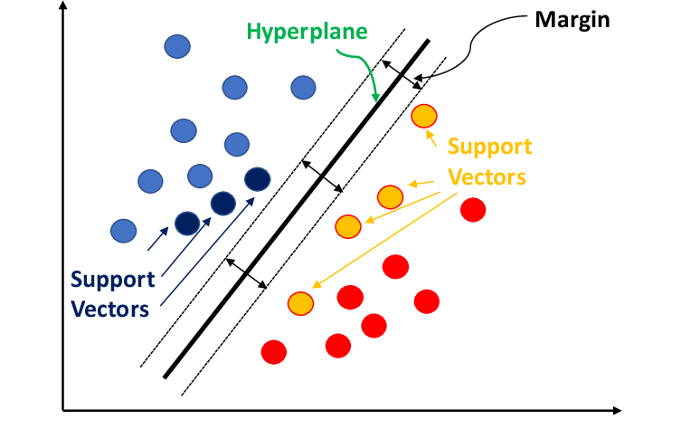

Human language is:
- Compositional: thoughts can be expressed in sentences comprising subjects, verbs and objects, which gives endless capacity for generating new sentences.
- Referential: can express information about objects and their locations/actions.
- Temporal: with past, present and future tenses. 
- Varied: thousands of different languages spoken around the world. 
# Text Data
NLP mainly deals with text data, but also semi-structured data (like html), programming code, relational (tabular) data, biological sequences, binary data, audio data, images & video. 
NLP, aka text mining, is the process of working with and extracting useful knowledge from textual data. 
NLP concerns the computational analysis, interpretation and production of natural language in either written or spoken form.

NLP techniques are regular expressions, vector space representation & text classification, text retrieval and clustering, word embedding based representations, language models for text generation, seq2seq models & transformers, dialog systems (task-oriented and retrieval-augmented chatbots), LLMs, audio aspects (speech-to-text & text-to-speech).

NLP can be used for sentiment analysis, summarisation, translation, named entity extraction, question answering, chatbots, personal assistants.
## Text Preprocessing
In text processing, we can have three types of tasks: classification, extraction and search.
Text generation can be either translation, summarisation, anonymisation & synthetic data generation, question answering, explanations.

NLP is difficult since human language is extremely expressing, it can be highly ambiguous, and even prosody (pronounce and emphasis) can affect its meaning, but thankfully it is also very redundant. 

It is common to pre-process text by performing cleaning activities, such as:
- Prior to tokenisation:
	- Remove mark-up (non-content information).
	- Lowercase the text.
	- Remove punctuation.
- After tokenisation:
	- Remove stopwords (extremely high frequency words).
	- Remove low frequency words.
	- Perform stemming or lemmatization to reduce the vocabulary size. 
	- Perform spelling correction. 

Less common activities when building classifiers:
- Performing stemming or lemmatization to reduce vocabulary size.
- Perform spelling correction. 

In other cases, we may need to extract plain text from: 
- Textual documents (.txt, html, e-mail, ..): usually discard mark-up (html tags) and other format-specific commands, in web crawl situations parser should be robust to badly formed HTML.
- Binary documents (Word, PDF, ..): much more complex to handle, for PDF documents the text structure must be reconstructed.
- Images of scanned documents: requires specialized **Optical Character Recognition** (**OCR**) software that is deep-learning based, which may introduce recognition errors in the text. 

Various **encoding** could be used to store characters on computer, each supports different number of possible characters. The most used are ASCII (traditional keyboard, only 128 characters in total) and UTF-8 (149k Unicode characters), the latter is needed to handle languages with non-latin characters sets (Arabic, Cyrillic, Greek, ..) and special characters ('ì', 'ù', ..).
### Tokenization
Many (if not all) NLP tasks require **tokenization**, segmenting the text into sequences of tokens which usually corresponds to the words in the text. It is possible to tokenize until character level. Tokenization requires language-specific resources and It can be difficult for some languages. 
Some languages use space between words which allow for space-based tokenization, which have some problems:
- depending on application, we may want to split hyphenated words.
- some languages are highly agglutinative, and can build very long and specific content, which it might be better to separate. 
- some time the "unit of meaning" is spread over two non-hyphenate words in multi-words expressions (MWE).
Moreover, we can't blindly remove punctuation (ex. titles, prices, dates, URLs, hashtags, email addresses, ..) and we may deal with clitics, words that don't stand on their own. 
Many languages, such as Chinese, do not use spaces to separate words, so deciding where the token boundaries are can be difficult. It is common to threat each character as a token.

Instead of white-space segmentation or single-character segmentation we can:
- use the data to tell us how to tokenize.
- use a sub-word tokenization which is useful for splitting up longer words and for allowing the ML model to learn explicitly the morphology of the language. 
- use byte-pair encoding.

Certain tasks require sentences to be segmented. A common algorithm is to tokenize and then use rules or ML to classify a period as either a part of the word or a sentence-boundary.
## Text Normalization
### Case Folding
Case folding consists in converting all the characters into the same case, either all upper case or lower case.
Applications like web search often reduce all letters to lowercase to drastically reduce size of vocabulary and increases recall (set of valid documents found).
For classification problems:
- removing case reduces vocabulary and thus number of parameters that must be learnt.
- help classifier to generalize well from far fewer examples. 
However, we may lose important information by removing case, thus retaining it can be helpful for many applications like sentiment analysis, machine translation, information extraction. 
### Word Normalization
Word normalization is the process of converting words/token into a standard format. It is critical for web search applications. 
### Morphology
It refers to the analysis of structure of words. 
- Morpheme is the smallest linguistic unit that has semantic meaning. Morphemes are divided into root, which is the base root, and affixes, which can either be prefix, infix or suffix.  Morphemes compose to make lexemes.
- Lexeme is the unit of lexical meaning that exists regardless of the number of inflectional endings it may have of the number of words it may contain. 
- A lemma is a canonical form of a lexeme. 
- A lexicon is a set of lexemes. In NLP lexicons define base forms, affix morphemes and address irregular forms. 
- A word is an inflected form of a lexeme.
Morphemes can be composed with morphological rules, which restricts the ordering of morphemes, and orthographic rules, aka 'spelling-rules' or 'two-level rules'.
Dealing with complex morphology is necessary for many languages. 
### Lemmatization vs. Stemming
**Lemmatization** consists in representing all words as their lemma, their shared root. 
**Stemming** consists in a simple algorithm that reduces terms to stems, chopping off affixes crudely. It is often used in text retrieval to reduce computational requirements. The Porter Stemming Algorithm is a set of rewriting rules, simple but error prone since it can cause many collisions (different words, same stems).

Lemmatization is a more sophisticated NLP technique while stemming is a simple algorithm that applies rules to extract word stems. 
In text retrieval to prevent vocabulary mismatch between query and document, usually perform stemming (or lemmatization) before adding terms to the index. 
### Stopword removal
Stopwords are just more frequent terms in language which convey very little information about the topic of the text. 
Removing stopwords can sometimes boots performance of retrieval/classification models since it will reduce computational/memory burden. 
Sometimes stopwords are useful. 
### Spelling Correction
#### Probabilistic Spelling Correction
If we had enormous corpus of misspellings and corrections, we could estimate **relative frequency**:
$$
P(correct | observed) = {\#(correct, observed) \over \#(observed)}
$$
but we don't have such a corpus. 
We could estimate such probability using **string edit distance** by counting number of insertions, deletions, substitutions or transpositions needed to get from one string to the other. Surely some words will be more likely then others and some words would be equally likely.

Use Bayes' rule to write the condition the other way around:
$$
P(correct | observed) = {{P(correct, observed)} \over {P(observed)}} = {P(observed | correct) P (correct)\over P (observed)} 
$$
Now, since the denominator is the same for all candidate corrections we can ignore it and normalize probabilities later:
$$
P(correct|observed) \propto \underbrace{P(observed|correct)}_\text{likelihood of correction}\underbrace{P(correct)}_{\text{prior probability} \atop \text{of corrected word}}
$$
For each possible correction, we need to estimate:
- Prior probability of correct word, by seeing how popular that word is in a large corpus. 
- Likelihood of correction, by counting in large corpus of errors how many times the correction is right. 

Also **context information** is needed. We can retrieve it by looking at the preceding words to see how much they agree with the candidate correction. We can count in large corpus the frequency of bigrams (pair of consecutive words) and replace the unigram probability of the correct word with a bigram probability: it is a Naïve Bayes model with two features the observed (incorrect) word and the previous word in the sentence.
## Regular expressions
RE are patterns that allow us to search within text document for specific sequences of characters. Using RExp we can find out whether pattern exists in document and we can extract information wherever pattern occurs. 

RExp provide a powerful language for writing rules to extract content from text documents. 
- Advantages: simplicity of approach, rules can be made precise to reduce the number of false positives. 
- Limitations: extraction rules must (usually) be written by hand, some false positives are usually present due to insufficiency of syntactic structure, often many false negatives due to the fact that rule is not general enough, hard to integrate knowledge of context around extracted entity.

# Text Classification
## Some Machine Learning Concepts
ML consists in a set of techniques aimed to make machines "act more intelligent" by generalizing from past data to predict the future data. 

"A computer program is said to learn from experience E with respect to some class of tasks T and a performance measure P, if its performance at task in T, as measured by P, improves because of experience E." Tom M. Mitchell

In supervised learning each training instance is a vector in some feature space and it has been labeled with a class. The tasks consists in partitioning the space to be able to make predictions for new vectors. 
Data usually overlaps, so classes may not be linearly separable. Instances are described by many features, with some dimensions better at distinguishing classes than others. 

![[data_no_linearly_separable.png]]

All classifiers divide up the feature space: boundary can be linear or non-linear.
- **Linear** models: include Naïve Bayes, Logistic Regression and Support Vector Machine (SVM).
- **Non-linear** models: include SVM with Radial Basis Function (RBF) kernel, Gradient Boosted Decision Trees and Neural Networks.

![[boundary_decisions.png]]

The learning algorithm:
- Takes as input training instances and corresponding ground truth labels.
- Searches for parameters which minimizes prediction error (loss) on training labels.
- Each algorithm has its own settings: the hyper-parameters which control the complexity of the model. 
- The model is used to predict labels for new instances. 

We must choose the hyper-parameters values to prevent overfitting:
- We can't use training data, because training error does not tell us about generalization.
- We can't use test data, since we need it later for unbiased testing. 
- So we have to hold-out portion of training set and use it for online evaluation: the validation set is used to evaluate different training runs. 
It is possibile to choose various hyper-parameters settings, train a model with each, then evaluate on the training set.

Training error usually improves with higher model complexity, but test performance reaches a peak and then degrades as model overfits the training set. We would like to find the model with the best generalization performance. 

 
## Text classification
It is the process of training a model to classify documents into categories. It is used for:
- spam/phishing detection.
- authorship identification.
- sentiment analysis.
- offensive content detection. 
- web search query intent. 
- personalized news feed. 
- identifying criminal behavior online.
- routing communication.
- task identification in spoken interfaces.
- ...

Types of text classification problems:
- **Binary classification**: output is binary (e.g. spam detection, sentiment analysis).
- **Ordinal regression**: output is ordinal (e.g. product reviews).
- **Multi-class classification**: output is a category (e.g. categorizing topics, routing communication to the correct department).
- **Multi-label classification**: output is a set of categories (e.g. categorizing news articles).
## Extracting Features from Text
Text can be arbitrarily long, it has NO fixed size which means that it cannot be given directly to the model. Features must be extracted. 

![[Pasted image 20250224105533.png]]

Features are signals in documents that are useful for predicting a category. We need to convert text data into a vector of features to give it to a classifier. 
If training data is scarce (few documents available), one might use:
- **Syntax-based features** (e.g. # of capitalized words).
- **Part-of-speech based features** (e.g. # verbs versus proper nouns).
- **Reading-difficulty based features** (e.g. average length of words/sentences).
Most common features to extract are just the words themselves as the vocabulary of the document provides the most important signal, the # of occurrences of words provides further information. 
### Bag-of-words (BOW) model
It represent docs as vectors of word counts. It is a massively sparse representation (long vector with many zeros).

One could also use **one-hot encoding** to create a fixed dimension feature vector: just truncate documents at fixed length and treat them as a sequence of categorical variables. Then, encode categorical variables using one-hot encoding to produce $n$ binary features per variable where $n$ is the vocabulary size. 
The problem is that we will have too many features given small amount of training data available (dense representation). 
So, to reduce the feature space it is possible to sum all one-hot encodings together which will results in throwing away all word order information but retains critical vocabulary information. 
## Word Frequencies
### Heap's law
Vocabulary grows with approximately the square root of document/collection length: $V(l)\propto l^{\beta}$  with $\beta \approx 0.5$.
### Zipf's law
Token’s frequency is approximately proportional to the inverse of its rank: $ctf_t \propto {1 \over {rank(t)^s}}$ with $s \approx 1$ 

Heap's law derives from Zipf's law and can be explained by random typing model (a.k.a.  [[https://www.cs.cmu.edu/~zollmann/publications/monkeypaper.pdf|monkeys at typewriters]] and [[https://en.wikipedia.org/wiki/Infinite_monkey_theorem|infinite monkey theorem]]). 
The point is that vocabulary of documents/collection grows slowly compared to its length.

![[vocabulary_tokens.png]]

Since document vocabulary is very small compared to vocabulary of collection, it is possibile to say that terms present in document usually characterize well its content.
BOW representation includes also count of occurrences of each term. 
Moreover, it completely ignores word order. An extension to include n-grams can increase performance, but greatly increases number of dimension, so more data is then needed. BOW is a very sparse representation.

In general, we have FAR FEWER documents than vocabulary terms, which means fewer examples than features. So strong regularization is needed to guide the learner and prevent overfitting. 
## Linear Classification Models
Due to very high number of dimensions in a BOW representation of documents, linear models are often used with text. 
Linear models estimate one parameter per vocabulary word making them **highly interpretable** as we can directly see which terms influence prediction and by how much.

Linear classification algorithms find linear decision boundaries (oriented **hyperplanes** in n-dimensional vector space).
Given a feature vector $x = (x_1, .., x_n)$ and a set of model parameters denoted $\theta$, the oriented hyperplane has equation $\theta \cdot x - b = 0$ where:
- $\theta \cdot x = \sum_i \theta_i x_i$ is a dot product. 
- $\theta = (\theta_1, .., \theta_n)$ is a n-dimensional vector that is orthogonal to the hyperplane.
- $b$ is an offset which regulates the distance of hyperplane from the origin (a parameter) as $b \over |\theta|_2$. $b$ is just a parameter, so it is often denoted as $b = - \theta_0$.

We will discuss 3 most popular linear models:
- **Naive Bayes**: traditionally used with text.
- **Logistic Regression**: works well if regularized.
- **Support Vector Machines**: naturally regularized and designed for high dimensional data. 
### Multinomial Naïve Bayes 
Naïve Bayes (NB) is one of the oldest and simplest text classifier. 
Called naïve because it makes simplifying assumption: that **word occurrences** are **statistically independent** of each other given the class label i.e. that words provide independent information about the class.
This assumption makes calculating parameters of model very simple. However, it does not hold in practice, since words are highly correlated with each other, but nonetheless the predictions from the model are good. The assumption just causes model to be overconfident.

If all examples of a word occur for only one class, then it will be classified always the same. To avoid this, we smooth the probability estimate by adding a pseudo-count $\alpha$ for each feature, which can be chosen to maximize prediction performance or set to default value (if $\alpha = 1$ it is called Laplace smoothing).

Advantages: 
- Very **fast to estimate** the NB model as it requires **only one pass over the training data** and there is NO need to search for parameters (no gradient descent routine).
- **Reliable predictor** even if there is little data available (stable classifier). If conditional independence holds, it is the best. 
Disadvantages:
- It does not perform quite as well on large data as other classifiers, since redundant features are counted twice.
- Predicted probabilities are not well calibrated, they are often overconfident due to violations of independence assumption. 
### [[Machine Learning#Logistic Regression|Logistic Regression]]
The further a point is from decision boundary, the more certain we are about the prediction.
The signed distance of a point from the hyperplane is $s(x) = \theta \cdot x - b$, where the classes are positive/negative scores.

Instead of mapping each point to fraud/non-fraud we could try to estimate the probability of fraud interpreted as the confidence of classification. 
To convert distance $s(x)$ to probability $P(x \in C_1|x)$, we need a function that maps $(-\infty, +\infty) \rightarrow [0,1]$ so we can use a **logistic curve** (a.k.a. **sigmoid function**) which takes value 0.5 at the decision boundary ($s=0$).
$$
sigmoid(s) = {1 \over 1 + e^{-s}} = {e^s \over e^s +1}
$$
Advantages:
- Produces well-calibrated probability estimate.
- Can be trained efficiently and scales well to large numbers of features. 
- Explainable since each feature's contribution to final score is additive. 
Disadvantages:
- Assumes feature values are **linearly related** to log odds. If assumption is strongly violated, model will perform poorly. 
### Support Vector Machines (SVMs)
SVM finds **maximum margin hyperplane separating classes**. The margin $\gamma$ is the distance from the hyperplane to the closest points either side. 
Points laying exactly on margin are referred as **support vectors**: they prevent the margin from getting bigger, thus constrain/define location of boundary. In d-dimensional space, we have at least d+1 support vectors.

In contrast with logistic regression, the position of the hyperplane depends only on the closest points. Moreover, adding or moving internal points won't effect such boundary. 

Basic SVM is also a linear classifier since it finds the hyperplane in feature space that best separate two classes. The difference with LR and NB lies in the loss function used to find parameters:
- LR uses the negative log-likelihood: penalizes points proportionally to probability of incorrect prediction (including those for which prediction was correct).
- SVM uses hinge loss, which only penalized points that are on the wrong side (or very close to) the hyperplane. 
#### Maximizing the margins
We can compute the distance to points from the hyperplane using: $s(x) = w_0 + \sum_i w_i x_i$.
For points that lie exactly on the margin we have: $|s(x)| = |w_0 + \sum_i w_i x_i| = \gamma$.
Assuming for simplicity that hyperplanes passes through origin ($w_0 = 0$), then points on the margin have $|w \cdot x| = \gamma$ where $w = (w_1, .., w_n)$ and $x = (x_1, .., x_n)$.
More generally, we have:
- $w \cdot x \ge \gamma$ for all positive data points.
- $w \cdot x \le -\gamma$  for all negative points.
- equivalently, $y_j w \cdot x \ge \gamma$ for all examples $x_j$ where class $y_i \in \{+1, -1\}$.

So we just need to find parameters $w$ that maximizes the margin $\gamma$, subject to the constraint $\forall j \ y_j w \cdot x_j \ge \gamma$.
But increasing length of vector $w$ increases value of $\gamma$, so either:
- fix length of vector $w$ and maximize $\gamma$.
- or set $\gamma=1$ and minimize $\sum_i w_i^2$ subject to constraint $\forall j \ y_j w \cdot x_j \ge 1$.
Mathematically, it is the same as minimizing loss: $\sum_i w_i^2 + \sum_j \epsilon_j$ where distance of point on wrong side of margin $\epsilon_j = max(0, \ - y_j w \cdot x_j)$ is the error for prediction $(x_j, y_j)$.
#### Non-separable data
If data is non-separable, simply penalize points on wrong side of margin based on the distance from it. 
Support vectors become points on wrong side of margin that provide non-zero contribution to loss function. 

The objective function to minimize remains almost unchanged:
$$
O(\vec{w}, b) = {1 \over 2} \sum_{j=1} w^2_j + C \sum_{i=1}^n \epsilon_i = {1 \over 2} \sum_{j=1}^d w_j^2 + C\sum_{i=1}^n \max[0, 1 - y_i(\sum_{j=1}^d w_j x_{ij} - b)]
$$
where $\epsilon_i$ is the distance from the $i_{th}$ support vector margin and $C$ is a hyperparameter that determines relative influence of errors versus size of margin. 
#### Hinge loss
It applies no cost to most correctly classified points. It increases linearly with distance from margin. 
$$
L(x_i, y_i) = max[0, 1 - y_i(\sum_{j=1}^d w_jx_{ij} - b)]
$$
![[hinge_loss.png|500]]

## Evaluating a Binary Text Classifier
If using a BOW representation of text, linear classifier are sufficient for most problems. Data is high dimensional, so dependencies between features do not usually need to be modeled. 

First thing to evaluate is the confusion matrix:
- Accuracy: % of correct predictions.
- Precision: % of positive predictions that were correct.
- Recall: % of positive instances that were found by model.
- F-measure: harmonic mean of precision and recall. 
- AuC: area under the ROC Curve is often used as a single measure that doesn't depend on the confidence threshold used to make prediction with the model. 

if the are n classes, confusion matrix will be $n \times n$. 
Precision and recall will be calculated for each class by considering it positive class in a one-versus-all setting. Then, each class's precision and recall values will be combined into a single measure:
- Macro-average: average over classes weighting each class the same. 
- Micro-average: average over classes weighting each class by the number of datapoints in it.

Generally for text classification a BOW representation of text is used together with a linear classifier such as SVM or regularized LR. 
# Searching Text
## Information Retrieval
It is the task of **finding content**, which could be documents, images, video, etc., that is useful (i.e. relevant) to user's information need. 
From information needs we extract **query keywords** and look for documents containing those keywords. 

Typical adult vocabulary lies in range of 20/35 thousand words, and typical document length is less than 1 thousand words: so vocabulary of each document is small. 

Most of the work in text retrieval can be done by **vocabulary matching**: assuming that vocabulary is well distributed over different documents we just need fast indexes to find all documents containing selected keywords.
If no document contains all query terms or many documents contain all of them we assign score to keywords based on how discriminative they are.

Text retrieval as text classification can be done by:
- Concatenate query and document BOW into a single feature vector.
- Predict probability that user finds document relevant to query.
Obviously we can’t use linear classifier since interactions between query & document terms wouldn’t be taken into account. 
So we could train non-linear model that includes pairwise interactions between query & document terms.

However, some problems arise:
- For vocabulary of 100 thousand, might require up to 10 billion parameters to cover all pairwise interactions.
- Need huge amounts of training data in form: (query, document, relevance_label).
- Retrieval would be very slow if need to iterate over all documents to calculate score for each.
## Term Weighting
Some terms are more **discriminative** than others, making them more useful for identifying relevant documents. 
In general, the smallest set will be the most specific and most on topic, so we rank documents by size of returned documents set (the smaller the better) for query term subset. 
### Inverse Document Frequency (IDF)
We can estimate how many documents are returned for given query term subset using the probability that a random document would contain those terms and then rank them by how likely it was to see query terms in it. 

The probability that a randomly chosen document contains keywords $t_1,…,t_{|q|} \in q$ (assuming terms are independent) is: $$ p(Q \subseteq d') = \prod_{t \in q} P(t \in d') = \prod_{t \in q} {\text{d}f_t \over N}$$where $\text{d}f_t$ is the number of docs in corpus that contains $t$ (document frequency) and $N$ is the corpus size.

Then we rank documents by how unlikely they are ($1 \over P$) resulting in an inverse document frequency (IDF), then we take the logarithm to make score additive (rather than multiplicative) over query terms:
$$
score(d) = -\log \prod_{t \in q \cap d} P(t \in d') = \sum_{t \in q \cap d} \log {N \over \text{d}f_t}
$$
IDF weights each term by the logarithm of inverse probability of finding term in a document: $idf_t = \log {N \over \text{d}f_t}$.
It is a standard information theory measure gained from observing term $info(t) = - \log P(t)$.

A common variants of IDF uses odds of observing term: $odds(t) = P(t) / [1 - P(t)]$.
Another variant is the document score:
$$ 
score(d) = \sum_{t \in q} \log {N - \text{d}f_t + {1 \over 2} \over \text{d}f_t + {1 \over 2}}
$$
where smoothing of $1 \over 2$ is added to prevent terms with small frequencies from dominating ranking. There is almost NO difference between the two formulations unless a term is very common $df_t > N / 2$.
### Term Frequency (TF- IDF)
IDF weights vocabulary terms but:
- there is more information in a document than just its vocabulary.
- some documents contain the same query term many times and are more likely to be relevant.
The simplest option to include term count information is to directly weight score by it: $$
score(q, d) = \sum_{t \in q} tf_{t, d} \log {N \over \text{d}f_t}
$$where $t f_{t, d}$ if the number of occurrences of term $t$ in document $d$ (a.k.a. term frequency).

Instead of calculating probability that a random doc contains the term, we calculate the probability that it contains the term exactly $k$ times:
$$
P(t, k) \simeq P(next\_token=t)^k
$$
Then, we estimate the next token probability using term occurrences over the collection: $$
P(next\_token=t) = {ctf_t \over \sum_{t'} ctf_{t'}}
$$where $ctf_t$ is the number of occurrences of $t$ in the collection.
Thus, the probability that the term occurs exactly $k$ times is:
$$
P(t, k) \simeq ({ctf_t \over \sum_{t'} ctf_{t'}})^{tf}  
$$
Taking the logarithm gives:
$$
score(q, d) = - \sum_{t \in q} tf_{t, d} \log ({ctf_t \over \sum_{t'} ctf_{t'}})
$$
Similar to the previous formula.

The TF-IDF score performs well in practice but assumes a linear relationship between term frequency and document score. This linear assumption have been questioned over time as it is not always valid. 

A common alternative is increase score with logarithm of term count: $\log(1 + tf_{t, d})$ or $\max (0, 1 + \log(tf_{t, d}))$.
## Length Normalization
We need to normalize the length of the document as longer documents have a larger vocabulary so are more likely to contain the query terms but are not necessarily useful for the research, so shorter documents with the same term count should be preferred.

To normalize we could just divide by the length of the document, but most common normalization uses $L_2$ rather than $L_1$ norm (a.k.a. document length in tokens).
### Cosine similarity between TF-IDF vectors
Vector space model treats TF-IDF values for all terms in documents as a vector representation $d = (tf{1, d} \cdot idf_1, ..., tf_{1, d} \cdot idf_n)$.
The similarity between query & document can be computed based on the angle between vectors. 
Cosine of the angle is used since it gives similarity values in range $[0, 1]$, which is normalized by the euclidean length (a.k.a. $L_2$ norm):
$$
sim(d_1, d_2) = {d_1 \cdot d_2 \over ||d_1||||d_2||}
$$
where $d_1$ is the query and $d_2$ is the document. 

### Pivoted Length Normalization
There have been many studies over the years into other types of normalization such as Pivoted Length Normalisation (PLN). 
The idea is that generally longer documents do contain more information than shorter ones,
but normalizing loses all length information.
So instead, we parameterize $L_1$ normalization around average document length:
$$
{tf_{t, d} \over L_d} \rightarrow {tf_{t, d} \over bL_d + (1-b)L_{ave}}
$$
with $L_d = \sum_t tf_{tid}$, $L_{ave} = {1 \over N} \sum_d L_d$ and $0 \le b \le 1$.

### Best Match 25 (BM25)
Another proposal is the Okapi BM25 ranking formula:
$$
RSV_d = \sum_{t \in q} \log[{N \over df_t}] \cdot {(k_1 + 1)t f_{t, d} \over k_1((1-b) + b \times (L_d /L_{ave}) + t f_{t, d})}
$$
where $k_1, b$ are parameters to be set, which control the dependence on document length. 

This was the go to method for term-based text retrieval. It has the property that term importance tend to maximum values, so document containing a query term repeated a massive number of times won't always rise to the top of the ranking. 
## Index Structures
Retrieval measures must be calculated **fast**, since delay affects attention: search engines need to respond in tenths of a second and have been engineered to be as fast as possibile. 

**Inverted indices** are the building blocks of search engines. They are made up of posting lists mapping: TermIDs -> DocumentIDs. They use integer compression algorithms that allow for fast decompression to reduce space requirement. 

Calculating retrieval function involves computing joins over posting list where documents are sorted by term count to allow for early termination of results. 
**Index pruning** techniques are used to get rid of documents that would never be retrieved for a certain query.
### Positional Indices
Documents are more likely to be relevant if query terms appear close together. Most indices record locations of terms in document and allows for **proximity** between keywords to be calculated. 
Words at start of webpage more important in general.
Statistically significant bigram/trigrams are found using pointwise mutual information and are often indexed with their own posting list.
### Crawlers
Crawlers scour web following hyperlinks to add to index. 
Efficient crawling requires learning to prioritize URLs effectively and determining how frequently to re-visit a website and update the index.

Web scale crawlers need to be robust to all types of content including generated pages. It should be able to detect content-based duplicate pages, where there are many URLs that may map to the same content.
It is generally a distributed crawler architecture with a centralized URL list.

The dark web is an anonymous web build around [TOR](https://www.torproject.org/) (The Onion Router) gateways. Crawling the dark web is interesting because there is NO DNS linking urls to IP-addresses behind TOR gateways. 
## Reranking
Once initial set of potentially relevant documents has been found, we can rerank them based on all the available information to maximize the overall quality of search results.

For web search many indicative features include:
- multiple retrieval functions (BM25, embedding-based, BERT, ..).
- different documents parts/views (title, anchor-text, bookmarks, ..).
- query-independent features (PageRank, HITS, spam scores, ..).
- personalized information (user click history, ..).
- context features (location, time, previous query in session, ..).

Search engines like Google combine hundreds of signals together. 

Rank learning provides an automated & coherent method for combining diverse signals into a single retrieval score while optimizing a measure users care about (e.g. NDCG, ERR).

1. Start with a query.
2. Generate initial ranking using keyword-based ranker.
3. Truncate ranking as candidates for re-ranking.
4. Calculate feature values for each candidate.
5. Normalize each feature at the query level: usually perform min-max normalization at query level for each feature, necessary to make values comparable across queries. 
6. Training: provide ground-truth relevance labels for each query-document pair, generally trough manual labeling.
The procedure is repeated for all queries. 
## Evaluating Search Results
Search engines employ people to annotate search results with relevance information. 
Other organisations (e.g. Wikipedia) can't afford to pay raters and try to collect judgments directly from users. 
Usually they do not train models directly from click data, since it causes a feedback loop.
Latest approach is to use a LLM to judge relevance. 

Traditional measures for evaluating search results are:
- Precision at depth $k$: $P @ k = \# \{ \text{relevant docs in top k}\}/k$.
  It is the percentage of relevant top results.
- Recall at depth $k$: $R @ k = \#\{\text{relevant docs in top k}\}/\#\{\text{relevant docs in total}\}$.
  It is the percentage of found documents in all the relevant documents available. 
- F-measure at depth $k$: $F_1 @ k = 2 / ({1 \over P@k} + {1 \over R@k})$.
  It is the measure of how well is the result, combining precision and recall.

More recent measures:
- Mean Average Position (MAP): "average position" is average of $P@k$ values at all rank positions containing relevant documents, it estimates area under precision-recall curve. $$ AveP = {\sum_{k=1}^n (P(k) \times rel(k)) \over \text{\# of relevant docs}}$$
- Normalized Discounted Cumulative Gain ($NDCG @ k$): it is more faithful to user experience by discounting lower ranked docs, it is normalized at the query level. $$ NDCG(Q, k) = {1 \over |Q|} \sum_{j=1}^{|Q|} Z_{kj} \sum_{m=1}^k {2^{R(j,m)}-1 \over \log_2 (1+m)}$$
Note that $P@k$ and $NDCG@k$ are usually the most important measures for retrieval.
## Formulating Learning-to-Rank Problem
A two stage (re)ranking process:

We can treat rank learning as a simple regression problem, in which we predict the relevance label based on feature values. 
Optimizing "pointwise" objective is suboptimal since it does not preference ordering at top of list, and ends up predicting well scores for less relevant documents. 

During learning, we can use different loss functions:
- Pointwise (e.g. MSE): $$total\_loss = \sum_{i=1}^m \sum_{j=1}^{n_{q_i}} loss(\underbrace{f(\overbrace{x_i^j}^{\text{feature vector}})}_{\text{predicted score}}, \overbrace{y_i^j}^{\text{relevance label}})$$- Pairwise (e.g. # of incorrectly ordered pairs): $$total\_loss = \sum_{i=1}^m \sum_{j=1}^{n_{q_i}} \sum_{k=j+1}^{n_{q_i}} loss(\underbrace{f(x_i^j), f(x_i^k)}_{\text{predicted scores}}, \overbrace{y_i^j, y_i^k}^{\text{relevance lables}})$$
- Listwise (e.g. NDCG): $$total\_loss = \sum_{i=1}^m loss(\underbrace{f(x_i^1), .., f(x_i^{n_{q_i}})}_{\text{predicted scores}}, \overbrace{y_i^1, .., y_i^{n_{q_i}}}^{\text{relevance labels}})$$
LambdaMART is a listwise rank learner that makes use of the boosted regression trees. The name comes from Lambda, which is an approximation of loss gradient, and MART, which stands for Multiple Additive Regression Trees.
It performs very well in practice, thus becoming the default/baseline learner in most applications.
# Clustering Text
Text clustering is the process of grouping documents into coherent subgroups based on some distance function or similarity measure.  
For text documents, usually means grouping documents into the same topic, emotion, problem, complaint/praise, author, text generator or source document.

A real-world application is news aggregators like Google News which use clustering to summarize/characterize a collection. In security application it is used for phishing and malware detection. 

To cluster documents we need to measure their similarity in the content, which is subjective. 
Generally, documents are represented as [[#Term Frequency (TF- IDF)|TD-IDF]] vectors (scaled BOW) which is a sparse representation as most values in vector are zero. It measure similarity based on the number of shared words, which are scaled by the importance. 
We usually assume that similarity does not depend on the document length, so we compute the [[Natural Language Processing#Cosine similarity between TF-IDF vectors|cosine similarity]] between vectors. 
## Clustering Techniques
Many different clustering algorithms are in common use, and can be implemented with [sklearn](https://scikit-learn.org/stable/modules/clustering.html):
- k-Means/k-Medoids.
- Agglomerative hierarchical clustering. 
- Density-based clustering.
- Spectral clustering.
- Topic Models.
The most used with text are k-Means and Topic Models.
### k-Means
It is the "goto" clustering method: simple, fast and relatively robust. 
It searches for exactly $k$ clusters and represents each cluster by its centroid. 

Advantages: scales well to large collections, require no pairwise distance calculations.
Disadvantages: searches for global clusters, implicitly assumes Euclidean distance metric which is not idea for text, number of clusters must be specified in advance. 

Algorithm:
1. Initialize $k$ centroid randomly.
2. (Re)assign each data point to the closest centroid. 
3. (Re)compute centroids by averaging data point in each cluster. 
4. Repeat steps 2. & 3. until convergence, when centroids stop moving. 
The algorithm minimizes the variance of clusters (squared distances between points & cluster centers): $\min \sum_{i=1}^k \sum_{\vec{x} \in C_i} d(\vec{x}, \vec{\mu}_{C_i})^2$. 

Potential problems arises from the fact that choosing the "right" value of $k$ is critical as the algorithm can converge on local minimum (generally we run the algorithm multiple times) and too small $k$ led to cluster merging while too big $k$ led to cluster splitting.
As for all clustering algorithms, scaling affects similarity measures and thus cluster found, but for text we have both TF-IDF weighting and document [[#Length Normalization|length normalization]]. 
### k-Medoids
It represents each cluster by its medoid rather than its centroid. Medoid is the point that is closest (small average distance) to all other points. 
At each iteration, the algorithm must reassign datapoints to the cluster with closest medoid, and then recompute the medoids.

Advantages: it can be used with other metrics rather than Euclidean, medoid is a real document so it provides a realistic representation of clusters.
Disadvantages: it has much higher computational complexity w.r.t. k-Means as it needs to calculate distances for pairs of datapoints which is an $O(n^2)$ operation.
### Agglomerative Hierarchical Clustering
It builds hierarchy of clusters called a **dendogram**. It is "agglomerative" since it builds cluster by merging groups in bottom-up fashion:
1. Assign each document to its own group.
2. Merge the two most similar groups.
3. Repeat until only one groups remains. 

Hierarchical clustering needs to compute distances between groups of documents, so it uses a **linkage criteria**:
- complete-linkage: maximum distance between points in two groups.
- single-linkage: minimum distance across groups.
- average-linkage: average distance across groups.
The linking criteria influences cluster's shape: complete or average linkage will restrict to tight, globular clusters while single linkage will allow for finding long, thin clusters.

Advantages: it works with any distance metric/similarity function, the dendogram provides information about underlying structure of data.
Disadvantage: its high time complexity makes it unsuitable for large datasets.
### DSBScan
It stands for Density-Based Spatial Clustering of Application with Noise: it is a density-based algorithm since clusters are found in high-density regions.
The number of clusters are not defined by user but inferred from data. 

The algorithms takes two parameters: the radius of neighborhood around each point $\epsilon$ and $minPoint$ which is the minimum number of points required to form a cluster. 
The number of datapoints in $\epsilon$-neighborhood is the density estimate while $minPoints$ is just a threshold on density. 
The algorithm classifies each point as either:
- core point, if it has $\ge minPoints$ neighbors inside radius $\epsilon$. In blue.
- border point, which is not core but lies within $\epsilon$ of core points. In purple.
- noise point, neither core nor border. In red. 

Advantages: it does not need to choose the number of clusters in advance, it identifies and ignores noise/outliers instances, it finds arbitrarily (oddly) shaped clusters.
Disadvantages: the performance depends critically on the chosen parameters (usually set $\epsilon$ as a function of average distance to $minPoints$ nearest neighbor), it may not work will if clusters have different densities. 
## Topic Modelling
It allows documents to belong to multiple clusters: it is a **soft clustering** method. 
It provides a low-dimensional representation of documents, compared to the high-dimensional vocabulary space. 

Each cluster is referred to as a "**topic**", in which terms should be coherent (discuss a single theme). 
- Topic vector: probability distribution over words.
- Document vector: probability distribution over topics.

Topic modelling is a form of **matrix decomposition**: it decomposes the matrix $terms \times documents$ into two smaller matrices $term \times topics$ and $topics \times documents$. 
In this way, we need to estimate a much smaller set of parameters: $V \times T + T \times D << V \times D$ for vocabulary size $V$, document count $D$ and topic count $T$.

The most famous technique is Latent Dirichlet Allocation (LDA) (so named since it uses a Dirichlet prior when estimating the parameters).
Also Latent Semantic Indexing (LSI) is used, which applies Singular Value Decomposition (SVD) to the TD-IDF matrix. 

Topic modelling is used to generalizes the observed term count to make the document representations more dense & useful, and allows calculating more meaningful distances between documents. 
Sometime it is used to visualize collections, since it represents topics by most frequent terms. It is also common to show changes of collection over time. 

The generative model for LDA works as follow:
1. choose word proportions for each topic.
2. choose topic proportions for each document. 
3. for each position in the document: choose topic based on document proportions and choose word based on topic proportion.
The algorithm require to iteratively update the parameters (topic probabilities for each document and word probabilities for each topic). It is possible to place Bayesian priors on parameters to avoid overfitting or use (Gibbs) sampling technique to avoid local maxima. The hyperparameters $\alpha, \beta$ determine the prior on the topic/document distribution (how concentrated they are).
# Language Models and Word Embeddings
A statistical language model is a probability distribution over sequences of words. In other words, language models are general-purpose text generator.

Language models discover statistical regularities in text and use them to predict the next word: if we can predict with some accuracy the next word, iterating forward allows us to predict entire sentences. 
## Markov Models
Markov models predict the next word based on a fixed number of previous word. It is the simplest model that count n-grams (sequence of n words) in large corpus. In general, longer n-grams give better predictions. 

**Smoothing** add a small constant to all counts before estimating probabilities: 
$$
P(w_n|w_{n-1}, w_{n-2}) = {count(w_{n-2}w_{n-1}w_n) + \alpha \over count(w_{n-2}w_{n-1} + V \cdot \alpha)}
$$
where $\alpha$ is the pseudocount (often $\alpha=1$) which prevents zero probability for previous unseen n-grams and $V$ is the vocabulary size. 

We do not invent values for unseen n-gram but just **backoff** to (n-1)-gram: use trigram count if you have it, otherwise revert to bigram model, else unigram. 

Interpolate higher and lower order models:
$$
\hat{P}(w_n|w_{n-1}w_{n-2}) = \lambda_1 P(w_n|w_{n-1}w_{n-2}) + \lambda_2P(w_n|w_{n-1}) + \lambda_3P(w_n)
$$
with $\sum_i \lambda_i = 1$, moreover we choose lambdas to maximize probability on held-out development data.
### Generating text from a Markov model
We can use the probability estimate of next word to generate text in various ways:
- **Greedy**: choose the most probable term $w^* = argmax_t P(w_n=t|w_{n-k}, .., w_{n-1})$ .
- **Random sampling**: sampling term according to probabilities $w^* \approx P(w_n|w_{n-k}, .., w_{n-1})$.
- **Top-k sampling**: by limit sampling to $k$ most likely terms $w^* = P(w_n|w_{n-k}, .., w_{n-1})\mathbb{1}(w_n \in \text{top-k})$.
- **Temperature sampling**: limit sampling to likely terms by raising probabilities to power $w^* = P(w_n | w_{n-k}, .., w_{n-1})^{1/T}$ where $T$ is the temperature (higher $T$ lead to more uniform sampling).
- **Beam search**: search forward one step at a time for most likely sequence $(w_n, w_{n+1}, w_{n+2}, ..)$ while limiting the search space to a maximum set of $k$ candidate sequences. 

Greedy techniques always produce the same text, while sampling techniques produces different text each time. 

To evaluate a language model (LM) we can apply:
- **Extrinsic** evaluation: use model in a downstream task (e.g. spelling corrector) and evaluate performance on that task.
- **Intrinsic** evaluation: train parameters of model on training set and then test model performance on the held-out dataset, by using likelihood that model would produce the new data to evaluate how well it is doing. 
#### Perplexity
Perplexity of language models quantifies the level of surprise/confusion at seeing new text: it measures how unlikely the observed data is under the model. 
It can be calculated by:
1. Compute the probability of observed sequence $P(w_1, .., w_n)$ under model.
2. Normalize it for the length of text sequence $P(w_1, .., w_n)^{1/n}$ (i.e. compute the "average" per-word probability).
3. Invert the probability to compute uncertainty $PP(w) = P(w_1, .., w_n)^{-1/n}$. 
   Minimizing perplexity is the same as maximizing the probability, so lower perplexity stands for a better model. 

| Perplexity                                                                     | Negative log Likelihood (nLL)                                                              | Cross-entropy (CE)                                                                                |
| ------------------------------------------------------------------------------ | ------------------------------------------------------------------------------------------ | ------------------------------------------------------------------------------------------------- |
| inverse of geometric mean of probability of correctly predicting the next word | negative logarithm of probability sequence, dividing by sequence length gives per-word nLL | expected (empirical average) log surprise under model, number of bits needed to quantify surprise |
| $PP(w) = P(w_1, .., w_n)^{-1/n}$                                               | $H(W) = -{1 \over N} \log_2 P(w_1, .., w_n)$ $PP(W)=2^{H(W)}$                           | $H(p, q)=-\sum p(x_i) \log_2 q(x_i)$ $H(p, q) \approx -{1 \over N} \log_2 q(W)$                |
### Problems with n-gram LM
As n gets larger, the change of finding the right sequence in corpus drops exponentially, meaning that there is never enough training data. 
This may lead to continuously backing off to shorter n-grams, which greatly limits the power of the model.

In order to generate a reasonable language we need to model very long distance dependencies. Memory and data requirements scale exponentially in length of observable dependency, so Markov models just don't scale.
We need methods that can both generalize from limited data and handle longer dependencies.
## [[Artificial Neural Networks & Deep Learning#Word Embedding|Word Embeddings]]
Word embeddings are **dense vectors** representing words in a high dimensional space. They are very low dimensional compared to one-hot encoding of terms. Just like one-hot encodings, word embeddings can be aggregated to represent sentences and documents. 

Embeddings are produced by supervised machine learning models, which are trained to predict missing words based on surrounding context which may include only previous words (causal model) or also future words (non-causal model).
It is a multi-class problem (estimate the probability for every word in a vocabulary). 
The issue is that even linear classifier requires very large number of parameters since it will be quadratic in the size of $V$. 
### [[Artificial Neural Networks & Deep Learning#Word2Vec|Word2Vec]]
It solved the parameter space issue by using bag-of-words representation, a NN with a single (linear) hidden layer and by training the model in a discriminative fashion by inventing negative examples. 

There are two versions of Word2Vec:
- **Continuous Bag of Words** (cbow) model: trained to predict observed word based on all surrounding context which consist of all terms occurring in symmetric window around target term. It is a many-to-1 prediction, as it takes as input all context word in a bag-of-word representation. 
- **Skip-gram** (skip) model: trained to predict observed word given a single context word. It is a 1-to-1 prediction, as it takes as input a single context word one-hot encoded. 
#### Skip-gram
The skip-gram model predict the target word $t$ given the observed word $x$ using a softmax dot product of the embedding representations: 
$$
	p(t|x;\theta) = {e^{v_t \cdot v_x} \over \sum_{t' \in T} e^{v_{t'} \cdot v_{x}}}
$$
Directly optimization is computationally intensive because we need to sum over all possible target words $t'$:
$$
arg \max_{\theta} = \sum_{(x, t) \in D} \log p(t|x) = \sum_{(x, t) \in D} (\log e^{v_t \cdot v_x} - \log \sum_{t'} e^{v_{t'} \cdot v_{x}})
$$
A solution is to sample some negative examples (of words that were NOT observed) to turn the problem into a binary classification task:
$$
p(D=1|x;t;\theta) = {1 \over 1 + e^{-v_t \cdot v_x}}
$$

#### Continuous BOW
The cbow model estimated the probability in the exact same way, except for the fact that the context is a sum of words vectors:
$$
arg\max_{\theta} = \sum_{(x, t) \in D} \log {1 \over 1 + e^{-v_t \cdot v_x}} + \sum_{(x, t) \in D'} \log({1 \over 1 + e^{v_t \cdot v_x}})
$$

### GloVe
Global Vectors for Word Representation is an unsupervised learning algorithm for obtaining vector representations of words.
The aim is to give a probabilistic interpolation to translation in embedding space:
$$
(w_i - w_j)^T \tilde{w_k} \approx f({P(k|i) \over P(k|j)})
$$
For example, translation in space from "steam" to "ice" should increase the chance of seeing the word "solid", so projection of "ice" minus "steam" onto vector "solid" should be function of conditional probabilities. 
$$
P(\text{solid}|\text{ice})>P(\text{solid}|\text{steam})
$$
$$
(w_{ice} - w_{steam})^T \tilde{w}_{solid} \approx f({P(\text{solid}|\text{ice}) \over P(\text{solid}|\text{steam})})
$$
According to most sources skip-gram beats cbow. 
### Properties of WE
WE have many interesting properties:
- **Semantic clustering**: neighbors in the embedding space are semantically related to each others. This means that words with similar meanings are **close** in the embedding space and tend to form clusters.
- Meaningful **spatial translations**: certain directions in the embedding space corresponds to meaningful transformations, which means that semantics is often additive and analogies are encoded in the embedding. This allows for vector arithmetic (e.g. $\text{king} - \text{man} + \text{woman} \approx \text{queen}$)
- **Encoded Relationships**: WE inherently capture various linguistic relationships, such as **synonymy**, **antonymy**, **gender relations**, and **verb conjugations**. These relationships are learned from large corpora and are embedded in the vector representations.
### Usages of WE
We can be used in **causal models**, where context words are restricted to come before a missing word. In language modelling, they help predict the next word in a sequence, capturing longer dependencies than traditional n-gram models.

In **non-caudal models**, WE serve as additional feature vector for representing words. It improves performance on tasks such as sentiment analysis (e.g. training a classifier for sentiment detection) or machine translation (e.g. improving translation quality by leveraging word semantics) since they make use of additional domain knowledge (semantics of words).

The low dimensional nature of embeddings forces similar terms to share representations, allowing models to generalize from semantically related samples: hypernym-hyponym relationships (broad category-specific term within that category) are implicitly encoded in an additive manner (e.g. $\text{dog} \approx \text{animal} + \text{some\_offset}$). 
Since embeddings place similar concepts close together, they are useful for mining text and discovering implied (but unknown) properties of them. 
### WE extension: FastText
Word embeddings work well if the vocabulary is fixed, so they cannot deal with new words in the test set: if we see a new word for which we do not have an embedding for it, we must ignore it.
An extension that solve this problem is [FastText](https://arxiv.org/abs/1607.04606): words are split into fixed-length characters sequences, the embeddings are learned for character n-grams and then combined to form new words. 
The main advantage is that it works well with morphologically related terms (e.g. believe/believing or rain/rainfall) and it handles better rare or unseen words. 
# Sequence Classification and Sequence Labeling
Word order is important for interpreting the meaning of text and for classifying it. 
Negation provides a particularly important example of word order. 
N-grams can indeed be used to capture word order information, but we can never quite make them long enough. 

In a sequence classification task the input is a ordered sequence of tokens $(w_1, .., w_n)$ and the output is a single prediction sequence $y$.

In a sequence labeling task the input is a ordered sequence of tokens $(w_1, .., w_n)$ and the output is a sequence of predictions $(y_1, .., y_n)$.

Traditional methods for sequence labeling make use of either:
- **Hidden Markov Models** (HMMs): it is similar as apply the Naïve Bayes to sequences. 
  A HMM consist of unobserved states, observed words, transition probabilities linking states, emission probabilities for word in particular hidden state. 
  Parameter estimation consist in simply count frequencies on hand labelled data, using expectation maximization (EM) if hidden state is unknown. 
- **Conditional Random Fields** (CRFs): it is similar to apply Logistic Regression to sequences. 
  It replaces transition and emission probabilities with undirected potentials $\phi(t_1, t_2)$ and $\phi(t_1, w_1)$. 
  It get better performance by relaxing generative assumption, while parameter estimation remains same.
Recent methods make use of **Recurrent Neural Networks** (RNNs) to further improve performance. 
## [[Artificial Neural Networks & Deep Learning#Recurrent Neural Networks|Recurrent Neural Networks (RNN)]]
Word embeddings allow us to represent words in a semantic space. 
However, there is still the problem of **aggregate embeddings** over words to represent a whole document: we could simply add them up like we did with one-hot encodings to get a BOW representation, but in doing so we will ignore word order.
RNNs allow us to aggregate information over a document while not ignoring word order. They provide a general way to accumulate information by combining the embedding of current word with context from previous words. 

RNNs are simple models which takes as input two vectors (<current input, previous state>) and produce two vectors as outputs (<current output, update state>).
They can be used to process arbitrarily long input context, i.e. encoding a sequence of text to a single embedding. 
### [[Artificial Neural Networks & Deep Learning#Long Short-Term Memories (LSTM)|Long Short-Term Memories (LSTM)]]
Clever implementation of RRN that is able to learn contexts and long-range dependencies. It does this by using a gating mechanism: information passes through by default unless new information is added to state or deleted from it (forgotten). 
LSTM learns when & what information to **remember**, **forget** and **output** at each timestep. 

LSTMs can be stacked on top of each other to be able to handle nested contexts. 
## NLP applications
Many applications of sequential models in NLP, including:
- part-of-speech tagging.
- named entity extraction.
- entity linkage.
- relation extraction.
- dependency parsing. 
- co-reference resolution.
### part-of-speech (POS) tagging
Modern grammar divides world classes into open and closed: 

POS tagging is the task of assigning to each token in a sequence a part-of-speech label (e.g. PRON, VERB, NOUN, etc.). 

They are useful:
- for **developing features** for certain tasks (e.g. authorship attribution, particularly if only small amount of training data is available), 
- to **reduce ambiguity in BOW** representation, since some terms have different meaning depending on the context so append a POS tag will help us in differentiating their meaning
- as **initial step** for other NLP tasks and to perform linguistic analysis or syntactic parsing.

The accuracy of POS tagging is about 97% (similar to human accuracy), but we have to take into account that the baseline (label each word with its most frequent tag) performance already 92%.
Sources of evidence for determining the POS tags are prior probabilities of word/tag, identity of neighboring words, morphology and wordshape (prefixes, suffixes, capitalization). 
### named-entity-recognition (NER)
It is the task of identifying entities that are mentioned in a text. It can be treated as a sequence labeling task where often a first step in extracting knowledge from text.
The named entity is an object in real world. Most common tags are:
- PER (person).
- LOC (location),
- ORG (organization).
- GPE (geo-political entity).
An entity is often a multi-word phrases. 

NER is traditionally used for:
- **Sentiment analysis**: identify sentiment towards particular company or person.
- **Information extraction**: extracting facts about entities from text.
- **Question answering**: answer questions about an entity.
- **De-identification**: remove references to individual from text to protect privacy

NER can be hard because of:
- **Segmentation**: in POS tagging each word gets one tag, while in NER entities can be phrases. 
- **Type ambiguity**: same word/phrase can have many types depending on context.

NER can be turned into a sequence labeling problem (with one label per token) by using begin/inside/outside tags:
- B: token that begins a span.
- I: token inside a span.
- O: token outside any span.
### Entity Linkage
It is the task of determining whether a named-entity has been mentioned in a text, the second part is to determine which real-word entity was referred to. 
Linkage make use of relative importance of entities and context within text (other entities present). 

Generally Wikipedia/DBPedia is used as knowledge base, but custom ontologies can be used since but many individuals/objects have no Wikipedia page (particularly for medical tasks).
### Relation Extraction
Once entity have been linked to other unique entities, **relationships between entities** can be mined and used to populate a knowledge graph/base. 
It is a problem of predicting missing links in a graph. Entity embeddings can be leveraged for this purpose since translations in space naturally encode relationships.
### Parse Trees
Parse trees (also referred to as syntax parse trees or dependency parse trees) are obtained by applying a formal grammar to analyze a sentence. 
Given a piece of text, we can reverse the process (parse the text) to determine which rules have been applied, and in which order, to create it: recursive application of rules results in tree structure for each sentence. 
In theory we do not need ML for parsing text, but in practice formal grammars are brittle and natural language can be ambiguous so we use ML to extract parse tree.

Parse trees tell us how the words in the sentence **relate** to one another and from which we can try to deduce **intended meaning** (**semantics**) of the sentence. 
### Co-reference resolution
It is the problem of determining who or what is being **referenced across** (or sometimes **within**) sentences. This resolution is necessary to understand what is being said about the entities: it is needed for information extraction and chatbots.
It related to the order of pronouns and referents: most times the pronoun comes after the referent but sometimes the pronoun comes before the referent. 
%% NON SO COME STRUTTURARLO PAGINA 36
There are different types of reference phenomena:
- Pronouns.
- A non-pronominal anaphora.
- Inferable anaphora
- Demonstratives %%
### Taxonomies and Ontologies
Taxonomy is an hierarchy of concepts (e.g. types of products with is-a or part-of relationships).
Ontology is the formal definition of concepts, an abstract definition that does not depend on the language. Most ontologies are composed of:
- Classes: a set of objects or a type (e.g. wine).
- Individuals: an object (e.g. champagne).
- Attributes: property (e.g. price) with primitive data type (e.g. integer) allowing for restrictions on values (e.g. “>0”).
- Relationships: characterization of relationships among classes or individuals (e.g. winery produces wine).
- Logical rules.

The relationships between concepts in an ontology/knowledge base form a graph. Moreover, ontologies/knowledge bases can represent the information (facts) contained in sentences.

Knowledge Bases have open world semantics: any statement that is not known to be true is unknown as opposed to closed world assumption used in databases (any statement that is not known to be true is false).

%%to revise %%
# Seq2Seq Models and Transformers
RNNs/LSTMs turned out to be powerful applied to seq2seq (text in and text out) tasks (i.e. translation, summarization, dialog systems).
We can learn translation models with LSTMs by training two different RNN models: 
- **Encoder**: reads in the input text and generated a representation for the sequence.
- **Decoder**: takes the encoder's outputs and serializes it, by generating one word at a time. 

Many (if not all) tasks can be posed as a seq2seq problem: named entity extraction, question answering, spelling correction, query reformulation, multi-label classification, translation, summarization.
## Attention mechanisms
We cannot directly map input words to output words since across languages different number of tokens are used to describe the same concept and a different word order is often used. 
Generating the right output word often requires more than just the current word in input, indeed it can require knowledge of a future word in the sentence. 
We need a mechanism that can pass information from embeddings of input word to corresponding output word. 
Attention provides direct route for information to flow from input to output: what information flows into the decoder is controlled by previous state of decoder.

Attention models make encoded input available to the decoder: it provides a direct route for the information to flow from input to output. 
It is a critical building blocks for modern image and text processing:
- In computer vision it enable models to concentrate processing on specific regions of image when making predictions (e.g. read text in images by moving from one character to the next).
- In NLP it enable models to concentrate processing on specific regions of text when making the prediction (e.g. focus on sentiment-bearing words).

Soft-attention computes a weighted average over input embeddings: $\vec{z}_i = \sum_j w_{ij}\vec{e}_j$. 
Soft attention is a **differentiable** version of attention where the model assigns continuous weights to all input elements. Instead of selecting a single most important part, it takes a weighted sum of all input elements.
It is possible to visualize weights used to generate each output token.

Similarity can be computed in several ways:
- **Softmax** attention: computed between the decoder state and output embedding for each term using a softmax $w_{ij} = P(j|i) = softmax(similarity(\vec{h}_{i-1}, \vec{e}_j))$.
- **Additive** attention by concatenating decoder state and encoder embedding in a feedforward network: $similarity(\vec{h}_{i-1}, \vec{e}_j) = FFNN(\vec{h}_{i-1}, \vec{e}_j)$.
- **Multiplicative** attention by computing the dot product between the decoder state and encoder embedding: $similarity(\vec{h}_{i-1}, \vec{e}_j) = \vec{h}_{i-1} \cdot \vec{e}_j / \sqrt{d}$.
  Note that we divide by $\sqrt{d}$, where $d$ is the embedding size, so that standard deviations remains 1. 

Once we have calculated the similarity weights at position $i$, they are used to weight the embeddings from the encoder.

It is possible to generalize the notation by using:
- queries: what is being looked at.
- keys: index of what to find.
- values: stored information at key.
Then, 
$$
\vec{z}_i = \sum_j w_{ij}\vec{v}_j = \sum_j softmax({\vec{q_i}\cdot\vec{k}_j \over \sqrt{d}}) \vec{v}_j
$$
where the query, key and values are usually transformed by a linear transformation: $\vec{q}_i = W_q \vec{h}_{i-1}$, $\vec{k}_j = W_k \vec{e}_j$, $\vec{v}_j = W_v \vec{e}_j$ with $W_q, W_k, W_v \in \mathbb{R}^{d \times d}$.

### Deep Learning
Deep Neural Networks are just NNs with many layers, to improve performance by allowing the network to learn hierarchy of useful features automatically. 
However, they need lots of training data, large computing resources and can be unstable and harder to train. 

Its massive popularity is due to:
- amazing performance on many tasks, especially with complicated raw data types like images and text.
- greatly simplifies training pipeline: little or no need for pre-processing. 
- allows for transfer learning where we reuse knowledge from previously trained systems. 
It is possible due to:
- hardware advancements: GPUs for fast matrix multiplication.
- huge amounts of data: available to learn features for complex tasks like image recognition.
- dever architectures: convolutional, recurrent and self-attention networks.
- improved training procedures: fast gradient descent routines, batch normalization, dropout, etc.
- toolkits: like PyTorch/TensorFlow that perform automated differentiation.

Deep learning provide SOTA performance for most text processing tasks. In 2017 a new architecture called Transformer emerged in the paper ["Attention is All You Need"](https://arxiv.org/abs/1706.03762): it makes use of a stack of self-attention networks.
### Self-Attention
Deeper models work better than shallow ones since each layer builds on simpler features from layer below. 
Some problems arises when training RNNs:
- when generating, information must propagate from first position of encoder to last position of decoder.
- gradient information must pass back along the entire sequence to update parameters. 
Moreover, calculation MUST be done sequentially. 
However, during training we already know the desired output and have attention mechanism
passing information directly from input to output, so something can be done to speed up the training. 

If we remove recurrent links from the encoder and decoder we create two problems:
- query is missing: a solution is to use the current encoder output as query rather than the decoder's context.
- lose all information about order of words: a solution is to add position information directly to the data provided of the encoder.

Self-attention is a mechanism for combining word embedding vectors to produce new word embedding vectors where each high-level embedding is weighted average of word embeddings below it.
Weights are computed based on similarity between embeddings in respective positions. Model parameters control the process, learning the best way to compute the weights.

Self-attention models are trained to either:
- Recover missing words from the input text based on the surrounding context (i.e. Masked Language Modelling task, where input text has been corrupted by masking randomly certain tokens).
- Predict the next word from the previous words in text (i.e. generating text).
## [[Artificial Neural Networks & Deep Learning#Transformers|Transformer architecture]]
The original transformer (from "Attention is All You Need") is a basic self-attention module which contains multiple attention heads working in parallel and a feedforward neural network with residual connections and normalization.
For better understanding see [this](https://www.youtube.com/watch?v=eMlx5fFNoYc).

This basic module is stacked on itself many times to allow semantics of each token to build up over multiple steps. 
Note that transformers are MUCH faster to train than stacks of RNNs as in the latter gradient must be iterated back along sequence.

In summary, it consist of:
- input module that creates the initial embedding for each token.
- many transformer blocks stacked on top of each others, that modify the embedding at each position.
- output module that recovers the predicted word.
### Transformer block
Each transformer block modifies the incoming embedding by adding information from a self-attention block and a FFNN.
Inside the self-attention block there are multiple self-attention heads, each working with embedding size $d/h$.
Inside the FFNN there is just a single layer with fan-out of 4. 
### Motivating self-attention
Considering that words can take different meanings depending on their content, the attention mechanism allows representation to depend on context as it learns a weighting function over lower-level embeddings of context terms. 

Complicated tasks (e.g. conference resolution) can be handled quite effectively with multiple layers of self-attention. 
### Self-attention via matrix multiplication
Calculations for a single layer of self-attention is a series of matrix multiplications in which all token positions are updated in parallel and all attention heads are computed at the same time. 
1. Compute query, key and value matrices.
2. Multiply query and key matrices. For autoregressive models, multiply also by mask matrix so that future tokens have similarity of zero.
3. Apply softmax to rows of resulting matrix. 
4. Multiply attention weights by value matrix.
5. For multi-head attention, concatenate each head output and multiply by output matrix. 
For better understating see [this](https://www.columbia.edu/~jsl2239/transformers.html).
## Generating Input for Transformers
The choice between using word-level or character-level representation depends on the computational trade-off and on the specific language (e.g. Chinese has logograms at syllable rather than at character level).

- Words as tokens: much larger number of tokens, no use or explicit modelling of morphology.
- Characters as tokens: longer sequence length, much less interpretable, rely on model to learn word structure as embeddings containing lots of disjunctive information.

Transformers use sub-word tokens: find frequent character sequence by performing a byte-pair encoding, then iteratively replace the most frequent consecutive characters by new characters. In this way, common prefixes/suffixes become vocabulary elements. 
### Embedding positional information
Transformer architecture is symmetric w.r.t. the input features and thus agnostic w.r.t. their ordering. However, the meaning of a text depends on the word order, so we need to inform the model about this.

The simplest way to do that is to use a binary encoding of the position: since the embedding vector is made of floating point values, it makes more sense to encode positions using sinusoids. 
![[Pasted image 20250330172459.png]]
It is not really clear what stacked self-attention is learning: some heads simply aggregate information to a previous token, while others learn language relationships.
It's been argued that transformers effectively learn how to build a dependency parse tree over concepts in the text. 
The two blocks within the transformer block provide complimentary functionality:
- self attention builds patterns from the input text.
- feed-forward later looks up facts for entities. 
## BERT vs GPT
The original transformer from "Attention is All You Need" was designed for translation tasks, it is brilliant but complicated, containing both encoder and decoder which are independently useful.

BERT stands for Bidirectional Encoder Representation from Transformers ([Google](https://arxiv.org/pdf/1810.04805.pdf)): it is an autoencoder which recovers (potentially corrected) input at top of each column. 
It mask random tokens in input, using a special \[MASK\] token, then the model must recover all words including the masked ones. It is trained on Wikipedia and a corpus of books. 
It is great for representing text (e.g. for building classifiers).

GPT stands for Generative Pretrained Transformer ([OpenAI](https://cdn.openai.com/better-language-models/language_models_are_unsupervised_multitask_learners.pdf)): it is an autoregressive model which predicts the next token at top of each column.
It learns by masking future tokens in a sequence and at each point predicts the next word. it is trained on 40GB of web text that Reddit users rated highly.
It is good for generating text. 

Transformers comes in different sizes depending on the number of self-attention layers, size of the embedding used at each layer, number of parallel attention heads. 
- Typical size for BERT models range from 100M to 340M parameters.
- Typical size for GPT-2 model is 1.5B parameters. 
More parameters results in better performance but longer training time and larger memory requirements. 
BERT/GPT uses a context size of 500 or 1000 tokens. 

There are huge number or variants of BERT, many pretrained for specific text domain (e.g. medical literature), many finetuned for specific tasks (e.g. question answering).
- RoBERTa (Facebook's version of BERT): modifies slightly the training objective and it is trained on more data with larger batches. 
- XLNet (BERT with some GTP-2): introduces autoregressive modelling (GPT-2) into BERT training.
- DistilBERT: designed to be smaller (40%) and faster (60%) to fine-tune, while retaining 97% of accuracy.

An encoder-decoder model is T5 (Text-To-Text Transfer Transformer). It uses a clever relative positional encoding. It is particularly useful for translation or other text2text problems. 
### Text classification with BERT
Traditionally, to build a text classifier we decide on the features to extract from text (e.g. n-grams counts) and how to process them (e.g. stemming, idf-weighting, add PoS tags). 
BERT removes the feature extraction step. Moreover, performance improvements likely over count-based features since BERT leverages unsupervised pre-training (language modelling) and does not discard word ordering.

During pre-training a special \[CLS\] token is added to start of text (but it is not used as the loss function just ignore it). During fine tuning we teach the model to produce class labels in place of the \[CLS\] token (i.e. instead of predicting a missing word, the model is fine-tuned to predict the missing label).

Transformers allow for [[Artificial Neural Networks & Deep Learning#Transfer Learning|transfer learning]] with text: the model comes pre-trained on enormous quantities of data then it is fine tuned on specific task for which little data is usually available.
Transfer learning for text can lead to:
- big improvements in performance: better performance from small training corpus since model leverages unsupervised pretraining to learn language model.
- **multilinguality**: multilingual BERT has been pretrained on 104 languages. We can train a classification model on English documents and the use it on Italian ones. 
### Text generation with GPT
GPT-2 can generate new content that sounds highly believable and very creative but can be nonsensical or disagree with common sense or reliable resources of true facts. However, newer/bigger models like GPT-3/4 do not make as many nonsensical statements, but do still invent untruths.

Text generation is the building block of many applications (e.g. question answering, chatbots, data integration) so models providing massive improvements in text generation performance are a big deal. 
# Application of Transformers
## Fine-tuning BERT and GPT-2
Bidirectional LM like BERT are very flexible. 
- BERT is usually trained to perform text classification by fine-tuning to replace \[CLS] token with the class label. 
- It can also be fine-tuned to perform sequence labeling, by simply replacing the output text during fine-tuning with sequences of begin/inside/outside labels. 
- Moreover, it can be fine-tuned to perform text pair classification by adding a special \[SEP] token to separate two pieces of text. Comparing text is useful for all sorts of applications (i.e. determining whether somebody agree or discuss the same topic).
- It can even be used for question-answering tasks, but GPT is more appropriate.

GPT-2 can also be used as text encoder for classification tasks, but strength of GPT-2 is text generation. So it makes sense to use it for tasks such as translation, summarization or dialog.
During fine-tuning we introduce special tokens (or text prompts) to separate the input from the output and to indicate the type of output desired. 
## Zero, One and Few-shot Learning with Generative (GPT) models
LM are universal learners that can be used with or without fine-tuning. 
- **Zero-Shot** Learning: the model makes predictions on tasks or classes it has never seen during training by leveraging semantic relationships, such as textual descriptions or embeddings.
- **One-Shot** Learning: the model learns from just one example per class by using prior knowledge, typically employing techniques like metric learning or transfer learning.
- **Few-Shot** Learning: the model is trained on a small number of labeled examples per class, often using meta-learning approaches to generalize better with minimal data.

Predicting text is a flexible method for providing all sorts of functionality:
- Translation
  In the context, provide multiple strings in the form `text in source language = text in target language` then prompt with `sentece to translate =`.
  GPT-2 even worked as a machine translation system even if it was not trained to do so. Moreover, it is only trained on an English corpus.
- Question answering
  Simply prompt the model with the question, possibly formulated as statement. The model stores facts in its parametric knowledge, then uses these facts to answer the question according to a prediction metric. However, the model has no been trained to do this.
- Reading comprehension
  Provide source context (document which contains answers). For few-shot learning provide also examples of question with answers, then prompt with unanswered question.
- Summarization
  Provide context to be summarized and prefix response with `tl;dr:`.
## Document Embeddings
BERT based models can be used to rerank documents in web search. 
To do this, fine-tune BERT to predict the relevance label for a set of <query, document> pairs. The \[SEP] token is used to separate query and document in the input. 

Fine-tuned BERT can be used to **estimate semantic similarity** between documents: starting from pairs of similar documents and randomly chosen pairs of (probably) dissimilar documents we fine-tune a **pairwise classifier** to identify similar documents using [logits](https://deepgram.com/ai-glossary/logits) (or probability of similar class label) as similarity score. 
If ground truth similarity/distance information is available it could be possible to also fine-tune the model on a regression task to predict the similarity value. 

Using pairwise BERT classifier to estimate the relevance of each document for a given query is very powerful because:
- it captures word order both in the document and query.
- it takes into account the semantics of words using contextual embeddings. 
At the same time, it is very costly:
- it performs many matrix multiplications during inference.
- it needs GPU to run fast, but still takes considerable time to run.
- it computes a score for every document in the collection. 
To speed up the computation, some optimization can be applied:
- Use **lexical search** engine to find **candidate** set of document quickly, then use fine-tuned pairwise BERT classifier only to rerank candidate documents. 
- **Pre-compute document embeddings**. 
  BERT can also be trained to compute document embeddings: it uses the output (contextual) embedding for \[CLS] token as the representation of each document, then the dot product between embeddings of different documents is their similarity. It is trained on pairs of similar and dissimilar documents using a [[Artificial Neural Networks & Deep Learning#Contrastive Loss|constrastive loss]] (i.e. producing high similarity scores for documents labelled similar and viceversa). 
  Given the context length restriction (500 tokens) it might need to compare sections of the document and aggregate.
## Vector Databases
Vector databases index objects based on their embedding. It provides a fast nearest neighbor search in the embedding space (e.g. FAISS a.k.a. Facebook AI Similarity Search): vector search.
Finding the nearest neighbor in high-dimensional spaces is computationally challenging. 
Efficient algorithms partition space into clusters to perform approximate nearest neighbor search (e.g. HNSW a.k.a. Hierarchical Navigable Small Worlds). 
## Multi-modal Embeddings
Embedding can be generated for both text and images. Using constrastive learning we can force two spaces to agree (align them) by training a model to correctly match image-text pairs.

We simply take a set of <image, text> pairs and then for a batch of them training a classifier to identify which piece of text describe which image and viceversa. 
Aligned embedding spaces allow for semantic image search using text queries.
## Multi-task Learning
LMs are general purpose models, so people have trained them to be multi-task and found that multi-task models often outperform models trained to perform a single task. Some even try to learn the best prompt for each task.
## Multi-modal Learning
The transformer architecture is very flexible, making it relatively easy to extend text-based models to multimodal settings. It allows for learning of tasks across all media. It does not require multi-modal embeddings, but they can be used. 