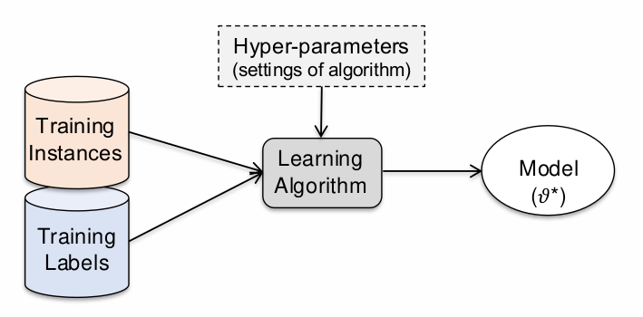

Human language is:
- Compositional: thoughts can be expressed in sentences comprising subjects, verbs and objects, which gives endless capacity for generating new sentences.
- Referential: can express information about objects and their locations/actions.
- Temporal: with past, present and future tenses. 
- Varied: thousands of different languages spoken around the world. 
# Text Data
NLP mainly deals with text data, but also semi-structured data (like html), programming code, relational (tabular) data, biological sequences, binary data, audio data, images & video. 
NLP, aka text mining, is the process of working with and extracting useful knowledge from textual data. 
NLP concerns the computational analysis, interpretation and production of natural language in either written or spoken form.

NLP techniques are regular expressions, vector space representation & text classification, text retrieval and clustering, word embedding based representations, language models for text generation, seq2seq models & transformers, dialog systems (task-oriented and retrieval-augmented chatbots), LLMs, audio aspects (speech-to-text & text-to-speech).

NLP can be used for sentiment analysis, summarisation, translation, named entity extraction, question answering, chatbots, personal assistants.
## Text Preprocessing
In text processing, we can have three types of tasks: classification, extraction and search.
Text generation can be either translation, summarisation, anonymisation & synthetic data generation, question answering, explanations.

NLP is difficult since human language is extremely expressing, it can be highly ambiguous, and even prosody (pronounce and emphasis) can affect its meaning, but thankfully it is also very redundant. 

It is common to pre-process text by performing cleaning activities, such as:
- Prior to tokenisation:
	- Remove mark-up (non-content information).
	- Lowercase the text.
	- Remove punctuation.
- After tokenisation:
	- Remove stopwords (extremely high frequency words).
	- Remove low frequency words.
	- Perform stemming or lemmatization to reduce the vocabulary size. 
	- Perform spelling correction. 

Less common activities when building classifiers:
- Performing stemming or lemmatization to reduce vocabulary size.
- Perform spelling correction. 

In other cases, we may need to extract plain text from: 
- Textual documents (.txt, html, e-mail, ..): usually discard mark-up (html tags) and other format-specific commands, in web crawl situations parser should be robust to badly formed HTML.
- Binary documents (Word, PDF, ..): much more complex to handle, for PDF documents the text structure must be reconstructed.
- Images of scanned documents: requires specialized **Optical Character Recognition** (**OCR**) software that is deep-learning based, which may introduce recognition errors in the text. 

Various **encoding** could be used to store characters on computer, each supports different number of possible characters. The most used are ASCII (traditional keyboard, only 128 characters in total) and UTF-8 (149k Unicode characters), the latter is needed to handle languages with non-latin characters sets (Arabic, Cyrillic, Greek, ..) and special characters ('ì', 'ù', ..).
### Tokenization
Many (if not all) NLP tasks require **tokenization**, segmenting the text into sequences of tokens which usually corresponds to the words in the text. It is possible to tokenize until character level. Tokenization requires language-specific resources and It can be difficult for some languages. 
Some languages use space between words which allow for space-based tokenization, which have some problems:
- depending on application, we may want to split hyphenated words.
- some languages are highly agglutinative, and can build very long and specific content, which it might be better to separate. 
- some time the "unit of meaning" is spread over two non-hyphenate words in multi-words expressions (MWE).
Moreover, we can't blindly remove punctuation (ex. titles, prices, dates, URLs, hashtags, email addresses, ..) and we may deal with clitics, words that don't stand on their own. 
Many languages, such as Chinese, do not use spaces to separate words, so deciding where the token boundaries are can be difficult. It is common to threat each character as a token.

Instead of white-space segmentation or single-character segmentation we can:
- use the data to tell us how to tokenize.
- use a sub-word tokenization which is useful for splitting up longer words and for allowing the ML model to learn explicitly the morphology of the language. 
- use byte-pair encoding.

Certain tasks require sentences to be segmented. A common algorithm is to tokenize and then use rules or ML to classify a period as either a part of the word or a sentence-boundary.
## Text Normalization
### Case Folding
Case folding consists in converting all the characters into the same case, either all upper case or lower case.
Applications like web search often reduce all letters to lowercase to drastically reduce size of vocabulary and increases recall (set of valid documents found).
For classification problems:
- removing case reduces vocabulary and thus number of parameters that must be learnt.
- help classifier to generalize well from far fewer examples. 
However, we may lose important information by removing case, thus retaining it can be helpful for many applications like sentiment analysis, machine translation, information extraction. 
### Word Normalization
Word normalization is the process of converting words/token into a standard format. It is critical for web search applications. 
### Morphology
It refers to the analysis of structure of words. 
- Morpheme is the smallest linguistic unit that has semantic meaning. Morphemes are divided into root, which is the base root, and affixes, which can either be prefix, infix or suffix.  Morphemes compose to make lexemes.
- Lexeme is the unit of lexical meaning that exists regardless of the number of inflectional endings it may have of the number of words it may contain. 
- A lemma is a canonical form of a lexeme. 
- A lexicon is a set of lexemes. In NLP lexicons define base forms, affix morphemes and address irregular forms. 
- A word is an inflected form of a lexeme.
Morphemes can be composed with morphological rules, which restricts the ordering of morphemes, and orthographic rules, aka 'spelling-rules' or 'two-level rules'.
Dealing with complex morphology is necessary for many languages. 
### Lemmatization vs. Stemming
**Lemmatization** consists in representing all words as their lemma, their shared root. 
**Stemming** consists in a simple algorithm that reduces terms to stems, chopping off affixes crudely. It is often used in text retrieval to reduce computational requirements. The Porter Stemming Algorithm is a set of rewriting rules, simple but error prone since it can cause many collisions (different words, same stems).

Lemmatization is a more sophisticated NLP technique while stemming is a simple algorithm that applies rules to extract word stems. 
In text retrieval to prevent vocabulary mismatch between query and document, usually perform stemming (or lemmatization) before adding terms to the index. 
### Stopword removal
Stopwords are just more frequent terms in language which convey very little information about the topic of the text. 
Removing stopwords can sometimes boots performance of retrieval/classification models since it will reduce computational/memory burden. 
Sometimes stopwords are useful. 
### Spelling Correction
#### Probabilistic Spelling Correction
If we had enormous corpus of misspellings and corrections, we could estimate **relative frequency**:
$$
P(correct | observed) = {\#(correct, observed) \over \#(observed)}
$$
but we don't have such a corpus. 
We could estimate such probability using **string edit distance** by counting number of insertions, deletions, substitutions or transpositions needed to get from one string to the other. Surely some words will be more likely then others and some words would be equally likely.

Use Bayes' rule to write the condition the other way around:
$$
P(correct | observed) = {{P(correct, observed)} \over {P(observed)}} = {P(observed | correct) P (correct)\over P (observed)} 
$$
Now, since the denominator is the same for all candidate corrections we can ignore it and normalize probabilities later:
$$
P(correct|observed) \propto \underbrace{P(observed|correct)}_\text{likelihood of correction}\underbrace{P(correct)}_{\text{prior probability} \atop \text{of corrected word}}
$$
For each possible correction, we need to estimate:
- Prior probability of correct word, by seeing how popular that word is in a large corpus. 
- Likelihood of correction, by counting in large corpus of errors how many times the correction is right. 

Also **context information** is needed. We can retrieve it by looking at the preceding words to see how much they agree with the candidate correction. We can count in large corpus the frequency of bigrams (pair of consecutive words) and replace the unigram probability of the correct word with a bigram probability: it is a Naïve Bayes model with two features the observed (incorrect) word and the previous word in the sentence.
## Regular expressions
RE are patterns that allow us to search within text document for specific sequences of characters. Using RExp we can find out whether pattern exists in document and we can extract information wherever pattern occurs. 

RExp provide a powerful language for writing rules to extract content from text documents. 
- Advantages: simplicity of approach, rules can be made precise to reduce the number of false positives. 
- Limitations: extraction rules must (usually) be written by hand, some false positives are usually present due to insufficiency of syntactic structure, often many false negatives due to the fact that rule is not general enough, hard to integrate knowledge of context around extracted entity.

# Classifying Text
## Some Machine Learning Concepts
ML consists in a set of techniques aimed to make machines "act more intelligent" by generalizing from past data to predict the future data. 

"A computer program is said to learn from experience E with respect to some class of tasks T and a performance measure P, if its performance at task in T, as measured by P, improves because of experience E." Tom M. Mitchell

In supervised learning each training instance is a vector in some feature space and it has been labeled with a class. The tasks consists in partitioning the space to be able to make predictions for new vectors. 
Data usually overlaps, so classes may not be linearly separable. Instances are described by many features, with some dimensions better at distinguishing classes than others. 

![[data_no_linearly_separable.png]]

All classifiers divide up the feature space: boundary can be linear or non-linear.
- **Linear** models: include Naïve Bayes, Logistic Regression and Support Vector Machine (SVM).
- **Non-linear** models: include SVM with Radial Basis Function (RBF) kernel, Gradient Boosted Decision Trees and Neural Networks.

![[boundary_decisions.png]]

The learning algorithm:
- Takes as input training instances and corresponding ground truth labels.
- Searches for parameters which minimizes prediction error (loss) on training labels.
- Each algorithm has its own settings: the hyper-parameters which control the complexity of the model. 
- The model is used to predict labels for new instances. 

We must choose the hyper-parameters values to prevent overfitting:
- We can't use training data, because training error does not tell us about generalization.
- We can't use test data, since we need it later for unbiased testing. 
- So we have to hold-out portion of training set and use it for online evaluation: the validation set is used to evaluate different training runs. 
It is possibile to choose various hyper-parameters settings, train a model with each, then evaluate on the training set.

Training error usually improves with higher model complexity, but test performance reaches a peak and then degrades as model overfits the training set. We would like to find the model with the best generalization performance. 

 
## Text classification
It is the process of training a model to classify documents into categories. It is used for:
- spam/phishing detection.
- authorship identification.
- sentiment analysis.
- offensive content detection. 
- web search query intent. 
- personalized news feed. 
- identifying criminal behavior online.
- routing communication.
- task identification in spoken interfaces.
- ...

Types of text classification problems:
- **Binary classification**: output is binary (e.g. spam detection, sentiment analysis).
- **Ordinal regression**: output is ordinal (e.g. product reviews).
- **Multi-class classification**: output is a category (e.g. categorizing topics, routing communication to the correct department).
- **Multi-label classification**: output is a set of categories (e.g. categorizing news articles).
## Extracting Features from Text
Text can be arbitrarily long, it has NO fixed size which means that it cannot be given directly to the model. Features must be extracted. 

![[Pasted image 20250224105533.png]]

Features are signals in documents that are useful for predicting a category. We need to convert text data into a vector of features to give it to a classifier. 
If training data is scarce (few documents available), one might use:
- **Syntax-based features** (e.g. # of capitalized words).
- **Part-of-speech based features** (e.g. # verbs versus proper nouns).
- **Reading-difficulty based features** (e.g. average length of words/sentences).
Most common features to extract are just the words themselves as the vocabulary of the document provides the most important signal, the # of occurrences of words provides further information. 
### Bag-of-words (BOW) model
It represent docs as vectors of word counts. It is a massively sparse representation (long vector with many zeros).

One could also use **one-hot encoding** to create a fixed dimension feature vector: just truncate documents at fixed length and treat them as a sequence of categorical variables. Then, encode categorical variables using one-hot encoding to produce $n$ binary features per variable where $n$ is the vocabulary size. 
The problem is that we will have too many features given small amount of training data available (dense representation). 
So, to reduce the feature space it is possible to sum all one-hot encodings together which will results in throwing away all word order information but retains critical vocabulary information. 
## Word Frequencies
### Heap's law
Vocabulary grows with approximately the square root of document/collection length: $V(l)\propto l^{\beta}$  with $\beta \approx 0.5$.
### Zipf's law
Token’s frequency is approximately proportional to the inverse of its rank: $ctf_t \propto {1 \over {rank(t)^s}}$ with $s \approx 1$ 

Heap's law derives from Zipf's law and can be explained by random typing model (a.k.a.  [[https://www.cs.cmu.edu/~zollmann/publications/monkeypaper.pdf|monkeys at typewriters]] and [[https://en.wikipedia.org/wiki/Infinite_monkey_theorem|infinite monkey theorem]]). 
The point is that vocabulary of documents/collection grows slowly compared to its length.

![[vocabulary_tokens.png]]

Since document vocabulary is very small compared to vocabulary of collection, it is possibile to say that terms present in document usually characterize well its content.
BOW representation includes also count of occurrences of each term. 
Moreover, it completely ignores word order. An extension to include n-grams can increase performance, but greatly increases number of dimension, so more data is then needed. BOW is a very sparse representation.

In general, we have FAR FEWER documents than vocabulary terms, which means fewer examples than features. So strong regularization is needed to guide the learner and prevent overfitting. 
## Linear Classification Models
Due to very high number of dimensions in a BOW representation of documents, linear models are often used with text. 
Linear models estimate one parameter per vocabulary word making them **highly interpretable** as we can directly see which terms influence prediction and by how much.

Linear classification algorithms find linear decision boundaries (oriented **hyperplanes** in n-dimensional vector space).
Given a feature vector $x = (x_1, .., x_n)$ and a set of model parameters denoted $\theta$, the oriented hyperplane has equation $\theta \cdot x - b = 0$ where:
- $\theta \cdot x = \sum_i \theta_i x_i$ is a dot product. 
- $\theta = (\theta_1, .., \theta_n)$ is a n-dimensional vector that is orthogonal to the hyperplane.
- $b$ is an offset which regulates the distance of hyperplane from the origin (a parameter) as $b \over |\theta|_2$. $b$ is just a parameter, so it is often denoted as $b = - \theta_0$.

We will discuss 3 most popular linear models:
- **Naive Bayes**: traditionally used with text.
- **Logistic Regression**: works well if regularized.
- **Support Vector Machines**: naturally regularized and designed for high dimensional data. 
### Multinomial Naïve Bayes 
Naïve Bayes (NB) is one of the oldest and simplest text classifier. 
Called naïve because it makes simplifying assumption: that **word occurrences** are **statistically independent** of each other given the class label i.e. that words provide independent information about the class.
This assumption makes calculating parameters of model very simple. However, it does not hold in practice, since words are highly correlated with each other, but nonetheless the predictions from the model are good. The assumption just causes model to be overconfident.

If all examples of a word occur for only one class, then it will be classified always the same. To avoid this, we smooth the probability estimate by adding a pseudo-count $\alpha$ for each feature, which can be chosen to maximize prediction performance or set to default value (if $\alpha = 1$ it is called Laplace smoothing).

Advantages: 
- Very **fast to estimate** the NB model as it requires **only one pass over the training data** and there is NO need to search for parameters (no gradient descent routine).
- **Reliable predictor** even if there is little data available (stable classifier). If conditional independence holds, it is the best. 
Disadvantages:
- It does not perform quite as well on large data as other classifiers, since redundant features are counted twice.
- Predicted probabilities are not well calibrated, they are often overconfident due to violations of independence assumption. 
### [[Machine Learning#Logistic Regression|Logistic Regression]]
The further a point is from decision boundary, the more certain we are about the prediction.
The signed distance of a point from the hyperplane is $s(x) = \theta \cdot x - b$, where the classes are positive/negative scores.

Instead of mapping each point to fraud/non-fraud we could try to estimate the probability of fraud interpreted as the confidence of classification. 
To convert distance $s(x)$ to probability $P(x \in C_1|x)$, we need a function that maps $(-\infty, +\infty) \rightarrow [0,1]$ so we can use a **logistic curve** (a.k.a. **sigmoid function**) which takes value 0.5 at the decision boundary ($s=0$).
$$
sigmoid(s) = {1 \over 1 + e^{-s}} = {e^s \over e^s +1}
$$
Advantages:
- Produces well-calibrated probability estimate.
- Can be trained efficiently and scales well to large numbers of features. 
- Explainable since each feature's contribution to final score is additive. 
Disadvantages:
- Assumes feature values are **linearly related** to log odds. If assumption is strongly violated, model will perform poorly. 
### Support Vector Machines (SVMs)
SVM finds **maximum margin hyperplane separating classes**. The margin $\gamma$ is the distance from the hyperplane to the closest points either side. 
Points laying exactly on margin are referred as **support vectors**: they prevent the margin from getting bigger, thus constrain/define location of boundary. In d-dimensional space, we have at least d+1 support vectors.

In contrast with logistic regression, the position of the hyperplane depends only on the closest points. Moreover, adding or moving internal points won't effect such boundary. 

Basic SVM is also a linear classifier since it finds the hyperplane in feature space that best separate two classes. The difference with LR and NB lies in the loss function used to find parameters:
- LR uses the negative log-likelihood: penalizes points proportionally to probability of incorrect prediction (including those for which prediction was correct).
- SVM uses hinge loss, which only penalized points that are on the wrong side (or very close to) the hyperplane. 
#### Maximizing the margins
We can compute the distance to points from the hyperplane using: $s(x) = w_0 + \sum_i w_i x_i$.
For points that lie exactly on the margin we have: $|s(x)| = |w_0 + \sum_i w_i x_i| = \gamma$.
Assuming for simplicity that hyperplanes passes through origin ($w_0 = 0$), then points on the margin have $|w \cdot x| = \gamma$ where $w = (w_1, .., w_n)$ and $x = (x_1, .., x_n)$.
More generally, we have:
- $w \cdot x \ge \gamma$ for all positive data points.
- $w \cdot x \le -\gamma$  for all negative points.
- equivalently, $y_j w \cdot x \ge \gamma$ for all examples $x_j$ where class $y_i \in \{+1, -1\}$.

So we just need to find parameters $w$ that maximizes the margin $\gamma$, subject to the constraint $\forall j \ y_j w \cdot x_j \ge \gamma$.
But increasing length of vector $w$ increases value of $\gamma$, so either:
- fix length of vector $w$ and maximize $\gamma$.
- or set $\gamma=1$ and minimize $\sum_i w_i^2$ subject to constraint $\forall j \ y_j w \cdot x_j \ge 1$.
Mathematically, it is the same as minimizing loss: $\sum_i w_i^2 + \sum_j \epsilon_j$ where distance of point on wrong side of margin $\epsilon_j = max(0, \ - y_j w \cdot x_j)$ is the error for prediction $(x_j, y_j)$.
#### Non-separable data
If data is non-separable, simply penalize points on wrong side of margin based on the distance from it. 
Support vectors become points on wrong side of margin that provide non-zero contribution to loss function. 

The objective function to minimize remains almost unchanged:
$$
O(\vec{w}, b) = {1 \over 2} \sum_{j=1} w^2_j + C \sum_{i=1}^n \epsilon_i = {1 \over 2} \sum_{j=1}^d w_j^2 + C\sum_{i=1}^n \max[0, 1 - y_i(\sum_{j=1}^d w_j x_{ij} - b)]
$$
where $\epsilon_i$ is the distance from the $i_{th}$ support vector margin and $C$ is a hyperparameter that determines relative influence of errors versus size of margin. 
#### Hinge loss
It applies no cost to most correctly classified points. It increases linearly with distance from margin. 
$$
L(x_i, y_i) = max[0, 1 - y_i(\sum_{j=1}^d w_jx_{ij} - b)]
$$
![[hinge_loss.png|500]]

## Evaluating a Binary Text Classifier
If using a BOW representation of text, linear classifier are sufficient for most problems. Data is high dimensional, so dependencies between features do not usually need to be modeled. 

First thing to evaluate is the confusion matrix:
- Accuracy: % of correct predictions.
- Precision: % of positive predictions that were correct.
- Recall: % of positive instances that were found by model.
- F-measure: harmonic mean of precision and recall. 
- AuC: area under the ROC Curve is often used as a single measure that doesn't depend on the confidence threshold used to make prediction with the model. 

if the are n classes, confusion matrix will be $n \times n$. 
Precision and recall will be calculated for each class by considering it positive class in a one-versus-all setting. Then, each class's precision and recall values will be combined into a single measure:
- Macro-average: average over classes weighting each class the same. 
- Micro-average: average over classes weighting each class by the number of datapoints in it.

Generally for text classification a BOW representation of text is used together with a linear classifier such as SVM or regularized LR. 
# Searching Text
## Information Retrieval
It is the task of **finding content**, which could be documents, images, video, etc., that is useful (i.e. relevant) to user's information need. 
From information needs we extract **query keywords** and look for documents containing those keywords. 

Typical adult vocabulary lies in range of 20/35 thousand words, and typical document length is less than 1 thousand words: so vocabulary of each document is small. 

Most of the work in text retrieval can be done by **vocabulary matching**: assuming that vocabulary is well distributed over different documents we just need fast indexes to find all documents containing selected keywords.
If no document contains all query terms or many documents contain all of them we assign score to keywords based on how discriminative they are.

Text retrieval as text classification can be done by:
- Concatenate query and document BOW into a single feature vector.
- Predict probability that user finds document relevant to query.
Obviously we can’t use linear classifier since interactions between query & document terms wouldn’t be taken into account. 
So we could train non-linear model that includes pairwise interactions between query & document terms.

However, some problems arise:
- For vocabulary of 100 thousand, might require up to 10 billion parameters to cover all pairwise interactions.
- Need huge amounts of training data in form: (query, document, relevance_label).
- Retrieval would be very slow if need to iterate over all documents to calculate score for each.
## Term Weighting
Some terms are more **discriminative** than others, making them more useful for identifying relevant documents. 
In general, the smallest set will be the most specific and most on topic, so we rank documents by size of returned documents set (the smaller the better) for query term subset. 
### Inverse Document Frequency (IDF)
We can estimate how many documents are returned for given query term subset using the probability that a random document would contain those terms and then rank them by how likely it was to see query terms in it. 

The probability that a randomly chosen document contains keywords $t_1,…,t_{|q|} \in q$ (assuming terms are independent) is: $$ p(Q \subseteq d') = \prod_{t \in q} P(t \in d') = \prod_{t \in q} {\text{d}f_t \over N}$$where $\text{d}f_t$ is the number of docs in corpus that contains $t$ (document frequency) and $N$ is the corpus size.

Then we rank documents by how unlikely they are ($1 \over P$) resulting in an inverse document frequency (IDF), then we take the logarithm to make score additive (rather than multiplicative) over query terms:
$$
score(d) = -\log \prod_{t \in q \cap d} P(t \in d') = \sum_{t \in q \cap d} \log {N \over \text{d}f_t}
$$
IDF weights each term by the logarithm of inverse probability of finding term in a document: $idf_t = \log {N \over \text{d}f_t}$.
It is a standard information theory measure gained from observing term $info(t) = - \log P(t)$.

A common variants of IDF uses odds of observing term: $odds(t) = P(t) / [1 - P(t)]$.
Another variant is the document score:
$$ 
score(d) = \sum_{t \in q} \log {N - \text{d}f_t + {1 \over 2} \over \text{d}f_t + {1 \over 2}}
$$
where smoothing of $1 \over 2$ is added to prevent terms with small frequencies from dominating ranking. There is almost NO difference between the two formulations unless a term is very common $df_t > N / 2$.
### Term Frequency (TF- IDF)
IDF weights vocabulary terms but:
- there is more information in a document than just its vocabulary.
- some documents contain the same query term many times and are more likely to be relevant.
The simplest option to include term count information is to directly weight score by it:
$$
score(q, d) = \sum_{t \in q} tf_{t, d} \log {N \over \text{d}f_t}
$$where $t f_{t, d}$ if the number of occurrences of term $t$ in document $d$ (a.k.a. term frequency).

Instead of calculating probability that a random doc contains the term, we calculate the probability that it contains the term exactly $k$ times:
$$
P(t, k) \simeq P(next\_token=t)^k
$$
Then, we estimate the next token probability using term occurrences over the collection:
$$
P(next\_token=t)= {ctf_t \over \sum_{t'} ctf_{t'}}
$$where $ctf_t$ is the number of occurrences of $t$ in the collection.
Thus, the probability that the term occurs exactly $k$ times is:
$$
P(t, k) \simeq ({ctf_t \over \sum_{t'} ctf_{t'}})^{tf}  
$$
Taking the logarithm gives:
$$
score(q, d) = - \sum_{t \in q} tf_{t, d} \log ({ctf_t \over \sum_{t'} ctf_{t'}})
$$
Similar to the previous formula.

The TF-IDF score performs well in practice but assumes a linear relationship between term frequency and document score. This linear assumption have been questioned over time as it is not always valid. 

A common alternative is increase score with logarithm of term count: $\log(1 + tf_{t, d})$ or $\max (0, 1 + \log(tf_{t, d}))$.
## Length Normalization
We need to normalize the length of the document as longer documents have a larger vocabulary so are more likely to contain the query terms but are not necessarily useful for the research, so shorter documents with the same term count should be preferred.

To normalize we could just divide by the length of the document, but most common normalization uses $L_2$ rather than $L_1$ norm (a.k.a. document length in tokens).
### Cosine similarity between TF-IDF vectors
Vector space model treats TF-IDF values for all terms in documents as a vector representation $d = (tf{1, d} \cdot idf_1, ..., tf_{1, d} \cdot idf_n)$.
The similarity between query & document can be computed based on the angle between vectors. 
Cosine of the angle is used since it gives similarity values in range $[0, 1]$, which is normalized by the euclidean length (a.k.a. $L_2$ norm):
$$
sim(d_1, d_2) = {d_1 \cdot d_2 \over ||d_1||||d_2||}
$$
where $d_1$ is the query and $d_2$ is the document. 

### Pivoted Length Normalization
There have been many studies over the years into other types of normalization such as Pivoted Length Normalisation (PLN). 
The idea is that generally longer documents do contain more information than shorter ones,
but normalizing loses all length information.
So instead, we parameterize $L_1$ normalization around average document length:
$$
{tf_{t, d} \over L_d} \rightarrow {tf_{t, d} \over bL_d + (1-b)L_{ave}}
$$
with $L_d = \sum_t tf_{tid}$, $L_{ave} = {1 \over N} \sum_d L_d$ and $0 \le b \le 1$.

### Best Match 25 (BM25)
Another proposal is the Okapi BM25 ranking formula:
$$
RSV_d = \sum_{t \in q} \log[{N \over df_t}] \cdot {(k_1 + 1)t f_{t, d} \over k_1((1-b) + b \times (L_d /L_{ave}) + t f_{t, d})}
$$
where $k_1, b$ are parameters to be set, which control the dependence on document length. 

This was the go to method for term-based text retrieval. It has the property that term importance tend to maximum values, so document containing a query term repeated a massive number of times won't always rise to the top of the ranking. 
## Index Structures
Retrieval measures must be calculated **fast**, since delay affects attention: search engines need to respond in tenths of a second and have been engineered to be as fast as possibile. 

**Inverted indices** are the building blocks of search engines. They are made up of posting lists mapping: TermIDs -> DocumentIDs. They use integer compression algorithms that allow for fast decompression to reduce space requirement. 

Calculating retrieval function involves computing joins over posting list where documents are sorted by term count to allow for early termination of results. 
**Index pruning** techniques are used to get rid of documents that would never be retrieved for a certain query.
### Positional Indices
Documents are more likely to be relevant if query terms appear close together. Most indices record locations of terms in document and allows for **proximity** between keywords to be calculated. 
Words at start of webpage more important in general.
Statistically significant bigram/trigrams are found using pointwise mutual information and are often indexed with their own posting list.
### Crawlers
Crawlers scour web following hyperlinks to add to index. 
Efficient crawling requires learning to prioritize URLs effectively and determining how frequently to re-visit a website and update the index.

Web scale crawlers need to be robust to all types of content including generated pages. It should be able to detect content-based duplicate pages, where there are many URLs that may map to the same content.
It is generally a distributed crawler architecture with a centralized URL list.

The dark web is an anonymous web build around [TOR](https://www.torproject.org/) (The Onion Router) gateways. Crawling the dark web is interesting because there is NO DNS linking urls to IP-addresses behind TOR gateways. 
## Rerank
Once initial set of potentially relevant documents has been found, we can rerank them based on all the available information to maximize the overall quality of search results.

For web search many indicative features include:
- multiple retrieval functions (BM25, embedding-based, BERT, ..).
- different documents parts/views (title, anchor-text, bookmarks, ..).
- query-independent features (PageRank, HITS, spam scores, ..).
- personalized information (user click history, ..).
- context features (location, time, previous query in session, ..).

Search engines like Google combine hundreds of signals together. 

Rank learning provides an automated & coherent method for combining diverse signals into a single retrieval score while optimizing a measure users care about (e.g. NDCG, ERR).

1. Start with a query.
2. Generate initial ranking using keyword-based ranker.
3. Truncate ranking as candidates for re-ranking.
4. Calculate feature values for each candidate.
5. Normalize each feature at the query level: usually perform min-max normalization at query level for each feature, necessary to make values comparable across queries. 
6. Training: provide ground-truth relevance labels for each query-document pair, generally trough manual labeling.
The procedure is repeated for all queries. 
## Evaluating Search Results
Search engines employ people to annotate search results with relevance information. 
Other organisations (e.g. Wikipedia) can't afford to pay raters and try to collect judgments directly from users. 
Usually they do not train models directly from click data, since it causes a feedback loop.
Latest approach is to use a LLM to judge relevance. 
### Metrics for Evaluating Search Results
Traditional measures are:
- Precision at depth $k$: $P @ k = \# \{ \text{relevant docs in top k}\}/k$.
  It is the percentage of relevant top results.
- Recall at depth $k$: $R @ k = \#\{\text{relevant docs in top k}\}/\#\{\text{relevant docs in total}\}$.
  It is the percentage of found documents in all the relevant documents available. 
- F-measure at depth $k$: $F_1 @ k = 2 / ({1 \over P@k} + {1 \over R@k})$.
  It is the measure of how well is the result, combining precision and recall.

More recent measures:
- Mean Average Position (MAP): "average position" is average of $P@k$ values at all rank positions containing relevant documents, it estimates area under precision-recall curve. $$ AveP = {\sum_{k=1}^n (P(k) \times rel(k)) \over \text{\# of relevant docs}}$$
- Normalized Discounted Cumulative Gain ($NDCG @ k$): it is more faithful to user experience by discounting lower ranked docs, it is normalized at the query level. $$ NDCG(Q, k) = {1 \over |Q|} \sum_{j=1}^{|Q|} Z_{kj} \sum_{m=1}^k {2^{R(j,m)}-1 \over \log_2 (1+m)}$$
Note that $P@k$ and $NDCG@k$ are usually the most important measures for retrieval.
## Formulating Learning-to-Rank Problem
A two stage (re)ranking process:
![[Pasted image 20250314111736.png]]

We can treat rank learning as a simple regression problem, in which we predict the relevance label based on feature values. 
Optimizing "pointwise" objective is suboptimal since it does not preference ordering at top of list, and ends up predicting well scores for less relevant documents. 

During learning, we can use different loss functions:
- Pointwise (e.g. MSE): $$total\_loss = \sum_{i=1}^m \sum_{j=1}^{n_{q_i}} loss(\underbrace{f(\overbrace{x_i^j}^{\text{feature vector}})}_{\text{predicted score}}, \overbrace{y_i^j}^{\text{relevance label}})$$- Pairwise (e.g. # of incorrectly ordered pairs): $$total\_loss = \sum_{i=1}^m \sum_{j=1}^{n_{q_i}} \sum_{k=j+1}^{n_{q_i}} loss(\underbrace{f(x_i^j), f(x_i^k)}_{\text{predicted scores}}, \overbrace{y_i^j, y_i^k}^{\text{relevance lables}})$$
- Listwise (e.g. NDCG): $$total\_loss = \sum_{i=1}^m loss(\underbrace{f(x_i^1), .., f(x_i^{n_{q_i}})}_{\text{predicted scores}}, \overbrace{y_i^1, .., y_i^{n_{q_i}}}^{\text{relevance labels}})$$
LambdaMART is a listwise rank learner that makes use of the boosted regression trees. The name comes from Lambda, which is an approximation of loss gradient, and MART, which stands for Multiple Additive Regression Trees.
It performs very well in practice, thus becoming the default/baseline learner in most applications.
# Clustering Text
Text clustering is the process of grouping documents into coherent subgroups based on some distance function or similarity measure.  
For text documents, usually means grouping documents into the same topic, emotion, problem, complaint/praise, author, text generator or source document.

A real-world application is news aggregators like Google News which use clustering to summarize/characterize a collection. In security application it is used for phishing and malware detection. 

To cluster documents we need to measure their similarity in the content, which is subjective. 
Generally, documents are represented as [[Natural Language Processing#Term Frequency (TF- IDF)|TD-IDF]] vectors (scaled BOW) which is a sparse representation as most values in vector are zero. It measure similarity based on the number of shared words, which are scaled by the importance. 
We usually assume that similarity does not depend on the document length, so we compute the cosine similarity between vectors. 
## Clustering Techniques